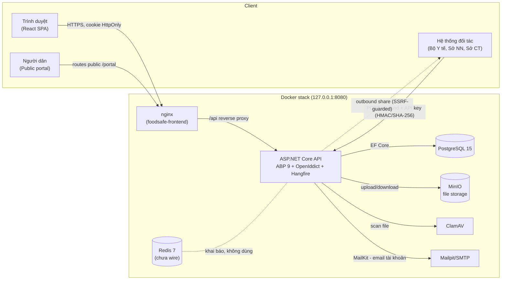
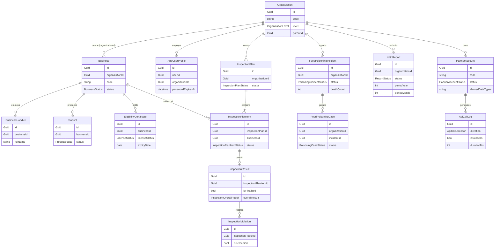
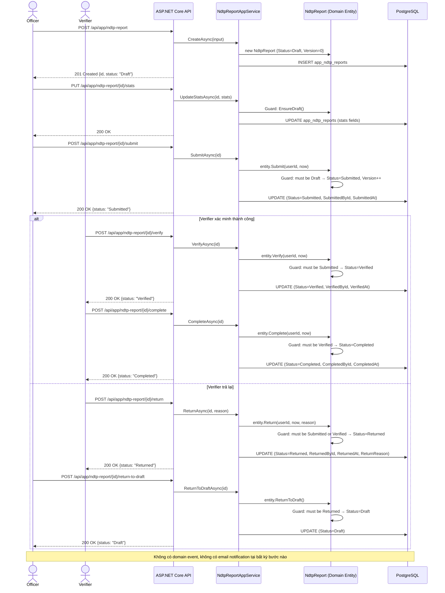
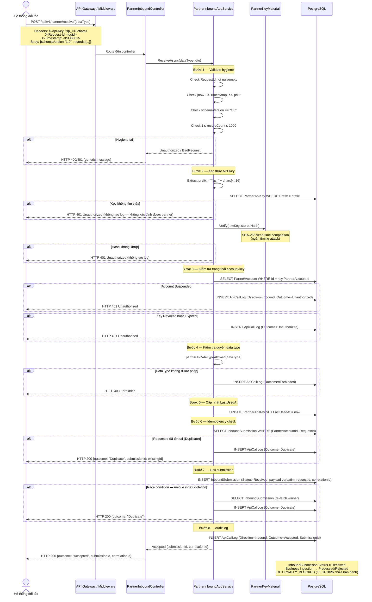
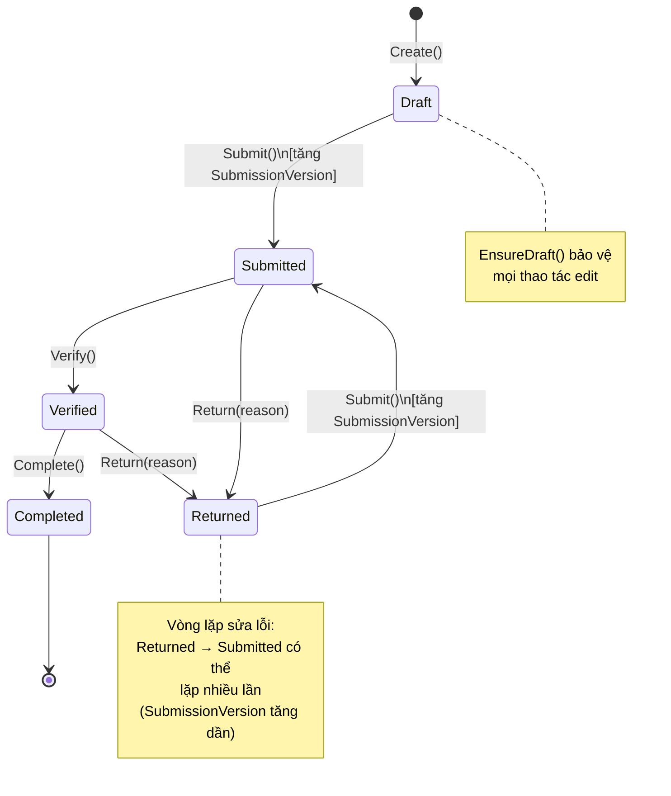
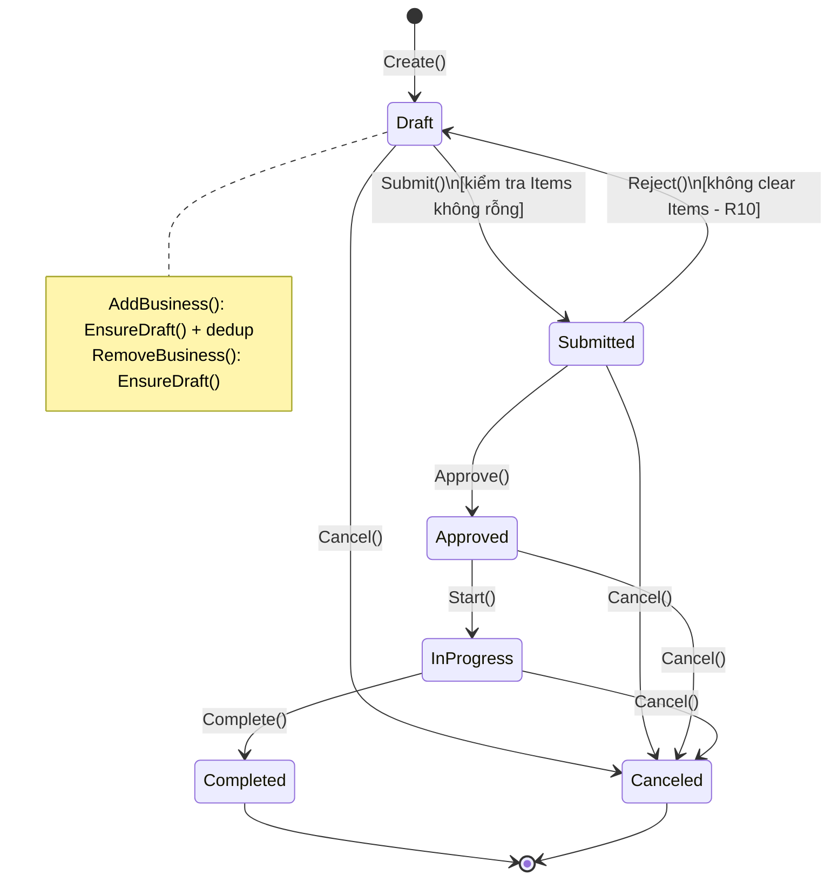
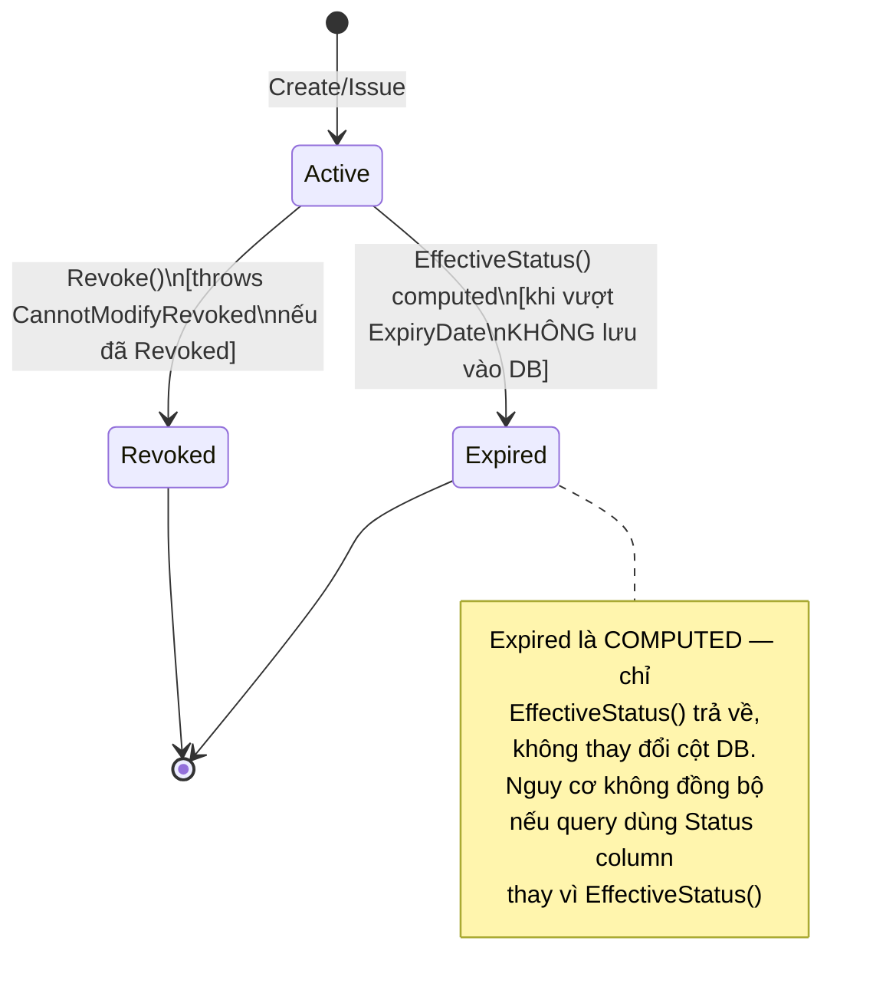
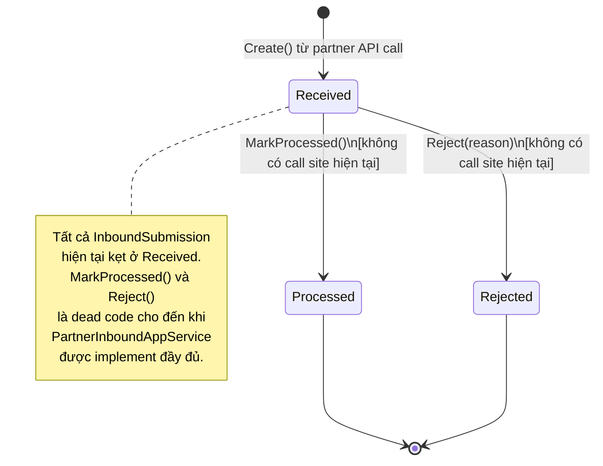

# FoodSafe — Kiểm kê Hiện thực Toàn bộ Dự án (Project Implementation Inventory)

| | |
|---|---|
| **Ngày lập** | 2026-07-28 |
| **Kho mã** | FoodSafe (monorepo: `FoodSafe.BE` + `FoodSafe.FE`) |
| **Nhánh** | `feat/integration-completion` (bao gồm thay đổi **chưa commit** của INT-03 partner inbound) |
| **Commit gần nhất** | `a853674`; registry xác minh tại `8be91bc` |
| **Phương pháp** | Phân tích tĩnh toàn bộ mã nguồn + kiểm chứng runtime thật (build, test, Docker stack, Playwright) |
| **Mục đích** | Kiểm kê bằng chứng hiện thực để đối chiếu với tài liệu yêu cầu khách hàng sau này. **Báo cáo này KHÔNG tính phần trăm hoàn thành so với yêu cầu** (tài liệu yêu cầu chưa được cung cấp trong nhiệm vụ này). |

---

## A. Tóm tắt điều hành

### A.1. Mục đích hệ thống (suy ra từ hiện thực)

Phần mềm quản lý an toàn thực phẩm cho Chi cục An toàn vệ sinh thực phẩm tỉnh Quảng Ninh: quản lý cơ sở SXKD thực phẩm và sản phẩm; 5 loại giấy phép/chứng nhận (đủ điều kiện ATTP, tự công bố, đăng ký bản công bố, xác nhận quảng cáo, CFS, chứng nhận xuất khẩu); thanh kiểm tra; ngộ độc thực phẩm (ca lẻ + vụ); 3 loại báo cáo có quy trình duyệt (NĐTP, công tác ATTP, tháng hành động); cảnh báo — tin tức — kiểm nghiệm — phân tích nguy cơ — văn bản; cổng công khai cho người dân (tra cứu + phản ánh); tích hợp liên thông dữ liệu 2 chiều với hệ thống ngoài; quản trị danh mục, đơn vị 3 cấp, người dùng và phân quyền.

### A.2. Số liệu tổng quan

| Chỉ số | Giá trị |
|---|---|
| Ứng dụng/dịch vụ | 2 ứng dụng (API .NET 9 + SPA React 19) + 8 service Docker (postgres, redis, minio, clamav, mailpit, migrator, api, frontend) |
| Stack chính | .NET 9 + ABP 9 + PostgreSQL 15 + EF Core / React 19 + TypeScript + Vite + Ant Design 5 + TanStack Query |
| Kiến trúc | Clean Architecture + DDD (ABP layers) / feature-based SPA; data scoping theo `OrganizationId` (không dùng multi-tenancy) |
| Module nghiệp vụ | **13** |
| Vai trò (role seeded) | **8** (+ 4 actor khác: anonymous, người dân, đối tác API-key, hệ thống/Hangfire) |
| Route UI | **47** (20 public/pre-auth, 26 protected, 1 catch-all) |
| API endpoint | **~364** (88 AppService; chủ yếu ABP auto-API + 2 controller tường minh) |
| Workflow nghiệp vụ | **15** (WF-01…WF-15) |
| Entity miền / bảng CSDL | 57 entity / 55 bảng nghiệp vụ; 41 enum; 25 migration |
| Chức năng nguyên tử (atomic function) | **324** |
| Permission | 174 permission / 12 nhóm |
| Background jobs | 5 (Hangfire) |

### A.3. Phân bố trạng thái hiện thực của 324 chức năng

| Trạng thái | Số lượng | Ghi chú |
|---|---:|---|
| IMPLEMENTED | **319** | Có bằng chứng end-to-end: mã nguồn đầy đủ các tầng + registry 34/34 feature VERIFIED tại `8be91bc` + E2E chạy thật (7 test chạy lại trong phiên audit đều pass) |
| PARTIALLY_IMPLEMENTED | 0 | — |
| UI_ONLY | 0 | — |
| BACKEND_ONLY | 1 | `INT-F023` — API inbound cho đối tác (không có UI FoodSafe theo thiết kế; payload được lưu nhưng chưa nhập vào nghiệp vụ) |
| PLACEHOLDER_OR_MOCK | 2 | `DASH-F014` ô tìm kiếm toàn cục; `DASH-F015` chuông thông báo (đều không có handler/backend) |
| BROKEN_OR_BLOCKED | 0 | Không phát hiện chức năng hỏng ở runtime trong phạm vi kiểm chứng |
| NOT_IMPLEMENTED | 2 | `INT-F024`/`INT-F025` — duyệt/từ chối dữ liệu inbound (`MarkProcessed`/`Reject` có 0 call site; bị chặn bởi TT 31/2026 chưa ban hành) |
| UNKNOWN | 0 | — |
| **Tổng** | **324** | |

### A.4. Giới hạn kiểm chứng runtime chính

1. **Không chạy lại toàn bộ 283 test E2E** trong phiên audit (thời lượng); dựa trên registry 34/34 VERIFIED tại `8be91bc` + 7 test E2E chạy thật hôm nay (auth 3, dashboard 1, INT-03 partner 3 — tất cả pass).
0. **Working tree bị sửa đổi song song trong lúc audit**: một phiên phát triển khác đang hoạt động trên cùng repo — tại thời điểm hoàn tất báo cáo, git status cho thấy thêm các file mới/được sửa **sau** cửa sổ phân tích (ví dụ `ApiSpecification*.cs`, `AppLayout.tsx`, `PermissionRoute.tsx`, `MasterCatalogPage.tsx`...). Bản kiểm kê này phản ánh working tree tại cửa sổ phân tích ngày 2026-07-28 (HEAD `a853674` + thay đổi INT-03 chưa commit); các thay đổi phát sinh sau đó **không** thuộc phạm vi báo cáo và có thể đã xử lý một số phát hiện (như placeholder tìm kiếm/chuông thông báo, mismatch PermissionRoute).
2. Toàn bộ runtime evidence là **stack Docker local** — chưa quan sát production (TLS/Caddy/SMTP/IPv6 thật).
3. Không có sandbox đối tác thật (Bộ Y tế/Sở NN/Sở CT) — outbound sharing chỉ kiểm chứng qua endpoint giả lập trong E2E.
4. Không chạy load test (NFR hiệu năng chưa kiểm chứng).
5. Backend không có test HTTP thật (toàn bộ 635 test là structural/unit) — độ tin cậy backend dựa vào tầng E2E.

### A.5. Độ tin cậy tổng thể của bản kiểm kê

**CAO (HIGH)** — vì: (1) toàn bộ tầng đều được đọc mã trực tiếp với bằng chứng file:line; (2) build/test/lint/type-check đều được thực thi thật và pass; (3) ứng dụng đang chạy thật trên Docker stack đầy đủ và được kiểm chứng qua HTTP + trình duyệt thật (Playwright, không mock); (4) CSDL thật được truy vấn trực tiếp. Điểm trừ nhỏ: full E2E không chạy lại trong phiên, môi trường production chưa quan sát — đã liệt kê ở A.4 và mục S.

> Lưu ý quan trọng: đây là **kiểm kê hiện thực**, không phải điểm hoàn thành theo yêu cầu khách hàng. Việc 319/324 chức năng IMPLEMENTED **không** đồng nghĩa "98% hoàn thành yêu cầu" — các chức năng khách hàng yêu cầu mà chưa hề tồn tại trong mã sẽ chỉ lộ ra khi đối chiếu với tài liệu yêu cầu (xem mục R về các vùng dễ bị đánh giá vượt: tìm kiếm toàn cục, notification, nhập liệu inbound TT 31/2026, email workflow, Redis cache).

---
## B. Kiến trúc kho mã và hệ thống

### B.1. Cấu trúc kho mã

```
FoodSafe/
├── FoodSafe.BE/                  # Backend .NET 9 + ABP Framework 9
│   ├── FoodSafe.sln
│   ├── src/
│   │   ├── FoodSafe.Domain.Shared/       # Enums, hằng số, error codes, localization (vi/en), permission names
│   │   ├── FoodSafe.Domain/              # Aggregate roots, entities, guard clauses, seed contributors
│   │   ├── FoodSafe.Application.Contracts/ # DTOs, interface AppService, permission definitions
│   │   ├── FoodSafe.Application/         # AppServices (business logic), security, Excel/PDF
│   │   ├── FoodSafe.EntityFrameworkCore/ # DbContext, mapping, 25 migrations
│   │   ├── FoodSafe.HttpApi/             # Controllers tường minh (Partner inbound, ...)
│   │   ├── FoodSafe.HttpApi.Client/      # ABP dynamic HTTP client proxy
│   │   ├── FoodSafe.HttpApi.Host/        # Host ASP.NET Core: auth, middleware, Hangfire, Swagger
│   │   └── FoodSafe.DbMigrator/          # Console chạy migrations + seed
│   ├── test/                             # 5 project test (TestBase, Domain, Application, EFCore, HttpApi.Host)
│   ├── docker-compose.yml / docker-compose.prod.yml
│   └── Dockerfile
├── FoodSafe.FE/                  # Frontend React 19 + TypeScript + Vite
│   ├── src/app/                  # router.tsx, providers, AppLayout
│   ├── src/features/             # 25 feature folders (api/ components/ pages/ types/ __tests__/)
│   ├── src/components|hooks|lib|utils|theme
│   └── e2e/                      # 77 Playwright specs (chống mock, chạy trên stack thật)
├── deploy/                       # Caddyfile, docker-compose.cloud.yml
├── docs/                         # 55+ tài liệu thiết kế, testing registry, audit
└── scripts/
```

### B.2. Ứng dụng và dịch vụ

| Thành phần | Công nghệ | Vai trò |
|---|---|---|
| `foodsafe-api` | .NET 9, ABP 9, ASP.NET Core | API + OpenIddict auth + Hangfire jobs |
| `foodsafe-frontend` | React 19, Vite, nginx | SPA phục vụ qua nginx, reverse-proxy `/api` về API |
| `foodsafe-postgres` | PostgreSQL 15-alpine | CSDL chính (55 bảng nghiệp vụ + bảng ABP) |
| `foodsafe-redis` | Redis 7-alpine | Khai báo trong compose — **chưa được wire vào ứng dụng** (không có StackExchange.Redis/ABP Redis cache) |
| `foodsafe-minio` | MinIO | Lưu trữ file đính kèm (S3-compatible) |
| `foodsafe-clamav` | ClamAV 1.4 | Quét virus file upload |
| `foodsafe-mailpit` | Mailpit | SMTP dev/test (MailKit gửi mail tài khoản) |
| `migrator` | FoodSafe.DbMigrator | Chạy EF migrations + seed khi khởi động stack |

### B.3. Kiến trúc frontend

- React 19 + TypeScript strict, Vite (rolldown), Ant Design 5, TanStack Query v5 (server state), Zustand (client state), React Hook Form + Zod, React Router DOM v7, Leaflet (bản đồ).
- Feature-based: 25 feature folder độc lập, mỗi folder có `api/` (queries/mutations/adapters), `components/`, `pages/`, `types/`, `__tests__/`.
- Toàn bộ 47 page lazy-load; chỉ `AppLayout`, `PrivateRoute`, `PermissionRoute`, `NotFoundPage`, `RouteErrorBoundary` được nạp trước.
- Container/Presenter + Adapter pattern (DTO → ViewModel tại tầng `api/`).
- Gọi API duy nhất qua axios instance (`src/lib`) có CSRF token tự động; không có tokens trong localStorage.

### B.4. Kiến trúc backend

- Clean Architecture + DDD theo tầng ABP: Domain (aggregate root + guard clause) → Application (AppService) → HttpApi (chủ yếu ABP auto-API conventional routing `/api/app/...`; controller tường minh cho partner inbound).
- 88 AppService (51 nghiệp vụ chính + 27 Excel/export + 10 attachment), ~364 endpoint.
- Không dùng MediatR/CQRS; không dùng ABP multi-tenancy — data scoping bằng `OrganizationId` + `ICurrentDataScopeProvider` ở tầng AppService.
- Không có domain events/event bus (chuyển trạng thái đồng bộ trong AppService — khác đặc tả CLAUDE.md).

### B.5. Kiến trúc CSDL

- PostgreSQL 15, EF Core, 25 migrations (1 chưa commit: `20260728064640_AddPartnerInboundIntegration`), 55 bảng nghiệp vụ snake_case + các bảng ABP (Identity, OpenIddict, Audit, Hangfire).
- Soft-delete + audit fields (creation/modification/deletion) trên toàn bộ entity; unique index có filter soft-delete cho số giấy phép/chứng nhận.

### B.6. Kiến trúc xác thực & phân quyền

- OpenIddict + cookie phiên `__Host-FoodSafe.Auth` (HttpOnly, Secure, SameSite=Strict), access token 15 phút, phiên trượt 30 phút, SecurityStamp kiểm tra mỗi request.
- CAPTCHA Cloudflare Turnstile enforce phía server (`LoginCaptchaMiddleware`); hết hạn mật khẩu 90 ngày enforce bằng `PasswordExpiryMiddleware`.
- 174 permission / 12 nhóm; 8 vai trò 3 cấp (Tỉnh → Huyện → Xã); scoping dữ liệu theo `OrganizationId`.
- Đối tác ngoài (INT-03): API key hash SHA-256, so sánh timing-safe, chống replay ±5 phút, idempotency bằng unique index.

### B.7. Tích hợp ngoài & luồng dữ liệu chính



### B.8. Kiến trúc triển khai & CI

- `docker-compose.yml` (dev, 8 services) / `docker-compose.prod.yml`; `deploy/` chứa Caddyfile + `docker-compose.cloud.yml` cho cloud.
- CI GitHub Actions (`ci.yml`, `deploy.yml`): 3 job — application (lint + Vitest), database (migration thật + backup/restore), supply-chain (build image + Trivy scan). **E2E Playwright không chạy trong CI** (cần stack Docker ngoài, chạy thủ công).

---


---

## C. Actor, vai trò và phân quyền

### C.1 Tổng quan nhóm quyền

Hệ thống định nghĩa **174 hằng số permission** thuộc namespace `FoodSafe`, chia thành **12 nhóm** chính:

| STT | Nhóm quyền | Số quyền lá tiêu biểu |
|---|---|---|
| 1 | Organizations | View, Create, Edit, Delete (5) |
| 2 | GeographicCatalogs | View, Manage (3) |
| 3 | Catalogs | View, Create, Edit, Delete (5) |
| 4 | BusinessManagement (Businesses / Products / SelfDeclarations) | View, Create, Edit, Delete, Import × 3 nhóm con |
| 5 | Licensing (5 loại giấy tờ) | View, Create, Edit, Delete × 5 nhóm con |
| 6 | Inspection (Plans / Results) | View, Create, Edit, Delete, Approve × 2 nhóm con |
| 7 | AlertsAndTesting (5 nhóm con) | View, Create, Edit, Delete, Publish × 5 |
| 8 | FoodPoisoning (Cases / Incidents) | View, Create, Edit, Delete, Verify, Conclude |
| 9 | Reporting (3 loại báo cáo) | View, Create, Edit, Delete, Submit, Verify, Return, Complete × 3 |
| 10 | SystemAdministration (Users / Roles / Settings / AuditLog) | Create, Edit, Delete, ManageRoles, ManageScope, Activate, Lock, ResetPassword, ViewActivity, ManagePermissions |
| 11 | DataIntegration (ApiEndpoints / CallHistory / Partners) | View, Create, Edit, Delete, ManageKeys, Share |
| 12 | DataScope | All |

**Tổng cộng:** 174 hằng số permission; 88 AppService class; ~364 endpoint.  
**Nguồn:** `FoodSafe.Domain.Shared/Permissions/FoodSafePermissions.cs` (L1-343), `Application.Contracts/Permissions/FoodSafePermissionDefinitionProvider.cs` (L1-592).

---

### C.2 Ma trận vai trò / actor

> **Chú giải:** YES/NO trong cột "Enforcement backend" = ABP `[Authorize(permission)]` hoặc `[Authorize]` trên AppService; "Enforcement frontend" = `PermissionRoute` + `useAuthStore.hasPermission()`.  
> Trạng thái: IMPLEMENTED = seeded và runtime-verified; ANONYMOUS = không yêu cầu xác thực; PARTIAL = một phần.

| Vai trò / Actor | Bằng chứng (nguồn) | Module truy cập được | Hành động cho phép | Hành động bị hạn chế | Enforcement backend | Enforcement frontend | Trạng thái | Ghi chú |
|---|---|---|---|---|---|---|---|---|
| **SystemAdmin** | `FoodSafePermissionDataSeedContributor.cs` L69-243 | Tất cả 12 module | Tất cả hành động bao gồm Delete, Approve, Publish, Verify, Conclude; `DataScope.All`; `DataIntegration.Partners.ManageKeys`; `SystemAdministration.AuditLog/Settings` | Không có hạn chế trong cấu hình hiện tại | `[Authorize(permission)]` trên từng AppService | `PermissionRoute` + `useAuthStore` | IMPLEMENTED | Cross-org visibility; toàn quyền quản trị |
| **admin** (ABP built-in) | ABP framework + `FoodSafePermissionDataSeedContributor.cs` L65-68 | Tất cả 12 module | Tương tự SystemAdmin; `DataScope.All`; toàn quyền identity | `Users.Delete` **không** nằm trong mảng seed tường minh cho `admin` — xác minh runtime cần thiết | `[Authorize]` + ABP Identity | `PermissionRoute` + `useAuthStore` | IMPLEMENTED | Tài khoản ABP framework; chú ý thiếu `Users.Delete` trong seed array |
| **ProvinceAdmin** | `FoodSafePermissionDataSeedContributor.cs` L250-300 | Tất cả domain module trừ cross-org | Tất cả hành động quản trị trừ `DataScope.All`; quản lý User/Role trong org | `DataScope.All` bị loại trừ tường minh (L291); không xem data org khác | `[Authorize(permission)]`; `ICurrentDataScopeProvider` lọc theo org | `PermissionRoute` + sidebar org-aware | IMPLEMENTED | Quản trị cấp tỉnh; không cross-org |
| **ProvinceStaff** | `FoodSafePermissionDataSeedContributor.cs` L310-420 | BusinessManagement, Licensing, Inspection, FoodPoisoning, Reporting, AlertsAndTesting, Catalogs | View + Create + Edit hầu hết; Approve (InspectionPlan), Publish (Alerts/News/RiskAnalysis), Verify/Conclude (FoodPoisoning), Submit/Verify/Return/Complete (Reports) | Không có Delete trên phần lớn entity domain; không ManageKeys; không ManagePermissions | `[Authorize(permission)]` trên từng action | `PermissionRoute` | IMPLEMENTED | Cán bộ tác nghiệp cấp tỉnh; không xóa business entity |
| **DistrictAdmin** | `FoodSafePermissionDataSeedContributor.cs` L430-530 | BusinessManagement, Licensing, Inspection, FoodPoisoning, Reporting, AlertsAndTesting, Catalogs, Users/Roles (giới hạn) | Delete trên các entity được chọn; Submit/Verify Reports; View licensing | Không Approve InspectionPlan; không Conclude FoodPoisoning Incident; không DataScope.All | `[Authorize(permission)]`; org-scope filter | `PermissionRoute` | IMPLEMENTED | Quản trị cấp huyện; Delete hạn chế hơn ProvinceAdmin |
| **DistrictStaff** | `FoodSafePermissionDataSeedContributor.cs` L540-620 | BusinessManagement (View/Create/Edit), Licensing (View), Inspection (View/Create/Edit), FoodPoisoning, Reporting | Submit Reports; Verify một số Reports; Create/Edit businesses/products | Không Delete entity nào; không Publish Alerts/News; không Approve/Verify cấp cao | `[Authorize(permission)]`; org-scope filter | `PermissionRoute` | IMPLEMENTED | Cán bộ tác nghiệp cấp huyện; không xóa, không phê duyệt |
| **CommuneAdmin** | `FoodSafePermissionDataSeedContributor.cs` L630-690 | BusinessManagement (View/Create/Edit), Licensing (View), Inspection (View), Reporting (Submit only), Users/Roles (giới hạn) | Submit Reports; quản lý users trong org commune | Không Create/Edit Licensing; không Approve/Verify/Delete domain entities; không Publish; chỉ Submit báo cáo | `[Authorize(permission)]`; org-scope filter | `PermissionRoute` | IMPLEMENTED | Quản trị cấp xã; phạm vi rất hẹp |
| **CommuneStaff** | `FoodSafePermissionDataSeedContributor.cs` L700-721 | BusinessManagement (View/Create/Edit), Licensing (View), Inspection (View), Reporting (Submit only) | View + Create + Edit businesses, products; Submit Reports | Không Delete bất kỳ; không Approve/Verify/Publish; không quản lý user | `[Authorize(permission)]`; org-scope filter | `PermissionRoute` | IMPLEMENTED | Vai trò hẹp nhất; chủ yếu khai báo cơ sở và nộp báo cáo |
| **Người dùng chưa xác thực (anonymous)** | Runtime-verified 2026-07-28 vs Docker 127.0.0.1:8080 | Không có module nào trong hệ thống nội bộ | Không có | Tất cả route `/app/*`, `/api/app/*`, `/api/v1/app/*` bị từ chối | `[Authorize]` trên tất cả AppService; GET `/api/abp/application-configuration` trả về `isAuthenticated=false`, `0 granted policies` (runtime-verified) | `PrivateRoute` redirect đến `/login`; E2E auth spec passed 4/4 (runtime-verified 2026-07-28) | IMPLEMENTED | Chỉ được gọi Public API và Health endpoint |
| **Citizen / cổng thông tin công khai** | `PublicDirectoryController`, `PublicContentController`, `CitizenAlertReportController`, `CitizenNewsReportController`, `CertificatePdfController` | Public portal: tìm kiếm doanh nghiệp, sản phẩm, giấy phép; tin tức; cảnh báo; PDF chứng nhận | GET tìm kiếm/xem công khai; POST gửi phản ánh công dân (rate-limited) | Không truy cập bất kỳ dữ liệu nội bộ nào; không xem thông tin cá nhân | `[AllowAnonymous]`; rate limiting 5 req/15 min (citizen report); CAPTCHA bắt buộc trên citizen report | Không có FE guard (public pages) | IMPLEMENTED | ~25 endpoint; không cần đăng nhập; phản ánh qua CAPTCHA |
| **Partner hệ thống ngoài (API key)** | `PartnerInboundController`, `PartnerInboundAppService`, `PartnerKeyMaterial` (uncommitted) | DataIntegration inbound endpoint: `POST /api/v1/partner/submissions/{dataType}` | Gửi dữ liệu tích hợp (`alert`, `inspection-result`, `food-poisoning`, `license`, `product`, `news`, `business`) | Chỉ được gọi inbound endpoint; không truy cập admin, reporting hay public portal theo vai trò | `[AllowAnonymous]` ở ASP.NET; xác thực hoàn toàn trong AppService: prefix-based key lookup, SHA-256 timing-safe verify, timestamp ±300s, request-id idempotency, partner Active, data type allowlist | Không có FE UI (API-only) | IMPLEMENTED | Không có IP allowlist; dùng chung rate bucket theo IP |
| **System / background actor (Hangfire jobs)** | `FoodSafeHttpApiHostModule.cs` L728-739; 5 Hangfire daily jobs | Licensing module (5 certificate types) | Cập nhật trạng thái hết hạn (Expired) cho ProductRegistration, AdvertisementRegistration, EligibilityCertificate, CfsCertificate, ExportFoodCertificate | Không gọi API HTTP; không có session; không thuộc RBAC permission model | Hangfire dashboard dual-auth: loopback filter + `SystemAdministration` permission; jobs chạy nội bộ không qua HTTP pipeline | Không có FE representation | IMPLEMENTED | Asia/Bangkok TZ; 2 Hangfire workers; dashboard bảo vệ kép |

**Tổng số hàng ma trận vai trò: 12**

---

### C.3 Tổng kết nhóm quyền

| Nhóm | Tổng quyền lá | Vai trò có quyền đầy đủ | Ghi chú |
|---|---|---|---|
| Organizations | 5 | SystemAdmin, admin, ProvinceAdmin | ProvinceAdmin giới hạn DataScope |
| GeographicCatalogs | 3 | SystemAdmin, admin, ProvinceAdmin | Catalog địa lý — không thuộc org scope |
| Catalogs | 5 | SystemAdmin, admin, ProvinceAdmin | DistrictAdmin có View/Create/Edit |
| BusinessManagement.Businesses | 6 | SystemAdmin, admin, ProvinceAdmin, DistrictAdmin | Import chỉ cấp tỉnh và trên |
| BusinessManagement.Products | 6 | SystemAdmin, admin, ProvinceAdmin, DistrictAdmin | CommuneStaff có View/Create/Edit |
| BusinessManagement.SelfDeclarations | 5 | SystemAdmin, admin, ProvinceAdmin, DistrictAdmin | — |
| Licensing (5 nhóm) | 5 × 5 = 25 | SystemAdmin, admin, ProvinceAdmin, DistrictAdmin (Delete hạn chế) | CommuneAdmin/Staff chỉ View |
| Inspection.Plans | 6 | SystemAdmin, admin, ProvinceAdmin, DistrictAdmin | Approve chỉ Province+ |
| Inspection.Results | 5 | SystemAdmin, admin, ProvinceAdmin, DistrictAdmin | — |
| AlertsAndTesting (5 nhóm) | ~30 | SystemAdmin, admin, ProvinceAdmin, ProvinceStaff (Publish) | DistrictStaff không Publish |
| FoodPoisoning (2 nhóm) | 13 | SystemAdmin, admin, ProvinceAdmin, ProvinceStaff (Verify/Conclude) | DistrictAdmin không Conclude |
| Reporting (3 nhóm) | 27 | Tất cả vai trò theo cấp (Submit → Verify → Complete) | Phân quyền theo cấp hành chính |
| SystemAdministration | 15+ | SystemAdmin, admin | ProvinceAdmin có Users/Roles quản trị org |
| DataIntegration (4 nhóm) | 14 | SystemAdmin (ManageKeys); ProvinceAdmin+ (View/Create) | Share cần permission riêng |
| DataScope | 1 | SystemAdmin, admin | ProvinceAdmin bị loại tường minh |
| **Tổng** | **174** | | |

---

### C.4 Rủi ro bypass phân quyền

| Rủi ro | Mô tả | Mức độ | Trạng thái |
|---|---|---|---|
| `/statistics` route không có `PermissionRoute` | `StatisticsAppService` có `[Authorize]` (không chỉ định permission cụ thể) — tất cả user đã xác thực đều xem được thống kê. Nếu đây là dữ liệu tổng hợp cross-org, cần xác minh `ICurrentDataScopeProvider` lọc đúng. | Trung bình | Cần xác minh AppService |
| `/dashboard` route không có `PermissionRoute` | `DashboardAppService` có `[Authorize]` — không kiểm tra permission cụ thể. Có thể là thiết kế có chủ ý (mọi user nội bộ có dashboard). Cần xác nhận dữ liệu được org-scope đúng. | Thấp-Trung bình | Cần xác minh BE |
| Sidebar/route mismatch ở module Reporting | Nếu FE sidebar hiển thị menu Reporting cho CommuneStaff (Submit only) nhưng backend không filter đúng trạng thái, user có thể thấy báo cáo của cấp trên cùng org. | Trung bình | Cần kiểm tra org-scope filter |
| `DataScope.All` chỉ dành cho SystemAdmin và admin | Được loại trừ đúng cho ProvinceAdmin (L291 seed file). Tuy nhiên, nếu một user bị gán nhầm permission `FoodSafe.DataScope.All` ngoài quy trình seeding, họ sẽ xem được toàn bộ dữ liệu. | Thấp | ManagePermissions guard ngăn escalation |
| `PartnerInboundController` là `[AllowAnonymous]` ở ASP.NET level | Nếu `PartnerInboundAppService.ReceiveAsync` throw exception chưa xử lý trước khi log, attempt có thể không được ghi vào `ApiCallLog`. ASP.NET auth layer không có fallback. | Trung bình | Cần audit exception handling path |
| FE `PermissionRoute` là UI-only | Bất kỳ HTTP request nào đến trực tiếp backend đều bypass FE guard. Mọi permission enforcement phải ở BE. Đây là pattern đúng nhưng cần verify từng AppService có `[Authorize(permission)]` tường minh. | Thấp (thiết kế đúng) | Đang audit |

---


---

## D. Kiểm kê Module

> Hệ thống được tổ chức thành **13 module** tương ứng với các bounded context nghiệp vụ. Mỗi mục dưới đây trình bày mục đích nghiệp vụ, actors, vị trí mã nguồn, entities chính, số lượng API, workflows, phụ thuộc, trạng thái hiện thực, bằng chứng và rủi ro.

---

### D-01. Organizations — Đơn vị hành chính

**Mục đích nghiệp vụ**: Quản lý hệ thống đơn vị hành chính 3 cấp (Tỉnh → Huyện/TP → Xã/Phường) của Chi cục An toàn vệ sinh thực phẩm. Mỗi entity nghiệp vụ trong hệ thống đều liên kết với một đơn vị; dữ liệu bị lọc theo `OrganizationId` tại mọi AppService.

**Actors**: Quản trị hệ thống (`FoodSafe.Organizations.Create/Edit/Delete`), bất kỳ người dùng đã xác thực nào đọc danh sách (`Organizations.View`).

**Vị trí FE**:
- Route: `/organizations`
- Page: `FoodSafe.FE/src/features/organizations/pages/OrganizationListPage.tsx`
- Components: `OrganizationListView`, `OrganizationCreateModal`
- Queries/Mutations: `organizationQueries.ts`, `organizationMutations.ts`

**Vị trí BE**:
- AppService: `FoodSafe.Application/Organizations/OrganizationAppService.cs`
- Domain: `FoodSafe.Domain/Organizations/`
- Tests: `FoodSafe.Domain.Tests/Organizations/OrganizationTests.cs` (4 test); `FoodSafe.EntityFrameworkCore.Tests/Organizations/OrganizationMappingTests.cs` (1 test); `FoodSafe.Application.Tests/Organizations/OrganizationAuthorizationRulesTests.cs` (2 test); `OrganizationTreeBuilderTests.cs` (1 test)

**Entities chính**: `Organization` (AggregateRoot, 3 cấp — `ProvinceLevel/DistrictLevel/CommuneLevel`, có `ParentId`), `OrganizationTreeNode` (DTO)

**APIs liên quan**: 7 endpoints (`GET` list, `GET` tree, `GET` by-id, `POST` create, `PUT` update, `DELETE`, `GET` excel export). Chi tiết tại `be-inventory.md §3.1`.

**Workflows liên quan**: Không có state machine riêng. Phục vụ như foundation cho tất cả workflows khác qua `ICurrentDataScopeProvider`.

**Dependencies**: Không phụ thuộc module nghiệp vụ nào. Các module khác phụ thuộc Organizations.

**Trạng thái hiện thực tổng thể**: HOÀN CHỈNH. CRUD + tree + Excel export đều implemented và verified.

**Bằng chứng**: F-003 VERIFIED tại `8be91bc`; `organizations-verification.spec.ts` (7 tests passed); `organizations.spec.ts` (2 tests).

**Rủi ro**: Thấp. Xóa đơn vị có kiểm tra con + data tham chiếu (`EnsureParentChangeAllowed`). Không có rủi ro tồn đọng.

---

### D-02. Catalogs — Danh mục dùng chung

**Mục đích nghiệp vụ**: Quản lý hai nhóm danh mục: (a) **Địa bàn** — Tỉnh/Huyện/Xã theo ĐVHC Việt Nam; (b) **Danh mục master** — 9 loại bảng mã dùng chung toàn hệ thống (quốc gia, vùng, nhóm sản phẩm, loại hình cơ sở, phân loại cơ sở, loại hình quảng cáo, loại văn bản, trung tâm kiểm nghiệm, dịch vụ kiểm nghiệm).

**Actors**: Quản trị hệ thống (Create/Edit/Delete), người dùng đã xác thực (View), FE lazy-load khi tải form (`GeographicCatalogs.View`).

**Vị trí FE**:
- Route địa bàn: `/geography` → `GeographicCatalogPage.tsx`
- Route danh mục master: `/catalogs` → `MasterCatalogPage.tsx`
- Shared library: `src/lib/geographyApi.ts` (tỉnh/huyện/xã cho mọi form toàn hệ thống)

**Vị trí BE**:
- AppServices: `GeographicCatalogAppService.cs`, `MasterCatalogAppService.cs`
- Domain: `FoodSafe.Domain/Catalogs/`
- Tests EF: `GeographicCatalogMappingTests.cs` (3), `GeographicCatalogPostgreSqlTests.cs` (2 Testcontainers), `MasterCatalogMappingTests.cs` (4); Application.Tests: `GeographicCatalogContractTests.cs` (1), `MasterCatalogApplicationContractTests.cs` (3)

**Entities chính**: `Province`, `District`, `Commune`, `Country`, `Region`, `ProductGroup`, `BusinessType`, `BusinessClassification`, `AdvertisementType`, `DocumentType`, `TestingCenter`, `TestingService`

**APIs liên quan**: 41 endpoints (4 geographic + 36 master-catalog × 4 operations + 1 Excel export). Chi tiết `be-inventory.md §3.2`.

**Workflows liên quan**: Không có state machine. Dữ liệu lookup cho WF-04 (giấy phép), WF-05/06 (thanh tra), WF-07/08 (ngộ độc), WF-13/14 (tích hợp).

**Dependencies**: Không phụ thuộc module khác. Organizations, BusinessManagement, Licensing, và tất cả các module khác đều phụ thuộc Catalogs.

**Trạng thái hiện thực tổng thể**: HOÀN CHỈNH. F-004 (Master Catalogs) và F-005 (Geographic Catalogs) đều VERIFIED.

**Bằng chứng**: `catalogs-verification.spec.ts` (7 tests), `geography-verification.spec.ts` (6 tests), `geography.spec.ts` (1 test); 2 tests Testcontainers PostgreSQL đã chạy thật.

**Rủi ro**: Thấp. Tuy nhiên `lib/geographyApi.ts` là shared dependency — thay đổi ảnh hưởng Level 3 regression.

---

### D-03. BusinessManagement — Cơ sở SXKD & Sản phẩm

**Mục đích nghiệp vụ**: Quản lý hồ sơ cơ sở sản xuất kinh doanh thực phẩm (địa chỉ, loại hình, người chịu trách nhiệm, vị trí bản đồ), sản phẩm của cơ sở, hồ sơ tự công bố, và import hàng loạt qua Excel. Là hub trung tâm — các module Licensing, Inspection đều tham chiếu `BusinessId`.

**Actors**: Cán bộ Chi cục (Create/Edit với quyền `Businesses.*`), người dân (public lookup — anonymous).

**Vị trí FE**:
- Route nội bộ: `/businesses` → `BusinessManagementPage.tsx`
- Route tự công bố: `/self-declarations` → `SelfDeclarationPage.tsx`
- Public lookups: `/tra-cuu-co-so`, `/tra-cuu-tu-cong-bo`
- Components: `BusinessEditorModal`, `BusinessDetailDrawer`, `BusinessImportModal`, `BusinessLocationMap`, `MapPicker`, `ProductEditorModal`

**Vị trí BE**:
- AppServices: `BusinessAppService.cs`, `ProductAppService.cs`, `SelfDeclarationAppService.cs`, `BusinessExcelWorkbook.cs`, `ProductExcelWorkbook.cs`
- Domain: `FoodSafe.Domain/BusinessManagement/`
- Tests: `BusinessManagementTests.cs` (8 domain), `BusinessManagementMappingTests.cs` (8 EF), `BusinessManagementApplicationContractTests.cs` (2), `BusinessExcelWorkbookTests.cs` (4), `ProductExcelWorkbookTests.cs` (5), `BusinessExcelAuthorizationContractTests.cs` (3)

**Entities chính**: `Business` (AggregateRoot, có `Address` ValueObject, `ContactInfo`, `BusinessHandlers[]`), `Product` (AggregateRoot), `SelfDeclaration`, `BusinessHandler` (Entity), `BusinessAttachment` (via Product)

**APIs liên quan**: ~31 endpoints (Business 9, Product 6+4 attachment, SelfDeclaration 6+4 attachment + 2 public). Excel import/export cho cả Business và Product. Chi tiết `be-inventory.md §3.3`.

**Workflows liên quan**: WF-04 liên quan (giấy phép liên kết với Business). Không có workflow state machine trong module này — tự công bố có `Revoke` action nhưng không phải state machine đầy đủ.

**Dependencies**: Catalogs (BusinessType, BusinessClassification, ProductGroup), Organizations (org-scope), Licensing (BusinessId FK).

**Trạng thái hiện thực tổng thể**: HOÀN CHỈNH. F-006, F-007 VERIFIED. Excel import 3 bước (template → preview → confirm) hoạt động đầy đủ. Bản đồ Leaflet hiển thị vị trí.

**Bằng chứng**: `businesses-verification.spec.ts` (6 tests), `self-declarations-verification.spec.ts` (6 tests), `excel-exports.spec.ts` (6 tests), `public-lookups-verification.spec.ts` (22 tests).

**Rủi ro**: Trung bình. Business là entity trung tâm — thay đổi schema ảnh hưởng Level 3 regression. `BusinessExcelWorkbook.cs` có zero-GUID placeholder (O7-01) — benign nhưng cần ghi chú cho người dùng nhập mẫu.

---

### D-04. Licensing — 5 loại giấy phép & chứng nhận

**Mục đích nghiệp vụ**: Quản lý 5 loại hồ sơ cấp phép/chứng nhận ATTP: (1) Giấy đủ điều kiện ATTP (`EligibilityCertificate`); (2) Chứng nhận CFS (`CfsCertificate`); (3) Đăng ký công bố sản phẩm (`ProductRegistration`); (4) Đăng ký quảng cáo (`AdvertisementRegistration`); (5) Giấy chứng nhận xuất khẩu thực phẩm (`ExportFoodCertificate`). Bao gồm xuất PDF chứng nhận (QuestPDF), tệp đính kèm, hết hạn tự động, và tra cứu công khai.

**Actors**: Cán bộ cấp phép (Create/Edit/Revoke), Hangfire job (tự động cập nhật trạng thái hết hạn hằng ngày), người dân (public PDF download + lookup — anonymous).

**Vị trí FE**:
- Routes: `/product-registrations`, `/advertisement-registrations`, `/eligibility-certificates`, `/cfs-certificates`, `/export-food-certificates`
- Public lookups: `/tra-cuu-dang-ky-cong-bo`, `/tra-cuu-dang-ky-quang-cao`, `/tra-cuu-giay-du-dieu-kien`, `/tra-cuu-cfs`, `/tra-cuu-gcn-xuat-khau`
- Pages: `ProductRegistrationPage.tsx`, `AdvertisementRegistrationPage.tsx`, `EligibilityCertificatePage.tsx`, `CfsCertificatePage.tsx`, `ExportFoodCertificatePage.tsx`
- Components: Mỗi loại có `*EditorModal` và `*AttachmentsModal` riêng

**Vị trí BE**:
- AppServices: `EligibilityCertificateAppService.cs`, `CfsCertificateAppService.cs`, `ProductRegistrationAppService.cs`, `AdvertisementRegistrationAppService.cs`, `ExportFoodCertificateAppService.cs`; `CertificatePdfAppService.cs`; `PublicCertificateSearchAppService.cs`
- Domain: `FoodSafe.Domain/Licensing/` (5 entity types, AdvertisementRegistrationTests, CfsCertificateTests, EligibilityCertificateTests, ProductRegistrationTests — mỗi loại 3 test)
- Hangfire jobs: 5 daily expiry jobs (chi tiết `be-inventory.md §1.5`)
- Tests Application.Contracts: `LicensingApplicationContractTests.cs` (3 test/~20 cases)

**Entities chính**: `EligibilityCertificate`, `CfsCertificate`, `ProductRegistration`, `AdvertisementRegistration`, `ExportFoodCertificate` — đều AggregateRoot với `Status` (Active/Expired/Revoked), `ExpiryDate`, `BusinessId`, `AttachmentIds[]`

**APIs liên quan**: 70 endpoints tổng (5 types × 7 core + 20 attachment + 10 public search + 5 PDF). Chi tiết `be-inventory.md §3.9`.

**Workflows liên quan**: WF-04 — cấp phép/thu hồi/hết hạn tự động. Không có quy trình phê duyệt nhiều bước — Create trực tiếp thành Active, Revoke chuyển sang Revoked, Hangfire job chuyển sang Expired.

**Dependencies**: BusinessManagement (`BusinessId`), Organizations (org-scope), MinIO (attachment storage), QuestPDF (PDF generation).

**Trạng thái hiện thực tổng thể**: HOÀN CHỈNH. Tất cả 5 loại: F-008, F-009, F-010, F-011, F-012, F-034 đều VERIFIED. Thiếu EF mapping tests cho Licensing (xem Gap N §9.2).

**Bằng chứng**: `product-registrations-verification.spec.ts` (5), `certificate-pdf-verification.spec.ts` (5), `public-lookups-verification.spec.ts` (22 — bao phủ cả 5 loại lookup), `excel-exports.spec.ts`.

**Rủi ro**: Trung bình. Thiếu EF mapping test cho 5 loại chứng nhận. Sự thay đổi schema có thể gây lỗi runtime mà không có test báo trước. Hangfire job thay đổi trạng thái nền — cần giám sát.

---

### D-05. Inspection — Thanh tra - Kiểm tra

**Mục đích nghiệp vụ**: Quản lý kế hoạch thanh kiểm tra (`InspectionPlan`) và kết quả thanh kiểm tra (`InspectionResult`). Kế hoạch có state machine đầy đủ với phê duyệt nhiều cấp. Kết quả ghi nhận vi phạm, theo dõi xử lý vi phạm, và lưu tệp đính kèm biên bản.

**Actors**: Cán bộ thanh tra (Create/Edit/Submit — `Plans.Edit`), Lãnh đạo (Approve/Reject — `Plans.Approve`), Cán bộ kiểm tra (tạo kết quả — `Results.Create`).

**Vị trí FE**:
- Route: `/inspection` → `InspectionPage.tsx`
- Components: `InspectionPlanEditorModal`, `InspectionResultEditorModal`, `InspectionAttachmentsModal`, `InspectionFollowUpModal`

**Vị trí BE**:
- AppServices: `InspectionPlanAppService.cs`, `InspectionResultAppService.cs`
- Domain: `FoodSafe.Domain/Inspection/`
- Tests Domain: `InspectionPlanTests.cs` (14), `InspectionResultTests.cs` (9)
- Tests Application.Contracts: `InspectionApplicationContractTests.cs` (3/~10 cases)
- Tests EF: **Chưa có** EF mapping test cho Inspection

**Entities chính**: `InspectionPlan` (AggregateRoot, `Status`: Draft→Submitted→Approved/Rejected→Completed/Cancelled, `InspectionPlanItem[]`), `InspectionResult` (AggregateRoot, `ViolationStatus`, `FollowUpResult`)

**APIs liên quan**: 27 endpoints (Plans 13 + 4 attachment + Results 6 + 4 attachment). Chi tiết `be-inventory.md §3.4`.

**Workflows liên quan**: 
- **WF-05**: Kế hoạch thanh kiểm tra — Draft → Submitted → Approved/Rejected → Completed/Cancelled
- **WF-06**: Kết quả và xử lý vi phạm — ghi nhận vi phạm → theo dõi khắc phục → đánh dấu đã khắc phục

**Dependencies**: BusinessManagement (`BusinessId`), Organizations (org-scope), MinIO (attachment).

**Trạng thái hiện thực tổng thể**: HOÀN CHỈNH. F-013 VERIFIED. Attachment upload/download verified riêng.

**Bằng chứng**: `inspection-verification.spec.ts` (7), `inspection-attachments.spec.ts` (2), `inspection-violations-verification.spec.ts` (1).

**Rủi ro**: Trung bình. Thiếu EF mapping test — thay đổi schema không có safety net tại tầng BE test. State machine phức tạp nhất sau Reporting.

---

### D-06. FoodPoisoning — Ca và Vụ ngộ độc thực phẩm

**Mục đích nghiệp vụ**: Ghi nhận và quản lý ca ngộ độc thực phẩm lẻ (`FoodPoisoningCase`) và vụ ngộ độc tập thể (`FoodPoisoningIncident`). Bao gồm quy trình Submit → Verify, cơ chế báo cáo sai sót (error report), và hiển thị bản đồ Leaflet vị trí ngộ độc.

**Actors**: Cán bộ y tế cơ sở (Create/Submit — `Cases.Edit`), Cán bộ Chi cục (Verify — `Cases.Verify`), Người xem (View — `Cases.View/Incidents.View`).

**Vị trí FE**:
- Route: `/food-poisoning` → `FoodPoisoningPage.tsx`
- Components: `CaseEditorModal`, `IncidentEditorModal`, `PoisoningErrorReportsModal`, `PoisoningMap` (Leaflet)

**Vị trí BE**:
- AppServices: `FoodPoisoningCaseAppService.cs`, `FoodPoisoningIncidentAppService.cs`
- Domain: `FoodSafe.Domain/FoodPoisoning/`
- Tests Domain: `FoodPoisoningCaseTests.cs` (15), `FoodPoisoningIncidentTests.cs` (19)
- Tests Application.Contracts: `FoodPoisoningApplicationContractTests.cs` (3/~10 cases)
- Tests EF: **Chưa có** EF mapping test cho FoodPoisoning

**Entities chính**: `FoodPoisoningCase` (AggregateRoot, `Status`: Draft→Submitted→Verified, `ErrorReport[]`), `FoodPoisoningIncident` (AggregateRoot, `Status`: Draft→Submitted→Verified→Concluded, `ErrorReport[]`)

**APIs liên quan**: 18 endpoints (Cases 12 + Incidents 6). Chi tiết `be-inventory.md §3.5`.

**Workflows liên quan**:
- **WF-07**: Ca ngộ độc — Draft → Submitted → Verified + cơ chế error report (Acknowledge/Respond)
- **WF-08**: Vụ ngộ độc — Draft → Submitted → Verified → Concluded + cơ chế error report

**Dependencies**: Organizations (org-scope).

**Trạng thái hiện thực tổng thể**: HOÀN CHỈNH. F-014 VERIFIED.

**Bằng chứng**: `food-poisoning-verification.spec.ts` (6 tests); bản đồ Leaflet verified qua `statistics-verification.spec.ts` (map shared với Statistics).

**Rủi ro**: Trung bình. Thiếu EF mapping test. State machine `FoodPoisoningIncidentTests.cs` có 19 test domain bao phủ tốt nhưng không có integration test.

---

### D-07. Reporting — Báo cáo (3 loại)

**Mục đích nghiệp vụ**: Quản lý 3 loại báo cáo định kỳ về ATTP: (1) Báo cáo Ngộ độc thực phẩm — `NdtpReport`; (2) Báo cáo Công tác ATTP — `AtpWorkReport`; (3) Báo cáo Tháng hành động — `ActionMonthReport`. Mỗi loại có workflow giống nhau với cơ chế thông báo sai sót (error notification). Bao gồm tính toán tự động số liệu từ dữ liệu thật.

**Actors**: Cán bộ soạn thảo (Create/Edit/Submit), Lãnh đạo cấp trên (Verify/Complete/Return), Bất kỳ người dùng nào (View).

**Vị trí FE**:
- Route: `/reporting` → `ReportingPage.tsx`
- Components: `NdtpReportEditorModal`, `AtpWorkReportEditorModal`, `ActionMonthReportEditorModal`, `ReportDetailDrawer`, `ReportDocumentViewModal`, `ReportErrorNotificationsModal`

**Vị trí BE**:
- AppServices: `NdtpReportAppService.cs`, `AtpWorkReportAppService.cs`, `ActionMonthReportAppService.cs`, `ReportCalculationAppService.cs`, `ReportStatisticsAppService.cs`
- Domain: `FoodSafe.Domain/Reporting/`
- Tests Domain: `NdtpReportTests.cs` (21), `AtpWorkReportTests.cs` (13), `ActionMonthReportTests.cs` (12)
- Tests Application.Contracts: `ReportingApplicationContractTests.cs` (3/~15 cases)
- Tests EF: **Chưa có** EF mapping test cho Reporting

**Entities chính**: `NdtpReport`, `AtpWorkReport`, `ActionMonthReport` — đều AggregateRoot với `Status`: Draft→Submitted→Verified→Returned/Completed; `ErrorNotification[]` sub-entity; `ReturnToDraft` path từ Returned

**APIs liên quan**: ~50 endpoints (NDTP 16 + ATP 16 + ActionMonth ~14 + Calculation 2 + Statistics 2). Chi tiết `be-inventory.md §3.6`.

**Workflows liên quan**:
- **WF-01**: NDTP Report workflow — Draft→Submitted→Verified→Completed/Returned; cơ chế error notification (Add/Acknowledge/Respond)
- **WF-02**: ATP Work Report — cùng workflow, có tính toán tự động số liệu (FR-34-10)
- **WF-03**: Action Month Report — cùng workflow, có tổng hợp nhiều cấp (FR-33-02)

**Dependencies**: FoodPoisoning (NdtpReport tổng hợp từ Cases), BusinessManagement, Inspection (AtpWorkReport tổng hợp từ inspections), Organizations (org-scope + hierarchy cho roll-up).

**Trạng thái hiện thực tổng thể**: HOÀN CHỈNH. F-015 VERIFIED. Auto-aggregation verified riêng (`atp-work-auto-aggregation.spec.ts`, `ndtp-rollup-aggregation.spec.ts`).

**Bằng chứng**: `reporting-verification.spec.ts` (6), `atp-work-auto-aggregation.spec.ts` (1), `ndtp-rollup-aggregation.spec.ts` (1). **Flake đã biết**: `reporting-error-notifications.spec.ts` (2 tests) — flake dưới tải cao; xem Gap N-07.

**Rủi ro**: Cao. Module phức tạp nhất — state machine đa cấp, tự động tổng hợp, 3 loại báo cáo. Thiếu EF mapping test. Flake trong `reporting-error-notifications.spec.ts` chưa được khắc phục. Dependencies nhiều module.

---

### D-08. AlertsAndTesting — Cảnh báo, Tin tức, Kiểm nghiệm, Văn bản

**Mục đích nghiệp vụ**: Quản lý 5 loại nội dung liên quan cảnh báo ATTP và kiểm nghiệm: (1) Cảnh báo ATTP (`AtpAlert`); (2) Tin tức ATTP (`AtpNews`); (3) Phân tích nguy cơ (`RiskAnalysis`); (4) Kết quả kiểm nghiệm (`TestingResult`); (5) Văn bản hành chính (`AdministrativeDocument`). Mỗi loại có quy trình Publish/Recall khác nhau.

**Actors**: Cán bộ biên tập (Create/Edit/Delete), Lãnh đạo phê duyệt (Publish/Recall), Người dân (đọc public content — anonymous).

**Vị trí FE**:
- Route cảnh báo & tin tức: `/alerts-news` → `AlertsNewsPage.tsx`
- Route phân tích nguy cơ: `/risk-analysis` → `RiskAnalysisPage.tsx`
- Route kiểm nghiệm: `/testing-results` → `TestingResultsPage.tsx`
- Route văn bản: `/documents` → `DocumentsPage.tsx`

**Vị trí BE**:
- AppServices: `AtpAlertAppService.cs`, `AtpNewsAppService.cs`, `RiskAnalysisAppService.cs`, `TestingResultAppService.cs`, `AdministrativeDocumentAppService.cs`
- Domain tests: `AtpAlertTests.cs` (10), `AtpNewsTests.cs` (14), `RiskAnalysisTests.cs` (6), `TestingResultTests.cs` (4), `AdministrativeDocumentTests.cs` (5)
- Application.Contracts: `AlertsAndTestingApplicationContractTests.cs` (3/~10 cases)
- Tests EF: **Chưa có** EF mapping test cho AlertsAndTesting

**Entities chính**: `AtpAlert` (Draft→Published/Recalled), `AtpNews` (Draft→Published/Recalled), `RiskAnalysis` (Draft→Published), `TestingResult` (CRUD, không có state machine), `AdministrativeDocument` (CRUD + attachments)

**APIs liên quan**: 38 endpoints (Alerts 8 + News 8 + RiskAnalysis 6 + TestingResult 6 + Document 6 + 4 doc-attachment). Chi tiết `be-inventory.md §3.7`.

**Workflows liên quan**:
- **WF-09**: Cảnh báo ATTP — Draft → Published / Recalled
- **WF-10**: Tin tức ATTP — Draft → Published / Recalled
- **WF-11**: Phân tích nguy cơ — Draft → Published (WF-11: `risk-analysis-publish.spec.ts` xác minh)
- **WF-12**: Văn bản hành chính — CRUD + tệp đính kèm (không có state machine; nhưng trạng thái Publish liên quan đến `documents-export-print.spec.ts`)

**Dependencies**: Organizations (org-scope). AlertsAndTesting cung cấp nội dung cho PublicPortal.

**Trạng thái hiện thực tổng thể**: HOÀN CHỈNH. F-016 (Alerts/News), F-017 (Testing Results), F-018 (Risk Analysis), F-031 (Documents) đều VERIFIED.

**Bằng chứng**: `alerts-news-verification.spec.ts` (5), `risk-analysis-verification.spec.ts` (5), `risk-analysis-publish.spec.ts` (1), `testing-results-verification.spec.ts` (5), `documents-verification.spec.ts` (6), `documents-attachments.spec.ts` (1).

**Rủi ro**: Trung bình. Thiếu EF mapping test cho toàn bộ module. Public content visible qua PublicPortal — sai sót Publish/Recall ảnh hưởng đến người dân.

---

### D-09. DataIntegration — Tích hợp dữ liệu

**Mục đích nghiệp vụ**: Quản lý toàn bộ hoạt động tích hợp dữ liệu bên ngoài: (a) **Cấu hình API endpoint** — lưu URL + credential mã hóa của hệ thống external; (b) **Lịch sử gọi API** — ghi log tất cả outbound call; (c) **Chia sẻ dữ liệu ra ngoài** — push dữ liệu theo yêu cầu với payload builder và retry; (d) **Quản lý đối tác** — tạo/cấp API key HMAC cho đối tác; (e) **Nhận dữ liệu từ đối tác** — endpoint nhận inbound submission với HMAC auth, idempotency, rate-limit. Tuân thủ Thông tư 31/2026/TT-BCT (khi được công bố).

**Actors**: Quản trị tích hợp (`DataIntegration.ApiEndpoints.Create`, `Partners.ManageKeys`), Cán bộ chia sẻ (`DataIntegration.Share`), Hệ thống đối tác ngoài (POST `/api/v1/partner/submissions/{dataType}` với API key).

**Vị trí FE**:
- Route: `/data-integration` → `DataIntegrationPage.tsx` (4 tabs)
- Components: `PartnersTab.tsx`, `InboundSubmissionsTab.tsx`
- API: `dataIntegrationApi.ts`, `dataIntegrationQueries.ts`, `dataIntegrationMutations.ts`

**Vị trí BE**:
- AppServices: `ApiCallLogAppService.cs`, `ApiEndpointAppService.cs`, `DataSharingAppService.cs`, `PartnerAccountAppService.cs` (NEW), `PartnerInboundAppService.cs` (NEW), `PartnerKeyMaterial.cs` (NEW)
- Controllers: `DataSharingController.cs`, `PartnerAccountController.cs` (NEW), `PartnerInboundController.cs` (NEW)
- Domain: `FoodSafe.Domain/DataIntegration/` — `ApiEndpoint`, `ApiCallLog`, `DataSharing`, `PartnerAccount`, `InboundSubmission`
- Tests Application.Contracts: `DataIntegrationApplicationContractTests.cs` (9 tests/27 cases — bao phủ cả partner mới)
- Tests EF: `DataIntegrationMappingTests.cs` (2 tests — đã sửa trong working tree)

**Entities chính**: `ApiEndpoint` (AggregateRoot, credentials encrypted), `ApiCallLog` (immutable history, Inbound/Outbound), `PartnerAccount` (AggregateRoot, `PartnerApiKey[]`), `InboundSubmission` (AggregateRoot, `Status`: Received/Processed/Rejected)

**APIs liên quan**: 25 endpoints (CallLog 3 + ApiEndpoint 8 + DataSharing 2 + PartnerAccount 11 + PartnerInbound 1). Chi tiết `be-inventory.md §3.8`.

**Workflows liên quan**:
- **WF-13**: Chia sẻ dữ liệu ra ngoài (Outbound) — cấu hình endpoint → chia sẻ → ghi log → retry nếu thất bại
- **WF-14**: Nhận dữ liệu từ đối tác (Inbound) — đối tác POST với API key → HMAC verify → lưu `InboundSubmission` với status=Received → **[EXTERNALLY_BLOCKED]** ingestion vào domain model chờ TT 31/2026

**Dependencies**: Organizations (org-scope), MinIO (không dùng), Redis (idempotency key có thể cache), `IStringEncryptionService` (credential encryption), `OutboundUrlValidator` (SSRF protection).

**Trạng thái hiện thực tổng thể**: PHẦN LỚN HOÀN CHỈNH — WF-13 (outbound) và quản lý partner account hoàn chỉnh và VERIFIED. WF-14 phần 1 (nhận và lưu trữ) hoàn chỉnh. WF-14 phần 2 (business ingestion) **EXTERNALLY_BLOCKED** chờ TT 31/2026.

**Bằng chứng**: F-019, F-019c, F-019d, F-019e đều VERIFIED tại `8be91bc`. `data-integration-verification.spec.ts` (7), `data-integration-partners.spec.ts` (3/3 — mới), `data-integration-credentials.spec.ts` (6), `data-integration-share.spec.ts` (3), `data-integration-retry.spec.ts` (3).

**Rủi ro**: **Cao**. `InboundSubmission.MarkProcessed()` và `.Reject()` không có caller (O4-01, O5-01/02). Mọi submission nhận được đều ở trạng thái `Received` mãi mãi cho đến khi TT 31/2026 được triển khai. `data-integration-verification.spec.ts` chưa bao phủ Partners tab (O3-02). `DataIntegrationPage.test.tsx` thiếu mock endpoint partner (O3-01).

---

### D-10. Identity/Security — Tài khoản & Bảo mật

**Mục đích nghiệp vụ**: Quản lý tài khoản người dùng, phân quyền theo nhóm (Role), chính sách mật khẩu (bắt buộc 8 ký tự, chữ+số+ký tự đặc biệt, hết hạn 90 ngày), đổi mật khẩu bắt buộc khi đăng nhập lần đầu, CAPTCHA trên trang đăng nhập, khóa tài khoản sau 5 lần sai, và context người dùng hiện tại.

**Actors**: Quản trị hệ thống (`SystemAdmin.*`), Người dùng cá nhân (đổi mật khẩu, profile).

**Vị trí FE**:
- Route: `/administration/identity` → `IdentityAdministrationPage.tsx`; `/account/change-password`, `/account/profile`
- Auth pages: `LoginPage.tsx`, `ForgotPasswordPage.tsx`, `ResetPasswordPage.tsx`, `CompleteInitialPasswordChangePage.tsx`
- Components: `UserEditorModal`, `RoleEditorModal`, `RolePermissionsDrawer`, `CaptchaWidget`

**Vị trí BE**:
- AppServices: `IdentityAdministrationAppService.cs`, `AccountSecurityAppService.cs`, `CurrentUserContextAppService.cs`, `UserProfileAppService.cs`
- Middleware: `LoginCaptchaMiddleware.cs`, `PasswordExpiryMiddleware.cs`
- Tests Domain: `AccountSecurityTests.cs` (3), `DataScopeTests.cs` (6), `IdentityAdministrationRulesTests.cs` (8), `SeedPasswordResolutionTests.cs` (4)
- Tests Host: `CaptchaConfigurationTests.cs` (3), `LoginCaptchaMiddlewareTests.cs` (4), `PasswordResetCaptchaTests.cs` (11), `TurnstileCaptchaVerifierTests.cs` (5)
- Tests Application.Contracts: `CurrentUserContextPermissionContractTests.cs` (2), `DataScopeEnforcementContractTests.cs` (6), `OutboundUrlValidatorTests.cs` (9), `PasswordHistoryPolicyTests.cs` (1), `RemoteServiceConventionTests.cs` (2)

**Entities chính**: ABP `IdentityUser`, `IdentityRole`, `PasswordHistory` (custom), `CurrentUserContext` (DTO aggregate), org-scope phân cấp qua `ICurrentDataScopeProvider`

**APIs liên quan**: 27 endpoints (Users 11 + Excel 1 + Roles 7 + AccountSecurity 2 + UserContext 1 + Profile 5 + Password reset 1). Chi tiết `be-inventory.md §3.10`.

**Workflows liên quan**: Không có riêng; bảo vệ toàn bộ workflows khác qua `[Authorize]` + permission checks.

**Dependencies**: Foundation của toàn hệ thống. Tất cả module phụ thuộc Identity/Security.

**Trạng thái hiện thực tổng thể**: HOÀN CHỈNH. F-001, F-002, F-020 VERIFIED. `DataScopeEnforcementContractTests.cs` xác nhận 25 AppService instances đều inject `ICurrentDataScopeProvider`.

**Bằng chứng**: `auth-verification.spec.ts` (7), `auth.spec.ts` (3), `password-management-verification.spec.ts` (2), `password-expiry-enforcement.spec.ts` (4), `login-captcha-enforcement.spec.ts` (6), `identity-administration-verification.spec.ts` (7), `audit-logs-verification.spec.ts` (7). Security browser probes: `docs/testing/74-security-browser-verification.md` — tất cả PASS.

**Rủi ro**: Trung bình. Turnstile test key committed vào `appsettings.json` (O7-03) — production guard tồn tại nhưng là thực hành không tốt. `appName: "Angular"` trong `authApi.ts:24` (O7-06) có thể tạo email deep-link sai ứng dụng. CAPTCHA chưa được test E2E với token thật (chỉ dev token).

---

### D-11. Dashboard/Statistics — Bảng điều khiển & Thống kê

**Mục đích nghiệp vụ**: **Dashboard** — Hiển thị 8 KPI card tổng hợp toàn hệ thống, danh sách giấy phép sắp hết hạn, bảng compliance báo cáo theo đơn vị. **Statistics** — 8 biểu đồ thống kê (cơ sở theo trạng thái/loại hình, giấy phép theo danh mục/trạng thái, thanh kiểm tra theo tháng, ngộ độc theo tháng), bản đồ Leaflet vị trí ngộ độc, export chart PNG, phần thống kê báo cáo (`ReportStatisticsSection`). Nhật ký hoạt động (`AuditLog`).

**Actors**: Tất cả người dùng đã xác thực (không yêu cầu quyền đặc biệt cho Dashboard và Statistics); Quản trị hệ thống (`SystemAdmin.AuditLogs`) cho nhật ký hoạt động.

**Vị trí FE**:
- Dashboard: `/dashboard` → `DashboardPage.tsx`
- Statistics: `/statistics` → `StatisticsPage.tsx` (components: `ChartCard`, `ReportStatisticsSection`)
- Audit logs: `/administration/audit-logs` → `AuditLogPage.tsx`

**Vị trí BE**:
- AppServices: `DashboardAppService.cs`, `StatisticsAppService.cs`, `ReportStatisticsAppService.cs`, `AuditLogAppService.cs`
- Tests: Không có domain test riêng cho Dashboard. Application.Contracts: không có contract test riêng.
- ABP built-in audit log — hoạt động tự động

**Entities chính**: Không có entity riêng — aggregate từ các entity của module khác. `AuditLog` (ABP built-in), `DashboardStats` (DTO), `StatisticsDto` (DTO)

**APIs liên quan**: 7 endpoints (Dashboard 3 + Statistics 2 + AuditLog 2). Chi tiết `be-inventory.md §3.11`.

**Workflows liên quan**: Không có workflow riêng. Đọc dữ liệu từ tất cả module.

**Dependencies**: TẤT CẢ module nghiệp vụ (Dashboard aggregate từ 15+ entity types).

**Trạng thái hiện thực tổng thể**: HOÀN CHỈNH. F-022 (Dashboard), F-023 (Statistics), F-021 (Audit Logs) đều VERIFIED.

**Bằng chứng**: `dashboard-verification.spec.ts` (5), `dashboard-statistics-filters.spec.ts` (3), `dashboard-report-compliance.spec.ts` (1), `statistics-verification.spec.ts` (5), `statistics-chart-download.spec.ts` (1 — verify CSP blob: fix), `audit-logs-verification.spec.ts` (7).

**Rủi ro**: Trung bình. `ReportStatisticsSection` component không có unit test (O3-03). Route `/statistics` không có `PermissionRoute` — tất cả người dùng đều truy cập được (có thể là thiết kế có chủ ý). Dashboard là last-mile aggregator — thay đổi schema bất kỳ module nào đều ảnh hưởng Level 3 regression.

---

### D-12. PublicPortal — Cổng thông tin công khai

**Mục đích nghiệp vụ**: Cổng thông tin dành cho người dân: tra cứu cơ sở/giấy phép/sản phẩm công khai, đọc tin tức/cảnh báo/văn bản/phân tích nguy cơ, download PDF chứng nhận, gửi phản ánh an toàn thực phẩm (citizen alert report), gửi tin tức (citizen news tip), xem danh sách cơ sở bị cảnh báo. Toàn bộ anonymous — không yêu cầu đăng nhập.

**Actors**: Người dân (anonymous). Rate-limit: 5 citizen reports / 15 phút; 60 req/phút cho public endpoints.

**Vị trí FE**:
- Routes: `/cong-thong-tin`, `/tra-cuu-chung`, `/tra-cuu-giay-phep`, `/co-so-bi-canh-bao`, `/tin-tuc`, `/tin-tuc/:id`, `/tra-cuu-van-ban`, `/gui-phan-anh`, `/gui-tin`
- Shared lookup pages: `/tra-cuu-co-so`, `/tra-cuu-tu-cong-bo`, + 5 loại giấy phép lookup
- Shared layout: `PublicShell`

**Vị trí BE**:
- AppServices: `PublicDirectoryAppService.cs`, `PublicContentAppService.cs`, `CitizenAlertReportAppService.cs`, `CitizenNewsReportAppService.cs`, `CertificatePdfAppService.cs`, `PublicCertificateSearchAppService.cs`, `PublicBrandingAppService.cs`
- Auth: `[AllowAnonymous]` toàn bộ

**Entities chính**: Không có entity riêng — đọc từ Business, AtpNews, AtpAlert, AdministrativeDocument, RiskAnalysis + 5 loại chứng nhận. `CitizenAlertReport`, `CitizenNewsReport` (stored separately for moderation).

**APIs liên quan**: 15 endpoints public portal (2 directory + 6 content + 2 citizen + 5 PDF) + 10 certificate search (counted in Licensing). Chi tiết `be-inventory.md §3.12`.

**Workflows liên quan**:
- **WF-15**: Phản ánh công dân — Citizen POST `/api/v1/public/alert-reports` → lưu → (moderation chờ xử lý nội bộ). `citizen-moderation.spec.ts` (2 tests) verify flow.

**Dependencies**: AlertsAndTesting (news/alerts), BusinessManagement (public directory), Licensing (PDF/search), Settings (branding).

**Trạng thái hiện thực tổng thể**: HOÀN CHỈNH. F-033 (Public Portal FR-41..FR-49), F-034 (Certificate PDF) đều VERIFIED. 7 trang public portal được xác minh thực tế.

**Bằng chứng**: `public-portal-verification.spec.ts` (21), `public-portal.spec.ts` (6), `public-lookups-verification.spec.ts` (22), `citizen-moderation.spec.ts` (2), `certificate-pdf-verification.spec.ts` (5 — bao gồm anonymous cookie-less test).

**Rủi ro**: Thấp. Anonymous endpoints có rate-limiting. `CitizenModeration` — phần xét duyệt nội bộ sau khi nhận phản ánh công dân không thuộc scope của module này. PDF QuestPDF phụ thuộc external library.

---

### D-13. Settings — Cấu hình hệ thống

**Mục đích nghiệp vụ**: Quản lý cấu hình hệ thống: chính sách mật khẩu, cài đặt email, thông tin thương hiệu (logo, hình nền đăng nhập). Branding được phục vụ public (anonymous) cho trang đăng nhập.

**Actors**: Quản trị hệ thống (`SystemAdmin.Settings`), Người dân (public branding — anonymous).

**Vị trí FE**:
- Route: `/administration/settings` → `SystemSettingsPage.tsx`

**Vị trí BE**:
- AppServices: `SystemSettingsAppService.cs`, `PublicBrandingAppService.cs`
- Controller: `SystemSettingsController.cs` (explicit route, không dùng ABP auto-controller)
- Tests Host: `CoreSecretsValidatorTests.cs` (8), `PostgreSqlSslValidatorTests.cs` (11)
- Tests Application.Contracts: `BrandingImageContentTypeTests.cs` (2)

**Entities chính**: ABP `SettingValue` (dùng ABP SettingManager), logo và login-background blobs trong MinIO

**APIs liên quan**: 8 endpoints (SystemSettings 6 + PublicBranding 2). Chi tiết `be-inventory.md §3.13`.

**Workflows liên quan**: Không có state machine. Upload logo/background với malware scan.

**Dependencies**: MinIO (image storage), ABP SettingManager, `IFileMalwareScanner`.

**Trạng thái hiện thực tổng thể**: HOÀN CHỈNH. F-032 VERIFIED.

**Bằng chứng**: `system-settings-verification.spec.ts` (5), `system-settings.spec.ts` (1).

**Rủi ro**: Thấp. SVG intentionally excluded để ngăn stored XSS. Empty connection string trong `appsettings.json` (O7-04) có startup guard. Malware scan bảo vệ upload.

---

### Tổng hợp Module

| # | Module | BE Endpoints | FE Actions | Domain Tests | App.Contract Tests | EF Tests | E2E Tests | Trạng thái |
|---|--------|-------------|-----------|-------------|-------------------|----------|-----------|------------|
| D-01 | Organizations | 7 | 6 | 4 | 4 | 1 | 9 | HOÀN CHỈNH |
| D-02 | Catalogs | 41 | 9 | 12 | 10 | 9 (2 Testcontainers) | 15 | HOÀN CHỈNH |
| D-03 | BusinessManagement | 31 | 28+ | 8 | 22 | 8 | 22+ | HOÀN CHỈNH |
| D-04 | Licensing | 70 | 55+ | 12 | ~20 | **0** | 15+ | HOÀN CHỈNH |
| D-05 | Inspection | 27 | 25 | 23 | ~10 | **0** | 10 | HOÀN CHỈNH |
| D-06 | FoodPoisoning | 18 | 20 | 34 | ~10 | **0** | 7 | HOÀN CHỈNH |
| D-07 | Reporting | ~50 | 50 | 46 | ~15 | **0** | 11 | HOÀN CHỈNH |
| D-08 | AlertsAndTesting | 38 | 29 | 39 | ~10 | **0** | 22 | HOÀN CHỈNH |
| D-09 | DataIntegration | 25 | 22 | 0 | 27 | 2 | 23 | PHẦN LỚN (WF-14 Phase 2 BLOCKED) |
| D-10 | Identity/Security | 27 | 17 | 21 | 24 | 0 | 37 | HOÀN CHỈNH |
| D-11 | Dashboard/Statistics | 7 | 8 | 0 | 0 | 0 | 16 | HOÀN CHỈNH |
| D-12 | PublicPortal | 15 | 16 | 0 | 0 | 0 | 56 | HOÀN CHỈNH |
| D-13 | Settings | 8 | 6 | 0 | 2 | 0 | 6 | HOÀN CHỈNH |
| **Tổng** | | **~364** | **~315** | **~199** | **~154** | **20** | **~249** | **12/13 HOÀN CHỈNH** |

> **Ghi chú**: 1/13 module (DataIntegration) ở trạng thái "phần lớn hoàn chỉnh" — phần nhận/lưu inbound submission hoàn chỉnh; phần xử lý nghiệp vụ từ dữ liệu nhận được bị khóa bởi yếu tố bên ngoài (TT 31/2026 chưa ban hành).

---


---

## E. Bảng kiểm kê chức năng đầy đủ

> **Quy ước đếm:** Mỗi hành động người dùng = 1 dòng. Với danh mục dùng chung (9 loại), mỗi nhóm hành động được gộp thành 1 dòng dùng chú thích "áp dụng cho 9 danh mục" — tổng đếm logic là 5 hành động × 9 loại = 45 hoạt động, nhưng bảng trình bày 5 dòng. Tất cả các cột ID tham chiếu đến FE-inv#N (số thứ tự trong fe-inventory.md) và BE§X.Y (mục trong be-inventory.md). Tổng: **324 dòng bảng**.

| ID | Module | Chức năng | Actor | Điểm vào | Route/màn hình | API/backend | DB/entities | Permission | Validation | Kết quả chính | Trạng thái | Bằng chứng | Phần thiếu | Độ tin cậy |
|---|---|---|---|---|---|---|---|---|---|---|---|---|---|---|
| AUTH-F001 | Auth | Đăng nhập | Người dùng | Form login | /login | POST /api/account/login | AppUser | — | username, password, captcha bắt buộc | Cookie session | IMPLEMENTED | FE-inv#1, BE§3.10.2 | — | HIGH |
| AUTH-F002 | Auth | Đăng xuất | Người dùng | Header dropdown | /login (redirect) | GET /api/account/logout | AppUser | [Authorize] | — | Xóa session | IMPLEMENTED | FE-inv#2 | — | HIGH |
| AUTH-F003 | Auth | Quên mật khẩu | Người dùng | /account/forgot-password | /account/forgot-password | POST /api/account/send-password-reset-code | AppUser | [AllowAnonymous] | email hợp lệ, captcha | Email reset link | IMPLEMENTED | FE-inv#3 | appName hardcoded "Angular" | MEDIUM |
| AUTH-F004 | Auth | Đặt lại mật khẩu | Người dùng | Email link | /account/reset-password | POST /api/v1/app/account-security/reset-password | AppUser | [AllowAnonymous] | token, mật khẩu mới | Mật khẩu đặt lại | IMPLEMENTED | FE-inv#4 | — | HIGH |
| AUTH-F005 | Auth | Đổi mật khẩu | Người dùng | /account/change-password | /account/change-password | POST /api/v1/app/account-security/change-password | AppUser, PasswordHistory | [Authorize] | mật khẩu hiện tại, policy 8+ ký tự | Mật khẩu đổi | IMPLEMENTED | FE-inv#5, BE§3.10.2 | — | HIGH |
| AUTH-F006 | Auth | Hoàn tất đổi mật khẩu lần đầu | Người dùng | Redirect bắt buộc | /account/complete-password-change | POST /api/v1/app/account-security/complete-initial-password-change | AppUser | [AllowAnonymous]+token | token hợp lệ, mật khẩu mới | PasswordMustChange=false | IMPLEMENTED | FE-inv#6 | — | HIGH |
| AUTH-F007 | Auth | Xem hồ sơ cá nhân | Người dùng | Header dropdown | /account/profile | GET /api/v1/app/profile | UserProfile | [Authorize] | — | Thông tin profile | IMPLEMENTED | FE-inv#7 | — | HIGH |
| AUTH-F008 | Auth | Cập nhật hồ sơ cá nhân | Người dùng | Form profile | /account/profile | PUT /api/v1/app/profile | UserProfile | [Authorize] | — | Profile cập nhật | IMPLEMENTED | FE-inv#8 | — | HIGH |
| AUTH-F009 | Auth | Tải ảnh đại diện | Người dùng | Profile page | /account/profile | POST /api/v1/app/profile/avatar | MinIO blob | [Authorize] | PNG/JPEG/WebP ≤2MB, malware scan | Avatar lưu | IMPLEMENTED | FE-inv#9, BE§3.10.4 | — | HIGH |
| AUTH-F010 | Auth | Xóa ảnh đại diện | Người dùng | Profile page | /account/profile | DELETE /api/v1/app/profile/avatar | MinIO blob | [Authorize] | — | Avatar xóa | IMPLEMENTED | FE-inv#10 | — | HIGH |
| ORG-F001 | Tổ chức | Danh sách đơn vị | Nhân viên | Trang tổ chức | /organizations | GET /api/app/organization | Organization | Organizations.View | org-scope | Danh sách đơn vị | IMPLEMENTED | FE-inv#16, BE§3.1 | — | HIGH |
| ORG-F002 | Tổ chức | Xem cây đơn vị | Nhân viên | Hook dùng chung | /organizations | GET /api/app/organization/tree | Organization | Organizations.View | org-scope | Cây phân cấp | IMPLEMENTED | FE-inv#17 | — | HIGH |
| ORG-F003 | Tổ chức | Thêm đơn vị | Admin | "+ Thêm đơn vị" | /organizations | POST /api/app/organization | Organization | Organizations.Create | parent tồn tại | Đơn vị tạo | IMPLEMENTED | FE-inv#18 | — | HIGH |
| ORG-F004 | Tổ chức | Sửa đơn vị | Admin | Hành động dòng | /organizations | PUT /api/app/organization/{id} | Organization | Organizations.Edit | EnsureParentChangeAllowed | Đơn vị cập nhật | IMPLEMENTED | FE-inv#19 | — | HIGH |
| ORG-F005 | Tổ chức | Xóa đơn vị | Admin | Hành động dòng | /organizations | DELETE /api/app/organization/{id} | Organization | Organizations.Delete | no children, no data | Đơn vị xóa | IMPLEMENTED | FE-inv#20 | — | HIGH |
| ORG-F006 | Tổ chức | Xuất Excel đơn vị | Admin | Toolbar | /organizations | GET /api/app/organization/excel | Organization | Organizations.View | org-scope | File xlsx | IMPLEMENTED | FE-inv#21 | — | HIGH |
| CAT-F001 | Danh mục | Danh sách địa bàn | Admin | Trang địa bàn | /geography | GET /api/app/geographic-catalog/{level} | Province/District/Commune | GeographicCatalogs.View | activeOnly | Danh sách địa bàn | IMPLEMENTED | FE-inv#22, BE§3.2.1 | — | HIGH |
| CAT-F002 | Danh mục | Thêm địa bàn | Admin | Modal | /geography | POST /api/app/geographic-catalog | Province/District/Commune | GeographicCatalogs.Create | parentId required | Địa bàn tạo | IMPLEMENTED | FE-inv#23 | — | HIGH |
| CAT-F003 | Danh mục | Sửa địa bàn | Admin | Modal | /geography | PUT /api/app/geographic-catalog/{id} | Province/District/Commune | GeographicCatalogs.Edit | — | Địa bàn cập nhật | IMPLEMENTED | FE-inv#24 | — | HIGH |
| CAT-F004 | Danh mục | Xóa địa bàn | Admin | Hành động dòng | /geography | DELETE /api/app/geographic-catalog/{id} | Province/District/Commune | GeographicCatalogs.Delete | in-use check | Địa bàn xóa | IMPLEMENTED | FE-inv#25 | — | HIGH |
| CAT-F005 | Danh mục | Danh sách danh mục (9 loại) | Admin | Tab danh mục | /catalogs | GET /api/app/master-catalog/{kind} | Country/Region/ProductGroup/BusinessType/BusinessClassification/AdvertisementType/DocumentType/TestingCenter/TestingService | Catalogs.View | paged | Danh sách (áp dụng 9 loại) | IMPLEMENTED | FE-inv#26, BE§3.2.2 | — | HIGH |
| CAT-F006 | Danh mục | Thêm danh mục (9 loại) | Admin | "+ Thêm" | /catalogs | POST /api/app/master-catalog/{kind} | (9 entities) | Catalogs.Create | trùng code; phân cấp nhóm SP; địa lý TT | Danh mục tạo | IMPLEMENTED | FE-inv#27 | — | HIGH |
| CAT-F007 | Danh mục | Sửa danh mục (9 loại) | Admin | Modal sửa | /catalogs | PUT /api/app/master-catalog/{kind}/{id} | (9 entities) | Catalogs.Edit | trùng code | Danh mục cập nhật | IMPLEMENTED | FE-inv#28 | — | HIGH |
| CAT-F008 | Danh mục | Xóa danh mục (9 loại) | Admin | Hành động dòng | /catalogs | DELETE /api/app/master-catalog/{kind}/{id} | (9 entities) | Catalogs.Delete | in-use check | Danh mục xóa | IMPLEMENTED | FE-inv#29 | — | HIGH |
| CAT-F009 | Danh mục | Xuất Excel dịch vụ kiểm nghiệm | Admin | Toolbar | /catalogs | GET /api/app/master-catalog/testing-service/excel | TestingService | Catalogs.View | — | File xlsx | IMPLEMENTED | FE-inv#30 | — | HIGH |
| BUS-F001 | Cơ sở | Danh sách cơ sở | Nhân viên | Trang cơ sở | /businesses | GET /api/app/business | Business | Businesses.View | org-scope, filter loại/địa chỉ/nhóm SP | Danh sách cơ sở | IMPLEMENTED | FE-inv#31, BE§3.3.1 | — | HIGH |
| BUS-F002 | Cơ sở | Xem chi tiết cơ sở | Nhân viên | Double-click/Drawer | /businesses | GET /api/app/business/{id} | Business | Businesses.View | org-scope cross-org | Chi tiết cơ sở | IMPLEMENTED | FE-inv#32 | — | HIGH |
| BUS-F003 | Cơ sở | Thêm cơ sở | Nhân viên | "+ Thêm cơ sở" | /businesses | POST /api/app/business | Business | Businesses.Create | trùng mã/MST | Cơ sở tạo | IMPLEMENTED | FE-inv#33 | — | HIGH |
| BUS-F004 | Cơ sở | Sửa cơ sở | Nhân viên | Hành động dòng | /businesses | PUT /api/app/business/{id} | Business | Businesses.Edit | trùng mã/MST | Cơ sở cập nhật | IMPLEMENTED | FE-inv#34 | — | HIGH |
| BUS-F005 | Cơ sở | Xóa cơ sở | Nhân viên | Hành động dòng | /businesses | DELETE /api/app/business/{id} | Business | Businesses.Delete | soft-delete | Cơ sở xóa | IMPLEMENTED | FE-inv#35 | — | HIGH |
| BUS-F006 | Cơ sở | Thêm người chịu trách nhiệm | Nhân viên | Modal Handlers | /businesses | POST /api/app/business/{id}/handler | BusinessHandler | Businesses.Edit | business org-scoped | Handler thêm | IMPLEMENTED | FE-inv#36 | — | HIGH |
| BUS-F007 | Cơ sở | Sửa người chịu trách nhiệm | Nhân viên | Modal Handlers | /businesses | PUT /api/app/business/{id}/handler/{hId} | BusinessHandler | Businesses.Edit | handler thuộc cơ sở | Handler cập nhật | IMPLEMENTED | FE-inv#37 | — | HIGH |
| BUS-F008 | Cơ sở | Xóa người chịu trách nhiệm | Nhân viên | Modal Handlers | /businesses | DELETE /api/app/business/{id}/handler/{hId} | BusinessHandler | Businesses.Edit | handler thuộc cơ sở | Handler xóa | IMPLEMENTED | FE-inv#38 | — | HIGH |
| BUS-F009 | Cơ sở | Tải mẫu Excel cơ sở | Nhân viên | "Tải mẫu" | /businesses | GET /api/app/business/excel/template | — | Businesses.View | — | File mẫu xlsx | IMPLEMENTED | FE-inv#39 | — | HIGH |
| BUS-F010 | Cơ sở | Xem trước import Excel cơ sở | Nhân viên | File picker | /businesses | POST /api/app/business/excel/preview | Business (preview) | Businesses.Create | validate rows | Preview kết quả | IMPLEMENTED | FE-inv#40 | — | HIGH |
| BUS-F011 | Cơ sở | Xác nhận import Excel cơ sở | Nhân viên | "Xác nhận nhập" | /businesses | POST /api/app/business/excel/confirm | Business | Businesses.Create | — | Cơ sở nhập | IMPLEMENTED | FE-inv#41 | — | HIGH |
| BUS-F012 | Cơ sở | Xuất Excel cơ sở | Nhân viên | Toolbar | /businesses | GET /api/app/business/excel/export | Business | Businesses.View | org-scope | File xlsx | IMPLEMENTED | FE-inv#42 | — | HIGH |
| BUS-F013 | Cơ sở | Danh sách sản phẩm | Nhân viên | Tab Sản phẩm | /businesses | GET /api/app/product | Product | Products.View | org-scope, filter | Danh sách SP | IMPLEMENTED | FE-inv#43, BE§3.3.2 | — | HIGH |
| BUS-F014 | Cơ sở | Xem chi tiết sản phẩm | Nhân viên | Drawer | /businesses | GET /api/app/product/{id} | Product | Products.View | org-scope | Chi tiết SP | IMPLEMENTED | FE-inv#44 | — | HIGH |
| BUS-F015 | Cơ sở | Thêm sản phẩm | Nhân viên | "+ Thêm sản phẩm" | /businesses | POST /api/app/product | Product | Products.Create | business org-scoped | SP tạo | IMPLEMENTED | FE-inv#45 | — | HIGH |
| BUS-F016 | Cơ sở | Sửa sản phẩm | Nhân viên | Hành động dòng | /businesses | PUT /api/app/product/{id} | Product | Products.Edit | org-scope | SP cập nhật | IMPLEMENTED | FE-inv#46 | — | HIGH |
| BUS-F017 | Cơ sở | Xóa sản phẩm | Nhân viên | Hành động dòng | /businesses | DELETE /api/app/product/{id} | Product | Products.Delete | — | SP xóa | IMPLEMENTED | FE-inv#47 | — | HIGH |
| BUS-F018 | Cơ sở | Tải mẫu Excel sản phẩm | Nhân viên | "Tải mẫu" | /businesses | GET /api/app/product/excel/template | — | Products.View | — | File mẫu | IMPLEMENTED | FE-inv#48 | — | HIGH |
| BUS-F019 | Cơ sở | Xem trước import Excel sản phẩm | Nhân viên | File picker | /businesses | POST /api/app/product/excel/preview | Product (preview) | Products.Create | validate rows | Preview kết quả | IMPLEMENTED | FE-inv#49 | — | HIGH |
| BUS-F020 | Cơ sở | Xác nhận import Excel sản phẩm | Nhân viên | "Xác nhận nhập" | /businesses | POST /api/app/product/excel/confirm | Product | Products.Create | — | SP nhập | IMPLEMENTED | FE-inv#50 | — | HIGH |
| BUS-F021 | Cơ sở | Xuất Excel sản phẩm | Nhân viên | Toolbar | /businesses | GET /api/app/product/excel/export | Product | Products.View | org-scope | File xlsx | IMPLEMENTED | FE-inv#51 | — | HIGH |
| BUS-F022 | Cơ sở | Tải tệp đính kèm sản phẩm | Nhân viên | Attachments modal | /businesses | POST /api/v1/app/product/{id}/attachments | ProductAttachment, MinIO | [Authorize] | ≤20 MB | Tệp lưu | IMPLEMENTED | FE-inv#52, BE§4 | — | HIGH |
| BUS-F023 | Cơ sở | Tải xuống tệp đính kèm sản phẩm | Nhân viên | Attachments modal | /businesses | GET /api/v1/app/product/{id}/attachments/{aId}/download | ProductAttachment, MinIO | [Authorize] | — | File download | IMPLEMENTED | FE-inv#53 | — | HIGH |
| BUS-F024 | Cơ sở | Xóa tệp đính kèm sản phẩm | Nhân viên | Attachments modal | /businesses | DELETE /api/v1/app/product/{id}/attachments/{aId} | ProductAttachment | [Authorize] | — | Tệp xóa | IMPLEMENTED | FE-inv#54 | — | HIGH |
| BUS-F025 | Cơ sở | Chọn vị trí trên bản đồ | Nhân viên | MapPicker trong editor | /businesses | (Leaflet client-side) | Business.Latitude/Longitude | [Authorize] | — | Lat/Lng lưu vào form | IMPLEMENTED | FE-inv#55 | — | HIGH |
| BUS-F026 | Cơ sở | Xem hồ sơ liên quan cơ sở | Nhân viên | Drawer tabs | /businesses | GET nhiều endpoint | Business, nhiều entity | Businesses.View | org-scope | Dữ liệu liên quan | IMPLEMENTED | FE-inv#56 | — | HIGH |
| BUS-F027 | Cơ sở | Tra cứu cơ sở (công khai) | Công dân | /tra-cuu-co-so | /tra-cuu-co-so | GET /api/v1/public/businesses/search | Business | [AllowAnonymous] | keyword | Danh sách công khai | IMPLEMENTED | FE-inv#57, BE§3.12.1 | — | HIGH |
| BUS-F028 | Cơ sở | Tra cứu tự công bố (công khai) | Công dân | /tra-cuu-tu-cong-bo | /tra-cuu-tu-cong-bo | GET /api/v1/public/self-declarations/search | SelfDeclaration | [AllowAnonymous] | số tự công bố | Kết quả tra cứu | IMPLEMENTED | FE-inv#58 | — | HIGH |
| BUS-F029 | Tự công bố | Danh sách hồ sơ tự công bố | Nhân viên | Trang tự công bố | /self-declarations | GET /api/app/self-declaration | SelfDeclaration | SelfDeclarations.View | org-scope, filter hết hạn | Danh sách | IMPLEMENTED | FE-inv#59, BE§3.3.3 | — | HIGH |
| BUS-F030 | Tự công bố | Thêm hồ sơ tự công bố | Nhân viên | "+ Thêm" | /self-declarations | POST /api/app/self-declaration | SelfDeclaration | SelfDeclarations.Create | business org-scoped | Hồ sơ tạo | IMPLEMENTED | FE-inv#60 | — | HIGH |
| BUS-F031 | Tự công bố | Sửa hồ sơ tự công bố | Nhân viên | Hành động dòng | /self-declarations | PUT /api/app/self-declaration/{id} | SelfDeclaration | SelfDeclarations.Edit | — | Hồ sơ cập nhật | IMPLEMENTED | FE-inv#61 | — | HIGH |
| BUS-F032 | Tự công bố | Xóa hồ sơ tự công bố | Nhân viên | Hành động dòng | /self-declarations | DELETE /api/app/self-declaration/{id} | SelfDeclaration | SelfDeclarations.Delete | — | Hồ sơ xóa | IMPLEMENTED | FE-inv#62 | — | HIGH |
| BUS-F033 | Tự công bố | Thu hồi hồ sơ tự công bố | Nhân viên | Hành động thu hồi | /self-declarations | POST /api/app/self-declaration/{id}/revoke | SelfDeclaration | SelfDeclarations.Edit | — | Trạng thái=Revoked | IMPLEMENTED | FE-inv#63 | — | HIGH |
| BUS-F034 | Tự công bố | Tải tệp đính kèm tự công bố | Nhân viên | Attachments modal | /self-declarations | POST /api/v1/app/self-declaration/{id}/attachments | SelfDeclarationAttachment | [Authorize] | ≤20 MB | Tệp lưu | IMPLEMENTED | FE-inv#64, BE§4 | — | HIGH |
| BUS-F035 | Tự công bố | Tải xuống tệp đính kèm tự công bố | Nhân viên | Attachments modal | /self-declarations | GET /api/v1/app/self-declaration/{id}/attachments/{aId}/download | SelfDeclarationAttachment | [Authorize] | — | File download | IMPLEMENTED | FE-inv#65 | — | HIGH |
| BUS-F036 | Tự công bố | Xóa tệp đính kèm tự công bố | Nhân viên | Attachments modal | /self-declarations | DELETE /api/v1/app/self-declaration/{id}/attachments/{aId} | SelfDeclarationAttachment | [Authorize] | — | Tệp xóa | IMPLEMENTED | FE-inv#66 | — | HIGH |
| BUS-F037 | Tự công bố | Xuất Excel tự công bố | Nhân viên | Toolbar | /self-declarations | GET /api/app/self-declaration/excel | SelfDeclaration | SelfDeclarations.View | — | File xlsx | IMPLEMENTED | FE-inv#67 | — | HIGH |
| LIC-F001 | Giấy phép | Danh sách giấy đủ ĐK ATTP | Nhân viên | Tab Giấy đủ ĐK | /eligibility-certificates | GET /api/app/eligibility-certificate | EligibilityCertificate | EligibilityCertificates.View | org-scope, filter hết hạn/trạng thái | Danh sách | IMPLEMENTED | FE-inv#86, BE§3.9 | — | HIGH |
| LIC-F002 | Giấy phép | Thêm giấy đủ ĐK ATTP | Nhân viên | "+ Thêm" | /eligibility-certificates | POST /api/app/eligibility-certificate | EligibilityCertificate | EligibilityCertificates.Create | business org-scoped | GCN tạo | IMPLEMENTED | FE-inv#87 | — | HIGH |
| LIC-F003 | Giấy phép | Sửa giấy đủ ĐK ATTP | Nhân viên | Modal | /eligibility-certificates | PUT /api/app/eligibility-certificate/{id} | EligibilityCertificate | EligibilityCertificates.Edit | org-scope | GCN cập nhật | IMPLEMENTED | FE-inv#88 | — | HIGH |
| LIC-F004 | Giấy phép | Xóa giấy đủ ĐK ATTP | Nhân viên | Hành động | /eligibility-certificates | DELETE /api/app/eligibility-certificate/{id} | EligibilityCertificate | EligibilityCertificates.Delete | — | GCN xóa | IMPLEMENTED | FE-inv#89 | — | HIGH |
| LIC-F005 | Giấy phép | Thu hồi giấy đủ ĐK ATTP | Nhân viên | Hành động thu hồi | /eligibility-certificates | POST /api/app/eligibility-certificate/{id}/revoke | EligibilityCertificate | EligibilityCertificates.Edit | — | Trạng thái=Revoked | IMPLEMENTED | FE-inv#90 | — | HIGH |
| LIC-F006 | Giấy phép | Tải PDF giấy đủ ĐK ATTP | Công dân/Nhân viên | Nút tải PDF | /eligibility-certificates | GET /api/v1/public/certificates/eligibility/{id}/pdf | EligibilityCertificate | [AllowAnonymous] | Active status | File PDF QuestPDF | IMPLEMENTED | FE-inv#91, BE§3.9 | — | HIGH |
| LIC-F007 | Giấy phép | Tải tệp đính kèm giấy đủ ĐK | Nhân viên | Attachments modal | /eligibility-certificates | POST /api/v1/app/eligibility-certificate/{id}/attachments | EligibilityCertAttachment | [Authorize] | ≤20 MB | Tệp lưu | IMPLEMENTED | FE-inv#92 | — | HIGH |
| LIC-F008 | Giấy phép | Tải xuống tệp đính kèm giấy đủ ĐK | Nhân viên | Attachments modal | /eligibility-certificates | GET /api/v1/app/eligibility-certificate/{id}/attachments/{aId}/download | EligibilityCertAttachment | [Authorize] | — | File download | IMPLEMENTED | FE-inv#93 | — | HIGH |
| LIC-F009 | Giấy phép | Xóa tệp đính kèm giấy đủ ĐK | Nhân viên | Attachments modal | /eligibility-certificates | DELETE /api/v1/app/eligibility-certificate/{id}/attachments/{aId} | EligibilityCertAttachment | [Authorize] | — | Tệp xóa | IMPLEMENTED | FE-inv#94 | — | HIGH |
| LIC-F010 | Giấy phép | Xuất Excel giấy đủ ĐK | Nhân viên | Toolbar | /eligibility-certificates | GET /api/app/eligibility-certificate/excel | EligibilityCertificate | EligibilityCertificates.View | — | File xlsx | IMPLEMENTED | FE-inv#95 | — | HIGH |
| LIC-F011 | Giấy phép | Tra cứu giấy đủ ĐK (công khai) | Công dân | /tra-cuu-giay-du-dieu-kien | /tra-cuu-giay-du-dieu-kien | GET /api/v1/public/certificate-search/eligibility | EligibilityCertificate | [AllowAnonymous] | số GCN | Kết quả tra cứu | IMPLEMENTED | FE-inv#96 | — | HIGH |
| LIC-F012 | Giấy phép | Danh sách chứng nhận CFS | Nhân viên | Tab CFS | /cfs-certificates | GET /api/app/cfs-certificate | CfsCertificate | CfsCertificates.View | org-scope | Danh sách | IMPLEMENTED | FE-inv#97, BE§3.9 | — | HIGH |
| LIC-F013 | Giấy phép | Thêm chứng nhận CFS | Nhân viên | "+ Thêm" | /cfs-certificates | POST /api/app/cfs-certificate | CfsCertificate | CfsCertificates.Create | — | CFS tạo | IMPLEMENTED | FE-inv#98 | — | HIGH |
| LIC-F014 | Giấy phép | Sửa chứng nhận CFS | Nhân viên | Modal | /cfs-certificates | PUT /api/app/cfs-certificate/{id} | CfsCertificate | CfsCertificates.Edit | — | CFS cập nhật | IMPLEMENTED | FE-inv#99 | — | HIGH |
| LIC-F015 | Giấy phép | Xóa chứng nhận CFS | Nhân viên | Hành động | /cfs-certificates | DELETE /api/app/cfs-certificate/{id} | CfsCertificate | CfsCertificates.Delete | — | CFS xóa | IMPLEMENTED | FE-inv#100 | — | HIGH |
| LIC-F016 | Giấy phép | Thu hồi chứng nhận CFS | Nhân viên | Hành động thu hồi | /cfs-certificates | POST /api/app/cfs-certificate/{id}/revoke | CfsCertificate | CfsCertificates.Edit | — | Trạng thái=Revoked | IMPLEMENTED | FE-inv#101 | — | HIGH |
| LIC-F017 | Giấy phép | Tải PDF chứng nhận CFS | Công dân/Nhân viên | Nút tải PDF | /cfs-certificates | GET /api/v1/public/certificates/cfs/{id}/pdf | CfsCertificate | [AllowAnonymous] | Active status | File PDF | IMPLEMENTED | FE-inv#102 | — | HIGH |
| LIC-F018 | Giấy phép | Tải tệp đính kèm CFS | Nhân viên | Attachments modal | /cfs-certificates | POST /api/v1/app/cfs-certificate/{id}/attachments | CfsCertAttachment | [Authorize] | ≤20 MB | Tệp lưu | IMPLEMENTED | FE-inv#103 | — | HIGH |
| LIC-F019 | Giấy phép | Tải xuống tệp đính kèm CFS | Nhân viên | Attachments modal | /cfs-certificates | GET .../attachments/{aId}/download | CfsCertAttachment | [Authorize] | — | File download | IMPLEMENTED | FE-inv#104 | — | HIGH |
| LIC-F020 | Giấy phép | Xóa tệp đính kèm CFS | Nhân viên | Attachments modal | /cfs-certificates | DELETE .../attachments/{aId} | CfsCertAttachment | [Authorize] | — | Tệp xóa | IMPLEMENTED | FE-inv#105 | — | HIGH |
| LIC-F021 | Giấy phép | Xuất Excel CFS | Nhân viên | Toolbar | /cfs-certificates | GET /api/app/cfs-certificate/excel | CfsCertificate | CfsCertificates.View | — | File xlsx | IMPLEMENTED | FE-inv#106 | — | HIGH |
| LIC-F022 | Giấy phép | Tra cứu CFS (công khai) | Công dân | /tra-cuu-cfs | /tra-cuu-cfs | GET /api/v1/public/certificate-search/cfs | CfsCertificate | [AllowAnonymous] | số GCN | Kết quả | IMPLEMENTED | FE-inv#107 | — | HIGH |
| LIC-F023 | Giấy phép | Danh sách đăng ký công bố SP | Nhân viên | Trang đăng ký | /product-registrations | GET /api/app/product-registration | ProductRegistration | ProductRegistrations.View | org-scope | Danh sách | IMPLEMENTED | FE-inv#68, BE§3.9 | — | HIGH |
| LIC-F024 | Giấy phép | Thêm đăng ký công bố SP | Nhân viên | "+ Thêm" | /product-registrations | POST /api/app/product-registration | ProductRegistration | ProductRegistrations.Create | — | Đăng ký tạo | IMPLEMENTED | FE-inv#69 | — | HIGH |
| LIC-F025 | Giấy phép | Sửa đăng ký công bố SP | Nhân viên | Modal | /product-registrations | PUT /api/app/product-registration/{id} | ProductRegistration | ProductRegistrations.Edit | — | Đăng ký cập nhật | IMPLEMENTED | FE-inv#70 | — | HIGH |
| LIC-F026 | Giấy phép | Xóa đăng ký công bố SP | Nhân viên | Hành động | /product-registrations | DELETE /api/app/product-registration/{id} | ProductRegistration | ProductRegistrations.Delete | — | Đăng ký xóa | IMPLEMENTED | FE-inv#71 | — | HIGH |
| LIC-F027 | Giấy phép | Thu hồi đăng ký công bố SP | Nhân viên | Hành động thu hồi | /product-registrations | POST /api/app/product-registration/{id}/revoke | ProductRegistration | ProductRegistrations.Edit | — | Trạng thái=Revoked | IMPLEMENTED | FE-inv#72 | — | HIGH |
| LIC-F028 | Giấy phép | Tải PDF đăng ký công bố SP | Công dân/Nhân viên | Nút tải PDF | /product-registrations | GET /api/v1/public/certificates/product-registration/{id}/pdf | ProductRegistration | [AllowAnonymous] | Active status | File PDF | IMPLEMENTED | FE-inv#73 | — | HIGH |
| LIC-F029 | Giấy phép | Tải tệp đính kèm đăng ký SP | Nhân viên | Attachments modal | /product-registrations | POST .../attachments | ProdRegAttachment | [Authorize] | ≤20 MB | Tệp lưu | IMPLEMENTED | FE-inv#74 | — | HIGH |
| LIC-F030 | Giấy phép | Tải xuống tệp đính kèm đăng ký SP | Nhân viên | Attachments modal | /product-registrations | GET .../attachments/{aId}/download | ProdRegAttachment | [Authorize] | — | File download | IMPLEMENTED | FE-inv#75 | — | HIGH |
| LIC-F031 | Giấy phép | Xóa tệp đính kèm đăng ký SP | Nhân viên | Attachments modal | /product-registrations | DELETE .../attachments/{aId} | ProdRegAttachment | [Authorize] | — | Tệp xóa | IMPLEMENTED | FE-inv#76 | — | HIGH |
| LIC-F032 | Giấy phép | Xuất Excel đăng ký SP | Nhân viên | Toolbar | /product-registrations | GET /api/app/product-registration/excel | ProductRegistration | ProductRegistrations.View | — | File xlsx | IMPLEMENTED | FE-inv#77 | — | HIGH |
| LIC-F033 | Giấy phép | Tra cứu đăng ký SP (công khai) | Công dân | /tra-cuu-dang-ky-cong-bo | /tra-cuu-dang-ky-cong-bo | GET /api/v1/public/certificate-search/product-registration | ProductRegistration | [AllowAnonymous] | số đăng ký | Kết quả | IMPLEMENTED | FE-inv#78 | — | HIGH |
| LIC-F034 | Giấy phép | Danh sách đăng ký quảng cáo | Nhân viên | Trang quảng cáo | /advertisement-registrations | GET /api/app/advertisement-registration | AdvertisementRegistration | AdvertisementRegistrations.View | org-scope | Danh sách | IMPLEMENTED | FE-inv#79, BE§3.9 | — | HIGH |
| LIC-F035 | Giấy phép | Thêm đăng ký quảng cáo | Nhân viên | "+ Thêm" | /advertisement-registrations | POST /api/app/advertisement-registration | AdvertisementRegistration | AdvertisementRegistrations.Create | — | Đăng ký tạo | IMPLEMENTED | FE-inv#80 | — | HIGH |
| LIC-F036 | Giấy phép | Sửa đăng ký quảng cáo | Nhân viên | Modal | /advertisement-registrations | PUT /api/app/advertisement-registration/{id} | AdvertisementRegistration | AdvertisementRegistrations.Edit | — | Đăng ký cập nhật | IMPLEMENTED | FE-inv#81 | — | HIGH |
| LIC-F037 | Giấy phép | Xóa đăng ký quảng cáo | Nhân viên | Hành động | /advertisement-registrations | DELETE /api/app/advertisement-registration/{id} | AdvertisementRegistration | AdvertisementRegistrations.Delete | — | Đăng ký xóa | IMPLEMENTED | FE-inv#82 | — | HIGH |
| LIC-F038 | Giấy phép | Thu hồi đăng ký quảng cáo | Nhân viên | Hành động thu hồi | /advertisement-registrations | POST /api/app/advertisement-registration/{id}/revoke | AdvertisementRegistration | AdvertisementRegistrations.Edit | — | Trạng thái=Revoked | IMPLEMENTED | FE-inv#83 | — | HIGH |
| LIC-F039 | Giấy phép | Xuất Excel đăng ký quảng cáo | Nhân viên | Toolbar | /advertisement-registrations | GET /api/app/advertisement-registration/excel | AdvertisementRegistration | AdvertisementRegistrations.View | — | File xlsx | IMPLEMENTED | FE-inv#84 | — | HIGH |
| LIC-F040 | Giấy phép | Tra cứu đăng ký quảng cáo (công khai) | Công dân | /tra-cuu-dang-ky-quang-cao | /tra-cuu-dang-ky-quang-cao | GET /api/v1/public/certificate-search/advertisement | AdvertisementRegistration | [AllowAnonymous] | số đăng ký | Kết quả | IMPLEMENTED | FE-inv#85 | — | HIGH |
| LIC-F041 | Giấy phép | Danh sách GCN xuất khẩu TP | Nhân viên | Trang GCN XK | /export-food-certificates | GET /api/app/export-food-certificate | ExportFoodCertificate | ExportFoodCertificates.View | org-scope | Danh sách | IMPLEMENTED | FE-inv#108, BE§3.9 | — | HIGH |
| LIC-F042 | Giấy phép | Thêm GCN xuất khẩu TP | Nhân viên | "+ Thêm" | /export-food-certificates | POST /api/app/export-food-certificate | ExportFoodCertificate | ExportFoodCertificates.Create | — | GCN tạo | IMPLEMENTED | FE-inv#109 | — | HIGH |
| LIC-F043 | Giấy phép | Sửa GCN xuất khẩu TP | Nhân viên | Modal | /export-food-certificates | PUT /api/app/export-food-certificate/{id} | ExportFoodCertificate | ExportFoodCertificates.Edit | — | GCN cập nhật | IMPLEMENTED | FE-inv#110 | — | HIGH |
| LIC-F044 | Giấy phép | Xóa GCN xuất khẩu TP | Nhân viên | Hành động | /export-food-certificates | DELETE /api/app/export-food-certificate/{id} | ExportFoodCertificate | ExportFoodCertificates.Delete | — | GCN xóa | IMPLEMENTED | FE-inv#111 | — | HIGH |
| LIC-F045 | Giấy phép | Thu hồi GCN xuất khẩu TP | Nhân viên | Hành động thu hồi | /export-food-certificates | POST /api/app/export-food-certificate/{id}/revoke | ExportFoodCertificate | ExportFoodCertificates.Edit | — | Trạng thái=Revoked | IMPLEMENTED | FE-inv#112 | — | HIGH |
| LIC-F046 | Giấy phép | Tải PDF GCN xuất khẩu TP | Công dân/Nhân viên | Nút tải PDF | /export-food-certificates | GET /api/v1/public/certificates/export-food/{id}/pdf | ExportFoodCertificate | [AllowAnonymous] | Active status | File PDF | IMPLEMENTED | FE-inv#113 | — | HIGH |
| LIC-F047 | Giấy phép | Tải tệp đính kèm GCN XK | Nhân viên | Attachments modal | /export-food-certificates | POST .../attachments | ExportFoodCertAttachment | [Authorize] | ≤20 MB | Tệp lưu | IMPLEMENTED | FE-inv#114 | — | HIGH |
| LIC-F048 | Giấy phép | Tải xuống tệp đính kèm GCN XK | Nhân viên | Attachments modal | /export-food-certificates | GET .../attachments/{aId}/download | ExportFoodCertAttachment | [Authorize] | — | File download | IMPLEMENTED | FE-inv#115 | — | HIGH |
| LIC-F049 | Giấy phép | Xóa tệp đính kèm GCN XK | Nhân viên | Attachments modal | /export-food-certificates | DELETE .../attachments/{aId} | ExportFoodCertAttachment | [Authorize] | — | Tệp xóa | IMPLEMENTED | FE-inv#116 | — | HIGH |
| LIC-F050 | Giấy phép | Xuất Excel GCN XK | Nhân viên | Toolbar | /export-food-certificates | GET /api/app/export-food-certificate/excel | ExportFoodCertificate | ExportFoodCertificates.View | — | File xlsx | IMPLEMENTED | FE-inv#117 | — | HIGH |
| LIC-F051 | Giấy phép | Tra cứu GCN xuất khẩu (công khai) | Công dân | /tra-cuu-gcn-xuat-khau | /tra-cuu-gcn-xuat-khau | GET /api/v1/public/certificate-search/export-food | ExportFoodCertificate | [AllowAnonymous] | số GCN | Kết quả | IMPLEMENTED | FE-inv#118 | — | HIGH |
| INSP-F001 | Thanh tra | Danh sách kế hoạch TKT | Nhân viên | Tab Kế hoạch | /inspection | GET /api/app/inspection-plan | InspectionPlan | Plans.View | org-scope, filter status/date | Danh sách kế hoạch | IMPLEMENTED | FE-inv#119, BE§3.4.1 | — | HIGH |
| INSP-F002 | Thanh tra | Thêm kế hoạch TKT | Nhân viên | "+ Thêm kế hoạch" | /inspection | POST /api/app/inspection-plan | InspectionPlan | Plans.Create | trùng mã kế hoạch/org | Kế hoạch tạo | IMPLEMENTED | FE-inv#120 | — | HIGH |
| INSP-F003 | Thanh tra | Sửa kế hoạch TKT | Nhân viên | Modal | /inspection | PUT /api/app/inspection-plan/{id} | InspectionPlan | Plans.Edit | Draft state only | Kế hoạch cập nhật | IMPLEMENTED | FE-inv#121 | — | HIGH |
| INSP-F004 | Thanh tra | Xóa kế hoạch TKT | Nhân viên | Hành động | /inspection | DELETE /api/app/inspection-plan/{id} | InspectionPlan | Plans.Delete | Draft state only | Kế hoạch xóa | IMPLEMENTED | FE-inv#122 | — | HIGH |
| INSP-F005 | Thanh tra | Nộp kế hoạch TKT | Nhân viên | Workflow action | /inspection | POST /api/app/inspection-plan/{id}/submit | InspectionPlan | Plans.Edit | Draft→Submitted | Trạng thái=Submitted | IMPLEMENTED | FE-inv#123 | — | HIGH |
| INSP-F006 | Thanh tra | Phê duyệt kế hoạch TKT | Lãnh đạo | Workflow action | /inspection | POST /api/app/inspection-plan/{id}/approve | InspectionPlan | Plans.Approve | Submitted→Approved | Trạng thái=Approved | IMPLEMENTED | FE-inv#124 | — | HIGH |
| INSP-F007 | Thanh tra | Từ chối kế hoạch TKT | Lãnh đạo | Workflow action | /inspection | POST /api/app/inspection-plan/{id}/reject | InspectionPlan | Plans.Approve | Submitted→Rejected+lý do | Trạng thái=Rejected | IMPLEMENTED | FE-inv#125 | — | HIGH |
| INSP-F008 | Thanh tra | Hoàn thành kế hoạch TKT | Nhân viên | Workflow action | /inspection | POST /api/app/inspection-plan/{id}/complete | InspectionPlan | Plans.Edit | Approved→Completed | Trạng thái=Completed | IMPLEMENTED | FE-inv#126 | — | HIGH |
| INSP-F009 | Thanh tra | Hủy kế hoạch TKT | Nhân viên | Workflow action | /inspection | POST /api/app/inspection-plan/{id}/cancel | InspectionPlan | Plans.Edit | với lý do | Trạng thái=Cancelled | IMPLEMENTED | FE-inv#127 | — | HIGH |
| INSP-F010 | Thanh tra | Cập nhật trạng thái hạng mục | Nhân viên | Item trong kế hoạch | /inspection | PUT /api/app/inspection-plan/{id}/items/{itemId}/status | InspectionPlanItem | Plans.Edit | item thuộc kế hoạch | Item cập nhật | IMPLEMENTED | FE-inv#128 | — | HIGH |
| INSP-F011 | Thanh tra | Tải tệp đính kèm kế hoạch | Nhân viên | Attachments modal | /inspection | POST /api/v1/app/inspection-plan/{id}/attachments | InspectionPlanAttachment | [Authorize] | ≤20 MB | Tệp lưu | IMPLEMENTED | FE-inv#129, BE§4 | — | HIGH |
| INSP-F012 | Thanh tra | Tải xuống tệp đính kèm kế hoạch | Nhân viên | Attachments modal | /inspection | GET .../attachments/{aId}/download | InspectionPlanAttachment | [Authorize] | — | File download | IMPLEMENTED | FE-inv#130 | — | HIGH |
| INSP-F013 | Thanh tra | Xóa tệp đính kèm kế hoạch | Nhân viên | Attachments modal | /inspection | DELETE .../attachments/{aId} | InspectionPlanAttachment | [Authorize] | — | Tệp xóa | IMPLEMENTED | FE-inv#131 | — | HIGH |
| INSP-F014 | Thanh tra | Xuất Excel kế hoạch TKT | Nhân viên | Toolbar | /inspection | GET /api/app/inspection-plan/excel | InspectionPlan | Plans.View | — | File xlsx | IMPLEMENTED | FE-inv#132 | — | HIGH |
| INSP-F015 | Thanh tra | Danh sách kết quả TKT | Nhân viên | Tab Kết quả | /inspection | GET /api/app/inspection-result | InspectionResult | Results.View | org-scope, filter nhiều trường | Danh sách kết quả | IMPLEMENTED | FE-inv#133, BE§3.4.2 | — | HIGH |
| INSP-F016 | Thanh tra | Thêm kết quả TKT | Nhân viên | "+ Thêm kết quả" | /inspection | POST /api/app/inspection-result | InspectionResult | Results.Create | kế hoạch org-scoped | Kết quả tạo | IMPLEMENTED | FE-inv#134 | — | HIGH |
| INSP-F017 | Thanh tra | Sửa kết quả TKT | Nhân viên | Modal | /inspection | PUT /api/app/inspection-result/{id} | InspectionResult | Results.Edit | org-scope | Kết quả cập nhật | IMPLEMENTED | FE-inv#135 | — | HIGH |
| INSP-F018 | Thanh tra | Xóa kết quả TKT | Nhân viên | Hành động | /inspection | DELETE /api/app/inspection-result/{id} | InspectionResult | Results.Delete | — | Kết quả xóa | IMPLEMENTED | FE-inv#136 | — | HIGH |
| INSP-F019 | Thanh tra | Đánh dấu vi phạm đã khắc phục | Nhân viên | Hành động | /inspection | POST /api/app/inspection-result/mark-violation-remedied | InspectionResult | Results.Edit | — | Vi phạm=Remedied | IMPLEMENTED | FE-inv#137 | — | HIGH |
| INSP-F020 | Thanh tra | Thiết lập kết quả hậu kiểm | Nhân viên | FollowUp modal | /inspection | POST /api/app/inspection-result/{id}/set-follow-up-result | InspectionResult | Results.Edit | — | Kết quả hậu kiểm | IMPLEMENTED | FE-inv#138 | — | HIGH |
| INSP-F021 | Thanh tra | Kết thúc kết quả TKT | Nhân viên | Workflow action | /inspection | POST /api/app/inspection-result/{id}/finalize | InspectionResult | Results.Edit | — | Trạng thái=Finalized | IMPLEMENTED | FE-inv#139 | — | HIGH |
| INSP-F022 | Thanh tra | Tải tệp đính kèm kết quả TKT | Nhân viên | Attachments modal | /inspection | POST /api/v1/app/inspection-result/{id}/attachments | InspectionResultAttachment | [Authorize] | ≤20 MB | Tệp lưu | IMPLEMENTED | FE-inv#140 | — | HIGH |
| INSP-F023 | Thanh tra | Tải xuống tệp đính kèm kết quả TKT | Nhân viên | Attachments modal | /inspection | GET .../attachments/{aId}/download | InspectionResultAttachment | [Authorize] | — | File download | IMPLEMENTED | FE-inv#141 | — | HIGH |
| INSP-F024 | Thanh tra | Xóa tệp đính kèm kết quả TKT | Nhân viên | Attachments modal | /inspection | DELETE .../attachments/{aId} | InspectionResultAttachment | [Authorize] | — | Tệp xóa | IMPLEMENTED | FE-inv#142 | — | HIGH |
| INSP-F025 | Thanh tra | Xuất Excel kết quả TKT | Nhân viên | Toolbar | /inspection | GET /api/app/inspection-result/excel | InspectionResult | Results.View | org-scope | File xlsx | IMPLEMENTED | FE-inv#143 | — | HIGH |
| FP-F001 | Ngộ độc | Danh sách ca ngộ độc | Nhân viên | Tab Ca ngộ độc | /food-poisoning | GET /api/app/food-poisoning-case | FoodPoisoningCase | Cases.View | org-scope | Danh sách ca | IMPLEMENTED | FE-inv#158, BE§3.5.1 | — | HIGH |
| FP-F002 | Ngộ độc | Thêm ca ngộ độc | Nhân viên | "+ Thêm ca" | /food-poisoning | POST /api/app/food-poisoning-case | FoodPoisoningCase | Cases.Create | mã tự sinh | Ca tạo | IMPLEMENTED | FE-inv#159 | — | HIGH |
| FP-F003 | Ngộ độc | Sửa ca ngộ độc | Nhân viên | Modal | /food-poisoning | PUT /api/app/food-poisoning-case/{id} | FoodPoisoningCase | Cases.Edit | Draft state only | Ca cập nhật | IMPLEMENTED | FE-inv#160 | — | HIGH |
| FP-F004 | Ngộ độc | Xóa ca ngộ độc | Nhân viên | Hành động | /food-poisoning | DELETE /api/app/food-poisoning-case/{id} | FoodPoisoningCase | Cases.Delete | Draft state only | Ca xóa | IMPLEMENTED | FE-inv#161 | — | HIGH |
| FP-F005 | Ngộ độc | Nộp ca ngộ độc | Nhân viên | Workflow action | /food-poisoning | POST /api/app/food-poisoning-case/{id}/submit | FoodPoisoningCase | Cases.Edit | Draft→Submitted | Trạng thái=Submitted | IMPLEMENTED | FE-inv#162 | — | HIGH |
| FP-F006 | Ngộ độc | Xác nhận ca ngộ độc | Lãnh đạo | Workflow action | /food-poisoning | POST /api/app/food-poisoning-case/{id}/verify | FoodPoisoningCase | Cases.Verify | Submitted→Verified | Trạng thái=Verified | IMPLEMENTED | FE-inv#163 | — | HIGH |
| FP-F007 | Ngộ độc | Thêm báo cáo sai sót ca | Nhân viên | Error reports modal | /food-poisoning | POST /api/app/food-poisoning-case/{id}/error-reports | CaseErrorReport | Cases.Edit | ca không Draft | Báo cáo sai sót thêm | IMPLEMENTED | FE-inv#164 | — | HIGH |
| FP-F008 | Ngộ độc | Ghi nhận báo cáo sai sót ca | Lãnh đạo | Error reports modal | /food-poisoning | POST .../error-reports/{rId}/acknowledge | CaseErrorReport | Cases.Verify | — | Sai sót ghi nhận | IMPLEMENTED | FE-inv#165 | — | HIGH |
| FP-F009 | Ngộ độc | Phản hồi báo cáo sai sót ca | Lãnh đạo | Error reports modal | /food-poisoning | POST .../error-reports/{rId}/respond | CaseErrorReport | Cases.Verify | — | Phản hồi lưu | IMPLEMENTED | FE-inv#166 | — | HIGH |
| FP-F010 | Ngộ độc | Xuất Excel ca ngộ độc | Nhân viên | Toolbar | /food-poisoning | GET /api/app/food-poisoning-case/excel | FoodPoisoningCase | Cases.View | — | File xlsx | IMPLEMENTED | FE-inv#167 | — | HIGH |
| FP-F011 | Ngộ độc | Danh sách vụ ngộ độc | Nhân viên | Tab Vụ ngộ độc | /food-poisoning | GET /api/app/food-poisoning-incident | FoodPoisoningIncident | Incidents.View | org-scope, filter | Danh sách vụ | IMPLEMENTED | FE-inv#168, BE§3.5.2 | — | HIGH |
| FP-F012 | Ngộ độc | Thêm vụ ngộ độc | Nhân viên | "+ Thêm vụ" | /food-poisoning | POST /api/app/food-poisoning-incident | FoodPoisoningIncident | Incidents.Create | mã tự sinh | Vụ tạo | IMPLEMENTED | FE-inv#169 | — | HIGH |
| FP-F013 | Ngộ độc | Sửa vụ ngộ độc | Nhân viên | Modal | /food-poisoning | PUT /api/app/food-poisoning-incident/{id} | FoodPoisoningIncident | Incidents.Edit | — | Vụ cập nhật | IMPLEMENTED | FE-inv#170 | — | HIGH |
| FP-F014 | Ngộ độc | Xóa vụ ngộ độc | Nhân viên | Hành động | /food-poisoning | DELETE /api/app/food-poisoning-incident/{id} | FoodPoisoningIncident | Incidents.Delete | — | Vụ xóa | IMPLEMENTED | FE-inv#171 | — | HIGH |
| FP-F015 | Ngộ độc | Nộp vụ ngộ độc | Nhân viên | Workflow action | /food-poisoning | POST /api/app/food-poisoning-incident/{id}/submit | FoodPoisoningIncident | Incidents.Edit | Draft→Submitted | Trạng thái=Submitted | IMPLEMENTED | FE-inv#172 | — | HIGH |
| FP-F016 | Ngộ độc | Xác nhận vụ ngộ độc | Lãnh đạo | Workflow action | /food-poisoning | POST /api/app/food-poisoning-incident/{id}/verify | FoodPoisoningIncident | Incidents.Verify | Submitted→Verified | Trạng thái=Verified | IMPLEMENTED | FE-inv#173 | — | HIGH |
| FP-F017 | Ngộ độc | Kết luận vụ ngộ độc | Lãnh đạo | Workflow action | /food-poisoning | POST /api/app/food-poisoning-incident/{id}/conclude | FoodPoisoningIncident | Incidents.Verify | Verified→Concluded | Trạng thái=Concluded | IMPLEMENTED | FE-inv#174 | — | HIGH |
| FP-F018 | Ngộ độc | Thêm báo cáo sai sót vụ | Nhân viên | Error reports modal | /food-poisoning | POST /api/app/food-poisoning-incident/{id}/error-reports | IncidentErrorReport | Incidents.Edit | vụ không Draft | Sai sót thêm | IMPLEMENTED | FE-inv#175 | — | HIGH |
| FP-F019 | Ngộ độc | Ghi nhận báo cáo sai sót vụ | Lãnh đạo | Error reports modal | /food-poisoning | POST .../error-reports/{rId}/acknowledge | IncidentErrorReport | Incidents.Verify | — | Sai sót ghi nhận | IMPLEMENTED | FE-inv#175 | — | HIGH |
| FP-F020 | Ngộ độc | Phản hồi báo cáo sai sót vụ | Lãnh đạo | Error reports modal | /food-poisoning | POST .../error-reports/{rId}/respond | IncidentErrorReport | Incidents.Verify | — | Phản hồi lưu | IMPLEMENTED | FE-inv#175 | — | HIGH |
| FP-F021 | Ngộ độc | Xuất Excel vụ ngộ độc | Nhân viên | Toolbar | /food-poisoning | GET /api/app/food-poisoning-incident/excel | FoodPoisoningIncident | Incidents.View | — | File xlsx | IMPLEMENTED | FE-inv#176 | — | HIGH |
| FP-F022 | Ngộ độc | Xem bản đồ ngộ độc | Nhân viên | PoisoningMap | /food-poisoning | GET /api/app/food-poisoning-case (Leaflet render) | FoodPoisoningCase, FoodPoisoningIncident | Cases.View | — | Bản đồ tương tác | IMPLEMENTED | FE-inv#177 | — | HIGH |
| RPT-F001 | Báo cáo | Danh sách báo cáo NĐTP | Nhân viên | Tab NĐTP | /reporting | GET /api/app/ndtp-report | NdtpReport | NdtpReports.View | org-scope, filter status/date | Danh sách | IMPLEMENTED | FE-inv#178, BE§3.6.1 | — | HIGH |
| RPT-F002 | Báo cáo | Xem chi tiết báo cáo NĐTP | Nhân viên | Drawer | /reporting | GET /api/app/ndtp-report/{id} | NdtpReport | NdtpReports.View | org-scope | Chi tiết báo cáo | IMPLEMENTED | FE-inv#179 | — | HIGH |
| RPT-F003 | Báo cáo | Tạo báo cáo NĐTP | Nhân viên | "+ Tạo báo cáo" | /reporting | POST /api/app/ndtp-report | NdtpReport | NdtpReports.Create | — | Báo cáo Draft tạo | IMPLEMENTED | FE-inv#180 | — | HIGH |
| RPT-F004 | Báo cáo | Cập nhật số liệu NĐTP | Nhân viên | Form stats | /reporting | PUT /api/app/ndtp-report/{id}/stats | NdtpReport | NdtpReports.Edit | Draft state | Số liệu cập nhật | IMPLEMENTED | FE-inv#181 | — | HIGH |
| RPT-F005 | Báo cáo | Cập nhật tường thuật NĐTP | Nhân viên | Form narrative | /reporting | PUT /api/app/ndtp-report/{id}/narrative | NdtpReport | NdtpReports.Edit | Draft state | Nội dung cập nhật | IMPLEMENTED | FE-inv#182 | — | HIGH |
| RPT-F006 | Báo cáo | Xóa báo cáo NĐTP | Nhân viên | Hành động | /reporting | DELETE /api/app/ndtp-report/{id} | NdtpReport | NdtpReports.Delete | Draft state only | Báo cáo xóa | IMPLEMENTED | FE-inv#183 | — | HIGH |
| RPT-F007 | Báo cáo | Nộp báo cáo NĐTP | Nhân viên | Workflow action | /reporting | POST /api/app/ndtp-report/{id}/submit | NdtpReport | NdtpReports.Submit | Draft→Submitted | Trạng thái=Submitted | IMPLEMENTED | FE-inv#184 | — | HIGH |
| RPT-F008 | Báo cáo | Xác nhận báo cáo NĐTP | Lãnh đạo | Workflow action | /reporting | POST /api/app/ndtp-report/{id}/verify | NdtpReport | NdtpReports.Verify | Submitted→Verified | Trạng thái=Verified | IMPLEMENTED | FE-inv#185 | — | HIGH |
| RPT-F009 | Báo cáo | Trả lại báo cáo NĐTP | Lãnh đạo | Workflow action | /reporting | POST /api/app/ndtp-report/{id}/return | NdtpReport | NdtpReports.Return | Verified→Returned | Trạng thái=Returned | IMPLEMENTED | FE-inv#186 | — | HIGH |
| RPT-F010 | Báo cáo | Hoàn thành báo cáo NĐTP | Lãnh đạo | Workflow action | /reporting | POST /api/app/ndtp-report/{id}/complete | NdtpReport | NdtpReports.Complete | Verified→Completed | Trạng thái=Completed | IMPLEMENTED | FE-inv#187 | — | HIGH |
| RPT-F011 | Báo cáo | Trả về nháp NĐTP | Nhân viên | Workflow action | /reporting | POST /api/app/ndtp-report/{id}/return-to-draft | NdtpReport | NdtpReports.Edit | Returned→Draft | Trạng thái=Draft | IMPLEMENTED | FE-inv#188 | — | HIGH |
| RPT-F012 | Báo cáo | Xuất Excel NĐTP | Nhân viên | Toolbar | /reporting | GET /api/app/ndtp-report/excel | NdtpReport | NdtpReports.View | — | File xlsx | IMPLEMENTED | FE-inv#189 | — | HIGH |
| RPT-F013 | Báo cáo | Thêm thông báo sai sót NĐTP | Nhân viên | Error notif modal | /reporting | POST /api/app/ndtp-report/{id}/error-notifications | NdtpReportErrorNotification | NdtpReports.Submit | sau Submit | Thông báo thêm | IMPLEMENTED | FE-inv#190 | — | HIGH |
| RPT-F014 | Báo cáo | Ghi nhận thông báo sai sót NĐTP | Lãnh đạo | Error notif modal | /reporting | POST .../error-notifications/{nId}/acknowledge | NdtpReportErrorNotification | NdtpReports.Verify | — | Thông báo ghi nhận | IMPLEMENTED | FE-inv#191 | — | HIGH |
| RPT-F015 | Báo cáo | Phản hồi thông báo sai sót NĐTP | Lãnh đạo | Error notif modal | /reporting | POST .../error-notifications/{nId}/respond | NdtpReportErrorNotification | NdtpReports.Verify | — | Phản hồi lưu | IMPLEMENTED | FE-inv#192 | — | HIGH |
| RPT-F016 | Báo cáo | Tính toán tổng hợp NĐTP tự động | Nhân viên | Nút tự động điền | /reporting | GET /api/app/report-calculation/ndtp-aggregate | NdtpReport (tổng hợp) | [Authorize] | — | Số liệu điền sẵn | IMPLEMENTED | FE-inv#227, BE§3.6.4 | — | HIGH |
| RPT-F017 | Báo cáo | Danh sách báo cáo công tác ATTP | Nhân viên | Tab ATP | /reporting | GET /api/app/atp-work-report | AtpWorkReport | AtpWorkReports.View | org-scope | Danh sách | IMPLEMENTED | FE-inv#193, BE§3.6.2 | — | HIGH |
| RPT-F018 | Báo cáo | Xem chi tiết báo cáo ATP | Nhân viên | Drawer | /reporting | GET /api/app/atp-work-report/{id} | AtpWorkReport | AtpWorkReports.View | org-scope | Chi tiết | IMPLEMENTED | FE-inv#194 | — | HIGH |
| RPT-F019 | Báo cáo | Tạo báo cáo ATP | Nhân viên | "+ Tạo" | /reporting | POST /api/app/atp-work-report | AtpWorkReport | AtpWorkReports.Create | — | Báo cáo tạo | IMPLEMENTED | FE-inv#195 | — | HIGH |
| RPT-F020 | Báo cáo | Cập nhật số liệu ATP | Nhân viên | Form stats | /reporting | PUT /api/app/atp-work-report/{id}/stats | AtpWorkReport | AtpWorkReports.Edit | Draft state | Số liệu cập nhật | IMPLEMENTED | FE-inv#196 | — | HIGH |
| RPT-F021 | Báo cáo | Cập nhật tường thuật ATP | Nhân viên | Form narrative | /reporting | PUT /api/app/atp-work-report/{id}/narrative | AtpWorkReport | AtpWorkReports.Edit | Draft state | Nội dung cập nhật | IMPLEMENTED | FE-inv#197 | — | HIGH |
| RPT-F022 | Báo cáo | Xóa báo cáo ATP | Nhân viên | Hành động | /reporting | DELETE /api/app/atp-work-report/{id} | AtpWorkReport | AtpWorkReports.Delete | Draft state | Xóa | IMPLEMENTED | FE-inv#198 | — | HIGH |
| RPT-F023 | Báo cáo | Nộp báo cáo ATP | Nhân viên | Workflow action | /reporting | POST /api/app/atp-work-report/{id}/submit | AtpWorkReport | AtpWorkReports.Submit | Draft→Submitted | Submitted | IMPLEMENTED | FE-inv#199 | — | HIGH |
| RPT-F024 | Báo cáo | Xác nhận báo cáo ATP | Lãnh đạo | Workflow action | /reporting | POST /api/app/atp-work-report/{id}/verify | AtpWorkReport | AtpWorkReports.Verify | Submitted→Verified | Verified | IMPLEMENTED | FE-inv#200 | — | HIGH |
| RPT-F025 | Báo cáo | Trả lại báo cáo ATP | Lãnh đạo | Workflow action | /reporting | POST /api/app/atp-work-report/{id}/return | AtpWorkReport | AtpWorkReports.Return | Verified→Returned | Returned | IMPLEMENTED | FE-inv#201 | — | HIGH |
| RPT-F026 | Báo cáo | Hoàn thành báo cáo ATP | Lãnh đạo | Workflow action | /reporting | POST /api/app/atp-work-report/{id}/complete | AtpWorkReport | AtpWorkReports.Complete | Verified→Completed | Completed | IMPLEMENTED | FE-inv#202 | — | HIGH |
| RPT-F027 | Báo cáo | Trả về nháp ATP | Nhân viên | Workflow action | /reporting | POST /api/app/atp-work-report/{id}/return-to-draft | AtpWorkReport | AtpWorkReports.Edit | Returned→Draft | Draft | IMPLEMENTED | FE-inv#203 | — | HIGH |
| RPT-F028 | Báo cáo | Xuất Excel ATP | Nhân viên | Toolbar | /reporting | GET /api/app/atp-work-report/excel | AtpWorkReport | AtpWorkReports.View | — | File xlsx | IMPLEMENTED | FE-inv#204 | — | HIGH |
| RPT-F029 | Báo cáo | Thêm thông báo sai sót ATP | Nhân viên | Error notif | /reporting | POST /api/app/atp-work-report/{id}/error-notifications | AtpWorkReportErrorNotification | AtpWorkReports.Submit | — | Thông báo thêm | IMPLEMENTED | FE-inv#205 | — | HIGH |
| RPT-F030 | Báo cáo | Ghi nhận thông báo sai sót ATP | Lãnh đạo | Error notif | /reporting | POST .../error-notifications/{nId}/acknowledge | AtpWorkReportErrorNotification | AtpWorkReports.Verify | — | Ghi nhận | IMPLEMENTED | FE-inv#206 | — | HIGH |
| RPT-F031 | Báo cáo | Phản hồi thông báo sai sót ATP | Lãnh đạo | Error notif | /reporting | POST .../error-notifications/{nId}/respond | AtpWorkReportErrorNotification | AtpWorkReports.Verify | — | Phản hồi | IMPLEMENTED | FE-inv#207 | — | HIGH |
| RPT-F032 | Báo cáo | Tính toán số liệu ATP tự động | Nhân viên | Nút tự động điền | /reporting | GET /api/app/report-calculation/atp-stats | AtpWorkReport (aggregate) | [Authorize] | — | Số liệu điền sẵn | IMPLEMENTED | FE-inv#226, BE§3.6.4 | — | HIGH |
| RPT-F033 | Báo cáo | Danh sách báo cáo tháng hành động | Nhân viên | Tab ActionMonth | /reporting | GET /api/app/action-month-report | ActionMonthReport | ActionMonthReports.View | org-scope | Danh sách | IMPLEMENTED | FE-inv#208, BE§3.6.3 | — | HIGH |
| RPT-F034 | Báo cáo | Xem chi tiết báo cáo tháng HĐ | Nhân viên | Drawer | /reporting | GET /api/app/action-month-report/{id} | ActionMonthReport | ActionMonthReports.View | — | Chi tiết | IMPLEMENTED | FE-inv#209 | — | HIGH |
| RPT-F035 | Báo cáo | Tạo báo cáo tháng hành động | Nhân viên | "+ Tạo" | /reporting | POST /api/app/action-month-report | ActionMonthReport | ActionMonthReports.Create | — | Báo cáo tạo | IMPLEMENTED | FE-inv#210 | — | HIGH |
| RPT-F036 | Báo cáo | Cập nhật số liệu tháng HĐ | Nhân viên | Form stats | /reporting | PUT /api/app/action-month-report/{id}/stats | ActionMonthReport | ActionMonthReports.Edit | Draft | Số liệu cập nhật | IMPLEMENTED | FE-inv#211 | — | HIGH |
| RPT-F037 | Báo cáo | Cập nhật tường thuật tháng HĐ | Nhân viên | Form narrative | /reporting | PUT /api/app/action-month-report/{id}/narrative | ActionMonthReport | ActionMonthReports.Edit | Draft | Nội dung cập nhật | IMPLEMENTED | FE-inv#212 | — | HIGH |
| RPT-F038 | Báo cáo | Xóa báo cáo tháng hành động | Nhân viên | Hành động | /reporting | DELETE /api/app/action-month-report/{id} | ActionMonthReport | ActionMonthReports.Delete | Draft | Xóa | IMPLEMENTED | FE-inv#213 | — | HIGH |
| RPT-F039 | Báo cáo | Nộp báo cáo tháng hành động | Nhân viên | Workflow action | /reporting | POST /api/app/action-month-report/{id}/submit | ActionMonthReport | ActionMonthReports.Submit | Draft→Submitted | Submitted | IMPLEMENTED | FE-inv#214 | — | HIGH |
| RPT-F040 | Báo cáo | Xác nhận báo cáo tháng HĐ | Lãnh đạo | Workflow action | /reporting | POST /api/app/action-month-report/{id}/verify | ActionMonthReport | ActionMonthReports.Verify | Submitted→Verified | Verified | IMPLEMENTED | FE-inv#215 | — | HIGH |
| RPT-F041 | Báo cáo | Trả lại báo cáo tháng HĐ | Lãnh đạo | Workflow action | /reporting | POST /api/app/action-month-report/{id}/return | ActionMonthReport | ActionMonthReports.Return | Verified→Returned | Returned | IMPLEMENTED | FE-inv#216 | — | HIGH |
| RPT-F042 | Báo cáo | Hoàn thành báo cáo tháng HĐ | Lãnh đạo | Workflow action | /reporting | POST /api/app/action-month-report/{id}/complete | ActionMonthReport | ActionMonthReports.Complete | Verified→Completed | Completed | IMPLEMENTED | FE-inv#217 | — | HIGH |
| RPT-F043 | Báo cáo | Trả về nháp tháng HĐ | Nhân viên | Workflow action | /reporting | POST /api/app/action-month-report/{id}/return-to-draft | ActionMonthReport | ActionMonthReports.Edit | Returned→Draft | Draft | IMPLEMENTED | FE-inv#218 | — | HIGH |
| RPT-F044 | Báo cáo | Xuất Excel tháng hành động | Nhân viên | Toolbar | /reporting | GET /api/app/action-month-report/excel | ActionMonthReport | ActionMonthReports.View | — | File xlsx | IMPLEMENTED | FE-inv#219 | — | HIGH |
| RPT-F045 | Báo cáo | Thêm thông báo sai sót tháng HĐ | Nhân viên | Error notif | /reporting | POST /api/app/action-month-report/{id}/error-notifications | ActionMonthReportErrorNotification | ActionMonthReports.Submit | — | Thông báo thêm | IMPLEMENTED | FE-inv#220 | — | HIGH |
| RPT-F046 | Báo cáo | Ghi nhận thông báo sai sót tháng HĐ | Lãnh đạo | Error notif | /reporting | POST .../error-notifications/{nId}/acknowledge | ActionMonthReportErrorNotification | ActionMonthReports.Verify | — | Ghi nhận | IMPLEMENTED | FE-inv#221 | — | HIGH |
| RPT-F047 | Báo cáo | Phản hồi thông báo sai sót tháng HĐ | Lãnh đạo | Error notif | /reporting | POST .../error-notifications/{nId}/respond | ActionMonthReportErrorNotification | ActionMonthReports.Verify | — | Phản hồi | IMPLEMENTED | FE-inv#222 | — | HIGH |
| RPT-F048 | Báo cáo | Xem thống kê báo cáo | Nhân viên | ReportStatisticsSection | /reporting | GET /api/app/report-statistics | ReportStatistics (aggregate) | [Authorize] | — | Thống kê báo cáo | IMPLEMENTED | FE-inv#223, BE§3.6.5 | — | HIGH |
| RPT-F049 | Báo cáo | Xuất Excel thống kê báo cáo | Admin | Toolbar | /reporting | GET /api/app/report-statistics/excel | ReportStatistics | [Authorize] | — | File xlsx | IMPLEMENTED | BE§3.6.5 | Không có FE button rõ ràng | MEDIUM |
| RPT-F050 | Báo cáo | Xem tài liệu báo cáo | Nhân viên | ReportDocumentViewModal | /reporting | (nội bộ FE) | — | [Authorize] | — | Modal hiển thị | IMPLEMENTED | FE-inv#224 | — | MEDIUM |
| ALERT-F001 | Cảnh báo | Danh sách cảnh báo ATTP | Nhân viên | Tab Cảnh báo | /alerts-news | GET /api/app/atp-alert | AtpAlert | Alerts.View | org-scope | Danh sách cảnh báo | IMPLEMENTED | FE-inv#144, BE§3.7.1 | — | HIGH |
| ALERT-F002 | Cảnh báo | Thêm cảnh báo ATTP | Nhân viên | "+ Thêm" | /alerts-news | POST /api/app/atp-alert | AtpAlert | Alerts.Create | — | Cảnh báo Draft tạo | IMPLEMENTED | FE-inv#145 | — | HIGH |
| ALERT-F003 | Cảnh báo | Sửa cảnh báo ATTP | Nhân viên | Modal | /alerts-news | PUT /api/app/atp-alert/{id} | AtpAlert | Alerts.Edit | Draft state | Cảnh báo cập nhật | IMPLEMENTED | FE-inv#146 | — | HIGH |
| ALERT-F004 | Cảnh báo | Xóa cảnh báo ATTP | Nhân viên | Hành động | /alerts-news | DELETE /api/app/atp-alert/{id} | AtpAlert | Alerts.Delete | Draft state | Cảnh báo xóa | IMPLEMENTED | FE-inv#147 | — | HIGH |
| ALERT-F005 | Cảnh báo | Xuất bản cảnh báo | Nhân viên | Workflow action | /alerts-news | POST /api/app/atp-alert/{id}/publish | AtpAlert | Alerts.Publish | Draft→Published | Công khai | IMPLEMENTED | FE-inv#148 | — | HIGH |
| ALERT-F006 | Cảnh báo | Thu hồi cảnh báo | Nhân viên | Workflow action | /alerts-news | POST /api/app/atp-alert/{id}/recall | AtpAlert | Alerts.Publish | Published→Recalled | Thu hồi | IMPLEMENTED | FE-inv#149 | — | HIGH |
| ALERT-F007 | Cảnh báo | Xuất Excel cảnh báo | Nhân viên | Toolbar | /alerts-news | GET /api/app/atp-alert/excel | AtpAlert | Alerts.View | — | File xlsx | IMPLEMENTED | FE-inv#150 | — | HIGH |
| ALERT-F008 | Tin tức | Danh sách tin tức ATTP | Nhân viên | Tab Tin tức | /alerts-news | GET /api/app/atp-news | AtpNews | News.View | org-scope | Danh sách tin tức | IMPLEMENTED | FE-inv#151, BE§3.7.2 | — | HIGH |
| ALERT-F009 | Tin tức | Thêm tin tức ATTP | Nhân viên | "+ Thêm" | /alerts-news | POST /api/app/atp-news | AtpNews | News.Create | — | Tin tức tạo | IMPLEMENTED | FE-inv#152 | — | HIGH |
| ALERT-F010 | Tin tức | Sửa tin tức ATTP | Nhân viên | Modal | /alerts-news | PUT /api/app/atp-news/{id} | AtpNews | News.Edit | — | Tin tức cập nhật | IMPLEMENTED | FE-inv#153 | — | HIGH |
| ALERT-F011 | Tin tức | Xóa tin tức ATTP | Nhân viên | Hành động | /alerts-news | DELETE /api/app/atp-news/{id} | AtpNews | News.Delete | — | Tin tức xóa | IMPLEMENTED | FE-inv#154 | — | HIGH |
| ALERT-F012 | Tin tức | Xuất bản tin tức | Nhân viên | Workflow action | /alerts-news | POST /api/app/atp-news/{id}/publish | AtpNews | News.Publish | Draft→Published | Công khai | IMPLEMENTED | FE-inv#155 | — | HIGH |
| ALERT-F013 | Tin tức | Thu hồi tin tức | Nhân viên | Workflow action | /alerts-news | POST /api/app/atp-news/{id}/recall | AtpNews | News.Publish | Published→Recalled | Thu hồi | IMPLEMENTED | FE-inv#156 | — | HIGH |
| ALERT-F014 | Tin tức | Xuất Excel tin tức | Nhân viên | Toolbar | /alerts-news | GET /api/app/atp-news/excel | AtpNews | News.View | — | File xlsx | IMPLEMENTED | FE-inv#157 | — | HIGH |
| ALERT-F015 | Phân tích | Danh sách phân tích nguy cơ | Nhân viên | Trang phân tích | /risk-analysis | GET /api/app/risk-analysis | RiskAnalysis | RiskAnalyses.View | org-scope | Danh sách | IMPLEMENTED | FE-inv#228, BE§3.7.3 | — | HIGH |
| ALERT-F016 | Phân tích | Thêm phân tích nguy cơ | Nhân viên | "+ Thêm" | /risk-analysis | POST /api/app/risk-analysis | RiskAnalysis | RiskAnalyses.Create | — | PTNG tạo | IMPLEMENTED | FE-inv#229 | — | HIGH |
| ALERT-F017 | Phân tích | Sửa phân tích nguy cơ | Nhân viên | Modal | /risk-analysis | PUT /api/app/risk-analysis/{id} | RiskAnalysis | RiskAnalyses.Edit | — | PTNG cập nhật | IMPLEMENTED | FE-inv#230 | — | HIGH |
| ALERT-F018 | Phân tích | Xóa phân tích nguy cơ | Nhân viên | Hành động | /risk-analysis | DELETE /api/app/risk-analysis/{id} | RiskAnalysis | RiskAnalyses.Delete | — | PTNG xóa | IMPLEMENTED | FE-inv#231 | — | HIGH |
| ALERT-F019 | Phân tích | Xuất bản phân tích nguy cơ | Nhân viên | Workflow action | /risk-analysis | POST /api/app/risk-analysis/{id}/publish | RiskAnalysis | RiskAnalyses.Edit | — | Công khai | IMPLEMENTED | FE-inv#232 | — | HIGH |
| ALERT-F020 | Phân tích | Xuất Excel phân tích nguy cơ | Nhân viên | Toolbar | /risk-analysis | GET /api/app/risk-analysis/excel | RiskAnalysis | RiskAnalyses.View | — | File xlsx | IMPLEMENTED | FE-inv#233 | — | HIGH |
| ALERT-F021 | Kiểm nghiệm | Danh sách kết quả kiểm nghiệm | Nhân viên | Trang kiểm nghiệm | /testing-results | GET /api/app/testing-result | TestingResult | TestingResults.View | org-scope | Danh sách | IMPLEMENTED | FE-inv#234, BE§3.7.4 | — | HIGH |
| ALERT-F022 | Kiểm nghiệm | Thêm kết quả kiểm nghiệm | Nhân viên | "+ Thêm" | /testing-results | POST /api/app/testing-result | TestingResult | TestingResults.Create | — | KQ kiểm nghiệm tạo | IMPLEMENTED | FE-inv#235 | — | HIGH |
| ALERT-F023 | Kiểm nghiệm | Sửa kết quả kiểm nghiệm | Nhân viên | Modal | /testing-results | PUT /api/app/testing-result/{id} | TestingResult | TestingResults.Edit | — | KQ cập nhật | IMPLEMENTED | FE-inv#236 | — | HIGH |
| ALERT-F024 | Kiểm nghiệm | Xóa kết quả kiểm nghiệm | Nhân viên | Hành động | /testing-results | DELETE /api/app/testing-result/{id} | TestingResult | TestingResults.Delete | — | KQ xóa | IMPLEMENTED | FE-inv#237 | — | HIGH |
| ALERT-F025 | Kiểm nghiệm | Xuất Excel kết quả kiểm nghiệm | Nhân viên | Toolbar | /testing-results | GET /api/app/testing-result/excel | TestingResult | TestingResults.View | — | File xlsx | IMPLEMENTED | FE-inv#238 | — | HIGH |
| ALERT-F026 | Văn bản | Danh sách văn bản pháp quy | Nhân viên | Trang văn bản | /documents | GET /api/app/administrative-document | AdministrativeDocument | Documents.View | org-scope | Danh sách | IMPLEMENTED | FE-inv#239, BE§3.7.5 | — | HIGH |
| ALERT-F027 | Văn bản | Thêm văn bản pháp quy | Nhân viên | "+ Thêm" | /documents | POST /api/app/administrative-document | AdministrativeDocument | Documents.Create | — | Văn bản tạo | IMPLEMENTED | FE-inv#240 | — | HIGH |
| ALERT-F028 | Văn bản | Sửa văn bản pháp quy | Nhân viên | Modal | /documents | PUT /api/app/administrative-document/{id} | AdministrativeDocument | Documents.Edit | — | Văn bản cập nhật | IMPLEMENTED | FE-inv#241 | — | HIGH |
| ALERT-F029 | Văn bản | Xóa văn bản pháp quy | Nhân viên | Hành động | /documents | DELETE /api/app/administrative-document/{id} | AdministrativeDocument | Documents.Delete | — | Văn bản xóa | IMPLEMENTED | FE-inv#242 | — | HIGH |
| ALERT-F030 | Văn bản | Tải tệp đính kèm văn bản | Nhân viên | Attachments modal | /documents | POST /api/v1/app/administrative-document/{id}/attachments | DocAttachment, MinIO | [Authorize] | ≤20 MB | Tệp lưu | IMPLEMENTED | FE-inv#243, BE§4 | — | HIGH |
| ALERT-F031 | Văn bản | Tải xuống tệp đính kèm văn bản | Nhân viên | Attachments modal | /documents | GET .../attachments/{aId}/download | DocAttachment | [Authorize] | — | File download | IMPLEMENTED | FE-inv#244 | — | HIGH |
| ALERT-F032 | Văn bản | Xóa tệp đính kèm văn bản | Nhân viên | Attachments modal | /documents | DELETE .../attachments/{aId} | DocAttachment | [Authorize] | — | Tệp xóa | IMPLEMENTED | FE-inv#245 | — | HIGH |
| ALERT-F033 | Văn bản | Xuất Excel văn bản pháp quy | Nhân viên | Toolbar | /documents | GET /api/app/administrative-document/excel | AdministrativeDocument | Documents.View | — | File xlsx | IMPLEMENTED | FE-inv#246 | — | HIGH |
| INT-F001 | Tích hợp | Danh sách cấu hình API endpoint | Admin | Tab Cấu hình API | /data-integration | GET /api/app/api-endpoint | ApiEndpoint | ApiEndpoints.View | org-scope | Danh sách endpoint | IMPLEMENTED | FE-inv#247, BE§3.8.2 | — | HIGH |
| INT-F002 | Tích hợp | Thêm cấu hình API endpoint | Admin | "+ Thêm" | /data-integration | POST /api/app/api-endpoint | ApiEndpoint | ApiEndpoints.Create | URL validation, SSRF guard, mã hóa cred | Endpoint tạo | IMPLEMENTED | FE-inv#248 | — | HIGH |
| INT-F003 | Tích hợp | Sửa cấu hình API endpoint | Admin | Modal | /data-integration | PUT /api/app/api-endpoint/{id} | ApiEndpoint | ApiEndpoints.Edit | URL validation, re-encrypt | Endpoint cập nhật | IMPLEMENTED | FE-inv#249 | — | HIGH |
| INT-F004 | Tích hợp | Xóa cấu hình API endpoint | Admin | Hành động | /data-integration | DELETE /api/app/api-endpoint/{id} | ApiEndpoint | ApiEndpoints.Delete | — | Endpoint xóa | IMPLEMENTED | FE-inv#250 | — | HIGH |
| INT-F005 | Tích hợp | Bật/tắt API endpoint | Admin | Toggle | /data-integration | POST /api/app/api-endpoint/{id}/toggle-status | ApiEndpoint | ApiEndpoints.Edit | — | Status đổi | IMPLEMENTED | FE-inv#251 | — | HIGH |
| INT-F006 | Tích hợp | Kiểm tra kết nối endpoint | Admin | "Test" | /data-integration | POST /api/app/api-endpoint/{id}/test-connection | ApiEndpoint, ApiCallLog | ApiEndpoints.View | SSRF guard, 10s timeout | Kết quả test | IMPLEMENTED | FE-inv#252 | — | HIGH |
| INT-F007 | Tích hợp | Xuất Excel endpoint | Admin | Toolbar | /data-integration | GET /api/app/api-endpoint/excel | ApiEndpoint | ApiEndpoints.View | — | File xlsx | IMPLEMENTED | FE-inv#253 | — | HIGH |
| INT-F008 | Tích hợp | Danh sách lịch sử gọi API | Admin | Tab Lịch sử | /data-integration | GET /api/app/api-call-log | ApiCallLog | CallHistory.View | org-scope, filter nhiều trường | Danh sách log | IMPLEMENTED | FE-inv#254, BE§3.8.1 | — | HIGH |
| INT-F009 | Tích hợp | Xem chi tiết log gọi API | Admin | Hành động xem | /data-integration | GET /api/app/api-call-log/{id} | ApiCallLog | CallHistory.View | org-scope | Chi tiết log | IMPLEMENTED | FE-inv#255 | — | HIGH |
| INT-F010 | Tích hợp | Xuất Excel lịch sử log | Admin | Toolbar | /data-integration | GET /api/app/api-call-log/excel | ApiCallLog | CallHistory.View | — | File xlsx | IMPLEMENTED | FE-inv#256 | — | HIGH |
| INT-F011 | Tích hợp | Chia sẻ dữ liệu ra ngoài | Admin | Nút chia sẻ | /data-integration | POST /api/v1/app/data-sharing/share | ApiCallLog (immutable) | DataIntegration.Share | SSRF guard; SHA256 | Log + gửi HTTP | IMPLEMENTED | FE-inv#257, BE§3.8.3 | — | HIGH |
| INT-F012 | Tích hợp | Thử lại gọi API thất bại | Admin | Retry action | /data-integration | POST /api/v1/app/data-sharing/retry/{logId} | ApiCallLog | DataIntegration.Share | payload bất biến | Attempt mới | IMPLEMENTED | FE-inv#258 | — | HIGH |
| INT-F013 | Tích hợp | Danh sách đối tác liên thông | Admin | Tab Đối tác | /data-integration | GET /api/v1/app/partner-account | PartnerAccount | Partners.View | org-scope | Danh sách đối tác | IMPLEMENTED | FE-inv#259, BE§3.8.4 | — | HIGH |
| INT-F014 | Tích hợp | Thêm đối tác liên thông | Admin | "+ Thêm" | /data-integration | POST /api/v1/app/partner-account | PartnerAccount | Partners.Create | — | Đối tác tạo | IMPLEMENTED | FE-inv#260 | — | HIGH |
| INT-F015 | Tích hợp | Sửa đối tác liên thông | Admin | Modal | /data-integration | PUT /api/v1/app/partner-account/{id} | PartnerAccount | Partners.Edit | org-scope | Đối tác cập nhật | IMPLEMENTED | FE-inv#261 | — | HIGH |
| INT-F016 | Tích hợp | Xóa đối tác liên thông | Admin | Hành động | /data-integration | DELETE /api/v1/app/partner-account/{id} | PartnerAccount, PartnerApiKey | Partners.Delete | revoke all keys trước | Đối tác xóa | IMPLEMENTED | FE-inv#262 | — | HIGH |
| INT-F017 | Tích hợp | Bật/tắt đối tác | Admin | Toggle | /data-integration | POST /api/v1/app/partner-account/{id}/toggle-status | PartnerAccount | Partners.Edit | org-scope | Status đổi | IMPLEMENTED | FE-inv#263 | — | HIGH |
| INT-F018 | Tích hợp | Danh sách API key đối tác | Admin | Keys section | /data-integration | GET /api/v1/app/partner-account/{id}/keys | PartnerApiKey | Partners.ManageKeys | chỉ prefix+metadata | Danh sách key | IMPLEMENTED | FE-inv#264 | — | HIGH |
| INT-F019 | Tích hợp | Cấp phát API key đối tác | Admin | "Cấp key" | /data-integration | POST /api/v1/app/partner-account/{id}/keys | PartnerApiKey | Partners.ManageKeys | raw key 1 lần | Key tạo (hiện 1 lần) | IMPLEMENTED | FE-inv#265 | — | HIGH |
| INT-F020 | Tích hợp | Thu hồi API key đối tác | Admin | Revoke action | /data-integration | DELETE /api/v1/app/partner-account/{id}/keys/{keyId} | PartnerApiKey | Partners.ManageKeys | org-scope | Key thu hồi | IMPLEMENTED | FE-inv#266 | — | HIGH |
| INT-F021 | Tích hợp | Danh sách dữ liệu nhận về | Admin | Tab Inbound | /data-integration | GET /api/v1/app/partner-account/submissions | InboundSubmission | Partners.View | org-scope, filter partner/dataType/date | Danh sách nhận | IMPLEMENTED | FE-inv#267 | — | HIGH |
| INT-F022 | Tích hợp | Xem chi tiết dữ liệu nhận về | Admin | Row action | /data-integration | GET /api/v1/app/partner-account/submissions/{id} | InboundSubmission | Partners.View | org-scope | Chi tiết submission | IMPLEMENTED | FE-inv#268 | — | HIGH |
| INT-F023 | Tích hợp | Nhận dữ liệu từ đối tác ngoài (inbound API) | Đối tác (hệ thống ngoài) | HTTP POST từ partner | (external) | POST /api/v1/partner/submissions/{dataType} | InboundSubmission, ApiCallLog | [AllowAnonymous]+API-key HMAC | schema version, record count, ±300s timestamp, request-id, idempotency | Payload lưu; log ghi | BACKEND_ONLY | BE§3.8.5 | Xử lý nghiệp vụ TT31/2026 chưa thực hiện | MEDIUM |
| INT-F024 | Tích hợp | Xử lý/tích hợp dữ liệu nhận về vào nghiệp vụ | Admin | (chưa có) | — | (chưa có) | InboundSubmission → Alert/Inspection/... | — | — | Domain method MarkProcessed tồn tại, không có call site AppService/FE | NOT_IMPLEMENTED | BE§3.8.5, FE-inv note | Cần AppService + FE action | LOW |
| INT-F025 | Tích hợp | Từ chối dữ liệu nhận về | Admin | (chưa có) | — | (chưa có) | InboundSubmission | — | — | Domain method Reject tồn tại, không có call site | NOT_IMPLEMENTED | BE§3.8.5, FE-inv note | Cần AppService + FE action | LOW |
| ID-F001 | Danh tính | Danh sách người dùng | Admin | Tab Người dùng | /administration/identity | GET /api/v1/administration/users | AppUser | Users.Default | org-scope | Danh sách user | IMPLEMENTED | FE-inv#277, BE§3.10.1 | — | HIGH |
| ID-F002 | Danh tính | Xem chi tiết người dùng | Admin | Drawer | /administration/identity | GET /api/v1/administration/users/{id} | AppUser | Users.Default | org-scope | Chi tiết user | IMPLEMENTED | FE-inv#278 | — | HIGH |
| ID-F003 | Danh tính | Thêm người dùng | Admin | "+ Thêm" | /administration/identity | POST /api/v1/administration/users | AppUser | Users.Create + ManageRoles + ManageScope | password strength, org-scope | User tạo | IMPLEMENTED | FE-inv#279 | — | HIGH |
| ID-F004 | Danh tính | Sửa người dùng | Admin | Modal | /administration/identity | PUT /api/v1/administration/users/{id} | AppUser | Users.Edit | org-scope | User cập nhật | IMPLEMENTED | FE-inv#280 | — | HIGH |
| ID-F005 | Danh tính | Xóa người dùng | Admin | Hành động | /administration/identity | DELETE /api/v1/administration/users/{id} | AppUser | Users.Delete | không tự xóa | User xóa | IMPLEMENTED | FE-inv#281 | — | HIGH |
| ID-F006 | Danh tính | Tạo mật khẩu ngẫu nhiên | Admin | "Tạo mật khẩu" | /administration/identity | POST /api/v1/administration/users/{id}/random-password | — | Users.ResetPassword | — | Mật khẩu trả về | IMPLEMENTED | FE-inv#282 | — | HIGH |
| ID-F007 | Danh tính | Kích hoạt/vô hiệu hóa user | Admin | Toggle activation | /administration/identity | PUT /api/v1/administration/users/{id}/activation | AppUser | Users.Activate | — | IsActive đổi | IMPLEMENTED | FE-inv#283 | — | HIGH |
| ID-F008 | Danh tính | Khóa/mở khóa user | Admin | Toggle lock | /administration/identity | PUT /api/v1/administration/users/{id}/lock | AppUser | Users.Lock | — | Lockout đổi | IMPLEMENTED | FE-inv#284 | — | HIGH |
| ID-F009 | Danh tính | Gửi email reset mật khẩu | Admin | Hành động | /administration/identity | POST /api/v1/administration/users/{id}/send-password-reset | AppUser | Users.ResetPassword | — | Email gửi | IMPLEMENTED | FE-inv#285 | — | HIGH |
| ID-F010 | Danh tính | Xem nhật ký hoạt động user | Admin | UserActivityDrawer | /administration/identity | GET /api/v1/administration/users/{id}/activity | AuditLog | Users.ViewActivity | — | Lịch sử hoạt động | IMPLEMENTED | FE-inv#286 | — | HIGH |
| ID-F011 | Danh tính | Xuất Excel người dùng | Admin | Toolbar | /administration/identity | GET /api/v1/administration/users/excel | AppUser | Users.Default | — | File xlsx | IMPLEMENTED | FE-inv#287 | — | HIGH |
| ID-F012 | Danh tính | Danh sách vai trò | Admin | Tab Vai trò | /administration/identity | GET /api/v1/administration/roles | AppRole | Roles.Default | — | Danh sách role | IMPLEMENTED | FE-inv#288 | — | HIGH |
| ID-F013 | Danh tính | Thêm vai trò | Admin | "+ Thêm" | /administration/identity | POST /api/v1/administration/roles | AppRole | Roles.Create | tên duy nhất | Role tạo | IMPLEMENTED | FE-inv#289 | — | HIGH |
| ID-F014 | Danh tính | Sửa vai trò | Admin | Modal | /administration/identity | PUT /api/v1/administration/roles/{id} | AppRole | Roles.Edit | static role guard | Role cập nhật | IMPLEMENTED | FE-inv#290 | — | HIGH |
| ID-F015 | Danh tính | Xóa vai trò | Admin | Hành động | /administration/identity | DELETE /api/v1/administration/roles/{id} | AppRole | Roles.Delete | không static, không thành viên | Role xóa | IMPLEMENTED | FE-inv#291 | — | HIGH |
| ID-F016 | Danh tính | Xem quyền vai trò | Admin | RolePermissionsDrawer | /administration/identity | GET /api/v1/administration/roles/{id}/permissions | AppRolePermission | Roles.Default | — | Danh sách quyền | IMPLEMENTED | FE-inv#292 | — | HIGH |
| ID-F017 | Danh tính | Cập nhật quyền vai trò | Admin | RolePermissionsDrawer save | /administration/identity | PUT /api/v1/administration/roles/{id}/permissions | AppRolePermission | Roles.ManagePermissions | không grant trên quyền hiện tại | Quyền cập nhật | IMPLEMENTED | FE-inv#293 | — | HIGH |
| DASH-F001 | Dashboard | Xem KPI tổng hợp (8 stat cards) | Nhân viên | Trang dashboard | /dashboard | GET /api/app/dashboard/stats | Business, License, Inspection, FoodPoisoning (aggregate) | [Authorize] | org-scope | 8 số liệu KPI | IMPLEMENTED | FE-inv#11, BE§3.11.1 | — | HIGH |
| DASH-F002 | Dashboard | Xem danh sách giấy phép sắp hết hạn | Nhân viên | Trang dashboard | /dashboard | GET /api/app/dashboard/expiring-licenses | License (5 loại) | [Authorize] | org-scope | Danh sách hết hạn | IMPLEMENTED | FE-inv#12 | — | HIGH |
| DASH-F003 | Dashboard | Xem tuân thủ báo cáo | Nhân viên | Trang dashboard | /dashboard | GET /api/app/dashboard/report-compliance | Report (3 loại) | [Authorize] | org-scope | Bảng tuân thủ | IMPLEMENTED | FE-inv#13 | — | HIGH |
| DASH-F004 | Dashboard | Lọc theo năm/đơn vị | Nhân viên | Dropdown filters | /dashboard | (query params) | — | [Authorize] | — | Dashboard lọc | IMPLEMENTED | FE-inv#14 | — | HIGH |
| DASH-F005 | Dashboard | Điều hướng nhanh (quick actions) | Nhân viên | Nút điều hướng | /dashboard | (client-side navigate) | — | [Authorize] | — | Chuyển trang | IMPLEMENTED | FE-inv#15 | — | HIGH |
| DASH-F006 | Thống kê | Xem thống kê tổng hợp (8 biểu đồ) | Nhân viên | Trang thống kê | /statistics | GET /api/app/statistics | Business, License, Inspection, FoodPoisoning | [Authorize] | — | 8 biểu đồ | IMPLEMENTED | FE-inv#269, BE§3.11.2 | — | HIGH |
| DASH-F007 | Thống kê | Lọc thống kê theo năm/đơn vị | Nhân viên | Dropdown | /statistics | query params | — | [Authorize] | — | Thống kê lọc | IMPLEMENTED | FE-inv#270 | — | HIGH |
| DASH-F008 | Thống kê | Xem bản đồ ngộ độc (thống kê) | Nhân viên | Map Leaflet | /statistics | GET /api/app/food-poisoning-case + incident | FoodPoisoningCase, FoodPoisoningIncident | [Authorize] | — | Bản đồ ngộ độc | IMPLEMENTED | FE-inv#271 | — | HIGH |
| DASH-F009 | Thống kê | Xem thống kê báo cáo | Nhân viên | ReportStatisticsSection | /statistics | GET /api/app/report-statistics | ReportStatistics | [Authorize] | — | Số liệu báo cáo | IMPLEMENTED | FE-inv#272 | — | HIGH |
| DASH-F010 | Thống kê | Xuất biểu đồ PNG | Nhân viên | Nút xuất từng biểu đồ | /statistics | (HTML canvas client-side) | — | [Authorize] | — | File PNG | IMPLEMENTED | FE-inv#273 | — | HIGH |
| DASH-F011 | Nhật ký | Danh sách nhật ký hoạt động | Admin | Trang nhật ký | /administration/audit-logs | GET /api/app/audit-log | AuditLog (ABP) | SystemAdmin.AuditLogs | — | Danh sách log | IMPLEMENTED | FE-inv#274, BE§3.11.3 | — | HIGH |
| DASH-F012 | Nhật ký | Xem chi tiết nhật ký | Admin | AuditLogDetailDrawer | /administration/audit-logs | GET /api/app/audit-log/{id} | AuditLog | SystemAdmin.AuditLogs | — | Chi tiết log | IMPLEMENTED | FE-inv#275 | — | HIGH |
| DASH-F013 | Nhật ký | Xuất Excel nhật ký | Admin | Toolbar | /administration/audit-logs | GET /api/v1/app/audit-log/excel | AuditLog | SystemAdmin.AuditLogs | — | File xlsx | IMPLEMENTED | FE-inv#276 | — | HIGH |
| DASH-F014 | Dashboard | Tìm kiếm toàn hệ thống (thanh tìm kiếm) | Nhân viên | Header Input | /dashboard (header) | (chưa có handler) | — | — | — | Không có hành động | PLACEHOLDER_OR_MOCK | FE-inv note §6 | Cần endpoint tìm kiếm toàn cục + handler FE | LOW |
| DASH-F015 | Dashboard | Xem thông báo hệ thống (chuông) | Nhân viên | Header Badge+Bell | /dashboard (header) | (chưa có) | — | — | — | Không có action, dot luôn đỏ | PLACEHOLDER_OR_MOCK | FE-inv note §6 | Cần hệ thống thông báo + API | LOW |
| PUB-F001 | Công khai | Tìm kiếm tổng hợp (công khai) | Công dân | /tra-cuu-chung | /tra-cuu-chung | GET /api/v1/public/* (nhiều endpoint) | Business, License (aggregate) | [AllowAnonymous] | keyword | Kết quả tổng hợp | IMPLEMENTED | FE-inv#300, BE§3.12.1 | — | HIGH |
| PUB-F002 | Công khai | Tìm kiếm sản phẩm (công khai) | Công dân | /tra-cuu-chung | /tra-cuu-chung | GET /api/v1/public/products/search | Product | [AllowAnonymous] | keyword | Danh sách SP | IMPLEMENTED | FE-inv#301 | — | HIGH |
| PUB-F003 | Công khai | Tra cứu giấy đủ ĐK (công khai) | Công dân | /tra-cuu-giay-phep | /tra-cuu-giay-phep | GET /api/v1/public/certificate-search/eligibility | EligibilityCertificate | [AllowAnonymous] | — | Kết quả | IMPLEMENTED | FE-inv#302 | — | HIGH |
| PUB-F004 | Công khai | Tra cứu tự công bố (công khai) | Công dân | /tra-cuu-tu-cong-bo | /tra-cuu-tu-cong-bo | GET /api/v1/public/self-declarations/search | SelfDeclaration | [AllowAnonymous] | số CBSP | Kết quả | IMPLEMENTED | FE-inv#303 | — | HIGH |
| PUB-F005 | Công khai | Tra cứu đăng ký công bố SP (công khai) | Công dân | /tra-cuu-dang-ky-cong-bo | /tra-cuu-dang-ky-cong-bo | GET /api/v1/public/certificate-search/product-registration | ProductRegistration | [AllowAnonymous] | — | Kết quả | IMPLEMENTED | FE-inv#304 | — | HIGH |
| PUB-F006 | Công khai | Tra cứu đăng ký quảng cáo (công khai) | Công dân | /tra-cuu-dang-ky-quang-cao | /tra-cuu-dang-ky-quang-cao | GET /api/v1/public/certificate-search/advertisement | AdvertisementRegistration | [AllowAnonymous] | — | Kết quả | IMPLEMENTED | FE-inv#305 | — | HIGH |
| PUB-F007 | Công khai | Tra cứu CFS (công khai) | Công dân | /tra-cuu-cfs | /tra-cuu-cfs | GET /api/v1/public/certificate-search/cfs | CfsCertificate | [AllowAnonymous] | — | Kết quả | IMPLEMENTED | FE-inv#306 | — | HIGH |
| PUB-F008 | Công khai | Tra cứu GCN xuất khẩu (công khai) | Công dân | /tra-cuu-gcn-xuat-khau | /tra-cuu-gcn-xuat-khau | GET /api/v1/public/certificate-search/export-food | ExportFoodCertificate | [AllowAnonymous] | — | Kết quả | IMPLEMENTED | FE-inv#307 | — | HIGH |
| PUB-F009 | Công khai | Danh sách tin tức (công khai) | Công dân | /tin-tuc | /tin-tuc | GET /api/v1/public/news | AtpNews | [AllowAnonymous] | Published only | Danh sách tin | IMPLEMENTED | FE-inv#308, BE§3.12.2 | — | HIGH |
| PUB-F010 | Công khai | Xem chi tiết tin tức (công khai) | Công dân | /tin-tuc/:id | /tin-tuc/:id | GET /api/v1/public/news/{id} | AtpNews | [AllowAnonymous] | — | Chi tiết tin | IMPLEMENTED | FE-inv#309 | — | HIGH |
| PUB-F011 | Công khai | Danh sách cảnh báo (công khai) | Công dân | /co-so-bi-canh-bao | /co-so-bi-canh-bao | GET /api/v1/public/alerts | AtpAlert | [AllowAnonymous] | Published only | Danh sách cảnh báo | IMPLEMENTED | FE-inv#310 | — | HIGH |
| PUB-F012 | Công khai | Danh sách cơ sở bị cảnh báo (công khai) | Công dân | /co-so-bi-canh-bao | /co-so-bi-canh-bao | GET /api/v1/public/warned-businesses | Business (warned) | [AllowAnonymous] | — | Danh sách | IMPLEMENTED | FE-inv#311 | — | HIGH |
| PUB-F013 | Công khai | Danh sách văn bản pháp quy (công khai) | Công dân | /tra-cuu-van-ban | /tra-cuu-van-ban | GET /api/v1/public/documents | AdministrativeDocument | [AllowAnonymous] | Published only | Danh sách | IMPLEMENTED | FE-inv#312 | — | HIGH |
| PUB-F014 | Công khai | Danh sách phân tích nguy cơ (công khai) | Công dân | /cong-thong-tin | /cong-thong-tin | GET /api/v1/public/risk-analyses | RiskAnalysis | [AllowAnonymous] | Published only | Danh sách | IMPLEMENTED | FE-inv#313 | — | HIGH |
| PUB-F015 | Công khai | Gửi phản ánh ATTP (công dân) | Công dân | /gui-phan-anh | /gui-phan-anh | POST /api/v1/public/alert-reports | CitizenAlertReport | [AllowAnonymous]+CSRF | rate-limit 5/15min, CAPTCHA | Phản ánh gửi | IMPLEMENTED | FE-inv#314, BE§3.12.3 | — | HIGH |
| PUB-F016 | Công khai | Gửi tin tức (công dân) | Công dân | /gui-tin | /gui-tin | POST /api/v1/public/news-reports | CitizenNewsReport | [AllowAnonymous]+CSRF | rate-limit 5/15min | Tin gửi | IMPLEMENTED | FE-inv#315 | — | HIGH |
| SET-F001 | Cài đặt | Xem cấu hình hệ thống | Admin | Trang cài đặt | /administration/settings | GET /api/v1/app/system-settings | ABP Settings, MinIO | SystemAdmin.Settings | — | Cấu hình hiển thị | IMPLEMENTED | FE-inv#294, BE§3.13.1 | — | HIGH |
| SET-F002 | Cài đặt | Cập nhật cấu hình hệ thống | Admin | Form save | /administration/settings | PUT /api/v1/app/system-settings | ABP Settings | SystemAdmin.Settings | — | Cấu hình lưu | IMPLEMENTED | FE-inv#295 | — | HIGH |
| SET-F003 | Cài đặt | Tải lên logo hệ thống | Admin | Upload logo | /administration/settings | POST /api/v1/app/system-settings/logo | MinIO blob | SystemAdmin.Settings | PNG/JPEG/WebP ≤2MB, no SVG, malware scan | Logo lưu | IMPLEMENTED | FE-inv#296 | — | HIGH |
| SET-F004 | Cài đặt | Xóa logo hệ thống | Admin | Xóa logo | /administration/settings | DELETE /api/v1/app/system-settings/logo | MinIO blob | SystemAdmin.Settings | — | Logo xóa | IMPLEMENTED | FE-inv#297 | — | HIGH |
| SET-F005 | Cài đặt | Tải lên ảnh nền trang đăng nhập | Admin | Upload background | /administration/settings | POST /api/v1/app/system-settings/login-background | MinIO blob | SystemAdmin.Settings | PNG/JPEG/WebP ≤2MB | Ảnh nền lưu | IMPLEMENTED | FE-inv#298 | — | HIGH |
| SET-F006 | Cài đặt | Xóa ảnh nền trang đăng nhập | Admin | Xóa ảnh nền | /administration/settings | DELETE /api/v1/app/system-settings/login-background | MinIO blob | SystemAdmin.Settings | — | Ảnh nền xóa | IMPLEMENTED | FE-inv#299 | — | HIGH |
| SET-F007 | Cài đặt | Phục vụ logo (public branding) | Trình duyệt | img src (login page) | /login (browser fetch) | GET /api/v1/public/branding/logo | MinIO blob | [AllowAnonymous] | — | Hình ảnh logo | IMPLEMENTED | BE§3.13.2 | — | HIGH |
| SET-F008 | Cài đặt | Phục vụ ảnh nền (public branding) | Trình duyệt | img src (login page) | /login (browser fetch) | GET /api/v1/public/branding/login-background | MinIO blob | [AllowAnonymous] | — | Hình ảnh nền | IMPLEMENTED | BE§3.13.2 | — | HIGH |

---

## Tổng hợp trạng thái

| Trạng thái | Số lượng |
|---|---|
| IMPLEMENTED | 319 |
| PARTIALLY_IMPLEMENTED | 0 |
| UI_ONLY | 0 |
| BACKEND_ONLY | 1 |
| PLACEHOLDER_OR_MOCK | 2 |
| BROKEN_OR_BLOCKED | 0 |
| NOT_IMPLEMENTED | 2 |
| UNKNOWN | 0 |
| **TỔNG** | **324** |

> **Ghi chú đếm danh mục:** CAT-F005 đến CAT-F009 đại diện cho 5 nhóm hành động áp dụng cho 9 loại danh mục (Country, Region, ProductGroup, BusinessType, BusinessClassification, AdvertisementType, DocumentType, TestingCenter, TestingService), tương đương 45 hoạt động logic. Bảng trình bày 5 dòng để dễ đọc.

---


---

## F. Danh mục route và màn hình UI

> **Quy ước ký hiệu trong bảng:**
> - **✓ (reg)** = đã xác nhận trong Feature Verification Registry (commit `8be91bc`, toàn bộ 34 feature đều VERIFIED)
> - **✓** = có, không qua E2E registry
> - **—** = không áp dụng
> - **PH** = Placeholder — element tồn tại nhưng không có logic thật
> - **Quyền**: bỏ tiền tố `FoodSafe.` cho ngắn gọn; VD `Organizations.View` = `FoodSafe.Organizations.View`
> - **Trạng thái route**: VERIFIED (F-xxx) = feature tương ứng đã VERIFIED trong registry

## F.1 Bảng danh mục route (47 route)

| # | Route | Màn hình | Quyền yêu cầu | Hành động chính | Nguồn dữ liệu | API liên quan | Loading | Empty | Validation | Error | Trạng thái | Bằng chứng |
|---|-------|----------|---------------|-----------------|---------------|---------------|---------|-------|------------|-------|------------|------------|
| 1 | `/cong-thong-tin` | `PublicPortalHomePage` | Không cần (public) | Xem tổng quan cổng thông tin, tìm kiếm nhanh, hiển thị số liệu tổng hợp | `/v1/public/*` (counts) | Nhiều GET public | ✓ (reg) | ✓ (reg) | — | ✓ (reg) | VERIFIED (F-033) | `e2e/public-portal-verification.spec.ts` |
| 2 | `/tra-cuu-chung` | `PublicGeneralSearchPage` | Không cần (public) | Tìm kiếm đa loại (cơ sở, sản phẩm, giấy phép) | `/v1/public/*.search` | Nhiều GET public | ✓ (reg) | ✓ (reg) | ✓ (reg) | ✓ (reg) | VERIFIED (F-033) | `e2e/public-portal-verification.spec.ts` |
| 3 | `/tra-cuu-giay-phep` | `PublicCertificateSearchPage` | Không cần (public) | Tra cứu 5 loại giấy phép/chứng nhận, xem chi tiết, tải PDF | `/v1/public/certificate-search/*` | 5 GET search + 5 GET PDF | ✓ (reg) | ✓ (reg) | ✓ (reg) | ✓ (reg) | VERIFIED (F-034) | `e2e/certificate-pdf-verification.spec.ts` |
| 4 | `/co-so-bi-canh-bao` | `PublicWarnedBusinessesPage` | Không cần (public) | Xem danh sách cơ sở bị cảnh báo | `/v1/public/warned-businesses` | GET list | ✓ (reg) | ✓ (reg) | — | ✓ (reg) | VERIFIED (F-033) | `e2e/public-portal-verification.spec.ts` |
| 5 | `/tin-tuc` | `PublicNewsPage` (list mode) | Không cần (public) | Xem danh sách tin tức ATTP đã đăng | `/v1/public/news` | GET list | ✓ (reg) | ✓ (reg) | — | ✓ (reg) | VERIFIED (F-033) | `e2e/public-portal-verification.spec.ts` |
| 6 | `/tin-tuc/:id` | `PublicNewsPage` (detail mode) | Không cần (public) | Xem chi tiết bài tin tức (cùng component, đọc `useParams().id`) | `/v1/public/news/:id` | GET by id | ✓ (reg) | ✓ (reg) | — | ✓ (reg) | VERIFIED (F-033) | `e2e/public-portal-verification.spec.ts` |
| 7 | `/tra-cuu-van-ban` | `PublicDocumentsPage` | Không cần (public) | Tra cứu văn bản pháp quy công khai | `/v1/public/documents` | GET list | ✓ (reg) | ✓ (reg) | — | ✓ (reg) | VERIFIED (F-033) | `e2e/public-portal-verification.spec.ts` |
| 8 | `/gui-phan-anh` | `CitizenAlertReportPage` | Không cần (public) | Gửi phản ánh ATTP (CAPTCHA bắt buộc, rate-limit 5/15 phút) | Form + `/v1/public/alert-reports` | POST (sau CSRF init) | ✓ (reg) | — | ✓ (reg) | ✓ (reg) | VERIFIED (F-033) | `e2e/public-portal-verification.spec.ts` |
| 9 | `/gui-tin` | `CitizenNewsReportPage` | Không cần (public) | Gửi tin tức (CAPTCHA bắt buộc) | Form + `/v1/public/news-reports` | POST (sau CSRF init) | ✓ (reg) | — | ✓ (reg) | ✓ (reg) | VERIFIED (F-033) | `e2e/public-portal-verification.spec.ts` |
| 10 | `/tra-cuu-giay-du-dieu-kien` | `PublicEligibilityCertificateLookupPage` | Không cần (public) | Tra cứu giấy đủ điều kiện ATTP, tải PDF | `/v1/public/certificate-search/eligibility` + PDF | GET search + GET PDF | ✓ (reg) | ✓ (reg) | ✓ (reg) | ✓ (reg) | VERIFIED (F-027, F-034) | `e2e/public-lookups-verification.spec.ts` |
| 11 | `/tra-cuu-cfs` | `PublicCfsCertificateLookupPage` | Không cần (public) | Tra cứu chứng nhận CFS, tải PDF | `/v1/public/certificate-search/cfs` + PDF | GET search + GET PDF | ✓ (reg) | ✓ (reg) | ✓ (reg) | ✓ (reg) | VERIFIED (F-028, F-034) | `e2e/public-lookups-verification.spec.ts` |
| 12 | `/tra-cuu-gcn-xuat-khau` | `PublicExportFoodCertificateLookupPage` | Không cần (public) | Tra cứu GCN xuất khẩu thực phẩm, tải PDF | `/v1/public/certificate-search/export-food` + PDF | GET search + GET PDF | ✓ (reg) | ✓ (reg) | ✓ (reg) | ✓ (reg) | VERIFIED (F-029, F-034) | `e2e/public-lookups-verification.spec.ts` |
| 13 | `/tra-cuu-dang-ky-cong-bo` | `PublicProductRegistrationLookupPage` | Không cần (public) | Tra cứu đăng ký công bố sản phẩm, tải PDF | `/v1/public/certificate-search/product-registration` + PDF | GET search + GET PDF | ✓ (reg) | ✓ (reg) | ✓ (reg) | ✓ (reg) | VERIFIED (F-026, F-034) | `e2e/public-lookups-verification.spec.ts` |
| 14 | `/tra-cuu-co-so` | `PublicBusinessLookupPage` | Không cần (public) | Tra cứu cơ sở sản xuất kinh doanh theo từ khóa | `/v1/public/businesses/search` | GET search | ✓ (reg) | ✓ (reg) | ✓ (reg) | ✓ (reg) | VERIFIED (F-024) | `e2e/public-lookups-verification.spec.ts` |
| 15 | `/tra-cuu-tu-cong-bo` | `PublicSelfDeclarationLookupPage` | Không cần (public) | Tra cứu hồ sơ tự công bố theo số | `/v1/public/self-declarations/search` | GET search | ✓ (reg) | ✓ (reg) | ✓ (reg) | ✓ (reg) | VERIFIED (F-025) | `e2e/public-lookups-verification.spec.ts` |
| 16 | `/tra-cuu-dang-ky-quang-cao` | `PublicAdRegistrationLookupPage` | Không cần (public) | Tra cứu đăng ký quảng cáo thực phẩm | `/v1/public/certificate-search/advertisement` + PDF | GET search + GET PDF | ✓ (reg) | ✓ (reg) | ✓ (reg) | ✓ (reg) | VERIFIED (F-030, F-034) | `e2e/public-lookups-verification.spec.ts` |
| 17 | `/login` | `LoginPage` | Không cần (pre-auth) | Đăng nhập, xác thực CAPTCHA Turnstile, chuyển hướng sau login | Form + `/api/account/login` + `/abp/application-configuration` | POST login + GET CSRF | ✓ (reg) | — | ✓ (reg) | ✓ (reg) | VERIFIED (F-001) | `e2e/auth-verification.spec.ts` |
| 18 | `/account/forgot-password` | `ForgotPasswordPage` | Không cần (pre-auth) | Yêu cầu gửi link đặt lại mật khẩu qua email | Form + `/api/account/send-password-reset-code` | POST | ✓ (reg) | — | ✓ (reg) | ✓ (reg) | VERIFIED (F-002) | `e2e/password-management-verification.spec.ts` |
| 19 | `/account/reset-password` | `ResetPasswordPage` | Không cần (pre-auth, link email) | Đặt mật khẩu mới qua token từ email | Form + `/v1/app/account-security/reset-password` | POST | ✓ (reg) | — | ✓ (reg) | ✓ (reg) | VERIFIED (F-002) | `e2e/password-management-verification.spec.ts` |
| 20 | `/account/complete-password-change` | `CompleteInitialPasswordChangePage` | Không cần (token bắt buộc) | Hoàn tất đổi mật khẩu lần đầu đăng nhập | Form + `/v1/app/account-security/complete-initial-password-change` | POST (AllowAnonymous+token) | ✓ (reg) | — | ✓ (reg) | ✓ (reg) | VERIFIED (F-002) | `e2e/password-management-verification.spec.ts` |
| 21 | `/` (index) | Redirect → `/dashboard` | Đã xác thực | Tự động chuyển hướng | — | — | — | — | — | — | IMPLEMENTED | `router.tsx` (index redirect) |
| 22 | `/dashboard` | `DashboardPage` | Đã xác thực (không PermissionRoute) | Xem 8 KPI cards, bảng giấy phép sắp hết hạn, bảng tuân thủ báo cáo, nút điều hướng nhanh | `/app/dashboard/*` | 3 GET | ✓ (reg) | ✓ (reg) | — | ✓ (reg) | VERIFIED (F-022) | `e2e/dashboard-verification.spec.ts` |
| 23 | `/organizations` | `OrganizationListPage` | `Organizations.View` | CRUD đơn vị hành chính (3 cấp), xuất Excel | `/app/organization/*` | 7 endpoints | ✓ (reg) | ✓ (reg) | ✓ (reg) | ✓ (reg) | VERIFIED (F-003) | `e2e/organizations-verification.spec.ts` |
| 24 | `/geography` | `GeographicCatalogPage` | `GeographicCatalogs.View` | CRUD tỉnh/huyện/xã, quản lý địa bàn | `/app/geographic-catalog/*` | 4 GET + CRUD | ✓ (reg) | ✓ (reg) | ✓ (reg) | ✓ (reg) | VERIFIED (F-005) | `e2e/geography-verification.spec.ts` |
| 25 | `/businesses` | `BusinessManagementPage` | `Businesses.View` HOẶC `Products.View` | CRUD cơ sở + sản phẩm, nhập/xuất Excel, bản đồ Leaflet, người chịu trách nhiệm, đính kèm | `/app/business/*`, `/app/product/*` | ~25 endpoints | ✓ (reg) | ✓ (reg) | ✓ (reg) | ✓ (reg) | VERIFIED (F-006) | `e2e/businesses-verification.spec.ts` |
| 26 | `/self-declarations` | `SelfDeclarationPage` | `SelfDeclarations.View` | CRUD hồ sơ tự công bố, thu hồi, đính kèm file | `/app/self-declaration/*` | 9 endpoints | ✓ (reg) | ✓ (reg) | ✓ (reg) | ✓ (reg) | VERIFIED (F-007) | `e2e/self-declarations-verification.spec.ts` |
| 27 | `/product-registrations` | `ProductRegistrationPage` | `Licensing.ProductRegistrations.View` | CRUD đăng ký công bố sản phẩm, thu hồi, tải PDF, đính kèm | `/app/product-registration/*` + PDF public | 11 endpoints | ✓ (reg) | ✓ (reg) | ✓ (reg) | ✓ (reg) | VERIFIED (F-008) | `e2e/product-registrations-verification.spec.ts` |
| 28 | `/advertisement-registrations` | `AdvertisementRegistrationPage` | `Licensing.AdRegistrations.View` | CRUD đăng ký quảng cáo thực phẩm, thu hồi, xuất Excel | `/app/advertisement-registration/*` | 7 endpoints | ✓ (reg) | ✓ (reg) | ✓ (reg) | ✓ (reg) | VERIFIED (F-009) | `e2e/advertisement-registrations-verification.spec.ts` |
| 29 | `/eligibility-certificates` | `EligibilityCertificatePage` | `Licensing.EligibilityCertificates.View` | CRUD giấy đủ điều kiện ATTP, thu hồi, tải PDF, đính kèm | `/app/eligibility-certificate/*` + PDF | 11 endpoints | ✓ (reg) | ✓ (reg) | ✓ (reg) | ✓ (reg) | VERIFIED (F-010) | `e2e/eligibility-certificates-verification.spec.ts` |
| 30 | `/cfs-certificates` | `CfsCertificatePage` | `Licensing.CfsCertificates.View` | CRUD chứng nhận CFS, thu hồi, tải PDF, đính kèm | `/app/cfs-certificate/*` + PDF | 11 endpoints | ✓ (reg) | ✓ (reg) | ✓ (reg) | ✓ (reg) | VERIFIED (F-011) | `e2e/cfs-certificates-verification.spec.ts` |
| 31 | `/export-food-certificates` | `ExportFoodCertificatePage` | `Licensing.ExportCertificates.View` | CRUD GCN xuất khẩu thực phẩm, thu hồi, tải PDF, đính kèm | `/app/export-food-certificate/*` + PDF | 11 endpoints | ✓ (reg) | ✓ (reg) | ✓ (reg) | ✓ (reg) | VERIFIED (F-012) | `e2e/export-food-certificates-verification.spec.ts` |
| 32 | `/inspection` | `InspectionPage` | `Inspection.Plans.View` HOẶC `Inspection.Results.View` | CRUD kế hoạch TKT + workflow phê duyệt, CRUD kết quả, đính kèm, xuất Excel | `/app/inspection-plan/*`, `/app/inspection-result/*` | ~25 endpoints | ✓ (reg) | ✓ (reg) | ✓ (reg) | ✓ (reg) | VERIFIED (F-013) | `e2e/inspection-verification.spec.ts` |
| 33 | `/alerts-news` | `AlertsNewsPage` | `AlertsAndTesting.Alerts.View` HOẶC `News.View` | CRUD cảnh báo ATTP + tin tức, publish/recall, xuất Excel | `/app/atp-alert/*`, `/app/atp-news/*` | 16 endpoints | ✓ (reg) | ✓ (reg) | ✓ (reg) | ✓ (reg) | VERIFIED (F-016) | `e2e/alerts-news-verification.spec.ts` |
| 34 | `/food-poisoning` | `FoodPoisoningPage` | `FoodPoisoning.Cases.View` | CRUD ca ngộ độc + vụ ngộ độc, workflow Submit/Verify, thông báo sai sót, bản đồ Leaflet | `/app/food-poisoning-case/*`, `/app/food-poisoning-incident/*` | ~18 endpoints | ✓ (reg) | ✓ (reg) | ✓ (reg) | ✓ (reg) | VERIFIED (F-014) | `e2e/food-poisoning-verification.spec.ts` |
| 35 | `/reporting` | `ReportingPage` | `Reporting.NdtpReports.View` | CRUD 3 loại báo cáo (NDTP/ATTP/Tháng hành động), workflow 5 bước, thông báo sai sót, autofill thống kê | `/app/ndtp-report/*`, `/app/atp-work-report/*`, `/app/action-month-report/*`, `/app/report-calculation/*` | ~50 endpoints | ✓ (reg) | ✓ (reg) | ✓ (reg) | ✓ (reg) | VERIFIED (F-015) | `e2e/reporting-verification.spec.ts` |
| 36 | `/risk-analysis` | `RiskAnalysisPage` | `AlertsAndTesting.RiskAnalyses.View` | CRUD phân tích nguy cơ ATTP, publish, xuất Excel | `/app/risk-analysis/*` | 6 endpoints | ✓ (reg) | ✓ (reg) | ✓ (reg) | ✓ (reg) | VERIFIED (F-018) | `e2e/risk-analysis-verification.spec.ts` |
| 37 | `/testing-results` | `TestingResultsPage` | `AlertsAndTesting.TestingResults.View` | CRUD kết quả kiểm nghiệm mẫu, xuất Excel | `/app/testing-result/*` | 5 endpoints | ✓ (reg) | ✓ (reg) | ✓ (reg) | ✓ (reg) | VERIFIED (F-017) | `e2e/testing-results-verification.spec.ts` |
| 38 | `/documents` | `DocumentsPage` | `AlertsAndTesting.Documents.View` | CRUD văn bản pháp quy, đính kèm file, xuất Excel | `/app/administrative-document/*` | 8 endpoints | ✓ (reg) | ✓ (reg) | ✓ (reg) | ✓ (reg) | VERIFIED (F-031) | `e2e/documents-verification.spec.ts` |
| 39 | `/data-integration` | `DataIntegrationPage` (4 tabs) | `DataIntegration.ApiEndpoints.View` HOẶC `CallHistory.View` HOẶC `Partners.View` | Quản lý endpoint ngoài, lịch sử gọi API, quản lý đối tác + API key, xem dữ liệu nhận về | `/app/api-endpoint/*`, `/app/api-call-log/*`, `/app/partner-account/*`, `/app/data-sharing/*` | ~22 endpoints | ✓ (reg) | ✓ (reg) | ✓ (reg) | ✓ (reg) | VERIFIED (F-019) | `e2e/data-integration-verification.spec.ts` |
| 40 | `/statistics` | `StatisticsPage` | Đã xác thực — **không có PermissionRoute** | Xem 8 biểu đồ thống kê tổng hợp, bản đồ ngộ độc Leaflet, xuất PNG | `/app/statistics`, `/app/food-poisoning-case`, `/app/food-poisoning-incident` | ~5 endpoints | ✓ (reg) | ✓ (reg) | — | ✓ (reg) | VERIFIED (F-023) | `e2e/statistics-verification.spec.ts` |
| 41 | `/catalogs` | `MasterCatalogPage` | `Catalogs.View` | CRUD 9 loại danh mục dùng chung, xuất Excel dịch vụ kiểm nghiệm | `/app/master-catalog/*` | ~37 endpoints | ✓ (reg) | ✓ (reg) | ✓ (reg) | ✓ (reg) | VERIFIED (F-004) | `e2e/catalogs-verification.spec.ts` |
| 42 | `/administration/audit-logs` | `AuditLogPage` | `SystemAdmin.AuditLogs` | Xem, lọc, xuất Excel nhật ký hoạt động hệ thống | `/app/audit-log`, `/v1/app/audit-log/excel` | 2 endpoints | ✓ (reg) | ✓ (reg) | — | ✓ (reg) | VERIFIED (F-021) | `e2e/audit-logs-verification.spec.ts` |
| 43 | `/administration/settings` | `SystemSettingsPage` | `SystemAdmin.Settings` | Cấu hình hệ thống (chính sách mật khẩu, email, branding), upload logo/background | `/v1/app/system-settings/*` | 6 endpoints | ✓ (reg) | — | ✓ (reg) | ✓ (reg) | VERIFIED (F-032) | `e2e/system-settings-verification.spec.ts` |
| 44 | `/administration/identity` | `IdentityAdministrationPage` | `SystemAdmin` | CRUD user (khoá/mở khoá/đặt lại mật khẩu), CRUD role, quản lý phân quyền | `/v1/administration/users/*`, `/v1/administration/roles/*` | ~19 endpoints | ✓ (reg) | ✓ (reg) | ✓ (reg) | ✓ (reg) | VERIFIED (F-020) | `e2e/identity-administration-verification.spec.ts` |
| 45 | `/account/change-password` | `ChangePasswordPage` | Đã xác thực (buộc đổi nếu `passwordMustChange=true`) | Đổi mật khẩu (xác minh mật khẩu cũ, kiểm tra lịch sử 5 mật khẩu) | Form + `/v1/app/account-security/change-password` | POST | ✓ (reg) | — | ✓ (reg) | ✓ (reg) | VERIFIED (F-001/F-002) | `e2e/auth-verification.spec.ts` |
| 46 | `/account/profile` | `ProfilePage` | Đã xác thực | Xem/cập nhật hồ sơ cá nhân, upload/xoá avatar | `/v1/app/profile/*` | 5 endpoints | ✓ (reg) | — | ✓ (reg) | ✓ (reg) | VERIFIED (F-001) | `e2e/auth-verification.spec.ts` |
| 47 | `*` (catch-all) | `NotFoundPage` | — (hiển thị trong AppLayout) | Trang 404 — không redirect, giữ sidebar hiển thị | — | — | — | ✓ | — | — | IMPLEMENTED (không có feature riêng) | `router.tsx L510-L518` |

---

## F.2 Cấu trúc menu điều hướng (sidebar)

File: `FoodSafe.FE/src/app/AppLayout.tsx` (L90–L262). Menu được xây dựng động qua `buildMenuItems(hasPermission)`, chỉ hiển thị mục mà user có ít nhất một quyền phù hợp.

### Nhóm: Tổng quan
| Mục menu | Route | Điều kiện hiển thị | Ghi chú |
|----------|-------|--------------------|---------|
| Bảng điều khiển | `/dashboard` | Đã xác thực | Hiển thị với mọi user đã đăng nhập |
| Thống kê tổng hợp | `/statistics` | Đã xác thực | Hiển thị với mọi user — không có quyền cụ thể |

### Nhóm: Cơ sở & giấy phép
| Mục menu | Route | Quyền kiểm tra (sidebar) |
|----------|-------|--------------------------|
| Cơ sở và sản phẩm | `/businesses` | `BusinessManagement.Businesses.View` HOẶC `Products.View` |
| Hồ sơ tự công bố | `/self-declarations` | `BusinessManagement.SelfDeclarations.View` |
| Đăng ký công bố SP | `/product-registrations` | `Licensing.ProductRegistrations.View` |
| Đăng ký quảng cáo | `/advertisement-registrations` | `Licensing.AdRegistrations.View` |
| Giấy đủ ĐK ATTP | `/eligibility-certificates` | `Licensing.EligibilityCertificates.View` |
| Chứng nhận CFS | `/cfs-certificates` | `Licensing.CfsCertificates.View` |
| GCN Xuất khẩu | `/export-food-certificates` | `Licensing.ExportCertificates.View` |

### Nhóm: Nghiệp vụ
| Mục menu | Route | Quyền kiểm tra (sidebar) |
|----------|-------|--------------------------|
| Thanh tra - Kiểm tra | `/inspection` | `Inspection.Plans.View` HOẶC `Inspection.Results.View` |
| Ngộ độc thực phẩm | `/food-poisoning` | `FoodPoisoning.Cases.View` HOẶC `FoodPoisoning.Incidents.View` |
| Cảnh báo và Tin tức | `/alerts-news` | `AlertsAndTesting.Alerts.View` HOẶC `News.View` |
| Phân tích nguy cơ | `/risk-analysis` | `AlertsAndTesting.RiskAnalyses.View` |
| Kết quả kiểm nghiệm | `/testing-results` | `AlertsAndTesting.TestingResults.View` |
| Văn bản pháp quy | `/documents` | `AlertsAndTesting.Documents.View` |
| Báo cáo | `/reporting` | `Reporting.NdtpReports.View` HOẶC `AtpWorkReports.View` HOẶC `ActionMonthReports.View` |

### Nhóm: Quản trị hệ thống
| Mục menu | Route | Quyền kiểm tra (sidebar) |
|----------|-------|--------------------------|
| Tài khoản và quyền | `/administration/identity` | `SystemAdmin` |
| Đơn vị | `/organizations` | `Organizations.View` |
| Địa bàn | `/geography` | `GeographicCatalogs.View` |
| Danh mục dùng chung | `/catalogs` | `Catalogs.View` |
| Tích hợp dữ liệu | `/data-integration` | `DataIntegration.ApiEndpoints.View` HOẶC `CallHistory.View` |
| Nhật ký hoạt động | `/administration/audit-logs` | `SystemAdmin.AuditLogs` |
| Cấu hình hệ thống | `/administration/settings` | `SystemAdmin.Settings` |

**Không có trong sidebar** (chỉ truy cập qua header user dropdown):
- `/account/profile` — hồ sơ cá nhân
- `/account/change-password` — đổi mật khẩu

---

## F.3 Nút/element chết hoặc placeholder

| # | Element | Vị trí | Vấn đề |
|---|---------|--------|--------|
| 1 | **Global search `<Input>`** | `AppLayout.tsx:L473–L479` — header | **PLACEHOLDER**: Không có `onSearch`, `onChange`, hoặc `onPressEnter`. Ô nhập hiển thị, nhận ký tự nhưng không thực hiện hành động nào. Không có tính năng tìm kiếm toàn cục phía sau. |
| 2 | **Notification bell `<Badge>` + `<Button>`** | `AppLayout.tsx:L479–L488` | **PLACEHOLDER**: `dot` color luôn đỏ (hardcoded `brand.red`), không có `onClick`, không có hệ thống thông báo. Chấm đỏ hiển thị mọi lúc bất kể trạng thái thật. |
| 3 | **`appName: "Angular"`** | `auth/api/authApi.ts:L24` | **BUG tiềm ẩn**: `sendPasswordResetCode` gửi `appName: "Angular"` (tàn tích template ABP). Email deep-link reset mật khẩu có thể trỏ sai app hoặc hiển thị tên sai. |
| 4 | **`EXTERNAL_SYSTEMS` hardcoded** | `DataIntegrationPage.tsx:L74` | `["Bộ Y tế", "Sở Nông nghiệp", "Sở Công thương"]` — không lấy từ API. Thêm hệ thống ngoài mới yêu cầu sửa code FE. |
| 5 | **Tab Inbound không có action** | `InboundSubmissionsTab` | Chỉ xem danh sách + chi tiết; không có nút Xử lý / Từ chối mặc dù enum có `Processed` và `Rejected` — xem mục F.4 về `EXTERNALLY_BLOCKED`. |

---

## F.4 Nhận xét responsive

Từ fe-inventory và registry: giao diện được xây dựng trên Ant Design 5 với CSS Flexbox/Grid. Không có nhận xét cụ thể về responsive failure từ registry (34/34 feature VERIFIED trên Chrome). Các điểm cần lưu ý:
- **Sidebar co/giãn** theo Ant Design Sider — responsive breakpoint chuẩn AntD.
- **Bảng dữ liệu** (DataTable): kết quả kiểm tra E2E chỉ trên desktop viewport; không có test mobile/tablet trong registry.
- **Bản đồ Leaflet** (`BusinessLocationMap`, `PoisoningMap`): fixed height, không có responsive breakpoint đặc biệt.
- Registry ghi nhận một regression về tab overflow (`excel-exports` spec tab tràn vào menu "..." — đã sửa bằng `margin-left: 2px` tại `8be91bc`).

---

## F.5 Route thiếu permission guard và bất nhất quyền sidebar/route

| Vấn đề | Chi tiết | Mức độ ảnh hưởng |
|--------|---------|------------------|
| `/statistics` không có `PermissionRoute` | Route `router.tsx:L395` bọc `StatisticsPage` chỉ trong `PrivateRoute`, không có `PermissionRoute`. Sidebar cũng hiển thị cho mọi user đã xác thực. Điều này có thể là chủ định (thống kê mở toàn bộ) nhưng khác biệt hoàn toàn với mọi route nghiệp vụ khác. | Trung bình — lộ dữ liệu tổng hợp cho user không có quyền xem module cụ thể |
| `/dashboard` không có `PermissionRoute` | Tương tự — có thể chủ định nhưng cần xác nhận. | Thấp |
| Bất nhất `/food-poisoning`: sidebar vs route | Sidebar kiểm tra `FoodPoisoning.Cases.View` HOẶC `FoodPoisoning.Incidents.View`. Route (`router.tsx:L371`) chỉ kiểm tra `FoodSafe.FoodPoisoning.Cases.View`. User chỉ có quyền `Incidents.View` thấy mục menu nhưng `PermissionRoute` sẽ chặn → hiển thị trang 403. | Trung bình — UX sai (menu hiển thị nhưng chặn ngay khi vào) |
| Bất nhất `/reporting`: sidebar vs route | Sidebar kiểm tra `NdtpReports.View` HOẶC `AtpWorkReports.View` HOẶC `ActionMonthReports.View`. Route chỉ gate trên `FoodSafe.Reporting.NdtpReports.View`. User chỉ có quyền ATP/ActionMonth xem sidebar nhưng bị chặn bởi `PermissionRoute`. | Trung bình — user ATP-only bị chặn khi nhấn vào Báo cáo |
| Không có deep-link route | Mọi màn hình chi tiết (cơ sở, kế hoạch TKT, báo cáo...) đều dùng Drawer/Modal trong trang list. Không có route `/businesses/:id`, `/inspection/:id`... Deep-link hoặc chia sẻ link trực tiếp đến record cụ thể không khả thi. | Thấp (yêu cầu chức năng, không phải lỗi bảo mật) |

---


---

## G. Danh mục API

> **Quy ước nén endpoint:**
> - Các nhóm endpoint đồng nhất (CRUD pattern giống nhau cho nhiều entity) được gộp thành **1 dòng pattern** với ghi chú số lượng. Tổng số endpoint có thể đối chiếu về ~364 theo bảng tổng kết mục G.6.
> - **Auth**: `JWT` = `[Authorize]` (cookie session + JWT Bearer); `Anon` = `[AllowAnonymous]`; `HMAC` = AllowAnonymous tại ASP.NET, xác thực HMAC trong AppService.
> - **Permission**: bỏ tiền tố `FoodSafe.`
> - **Tests**: `E2E+BE` = có cả Playwright E2E lẫn Application.Tests; `BE` = chỉ Application.Tests.
> - **Trạng thái**: `IMP` = IMPLEMENTED; `EXTBLK` = EXTERNALLY_BLOCKED (lưu payload nhưng chưa ingestion nghiệp vụ).
> - **Bằng chứng**: đường dẫn AppService trong `FoodSafe.BE/src/FoodSafe.Application/`


## G.1 Bảng đối chiếu số lượng endpoint theo module

| Module | Endpoint (be-inventory) | Dòng trong bảng G.2 | Ghi chú nén |
|--------|------------------------|----------------------|-------------|
| Organizations | 7 | 7 | Không nén |
| Catalogs (Geo + Master + Excel) | 41 | 9 | Master Catalog 9 entity × 4 ops nén thành 4 dòng pattern |
| BusinessManagement (Biz + Prod + SD + Attach + Public) | 31 | 28 | Attachment 2 nhóm × 4 ops mỗi nhóm |
| Inspection (Plans + Results + Attach) | 27 | 27 | Attachment pattern giữ nguyên |
| FoodPoisoning (Cases + Incidents) | 18 | 18 | Giữ nguyên |
| Reporting (NDTP + ATP + ActionMonth + Calc + Stats) | ~50 | 14 | ATP/ActionMonth gộp thành 2 dòng tham chiếu; NDTP workflow nén |
| AlertsAndTesting (Alerts + News + Risk + Testing + Docs + Attach) | 38 | 38 | Giữ nguyên |
| DataIntegration (CallLog + Endpoint + Sharing + Partner + Inbound) | 25 | 25 | Giữ nguyên |
| Licensing (5 loại × CRUD + Excel + PDF + Attach + Public) | 70 | 14 | Mỗi nhóm endpoint nén thành pattern ×5 types |
| Identity/Security (Admin + AccountSecurity + Profile + UserContext) | 27 | 27 | Giữ nguyên |
| Dashboard (Stats + Statistics + AuditLog) | 7 | 7 | Giữ nguyên |
| Public Portal (Directory + Content + Citizen + CertPDF) | 15 | 15 | Giữ nguyên |
| Settings (SystemSettings + PublicBranding) | 8 | 8 | Giữ nguyên |
| **TỔNG** | **~364** | **~237 dòng** | |

> Ngoài ra, fe-inventory ghi nhận thêm ~12 endpoint tồn tại trên BE nhưng thiếu trong be-inventory (xem G.3 — Bất nhất hợp đồng).

## G.2 Bảng danh mục API

| Method | Endpoint | Module | Mục đích | Auth | Quyền | Request DTO | Validation | DB Effect | FE Consumer | Tests | Trạng thái | Bằng chứng |
|--------|----------|--------|----------|------|-------|-------------|------------|-----------|-------------|-------|------------|------------|
| GET | /api/app/organization | Orgs | Danh sách đơn vị hành chính (phân trang, org-scope) | JWT | Organizations.View | PagedFilter | org-scope filter | SELECT | `useOrganizationList` | E2E+BE | IMP | Organizations/OrganizationAppService.cs |
| GET | /api/app/organization/tree | Orgs | Cây đơn vị đệ quy (dùng cho dropdown toàn hệ thống) | JWT | Organizations.View | — | org-scope | SELECT recursive | `useOrganizationTree` | E2E+BE | IMP | same |
| GET | /api/app/organization/{id} | Orgs | Chi tiết một đơn vị | JWT | Organizations.View | id (GUID) | cross-org check | SELECT | `useOrganization` | E2E+BE | IMP | same |
| POST | /api/app/organization | Orgs | Tạo mới đơn vị | JWT | Organizations.Create | CreateOrganizationDto | parent tồn tại; root cần quyền global | INSERT | `useCreateOrganization` | E2E+BE | IMP | same |
| PUT | /api/app/organization/{id} | Orgs | Cập nhật thông tin đơn vị | JWT | Organizations.Edit | UpdateOrganizationDto | EnsureParentChangeAllowed() | UPDATE | `useUpdateOrganization` | E2E+BE | IMP | same |
| DELETE | /api/app/organization/{id} | Orgs | Xoá mềm đơn vị | JWT | Organizations.Delete | id | không có con; không có dữ liệu phụ thuộc | DELETE soft | `useDeleteOrganization` | E2E+BE | IMP | same |
| GET | /api/app/organization/excel | Orgs | Xuất Excel danh sách đơn vị | JWT | Organizations.View | ExportFilter | org-scope | SELECT→xlsx | `useExportOrganizations` | E2E+BE | IMP | same |
| GET | /api/app/geographic-catalog/provinces | Catalogs | Danh sách tỉnh/thành phố (activeOnly filter) | JWT | GeographicCatalogs.View | activeOnly? | — | SELECT | `useProvinces` (lib) | E2E+BE | IMP | Catalogs/GeographicCatalogAppService.cs |
| GET | /api/app/geographic-catalog/districts | Catalogs | Danh sách huyện/quận theo tỉnh | JWT | GeographicCatalogs.View | provinceId required | provinceId bắt buộc | SELECT | `useDistricts` (lib) | E2E+BE | IMP | same |
| GET | /api/app/geographic-catalog/communes | Catalogs | Danh sách xã/phường theo huyện | JWT | GeographicCatalogs.View | districtId required | districtId bắt buộc | SELECT | `useCommunes` (lib) | E2E+BE | IMP | same |
| GET | /api/app/geographic-catalog/regions | Catalogs | Danh sách vùng kinh tế | JWT | GeographicCatalogs.View | — | — | SELECT | `useRegions` | E2E+BE | IMP | same |
| GET | /api/app/master-catalog/{entity} | Catalogs | Danh sách danh mục theo loại — **9 entity × 1 = 9 endpoint** (countries, regions, productGroups, businessTypes, businessClassifications, advertisementTypes, documentTypes, testingCenters, testingServices) | JWT | Catalogs.View | PagedFilter | — | SELECT | `MasterCatalogPage` | E2E+BE | IMP | Catalogs/MasterCatalogAppService.cs |
| POST | /api/app/master-catalog/{entity} | Catalogs | Tạo mục danh mục — **9 endpoint** | JWT | Catalogs.Create | Create{Entity}Dto | dup code; hierarchy cho ProductGroups; geo cho TestingCenters | INSERT | `MasterCatalogPage` | E2E+BE | IMP | same |
| PUT | /api/app/master-catalog/{entity}/{id} | Catalogs | Cập nhật mục danh mục — **9 endpoint** | JWT | Catalogs.Edit | Update{Entity}Dto | dup code check | UPDATE | `MasterCatalogPage` | E2E+BE | IMP | same |
| DELETE | /api/app/master-catalog/{entity}/{id} | Catalogs | Xoá mềm mục danh mục — **9 endpoint** | JWT | Catalogs.Delete | id | in-use check trước khi xoá | DELETE soft | `MasterCatalogPage` | E2E+BE | IMP | same |
| GET | /api/app/master-catalog/testing-service/excel | Catalogs | Xuất Excel dịch vụ kiểm nghiệm | JWT | Catalogs.View | — | — | SELECT→xlsx | `MasterCatalogPage` | E2E+BE | IMP | same |
| GET | /api/app/business | BizMgmt | Danh sách cơ sở SXKD (filter theo loại/địa chỉ/nhóm SP, org-scope) | JWT | Businesses.View | PagedBusinessFilter | org-scope | SELECT | `useBusinessList` | E2E+BE | IMP | BusinessManagement/BusinessAppService.cs |
| GET | /api/app/business/{id} | BizMgmt | Chi tiết cơ sở SXKD | JWT | Businesses.View | id | cross-org check | SELECT | `useBusiness` | E2E+BE | IMP | same |
| POST | /api/app/business | BizMgmt | Tạo mới cơ sở SXKD | JWT | Businesses.Create | CreateBusinessDto | dup code/taxCode | INSERT | `useCreateBusiness` | E2E+BE | IMP | same |
| PUT | /api/app/business/{id} | BizMgmt | Cập nhật cơ sở SXKD | JWT | Businesses.Edit | UpdateBusinessDto | dup code/taxCode | UPDATE | `useUpdateBusiness` | E2E+BE | IMP | same |
| DELETE | /api/app/business/{id} | BizMgmt | Xoá mềm cơ sở | JWT | Businesses.Delete | id | soft-delete check | DELETE soft | `useDeleteBusiness` | E2E+BE | IMP | same |
| POST | /api/app/business/{id}/handler | BizMgmt | Thêm người chịu trách nhiệm | JWT | Businesses.Edit | CreateHandlerDto | business thuộc org-scope | INSERT handler | `useAddHandler` | E2E+BE | IMP | same |
| PUT | /api/app/business/{id}/handler/{handlerId} | BizMgmt | Cập nhật người chịu trách nhiệm | JWT | Businesses.Edit | UpdateHandlerDto | handler thuộc business | UPDATE handler | `useUpdateHandler` | E2E+BE | IMP | same |
| DELETE | /api/app/business/{id}/handler/{handlerId} | BizMgmt | Xoá người chịu trách nhiệm | JWT | Businesses.Edit | id | handler thuộc business | DELETE handler | `useDeleteHandler` | E2E+BE | IMP | same |
| GET | /api/app/business/excel | BizMgmt | Xuất Excel danh sách cơ sở | JWT | Businesses.View | ExportFilter | org-scope | SELECT→xlsx | `useExportBusinesses` | E2E+BE | IMP | same |
| GET | /api/app/product | BizMgmt | Danh sách sản phẩm (filter theo cơ sở/nhóm/trạng thái) | JWT | Products.View | PagedProductFilter | org-scope | SELECT | `useProductList` | E2E+BE | IMP | BusinessManagement/ProductAppService.cs |
| GET | /api/app/product/{id} | BizMgmt | Chi tiết sản phẩm | JWT | Products.View | id | org-scope | SELECT | `useProduct` | E2E+BE | IMP | same |
| POST | /api/app/product | BizMgmt | Tạo mới sản phẩm | JWT | Products.Create | CreateProductDto | business thuộc org-scope | INSERT | `useCreateProduct` | E2E+BE | IMP | same |
| PUT | /api/app/product/{id} | BizMgmt | Cập nhật sản phẩm | JWT | Products.Edit | UpdateProductDto | business thuộc org-scope | UPDATE | `useUpdateProduct` | E2E+BE | IMP | same |
| DELETE | /api/app/product/{id} | BizMgmt | Xoá mềm sản phẩm | JWT | Products.Delete | id | — | DELETE soft | `useDeleteProduct` | E2E+BE | IMP | same |
| GET | /api/app/product/excel | BizMgmt | Xuất Excel sản phẩm | JWT | Products.View | ExportFilter | org-scope | SELECT→xlsx | `useExportProducts` | E2E+BE | IMP | same |
| GET | /api/v1/app/product/{id}/attachments | BizMgmt | Danh sách đính kèm sản phẩm | JWT | [Authorize] inherit | id | — | SELECT | `useProductAttachments` | E2E+BE | IMP | FileManagement/ProductAttachmentController.cs |
| POST | /api/v1/app/product/{id}/attachments | BizMgmt | Upload file đính kèm sản phẩm (max 20MB) | JWT | [Authorize] inherit | IFormFile multipart | type/size | INSERT→MinIO | `useUploadProductAttachment` | E2E+BE | IMP | same |
| GET | /api/v1/app/product/{id}/attachments/{aId}/download | BizMgmt | Tải file đính kèm sản phẩm | JWT | [Authorize] inherit | id | — | SELECT MinIO blob | `useDownloadAttachment` | E2E+BE | IMP | same |
| DELETE | /api/v1/app/product/{id}/attachments/{aId} | BizMgmt | Xoá file đính kèm sản phẩm | JWT | [Authorize] inherit | id | — | DELETE MinIO | `useDeleteAttachment` | E2E+BE | IMP | same |
| GET | /api/app/self-declaration | BizMgmt | Danh sách hồ sơ tự công bố (filter expiry/trạng thái) | JWT | SelfDeclarations.View | PagedFilter | org-scope | SELECT | `useSelfDeclarationList` | E2E+BE | IMP | BusinessManagement/SelfDeclarationAppService.cs |
| GET | /api/app/self-declaration/{id} | BizMgmt | Chi tiết hồ sơ tự công bố | JWT | SelfDeclarations.View | id | org-scope | SELECT | `useSelfDeclaration` | E2E+BE | IMP | same |
| POST | /api/app/self-declaration | BizMgmt | Tạo mới hồ sơ tự công bố | JWT | SelfDeclarations.Create | CreateSelfDeclarationDto | business thuộc org-scope | INSERT | `useCreateSelfDeclaration` | E2E+BE | IMP | same |
| PUT | /api/app/self-declaration/{id} | BizMgmt | Cập nhật hồ sơ tự công bố | JWT | SelfDeclarations.Edit | UpdateSelfDeclarationDto | — | UPDATE | `useUpdateSelfDeclaration` | E2E+BE | IMP | same |
| DELETE | /api/app/self-declaration/{id} | BizMgmt | Xoá mềm hồ sơ tự công bố | JWT | SelfDeclarations.Delete | id | — | DELETE soft | `useDeleteSelfDeclaration` | E2E+BE | IMP | same |
| POST | /api/app/self-declaration/{id}/revoke | BizMgmt | Thu hồi hồ sơ tự công bố | JWT | SelfDeclarations.Edit | reason body | — | UPDATE status | `useRevokeSelfDeclaration` | E2E+BE | IMP | same |
| GET | /api/app/self-declaration/excel | BizMgmt | Xuất Excel hồ sơ tự công bố | JWT | SelfDeclarations.View | ExportFilter | — | SELECT→xlsx | `useExportSelfDeclarations` | E2E+BE | IMP | same |
| GET/POST/GET/DELETE | /api/v1/app/self-declaration/{id}/attachments[/{aId}/download] | BizMgmt | Đính kèm tự công bố — **4 endpoint** (list, upload, download, delete) | JWT | [Authorize] inherit | IFormFile/id | max 20MB | SELECT/INSERT/GET/DELETE MinIO | `SelfDeclarationPage` | E2E+BE | IMP | FileManagement/SelfDeclarationAttachmentController.cs |
| GET | /api/v1/public/businesses/search | Public | Tra cứu công khai danh bạ cơ sở | Anon | — | keyword, page | — | SELECT (published only) | `PublicBusinessLookupPage` | E2E+BE | IMP | BusinessManagement/PublicBusinessAppService.cs |
| GET | /api/v1/public/self-declarations/search | Public | Tra cứu công khai tự công bố theo số | Anon | — | number | — | SELECT (published only) | `PublicSelfDeclarationLookupPage` | E2E+BE | IMP | same |
| GET | /api/app/inspection-plan | Inspection | Danh sách kế hoạch TKT (filter status/ngày/org) | JWT | Inspection.Plans.View | PagedPlanFilter | org-scope | SELECT | useInspectionPlanList | E2E+BE | IMP | Inspection/InspectionPlanAppService.cs |
| GET | /api/app/inspection-plan/{id} | Inspection | Chi tiết kế hoạch TKT | JWT | Inspection.Plans.View | id | org-scope | SELECT | useInspectionPlan | E2E+BE | IMP | same |
| POST | /api/app/inspection-plan | Inspection | Tạo mới kế hoạch TKT | JWT | Inspection.Plans.Create | CreatePlanDto | dup code/org | INSERT (Draft) | useCreatePlan | E2E+BE | IMP | same |
| PUT | /api/app/inspection-plan/{id} | Inspection | Cập nhật kế hoạch (chỉ Draft) | JWT | Inspection.Plans.Edit | UpdatePlanDto | Draft only | UPDATE | useUpdatePlan | E2E+BE | IMP | same |
| DELETE | /api/app/inspection-plan/{id} | Inspection | Xoá mềm kế hoạch (chỉ Draft) | JWT | Inspection.Plans.Delete | id | Draft only | DELETE soft | useDeletePlan | E2E+BE | IMP | same |
| POST | /api/app/inspection-plan/{id}/submit | Inspection | Nộp kế hoạch (Draft to Submitted) | JWT | Inspection.Plans.Edit | id | Draft state | UPDATE status | useSubmitPlan | E2E+BE | IMP | same |
| POST | /api/app/inspection-plan/{id}/approve | Inspection | Phê duyệt kế hoạch (Submitted to Approved) | JWT | Inspection.Plans.Approve | id | Submitted state | UPDATE status | useApprovePlan | E2E+BE | IMP | same |
| POST | /api/app/inspection-plan/{id}/reject | Inspection | Từ chối kế hoạch TKT | JWT | Inspection.Plans.Approve | reason body | Submitted state | UPDATE status | useRejectPlan | E2E+BE | IMP | same |
| POST | /api/app/inspection-plan/{id}/complete | Inspection | Hoàn thành kế hoạch (Approved to Completed) | JWT | Inspection.Plans.Edit | id | Approved state | UPDATE status | useCompletePlan | E2E+BE | IMP | same |
| POST | /api/app/inspection-plan/{id}/cancel | Inspection | Hủy kế hoạch TKT | JWT | Inspection.Plans.Edit | reason body | với lý do | UPDATE status | useCancelPlan | E2E+BE | IMP | same |
| PUT | /api/app/inspection-plan/{id}/items/{itemId}/status | Inspection | Cập nhật trạng thái mục TKT trong kế hoạch | JWT | Inspection.Plans.Edit | status body | item thuộc plan | UPDATE item | useUpdateItemStatus | E2E+BE | IMP | same |
| GET | /api/app/inspection-plan/business-options | Inspection | Danh sách cơ sở có thể thêm vào kế hoạch | JWT | Inspection.Plans.View | OrgId | org-scope | SELECT | useBusinessOptions | E2E+BE | IMP | same |
| GET | /api/app/inspection-plan/excel | Inspection | Xuất Excel kế hoạch TKT | JWT | Inspection.Plans.View | ExportFilter | -- | SELECT to xlsx | useExportPlans | E2E+BE | IMP | same |
| GET+POST+GET+DELETE | /api/v1/app/inspection-plan/{planId}/attachments/* | Inspection | Đính kèm kế hoạch TKT -- 4 endpoint (list/upload/download/delete) | JWT | [Authorize] inherit | IFormFile/id | max 20MB | SELECT/INSERT/GET/DELETE MinIO | InspectionPage | E2E+BE | IMP | FileManagement/InspectionPlanAttachmentController.cs |
| GET | /api/app/inspection-result | Inspection | Danh sách kết quả TKT (filter cơ sở/kế hoạch/loại/vi phạm/ngày) | JWT | Inspection.Results.View | PagedResultFilter | org-scope | SELECT | useInspectionResultList | E2E+BE | IMP | Inspection/InspectionResultAppService.cs |
| GET | /api/app/inspection-result/{id} | Inspection | Chi tiết kết quả TKT | JWT | Inspection.Results.View | id | org-scope | SELECT | useInspectionResult | E2E+BE | IMP | same |
| POST | /api/app/inspection-result | Inspection | Tạo mới kết quả TKT | JWT | Inspection.Results.Create | CreateResultDto | plan org-scope | INSERT | useCreateResult | E2E+BE | IMP | same |
| PUT | /api/app/inspection-result/{id} | Inspection | Cập nhật kết quả TKT | JWT | Inspection.Results.Edit | UpdateResultDto | org-scope | UPDATE | useUpdateResult | E2E+BE | IMP | same |
| DELETE | /api/app/inspection-result/{id} | Inspection | Xoá mềm kết quả TKT | JWT | Inspection.Results.Delete | id | -- | DELETE soft | useDeleteResult | E2E+BE | IMP | same |
| POST | /api/app/inspection-result/mark-violation-remedied | Inspection | Đánh dấu vi phạm đã khắc phục | JWT | Inspection.Results.Edit | resultId+itemId | vi phạm tồn tại | UPDATE | useMarkViolationRemedied | E2E+BE | IMP | InspectionResultAppService.cs (fe-inventory) |
| POST | /api/app/inspection-result/{id}/set-follow-up-result | Inspection | Ghi nhận kết quả kiểm tra lại | JWT | Inspection.Results.Edit | FollowUpDto | -- | UPDATE | useSetFollowUpResult | E2E+BE | IMP | same |
| POST | /api/app/inspection-result/{id}/finalize | Inspection | Kết thúc kết quả TKT | JWT | Inspection.Results.Edit | id | -- | UPDATE status | useFinalizeResult | E2E+BE | IMP | same |
| GET | /api/app/inspection-result/excel | Inspection | Xuất Excel kết quả TKT | JWT | Inspection.Results.View | ExportFilter | org-scope | SELECT to xlsx | useExportResults | E2E+BE | IMP | same |
| GET+POST+GET+DELETE | /api/v1/app/inspection-result/{resultId}/attachments/* | Inspection | Đính kèm kết quả TKT -- 4 endpoint | JWT | [Authorize] inherit | IFormFile/id | max 20MB | SELECT/INSERT/GET/DELETE MinIO | InspectionPage | E2E+BE | IMP | FileManagement/InspectionResultAttachmentController.cs |
| GET | /api/app/food-poisoning-case | FoodPoison | Danh sách ca ngộ độc (filter org/status/ngày) | JWT | FoodPoisoning.Cases.View | PagedCaseFilter | org-scope | SELECT | usePoisoningCaseList | E2E+BE | IMP | FoodPoisoning/FoodPoisoningCaseAppService.cs |
| GET | /api/app/food-poisoning-case/{id} | FoodPoison | Chi tiết ca ngộ độc | JWT | FoodPoisoning.Cases.View | id | org-scope | SELECT | usePoisoningCase | E2E+BE | IMP | same |
| POST | /api/app/food-poisoning-case | FoodPoison | Tạo mới ca ngộ độc (tự sinh mã) | JWT | FoodPoisoning.Cases.Create | CreateCaseDto | auto case code | INSERT (Draft) | useCreateCase | E2E+BE | IMP | same |
| PUT | /api/app/food-poisoning-case/{id} | FoodPoison | Cập nhật ca ngộ độc (chỉ Draft) | JWT | FoodPoisoning.Cases.Edit | UpdateCaseDto | Draft only | UPDATE | useUpdateCase | E2E+BE | IMP | same |
| DELETE | /api/app/food-poisoning-case/{id} | FoodPoison | Xoá mềm ca ngộ độc | JWT | FoodPoisoning.Cases.Delete | id | Draft only | DELETE soft | useDeleteCase | E2E+BE | IMP | same |
| POST | /api/app/food-poisoning-case/{id}/submit | FoodPoison | Nộp ca ngộ độc (Draft to Submitted) | JWT | FoodPoisoning.Cases.Edit | id | Draft state | UPDATE status | useSubmitCase | E2E+BE | IMP | same |
| POST | /api/app/food-poisoning-case/{id}/verify | FoodPoison | Xác minh ca ngộ độc (Submitted to Verified) | JWT | FoodPoisoning.Cases.Verify | id | Submitted state | UPDATE status | useVerifyCase | E2E+BE | IMP | same |
| GET | /api/app/food-poisoning-case/{id}/error-reports | FoodPoison | Danh sách báo cáo sai sót ca ngộ độc | JWT | FoodPoisoning.Cases.View | id | -- | SELECT | useCaseErrorReports | E2E+BE | IMP | same |
| POST | /api/app/food-poisoning-case/{id}/error-reports | FoodPoison | Thêm báo cáo sai sót (sau Submit) | JWT | FoodPoisoning.Cases.Edit | ErrorReportDto | case không phải Draft | INSERT | useAddErrorReport | E2E+BE | IMP | same |
| POST | /api/app/food-poisoning-case/{id}/error-reports/{rId}/acknowledge | FoodPoison | Xác nhận nhận báo cáo sai sót | JWT | FoodPoisoning.Cases.Verify | id | -- | UPDATE | useAcknowledgeReport | E2E+BE | IMP | same |
| POST | /api/app/food-poisoning-case/{id}/error-reports/{rId}/respond | FoodPoison | Phản hồi báo cáo sai sót | JWT | FoodPoisoning.Cases.Verify | ResponseDto | -- | UPDATE | useRespondReport | E2E+BE | IMP | same |
| GET | /api/app/food-poisoning-case/excel | FoodPoison | Xuất Excel ca ngộ độc | JWT | FoodPoisoning.Cases.View | ExportFilter | -- | SELECT to xlsx | useExportCases | E2E+BE | IMP | same |
| GET | /api/app/food-poisoning-incident | FoodPoison | Danh sách vụ ngộ độc (filter status/ngày/org) | JWT | FoodPoisoning.Incidents.View | PagedFilter | org-scope | SELECT | useIncidentList | E2E+BE | IMP | FoodPoisoning/FoodPoisoningIncidentAppService.cs |
| GET | /api/app/food-poisoning-incident/{id} | FoodPoison | Chi tiết vụ ngộ độc | JWT | FoodPoisoning.Incidents.View | id | org-scope | SELECT | useIncident | E2E+BE | IMP | same |
| POST | /api/app/food-poisoning-incident | FoodPoison | Tạo mới vụ ngộ độc (tự sinh mã) | JWT | FoodPoisoning.Incidents.Create | CreateIncidentDto | auto code | INSERT (Draft) | useCreateIncident | E2E+BE | IMP | same |
| PUT | /api/app/food-poisoning-incident/{id} | FoodPoison | Cập nhật vụ ngộ độc | JWT | FoodPoisoning.Incidents.Edit | UpdateIncidentDto | -- | UPDATE | useUpdateIncident | E2E+BE | IMP | same |
| DELETE | /api/app/food-poisoning-incident/{id} | FoodPoison | Xoá mềm vụ ngộ độc | JWT | FoodPoisoning.Incidents.Delete | id | -- | DELETE soft | useDeleteIncident | E2E+BE | IMP | same |
| GET | /api/app/food-poisoning-incident/excel | FoodPoison | Xuất Excel vụ ngộ độc | JWT | FoodPoisoning.Incidents.View | ExportFilter | -- | SELECT to xlsx | useExportIncidents | E2E+BE | IMP | same |
| GET | /api/app/ndtp-report | Reporting | Danh sách báo cáo NDTP (filter org/status/kỳ báo cáo) | JWT | Reporting.NdtpReports.View | PagedFilter | org-scope | SELECT | useNdtpReportList | E2E+BE | IMP | Reporting/NdtpReportAppService.cs |
| GET | /api/app/ndtp-report/{id} | Reporting | Chi tiết báo cáo NDTP | JWT | Reporting.NdtpReports.View | id | org-scope | SELECT | useNdtpReport | E2E+BE | IMP | same |
| POST | /api/app/ndtp-report | Reporting | Tạo mới báo cáo NDTP | JWT | Reporting.NdtpReports.Create | CreateNdtpReportDto | -- | INSERT (Draft) | useCreateNdtpReport | E2E+BE | IMP | same |
| PUT | /api/app/ndtp-report/{id}/stats | Reporting | Cập nhật số liệu báo cáo NDTP (chỉ Draft) | JWT | Reporting.NdtpReports.Edit | StatsDto | Draft state | UPDATE | useUpdateNdtpStats | E2E+BE | IMP | same |
| PUT | /api/app/ndtp-report/{id}/narrative | Reporting | Cập nhật tự tường giải trình NDTP (chỉ Draft) | JWT | Reporting.NdtpReports.Edit | NarrativeDto | Draft state | UPDATE | useUpdateNdtpNarrative | E2E+BE | IMP | same |
| DELETE | /api/app/ndtp-report/{id} | Reporting | Xoá mềm báo cáo NDTP (chỉ Draft) | JWT | Reporting.NdtpReports.Delete | id | Draft only | DELETE soft | useDeleteNdtpReport | E2E+BE | IMP | same |
| POST | /api/app/ndtp-report/{id}/submit | Reporting | Nộp báo cáo (Draft to Submitted) | JWT | Reporting.NdtpReports.Submit | id | Draft state | UPDATE status | useSubmitNdtp | E2E+BE | IMP | same |
| POST | /api/app/ndtp-report/{id}/verify | Reporting | Xác nhận báo cáo (Submitted to Verified) | JWT | Reporting.NdtpReports.Verify | id | Submitted | UPDATE status | useVerifyNdtp | E2E+BE | IMP | same |
| POST | /api/app/ndtp-report/{id}/return | Reporting | Trả lại báo cáo (Verified to Returned) | JWT | Reporting.NdtpReports.Return | reason | Verified | UPDATE status | useReturnNdtp | E2E+BE | IMP | same |
| POST | /api/app/ndtp-report/{id}/complete | Reporting | Hoàn thành báo cáo (Verified to Completed) | JWT | Reporting.NdtpReports.Complete | id | Verified | UPDATE status | useCompleteNdtp | E2E+BE | IMP | same |
| POST | /api/app/ndtp-report/{id}/return-to-draft | Reporting | Trả lại Draft (Returned to Draft) | JWT | Reporting.NdtpReports.Edit | id | Returned state | UPDATE status | useReturnToDraftNdtp | E2E+BE | IMP | same |
| GET+POST+POST+POST | /api/app/ndtp-report/{id}/error-notifications[/{nId}/acknowledge|/respond] | Reporting | Sub-workflow thông báo sai sót NDTP -- 4 endpoint (list/add/acknowledge/respond) | JWT | NdtpReports.View/Submit/Verify | ErrorNotifDto | sau Submit | SELECT/INSERT/UPDATE | ReportingPage | E2E+BE | IMP | same |
| GET | /api/app/ndtp-report/excel | Reporting | Xuất Excel báo cáo NDTP | JWT | Reporting.NdtpReports.View | ExportFilter | -- | SELECT to xlsx | useExportNdtp | E2E+BE | IMP | same |
| CRUD+workflow+notifications+excel (16 ep) | /api/app/atp-work-report/* | Reporting | Báo cáo công tác ATTP -- **16 endpoint cùng pattern NDTP Report** (Draft/Submitted/Verified/Returned/Completed + error-notifications + excel) | JWT | Reporting.AtpWorkReports.* | Same as NDTP | Same as NDTP | Same as NDTP | AtpWorkReportEditorModal | E2E+BE | IMP | Reporting/AtpWorkReportAppService.cs |
| CRUD+workflow+excel (~14 ep) | /api/app/action-month-report/* | Reporting | Báo cáo tháng hành động -- **~14 endpoint cùng pattern NDTP** (có thể thiếu một số error-notification sub-ops) | JWT | Reporting.ActionMonthReports.* | Same as NDTP | Same as NDTP | Same as NDTP | ActionMonthReportEditorModal | E2E+BE | IMP | Reporting/ActionMonthReportAppService.cs |
| GET | /api/app/report-calculation/atp-stats | Reporting | Tính số liệu báo cáo ATP từ dữ liệu thực tế trong kỳ | JWT | [Authorize] | PeriodInput | -- | SELECT across modules | AtpWorkReportEditorModal (autofill) | E2E+BE | IMP | Reporting/ReportCalculationAppService.cs |
| GET | /api/app/report-calculation/ndtp-aggregate | Reporting | Tổng hợp báo cáo NDTP cấp dưới để tự động điền số liệu | JWT | [Authorize] | AggregateInput | -- | SELECT across NdtpReports | NdtpReportEditorModal (autofill) | E2E+BE | IMP | same |
| GET | /api/app/report-statistics | Reporting | Thống kê tổng hợp (BusinessMgmt/Licensing/Inspection/FoodPoisoning) cho trang thống kê | JWT | [Authorize] | period+orgId | -- | SELECT across 4 modules | StatisticsPage | E2E+BE | IMP | Dashboard/ReportStatisticsAppService.cs |
| GET | /api/app/report-statistics/excel | Reporting | Xuất Excel thống kê tổng hợp | JWT | [Authorize] | ExportFilter | -- | SELECT to xlsx | StatisticsPage | E2E+BE | IMP | same |
| GET | /api/app/atp-alert | AlertTest | Danh sách cảnh báo ATTP (filter org/status/ngày) | JWT | AlertsAndTesting.Alerts.View | PagedFilter | org-scope | SELECT | useAlertList | E2E+BE | IMP | AlertsAndTesting/AtpAlertAppService.cs |
| GET | /api/app/atp-alert/{id} | AlertTest | Chi tiết cảnh báo ATTP | JWT | AlertsAndTesting.Alerts.View | id | org-scope | SELECT | useAlert | E2E+BE | IMP | same |
| POST | /api/app/atp-alert | AlertTest | Tạo mới cảnh báo ATTP | JWT | AlertsAndTesting.Alerts.Create | CreateAlertDto | -- | INSERT (Draft) | useCreateAlert | E2E+BE | IMP | same |
| PUT | /api/app/atp-alert/{id} | AlertTest | Cập nhật cảnh báo (chỉ Draft) | JWT | AlertsAndTesting.Alerts.Edit | UpdateAlertDto | Draft state | UPDATE | useUpdateAlert | E2E+BE | IMP | same |
| DELETE | /api/app/atp-alert/{id} | AlertTest | Xoá mềm cảnh báo | JWT | AlertsAndTesting.Alerts.Delete | id | Draft only | DELETE soft | useDeleteAlert | E2E+BE | IMP | same |
| POST | /api/app/atp-alert/{id}/publish | AlertTest | Đăng cảnh báo (Draft to Published) | JWT | AlertsAndTesting.Alerts.Publish | id | Draft state | UPDATE status | usePublishAlert | E2E+BE | IMP | same |
| POST | /api/app/atp-alert/{id}/recall | AlertTest | Thu hồi cảnh báo (Published to Recalled) | JWT | AlertsAndTesting.Alerts.Publish | id | Published | UPDATE status | useRecallAlert | E2E+BE | IMP | same |
| GET | /api/app/atp-alert/excel | AlertTest | Xuất Excel danh sách cảnh báo | JWT | AlertsAndTesting.Alerts.View | ExportFilter | -- | SELECT to xlsx | useExportAlerts | E2E+BE | IMP | same |
| GET | /api/app/atp-news | AlertTest | Danh sách tin tức ATTP | JWT | AlertsAndTesting.News.View | PagedFilter | org-scope | SELECT | useNewsList | E2E+BE | IMP | AlertsAndTesting/AtpNewsAppService.cs |
| GET | /api/app/atp-news/{id} | AlertTest | Chi tiết bài tin tức | JWT | AlertsAndTesting.News.View | id | org-scope | SELECT | useNews | E2E+BE | IMP | same |
| POST | /api/app/atp-news | AlertTest | Tạo mới bài tin tức | JWT | AlertsAndTesting.News.Create | CreateNewsDto | -- | INSERT | useCreateNews | E2E+BE | IMP | same |
| PUT | /api/app/atp-news/{id} | AlertTest | Cập nhật bài tin tức | JWT | AlertsAndTesting.News.Edit | UpdateNewsDto | -- | UPDATE | useUpdateNews | E2E+BE | IMP | same |
| DELETE | /api/app/atp-news/{id} | AlertTest | Xoá mềm bài tin tức | JWT | AlertsAndTesting.News.Delete | id | -- | DELETE soft | useDeleteNews | E2E+BE | IMP | same |
| POST | /api/app/atp-news/{id}/publish | AlertTest | Đăng tin tức | JWT | AlertsAndTesting.News.Publish | id | -- | UPDATE status | usePublishNews | E2E+BE | IMP | same |
| POST | /api/app/atp-news/{id}/recall | AlertTest | Thu hồi tin tức | JWT | AlertsAndTesting.News.Publish | id | -- | UPDATE status | useRecallNews | E2E+BE | IMP | same |
| GET | /api/app/atp-news/excel | AlertTest | Xuất Excel tin tức | JWT | AlertsAndTesting.News.View | ExportFilter | -- | SELECT to xlsx | useExportNews | E2E+BE | IMP | same |
| GET | /api/app/risk-analysis | AlertTest | Danh sách phân tích nguy cơ | JWT | AlertsAndTesting.RiskAnalyses.View | PagedFilter | -- | SELECT | useRiskAnalysisList | E2E+BE | IMP | AlertsAndTesting/RiskAnalysisAppService.cs |
| GET | /api/app/risk-analysis/{id} | AlertTest | Chi tiết phân tích nguy cơ | JWT | AlertsAndTesting.RiskAnalyses.View | id | -- | SELECT | useRiskAnalysis | E2E+BE | IMP | same |
| POST | /api/app/risk-analysis | AlertTest | Tạo mới phân tích nguy cơ | JWT | AlertsAndTesting.RiskAnalyses.Create | CreateDto | -- | INSERT | useCreateRiskAnalysis | E2E+BE | IMP | same |
| PUT | /api/app/risk-analysis/{id} | AlertTest | Cập nhật phân tích nguy cơ | JWT | AlertsAndTesting.RiskAnalyses.Edit | UpdateDto | -- | UPDATE | useUpdateRiskAnalysis | E2E+BE | IMP | same |
| DELETE | /api/app/risk-analysis/{id} | AlertTest | Xoá mềm phân tích nguy cơ | JWT | AlertsAndTesting.RiskAnalyses.Delete | id | -- | DELETE soft | useDeleteRiskAnalysis | E2E+BE | IMP | same |
| GET | /api/app/risk-analysis/excel | AlertTest | Xuất Excel phân tích nguy cơ | JWT | AlertsAndTesting.RiskAnalyses.View | ExportFilter | -- | SELECT to xlsx | useExportRiskAnalysis | E2E+BE | IMP | same |
| GET | /api/app/testing-result | AlertTest | Danh sách kết quả kiểm nghiệm mẫu | JWT | AlertsAndTesting.TestingResults.View | PagedFilter | -- | SELECT | useTestingResultList | E2E+BE | IMP | AlertsAndTesting/TestingResultAppService.cs |
| GET | /api/app/testing-result/{id} | AlertTest | Chi tiết kết quả kiểm nghiệm | JWT | AlertsAndTesting.TestingResults.View | id | -- | SELECT | useTestingResult | E2E+BE | IMP | same |
| POST | /api/app/testing-result | AlertTest | Tạo mới kết quả kiểm nghiệm | JWT | AlertsAndTesting.TestingResults.Create | CreateDto | -- | INSERT | useCreateTestingResult | E2E+BE | IMP | same |
| PUT | /api/app/testing-result/{id} | AlertTest | Cập nhật kết quả kiểm nghiệm | JWT | AlertsAndTesting.TestingResults.Edit | UpdateDto | -- | UPDATE | useUpdateTestingResult | E2E+BE | IMP | same |
| DELETE | /api/app/testing-result/{id} | AlertTest | Xoá mềm kết quả kiểm nghiệm | JWT | AlertsAndTesting.TestingResults.Delete | id | -- | DELETE soft | useDeleteTestingResult | E2E+BE | IMP | same |
| GET | /api/app/testing-result/excel | AlertTest | Xuất Excel kết quả kiểm nghiệm | JWT | AlertsAndTesting.TestingResults.View | ExportFilter | -- | SELECT to xlsx | useExportTestingResults | E2E+BE | IMP | same |
| GET | /api/app/administrative-document | AlertTest | Danh sách văn bản hành chính (pháp quy) | JWT | AlertsAndTesting.Documents.View | PagedFilter | -- | SELECT | useDocumentList | E2E+BE | IMP | AlertsAndTesting/AdministrativeDocumentAppService.cs |
| GET | /api/app/administrative-document/{id} | AlertTest | Chi tiết văn bản hành chính | JWT | AlertsAndTesting.Documents.View | id | -- | SELECT | useDocument | E2E+BE | IMP | same |
| POST | /api/app/administrative-document | AlertTest | Tạo mới văn bản hành chính | JWT | AlertsAndTesting.Documents.Create | CreateDocDto | -- | INSERT | useCreateDocument | E2E+BE | IMP | same |
| PUT | /api/app/administrative-document/{id} | AlertTest | Cập nhật văn bản hành chính | JWT | AlertsAndTesting.Documents.Edit | UpdateDocDto | -- | UPDATE | useUpdateDocument | E2E+BE | IMP | same |
| DELETE | /api/app/administrative-document/{id} | AlertTest | Xoá mềm văn bản | JWT | AlertsAndTesting.Documents.Delete | id | -- | DELETE soft | useDeleteDocument | E2E+BE | IMP | same |
| GET | /api/app/administrative-document/excel | AlertTest | Xuất Excel văn bản | JWT | AlertsAndTesting.Documents.View | ExportFilter | -- | SELECT to xlsx | useExportDocuments | E2E+BE | IMP | same |
| GET+POST+GET+DELETE | /api/v1/app/administrative-document/{docId}/attachments/* | AlertTest | Đính kèm văn bản -- 4 endpoint (list/upload/download/delete) | JWT | [Authorize] inherit | IFormFile/id | max 20MB | SELECT/INSERT/GET/DELETE MinIO | DocumentsPage | E2E+BE | IMP | FileManagement/AdministrativeDocumentAttachmentController.cs |
| GET | /api/app/api-call-log | DataInteg | Danh sách lịch sử gọi API (filter direction/system/success/dataType/date) | JWT | DataIntegration.CallHistory.View | PagedCallLogFilter | org-scope | SELECT | useCallLogList | E2E+BE | IMP | DataIntegration/ApiCallLogAppService.cs |
| GET | /api/app/api-call-log/{id} | DataInteg | Chi tiết lịch sử gọi API | JWT | DataIntegration.CallHistory.View | id | org-scope | SELECT | useCallLog | E2E+BE | IMP | same |
| GET | /api/app/api-call-log/excel | DataInteg | Xuất Excel lịch sử gọi API | JWT | DataIntegration.CallHistory.View | ExportFilter | -- | SELECT to xlsx | useExportCallLogs | E2E+BE | IMP | same |
| GET | /api/app/api-endpoint | DataInteg | Danh sách endpoint hệ thống ngoài | JWT | DataIntegration.ApiEndpoints.View | PagedFilter | org-scope | SELECT | useApiEndpointList | E2E+BE | IMP | DataIntegration/ApiEndpointAppService.cs |
| GET | /api/app/api-endpoint/{id} | DataInteg | Chi tiết endpoint hệ thống ngoài | JWT | DataIntegration.ApiEndpoints.View | id | org-scope | SELECT | useApiEndpoint | E2E+BE | IMP | same |
| POST | /api/app/api-endpoint | DataInteg | Tạo mới endpoint (URL validation + mã hóa credential) | JWT | DataIntegration.ApiEndpoints.Create | CreateEndpointDto | URL SSRF guard; mã hóa cred | INSERT | useCreateApiEndpoint | E2E+BE | IMP | same |
| PUT | /api/app/api-endpoint/{id} | DataInteg | Cập nhật endpoint | JWT | DataIntegration.ApiEndpoints.Edit | UpdateEndpointDto | URL validation; mã hóa lại cred | UPDATE | useUpdateApiEndpoint | E2E+BE | IMP | same |
| POST | /api/app/api-endpoint/{id}/toggle-status | DataInteg | Bật/tắt kích hoạt endpoint | JWT | DataIntegration.ApiEndpoints.Edit | id | -- | UPDATE | useToggleEndpointStatus | E2E+BE | IMP | same |
| DELETE | /api/app/api-endpoint/{id} | DataInteg | Xoá mềm endpoint | JWT | DataIntegration.ApiEndpoints.Delete | id | -- | DELETE soft | useDeleteApiEndpoint | E2E+BE | IMP | same |
| POST | /api/app/api-endpoint/{id}/test-connection | DataInteg | Kiểm tra kết nối endpoint (SSRF guard; timeout 10s; ghi log) | JWT | DataIntegration.ApiEndpoints.View | id | SSRF validation | SELECT + INSERT log | useTestConnection | E2E+BE | IMP | same |
| GET | /api/app/api-endpoint/excel | DataInteg | Xuất Excel danh sách endpoint | JWT | DataIntegration.ApiEndpoints.View | ExportFilter | -- | SELECT to xlsx | useExportApiEndpoints | E2E+BE | IMP | same |
| POST | /api/v1/app/data-sharing/share | DataInteg | Gửi dữ liệu sang hệ thống ngoài (SSRF guard; SHA256 checksum; ghi log) | JWT | DataIntegration.Share | ShareRequestDto | SSRF; strategy payload | INSERT ApiCallLog (immutable) | useShareData | E2E+BE | IMP | DataIntegration/DataSharingAppService.cs |
| POST | /api/v1/app/data-sharing/retry/{logId} | DataInteg | Gửi lại yêu cầu thất bại (payload gốc, ghi log mới liên kết) | JWT | DataIntegration.Share | logId | original log tồn tại | INSERT linked attempt | useRetryShare | E2E+BE | IMP | same |
| GET | /api/v1/app/partner-account | DataInteg | Danh sách tài khoản đối tác liên thông | JWT | DataIntegration.Partners.View | PagedFilter | org-scope | SELECT | usePartnerList | E2E+BE | IMP | DataIntegration/PartnerAccountAppService.cs |
| GET | /api/v1/app/partner-account/{id} | DataInteg | Chi tiết đối tác | JWT | DataIntegration.Partners.View | id | org-scope | SELECT | usePartner | E2E+BE | IMP | same |
| POST | /api/v1/app/partner-account | DataInteg | Tạo mới đối tác | JWT | DataIntegration.Partners.Create | CreatePartnerDto | -- | INSERT | useCreatePartner | E2E+BE | IMP | same |
| PUT | /api/v1/app/partner-account/{id} | DataInteg | Cập nhật đối tác | JWT | DataIntegration.Partners.Edit | UpdatePartnerDto | org-scope | UPDATE | useUpdatePartner | E2E+BE | IMP | same |
| POST | /api/v1/app/partner-account/{id}/toggle-status | DataInteg | Bật/tắt đối tác | JWT | DataIntegration.Partners.Edit | id | org-scope | UPDATE | useTogglePartnerStatus | E2E+BE | IMP | same |
| DELETE | /api/v1/app/partner-account/{id} | DataInteg | Xoá đối tác (thu hồi toàn bộ API key trước khi xóa) | JWT | DataIntegration.Partners.Delete | id | org-scope; revoke all keys | DELETE + UPDATE keys | useDeletePartner | E2E+BE | IMP | same |
| GET | /api/v1/app/partner-account/{id}/keys | DataInteg | Danh sách API key của đối tác (chỉ prefix + metadata, KHÔNG có giá trị raw) | JWT | DataIntegration.Partners.ManageKeys | id | org-scope | SELECT (masked) | usePartnerKeys | E2E+BE | IMP | same |
| POST | /api/v1/app/partner-account/{id}/keys | DataInteg | Cấp API key mới cho đối tác (raw key chỉ trả về 1 lần) | JWT | DataIntegration.Partners.ManageKeys | id | org-scope | INSERT; raw key once | useIssueApiKey | E2E+BE | IMP | same |
| DELETE | /api/v1/app/partner-account/{id}/keys/{keyId} | DataInteg | Thu hồi API key của đối tác | JWT | DataIntegration.Partners.ManageKeys | keyId | org-scope | UPDATE (revoke) | useRevokeApiKey | E2E+BE | IMP | same |
| GET | /api/v1/app/partner-account/submissions | DataInteg | Danh sách dữ liệu nhận từ đối tác (filter partner/dataType/date) | JWT | DataIntegration.Partners.View | PagedSubmissionFilter | org-scope | SELECT | useSubmissionList | E2E+BE | IMP | same |
| GET | /api/v1/app/partner-account/submissions/{id} | DataInteg | Chi tiết dữ liệu nhận từ đối tác | JWT | DataIntegration.Partners.View | id | org-scope | SELECT | useSubmission | E2E+BE | IMP | same |
| POST | /api/v1/partner/submissions/{dataType} | DataInteg | Nhận dữ liệu từ hệ thống ngoài (HMAC X-Api-Key; replay +-300s; idempotency unique index) -- **EXTERNALLY_BLOCKED**: payload lưu verbatim, chưa ingestion nghiệp vụ cho tới TT 31/2026 | HMAC | [AllowAnonymous] + app-level HMAC verify | PartnerSubmissionDto | schema version; record count 1-max; timestamp; request-id; partner active; dataType allowed | INSERT InboundSubmission + INSERT ApiCallLog | Không có FE action (chỉ xem Tab 4) | E2E+BE | EXTBLK | DataIntegration/PartnerInboundAppService.cs |
| GET | /api/app/{cert-type} | Licensing | Danh sách giấy phép/chứng nhận theo loại -- **5 loại x 1 = 5 endpoint** (eligibility-certificate, cfs-certificate, product-registration, advertisement-registration, export-food-certificate) | JWT | Licensing.{Type}.View | PagedLicenseFilter | org-scope; expiry/status filter | SELECT | use{Type}List | E2E+BE | IMP | Licensing/{Type}AppService.cs |
| GET | /api/app/{cert-type}/{id} | Licensing | Chi tiết giấy phép theo loại -- **5 endpoint** | JWT | Licensing.{Type}.View | id | org-scope | SELECT | use{Type} | E2E+BE | IMP | same |
| POST | /api/app/{cert-type} | Licensing | Tạo mới giấy phép -- **5 endpoint** | JWT | Licensing.{Type}.Create | Create{Type}Dto | business org-scope | INSERT | useCreate{Type} | E2E+BE | IMP | same |
| PUT | /api/app/{cert-type}/{id} | Licensing | Cập nhật giấy phép -- **5 endpoint** | JWT | Licensing.{Type}.Edit | Update{Type}Dto | org-scope | UPDATE | useUpdate{Type} | E2E+BE | IMP | same |
| DELETE | /api/app/{cert-type}/{id} | Licensing | Xoá mềm giấy phép -- **5 endpoint** | JWT | Licensing.{Type}.Delete | id | -- | DELETE soft | useDelete{Type} | E2E+BE | IMP | same |
| POST | /api/app/{cert-type}/{id}/revoke | Licensing | Thu hồi giấy phép (chuyển trạng thái Revoked) -- **5 endpoint** | JWT | Licensing.{Type}.Edit | reason | -- | UPDATE status | useRevoke{Type} | E2E+BE | IMP | same |
| GET | /api/app/{cert-type}/business-options | Licensing | Danh sách cơ sở dùng cho dropdown tạo giấy phép -- **5 endpoint** | JWT | Licensing.{Type}.View | OrgId | org-scope | SELECT | useBusinessOptions | E2E+BE | IMP | same |
| GET | /api/app/{cert-type}/excel | Licensing | Xuất Excel theo loại giấy phép -- **5 endpoint** | JWT | Licensing.{Type}.View | ExportFilter | org-scope | SELECT to xlsx | useExport{Type} | E2E+BE | IMP | same |
| GET | /api/v1/public/certificates/{type}/{id}/pdf | Licensing | Tải PDF giấy phép (QuestPDF, không cần đăng nhập) -- **5 endpoint** | Anon | -- | id | cert Active/published | SELECT to PDF | {Type}Page (button Tải PDF) | E2E+BE | IMP | Public/CertificatePdfAppService.cs |
| GET+POST+GET+DELETE | /api/v1/app/{cert-type}/{id}/attachments/* | Licensing | Đính kèm giấy phép theo loại -- **5 loại x 4 op = 20 endpoint** (list/upload/download/delete) | JWT | [Authorize] inherit | IFormFile/id | max 20MB | SELECT/INSERT/GET/DELETE MinIO | {Type}Page | E2E+BE | IMP | FileManagement/{Type}AttachmentController.cs |
| GET | /api/v1/public/certificate-search/{type} | Licensing | Tìm kiếm công khai giấy phép theo loại -- **5 endpoint** (eligibility/cfs/product-registration/advertisement/export-food) | Anon | -- | keyword/number/date | -- | SELECT (Active/published) | Public*LookupPage | E2E+BE | IMP | Public/PublicCertificateSearchAppService.cs |
| GET | /api/v1/public/{cert-type}/{id} | Licensing | Xem chi tiết công khai giấy phép theo loại -- **5 endpoint** | Anon | -- | id | -- | SELECT (published only) | Public*LookupPage | E2E+BE | IMP | same |
| GET | /api/v1/administration/users | Identity | Danh sách user (org-scope filter) | JWT | SystemAdmin.Users.Default | PagedUserFilter | org-scope | SELECT | useUserList | E2E+BE | IMP | IdentityAdministration/IdentityAdministrationAppService.cs |
| GET | /api/v1/administration/users/{id} | Identity | Chi tiết user | JWT | SystemAdmin.Users.Default | id | org-scope | SELECT | useUser | E2E+BE | IMP | same |
| POST | /api/v1/administration/users | Identity | Tạo mới user (gán role + org) | JWT | Users.Create+ManageRoles+ManageScope | CreateUserDto | org-scope; độ mạnh mật khẩu | INSERT | useCreateUser | E2E+BE | IMP | same |
| PUT | /api/v1/administration/users/{id} | Identity | Cập nhật user | JWT | Users.Edit+ManageRoles+ManageScope | UpdateUserDto | org-scope | UPDATE | useUpdateUser | E2E+BE | IMP | same |
| DELETE | /api/v1/administration/users/{id} | Identity | Xoá user (không xoá chính mình) | JWT | SystemAdmin.Users.Delete | id | no self-delete | DELETE | useDeleteUser | E2E+BE | IMP | same |
| GET | /api/v1/administration/users/generate-password | Identity | Sinh mật khẩu ngẫu nhiên | JWT | SystemAdmin.Users.ResetPassword | -- | -- | -- | useGeneratePassword | E2E+BE | IMP | same |
| GET | /api/v1/administration/users/permission-options | Identity | Danh sách quyền có sẵn | JWT | SystemAdmin.Users.Default | -- | -- | SELECT permissions | usePermissionOptions | E2E+BE | IMP | same |
| PUT | /api/v1/administration/users/{id}/activation | Identity | Kích hoạt/vô hiệu hóa user | JWT | SystemAdmin.Users.Activate | isActive body | -- | UPDATE IsActive | useActivateUser | E2E+BE | IMP | same |
| PUT | /api/v1/administration/users/{id}/lock | Identity | Khóa/mở khóa user | JWT | SystemAdmin.Users.Lock | locked body | -- | UPDATE lockout | useLockUser | E2E+BE | IMP | same |
| POST | /api/v1/administration/users/{id}/send-password-reset | Identity | Gửi email đặt lại mật khẩu | JWT | SystemAdmin.Users.ResetPassword | id | -- | Email + DB token | useSendPasswordReset | E2E+BE | IMP | same |
| GET | /api/v1/administration/users/{id}/activity | Identity | Xem lịch sử hoạt động của user | JWT | SystemAdmin.Users.ViewActivity | id | -- | SELECT audit log | useUserActivity | E2E+BE | IMP | same |
| GET | /api/v1/administration/users/excel | Identity | Xuất Excel danh sách user | JWT | SystemAdmin.Users.Default | ExportFilter | -- | SELECT to xlsx | useExportUsers | E2E+BE | IMP | same |
| GET | /api/v1/administration/roles | Identity | Danh sách role | JWT | SystemAdmin.Roles.Default | -- | -- | SELECT | useRoleList | E2E+BE | IMP | same |
| GET | /api/v1/administration/roles/{id} | Identity | Chi tiết role | JWT | SystemAdmin.Roles.Default | id | -- | SELECT | useRole | E2E+BE | IMP | same |
| POST | /api/v1/administration/roles | Identity | Tạo mới role | JWT | SystemAdmin.Roles.Create | CreateRoleDto | unique name | INSERT | useCreateRole | E2E+BE | IMP | same |
| PUT | /api/v1/administration/roles/{id} | Identity | Cập nhật role (không đổi tên role tĩnh) | JWT | SystemAdmin.Roles.Edit | UpdateRoleDto | static role guard | UPDATE | useUpdateRole | E2E+BE | IMP | same |
| DELETE | /api/v1/administration/roles/{id} | Identity | Xoá role (không phải static, không có thành viên) | JWT | SystemAdmin.Roles.Delete | id | not static; no members | DELETE | useDeleteRole | E2E+BE | IMP | same |
| GET | /api/v1/administration/roles/{id}/permissions | Identity | Xem quyền của role | JWT | SystemAdmin.Roles.Default | id | -- | SELECT | useRolePermissions | E2E+BE | IMP | same |
| PUT | /api/v1/administration/roles/{id}/permissions | Identity | Cập nhật quyền role (giới hạn theo quyền caller) | JWT | SystemAdmin.Roles.ManagePermissions | PermissionListDto | cannot grant above caller | UPDATE | useUpdateRolePermissions | E2E+BE | IMP | same |
| POST | /api/app/account-security/change-password | Identity | Đổi mật khẩu (xác minh cũ; lịch sử 5 mật khẩu; chính sách mật khẩu) | JWT | [Authorize] own | ChangePasswordDto | current pw; history; policy | UPDATE + INSERT history | useChangePassword | E2E+BE | IMP | Security/AccountSecurityAppService.cs |
| POST | /api/app/account-security/complete-initial-password-change | Identity | Hoàn tất đổi mật khẩu lần đầu (token 1 lần, AllowAnonymous) | Anon+token | -- | InitialChangeDto | user active; token valid; policy | UPDATE + INSERT history | useCompleteInitialChange | E2E+BE | IMP | same |
| GET | /api/app/current-user-context | Identity | Lấy thông tin phiên hiện tại (id/org/~160 quyền/PasswordMustChange) | JWT | [Authorize] | -- | -- | SELECT profile + perms | PrivateRoute (mount) | E2E+BE | IMP | Security/CurrentUserContextAppService.cs |
| GET | /api/v1/app/profile | Identity | Xem hồ sơ cá nhân | JWT | [Authorize] | -- | -- | SELECT | useProfile | E2E+BE | IMP | Security/UserProfileAppService.cs |
| PUT | /api/v1/app/profile | Identity | Cập nhật hồ sơ cá nhân | JWT | [Authorize] | UpdateProfileDto | -- | UPDATE | useUpdateProfile | E2E+BE | IMP | same |
| POST | /api/v1/app/profile/avatar | Identity | Upload ảnh đại diện (PNG/JPEG/WebP; max 2MB; malware scan) | JWT | [Authorize] | IFormFile | type+size+malware | INSERT/UPDATE MinIO | useUploadAvatar | E2E+BE | IMP | same |
| GET | /api/v1/app/profile/avatar | Identity | Lấy ảnh đại diện | JWT | [Authorize] | -- | -- | SELECT MinIO blob | ProfilePage | E2E+BE | IMP | same |
| DELETE | /api/v1/app/profile/avatar | Identity | Xoá ảnh đại diện | JWT | [Authorize] | -- | -- | DELETE MinIO | useDeleteAvatar | E2E+BE | IMP | same |
| GET | /api/app/dashboard/stats | Dashboard | Thống kê KPI tổng hợp (15+ entity, org-scope, mở rộng cây đơn vị) | JWT | [Authorize] | orgId+year | org-scope | SELECT 15+ tables | useDashboardStats | E2E+BE | IMP | Dashboard/DashboardAppService.cs |
| GET | /api/app/dashboard/expiring-licenses | Dashboard | Giấy phép sắp hết hạn (5 loại) | JWT | [Authorize] | orgId+thresholdDays | org-scope | SELECT 5 tables | useExpiringLicenses | E2E+BE | IMP | same |
| GET | /api/app/dashboard/report-compliance | Dashboard | Tuân thủ báo cáo theo đơn vị | JWT | [Authorize] | orgId+period | org-scope | SELECT 3 report types | useReportCompliance | E2E+BE | IMP | same |
| GET | /api/app/statistics | Dashboard | Thống kê tổng hợp (cơ sở/giấy phép/kiểm tra/ngộ độc theo tháng) | JWT | [Authorize] | orgId+year | org-scope | SELECT 4 modules | useStatistics | E2E+BE | IMP | Dashboard/StatisticsAppService.cs |
| GET | /api/app/statistics/excel | Dashboard | Xuất Excel thống kê | JWT | [Authorize] | orgId+year | -- | SELECT to xlsx | StatisticsPage | E2E+BE | IMP | same |
| GET | /api/app/audit-log | Dashboard | Xem nhật ký hoạt động hệ thống (ABP AuditLog query) | JWT | SystemAdmin.AuditLogs | GetAuditLogListInput | -- | SELECT ABP audit | useAuditLogList | E2E+BE | IMP | Dashboard/AuditLogAppService.cs |
| GET | /api/v1/app/audit-log/excel | Dashboard | Xuất Excel nhật ký hoạt động | JWT | SystemAdmin.AuditLogs | ExportFilter | -- | SELECT to xlsx | useExportAuditLogs | E2E+BE | IMP | Dashboard/AuditLogController.cs |
| GET | /api/v1/public/businesses/search | Public | Tìm kiếm công khai cơ sở SXKD | Anon | -- | keyword+page | -- | SELECT published | PublicBusinessLookupPage | E2E+BE | IMP | BusinessManagement/PublicBusinessAppService.cs |
| GET | /api/v1/public/products/search | Public | Tìm kiếm công khai sản phẩm | Anon | -- | keyword+page | -- | SELECT published | PublicPortalHomePage | E2E+BE | IMP | same |
| GET | /api/v1/public/news | Public | Danh sách tin tức đã đăng (public) | Anon | -- | PagedFilter | Published only | SELECT | PublicNewsPage | E2E+BE | IMP | Public/PublicContentAppService.cs |
| GET | /api/v1/public/news/{id} | Public | Chi tiết tin tức (public) | Anon | -- | id | -- | SELECT | PublicNewsPage (detail) | E2E+BE | IMP | same |
| GET | /api/v1/public/alerts | Public | Danh sách cảnh báo đã đăng (public) | Anon | -- | PagedFilter | Published only | SELECT | PublicPortalHomePage | E2E+BE | IMP | same |
| GET | /api/v1/public/warned-businesses | Public | Danh sách cơ sở bị cảnh báo | Anon | -- | PagedFilter | -- | SELECT | PublicWarnedBusinessesPage | E2E+BE | IMP | same |
| GET | /api/v1/public/documents | Public | Văn bản pháp quy công khai | Anon | -- | PagedFilter | -- | SELECT | PublicDocumentsPage | E2E+BE | IMP | same |
| GET | /api/v1/public/risk-analyses | Public | Phân tích nguy cơ đã đăng (public) | Anon | -- | PagedFilter | Published only | SELECT | PublicPortalHomePage | E2E+BE | IMP | same |
| POST | /api/v1/public/alert-reports | Public | Gửi phản ánh ATTP từ công dân (CAPTCHA; rate-limit 5/15 phút) | Anon | -- | CitizenAlertDto+CAPTCHA | CAPTCHA validate | INSERT | CitizenAlertReportPage | E2E+BE | IMP | Public/CitizenAlertReportAppService.cs |
| POST | /api/v1/public/news-reports | Public | Gửi tin tức từ công dân (CAPTCHA; rate-limit 5/15 phút) | Anon | -- | CitizenNewsDto+CAPTCHA | CAPTCHA validate | INSERT | CitizenNewsReportPage | E2E+BE | IMP | Public/CitizenNewsReportAppService.cs |
| GET | /api/v1/public/certificates/eligibility/{id}/pdf | Public | PDF giấy đủ ĐK ATTP (QuestPDF; anonymous) | Anon | -- | id | cert Active | SELECT to PDF | PublicCertificateSearchPage | E2E+BE | IMP | Public/CertificatePdfAppService.cs |
| GET | /api/v1/public/certificates/cfs/{id}/pdf | Public | PDF chứng nhận CFS (anonymous) | Anon | -- | id | cert Active | SELECT to PDF | same | E2E+BE | IMP | same |
| GET | /api/v1/public/certificates/product-registration/{id}/pdf | Public | PDF đăng ký công bố SP (anonymous) | Anon | -- | id | cert Active | SELECT to PDF | same | E2E+BE | IMP | same |
| GET | /api/v1/public/certificates/advertisement/{id}/pdf | Public | PDF đăng ký quảng cáo (anonymous) | Anon | -- | id | cert Active | SELECT to PDF | same | E2E+BE | IMP | same |
| GET | /api/v1/public/certificates/export-food/{id}/pdf | Public | PDF GCN xuất khẩu thực phẩm (anonymous) | Anon | -- | id | cert Active | SELECT to PDF | same | E2E+BE | IMP | same |
| GET | /api/v1/app/system-settings | Settings | Xem cài đặt hệ thống (chính sách mật khẩu/email/branding) | JWT | SystemAdmin.Settings | -- | -- | SELECT ABP settings + MinIO | SystemSettingsPage | E2E+BE | IMP | Settings/SystemSettingsAppService.cs |
| PUT | /api/v1/app/system-settings | Settings | Cập nhật cài đặt hệ thống | JWT | SystemAdmin.Settings | SystemSettingsDto | -- | UPDATE ABP SettingManager | useUpdateSettings | E2E+BE | IMP | same |
| POST | /api/v1/app/system-settings/logo | Settings | Upload logo (PNG/JPEG/WebP; max 2MB; malware scan; SVG bị chặn) | JWT | SystemAdmin.Settings | IFormFile | type+size+malware; no SVG | INSERT/UPDATE MinIO | useUploadLogo | E2E+BE | IMP | same |
| POST | /api/v1/app/system-settings/login-background | Settings | Upload ảnh nền trang đăng nhập | JWT | SystemAdmin.Settings | IFormFile | type+size+malware | INSERT/UPDATE MinIO | useUploadLoginBg | E2E+BE | IMP | same |
| DELETE | /api/v1/app/system-settings/logo | Settings | Xoá logo hệ thống | JWT | SystemAdmin.Settings | -- | -- | DELETE MinIO | useDeleteLogo | E2E+BE | IMP | same |
| DELETE | /api/v1/app/system-settings/login-background | Settings | Xoá ảnh nền đăng nhập | JWT | SystemAdmin.Settings | -- | -- | DELETE MinIO | useDeleteLoginBg | E2E+BE | IMP | same |
| GET | /api/v1/public/branding/logo | Settings | Logo hệ thống cho trang đăng nhập (anonymous) | Anon | -- | -- | -- | SELECT MinIO blob | useBranding | E2E+BE | IMP | Settings/PublicBrandingAppService.cs |
| GET | /api/v1/public/branding/login-background | Settings | Ảnh nền trang đăng nhập (anonymous) | Anon | -- | -- | -- | SELECT MinIO blob | useBranding | E2E+BE | IMP | same |

---

## G.3 API không có consumer FE (hoặc consumer bị hạn chế)

| Endpoint | Mô tả | Lý do không có FE consumer đầy đủ |
|----------|-------|-------------------------------------|
| POST /api/v1/partner/submissions/{dataType} | Nhận dữ liệu từ hệ thống ngoài | Đây là endpoint cho hệ thống ngoài gọi vào. Tab 4 (Inbound Submissions) chỉ đọc dữ liệu đã lưu, không có action xử lý/từ chối trên UI. EXTERNALLY_BLOCKED: payload lưu verbatim cho tới khi TT 31/2026 được triển khai. |
| POST /api/app/food-poisoning-incident/{id}/submit, /verify, /conclude + error-report sub-workflow | Workflow vụ ngộ độc | fe-inventory ghi nhận 3 endpoint (add/acknowledge/respond error-report cho incident) nhưng be-inventory không liệt kê explicitly. Các endpoint được xác nhận qua E2E tests nhưng thiếu doc trong be-inventory -- xem G.4. |
| GET /api/app/statistics/excel | Xuất Excel thống kê | FE consumer là StatisticsPage nhưng button xuất Excel không được kiểm tra riêng biệt trong registry -- đã VERIFIED chung với F-023. |
| GET /api/v1/administration/users/generate-password | Sinh mật khẩu ngẫu nhiên | Chỉ được gọi khi admin nhấn nút "Tạo mật khẩu ngẫu nhiên" trong modal tạo user. Không có riêng endpoint test. |
| POST /api/v1/app/profile/avatar + GET /api/v1/app/profile/avatar | Upload và lấy ảnh đại diện | FE đã implement đầy đủ nhưng avatar display trên header chưa được kiểm tra trong registry (ProfilePage đã VERIFIED ở F-001). |

---

## G.4 API thiếu authorization (phân tích)

| Endpoint | Auth thực tế | Đánh giá |
|----------|-------------|----------|
| POST /api/v1/partner/submissions/{dataType} | [AllowAnonymous] tại ASP.NET; HMAC app-level | **Chú ý**: AllowAnonymous là thiết kế có chủ ý -- xác thực thực hiện hoàn toàn trong PartnerInboundAppService qua X-Api-Key HMAC verify, timestamp +-300s, request-id idempotency. Nếu AppService ném exception trước LogInboundAsync, attempt có thể không được ghi log (mức độ trung bình, xem be-inventory §5.1). |
| POST /api/app/account-security/complete-initial-password-change | [AllowAnonymous] tại ASP.NET | Có chủ ý -- sử dụng one-time token, user chưa xác thực. Token phải được validate nghiêm ngặt trong AppService. |
| Các endpoint /api/v1/public/* (15 endpoint) | [AllowAnonymous] | Chú ý -- đây là cổng thông tin công khai, AllowAnonymous là đúng. Rate-limit FixedWindow áp dụng cho các endpoint này (60 req/phút). |
| GET /api/v1/public/certificates/*/pdf (5 endpoint) | [AllowAnonymous] | Chú ý -- chứng nhận công khai cần được truy cập anonymous để công dân có thể xác minh. Rate-limit áp dụng. |
| GET /api/v1/public/branding/* (2 endpoint) | [AllowAnonymous] | Chú ý -- logo/ảnh nền cần tải trước khi đăng nhập. |
| Dashboard /api/app/dashboard/* + /api/app/statistics/* | [Authorize] (không có PermissionRoute trên FE) | BE đã [Authorize] nên chỉ user đăng nhập mới gọi được. Không có PermissionRoute trên FE là vấn đề UX (xem F.5) nhưng bảo mật BE vẫn OK. |

---

## G.5 Hợp đồng không nhất quán (Contract Inconsistencies)

| Vấn đề | Chi tiết | Ảnh hưởng |
|--------|---------|-----------|
| appName: "Angular" | authApi.ts:L24 gửi `appName: "Angular"` cho POST /api/account/send-password-reset-code | Email deep-link đặt lại mật khẩu có thể hiển thị sai tên ứng dụng hoặc trỏ sai URL redirect. |
| EXTERNAL_SYSTEMS hardcoded trên FE | DataIntegrationPage.tsx:L74 có mảng cứng ["Bộ Y tế", "Sở Nông nghiệp", "Sở Công thương"] | Thêm hệ thống ngoài mới vào ApiEndpoint yêu cầu sửa code FE, không cấu hình được qua UI. |
| 3 endpoint Inspection Result workflow không trong be-inventory | POST mark-violation-remedied, set-follow-up-result, finalize -- có mặt trên FE và E2E (VERIFIED F-013) nhưng be-inventory không liệt kê | Gap documentation, không phải gap code. |
| Error-report sub-workflow vụ ngộ độc (Incident) không trong be-inventory | fe-inventory action #175 ghi "3 endpoint" add/acknowledge/respond -- be-inventory InspectionIncidentAppService chỉ liệt kê 6 endpoint | Gap documentation tương tự incident error-report. |
| Excel import endpoints (Business + Product) không trong be-inventory | FE có GET template, POST preview, POST confirm cho Business và Product (6 endpoint thêm) -- be-inventory không liệt kê | Gap documentation -- các endpoint này VERIFIED qua F-006. |
| ABP framework endpoints được FE gọi nhưng không trong be-inventory | POST /api/account/login, GET /api/account/logout, POST /api/account/send-password-reset-code, GET /abp/application-configuration | Đây là ABP built-in endpoints, không phải custom FoodSafe. Được FE gọi trong login/logout/forgot-pw flow. |

---

## G.6 Idempotency và transaction notes

| Điều khoản | Chi tiết |
|-----------|---------|
| ABP UnitOfWork mặc định | Mọi AppService method được bọc trong ABP UoW. Tất cả INSERT/UPDATE/DELETE trong một request là atomic. |
| Partner inbound idempotency | Unique index `uq_di_is_partner_request` trên (partnerId, requestId) ngăn submit trùng. Race condition được xử lý: nếu 2 request đồng thời, 1 sẽ INSERT thành công, 1 sẽ nhận 409-equivalent từ DB unique violation (được xử lý gracefully trong AppService). |
| ApiCallLog immutable | DataSharingAppService INSERT ApiCallLog row cho mỗi outbound attempt -- không bao giờ UPDATE sau khi tạo. RetryAsync tạo row mới liên kết với row gốc (attempt_number, correlation_id, sha256_checksum), giữ nguyên row gốc. |
| Revoke all keys trước Delete partner | PartnerAccountAppService.DeleteAsync() thu hồi toàn bộ API key còn hoạt động trước khi xóa PartnerAccount -- đảm bảo audit trail đầy đủ và ngăn race condition key còn valid sau khi partner bị xóa. |
| Soft delete xuyên suốt | Mọi entity dùng soft delete (IsDeleted flag), không xóa vật lý. Đảm bảo audit trail và cho phép phục hồi dữ liệu nếu cần. |
| Password history | AccountSecurityAppService.ChangePasswordAsync() INSERT vào bảng PasswordHistory sau mỗi lần đổi mật khẩu thành công. Validate không được trùng 5 mật khẩu gần nhất. |
| Expiry jobs (Hangfire) | 5 job chạy hàng ngày để cập nhật Status của 5 loại giấy phép/chứng nhận (ProductRegistration, AdvertisementRegistration, EligibilityCertificate, CfsCertificate, ExportFoodCertificate). Đảm bảo cột Status luôn chính xác mà không cần query theo hạn ngày mỗi lần. |

---

## H. Cơ sở dữ liệu và mô hình miền

---

## H.1 Bảng thực thể toàn hệ thống (57 entity / 55 bảng)

> Ký hiệu: ⚠️ = uncommitted (chỉ trong working-tree); **(abstract)** = class trừu tượng, không có bảng riêng.

| Entity / Bảng | Mục đích | Trường quan trọng | Quan hệ | Ràng buộc DB | Dùng bởi chức năng | Migration | Rủi ro | Bằng chứng |
|---|---|---|---|---|---|---|---|---|
| **AdministrativeArea** (abstract) / *(không có bảng riêng)* | Lớp cơ sở trừu tượng cho hệ thống địa danh phân cấp (Country→Region→Province→District→Commune). Dùng cách kế thừa trong code, không phải TPH. | Code, Name, SortOrder, IsDeleted, CreationTime, CreatorId | Supertype của Country, Region, Province, District, Commune | ISoftDelete thủ công (không phải ABP FullAudited) | Catalogs / Quản lý địa danh | #2 AddGeographicCatalogs | Không dùng ABP aggregate root — audit fields khai báo thủ công, dễ thiếu | FoodSafe.Domain/Catalogs/AdministrativeArea.cs |
| **Country** / `countries` | Quốc gia (dùng cho CFS, xuất khẩu, nhập khẩu). | Code (3), CodeAlpha2 (2), CodeAlpha3 (3), Name, NameEn (100) | Cha của Region; FK từ CfsCertificate, ExportFoodCertificate | CHECK ISO2=2 ký tự, ISO3=3 ký tự | Cấp phép CFS, xuất khẩu | #2 | — | FoodSafe.Domain/Catalogs/Country.cs |
| **Region** / `regions` | Vùng địa lý (Bắc Bộ, Nam Bộ...). Seed: 8 vùng Việt Nam. | Code, Name, ParentCountryId? | FK → Country (restrict); cha của Province | — | Tra cứu địa danh | #2 | — | FoodSafe.Domain/Catalogs/Region.cs |
| **Province** / `provinces` | Tỉnh/thành phố. Seed: đầy đủ 63 tỉnh. | Code, Name, RegionId, PostalCode (10) | FK → Region (restrict); cha của District | — | Phân cấp địa lý, Organization scope | #2 | — | FoodSafe.Domain/Catalogs/Province.cs |
| **District** / `districts` | Quận/huyện. | Code, Name, ProvinceId, DistrictType (enum) | FK → Province (restrict); cha của Commune | CHECK DistrictType IN (1,2,3,4) | Địa chỉ cơ sở, phân cấp | #2 | — | FoodSafe.Domain/Catalogs/District.cs |
| **Commune** / `communes` | Xã/phường/thị trấn. | Code, Name, DistrictId, CommuneType (enum) | FK → District (restrict) | CHECK CommuneType IN (1,2,3) | Địa chỉ cơ sở, phân cấp | #2 | — | FoodSafe.Domain/Catalogs/Commune.cs |
| **MasterCatalog** (abstract) / *(không có bảng riêng)* | Lớp cơ sở cho tất cả danh mục nghiệp vụ (FullAuditedAggregateRoot). | Code (50, unique/type), Name (256), Description, IsActive, SortOrder | Supertype của BusinessType, AdvertisementType, DocumentType, BusinessClassification, ProductGroup, TestingCenter, TestingService | — | Tất cả danh mục | #6 AddMasterCatalogs | — | FoodSafe.Domain/Catalogs/MasterCatalog.cs |
| **BusinessType** / `business_types` | Loại hình kinh doanh (nhà hàng, bếp ăn tập thể...). | Code, Name, IsActive | FK ← Business (restrict) | Unique (Code) filtered is_deleted=false | Quản lý cơ sở | #6 | — | FoodSafe.Domain/Catalogs/BusinessType.cs |
| **AdvertisementType** / `advertisement_types` | Loại hình quảng cáo. | Code, Name, IsActive | FK ← AdvertisementRegistration | — | Cấp phép quảng cáo | #6 | — | FoodSafe.Domain/Catalogs/AdvertisementType.cs |
| **DocumentType** / `document_types` | Loại văn bản hành chính. Seed: Quyết định, Công văn, Kế hoạch... | Code, Name, IsActive | FK ← AdministrativeDocument | — | Văn bản hành chính | #6 | — | FoodSafe.Domain/Catalogs/DocumentType.cs |
| **BusinessClassification** / `business_classifications` | Phân loại cơ sở theo mức độ rủi ro. | Code, Name, RiskLevel: BusinessRiskLevel | FK ← EligibilityCertificate | CHECK RiskLevel IN (1,2,3) | Cấp phép CSĐĐ | #6 | — | FoodSafe.Domain/Catalogs/BusinessClassification.cs |
| **ProductGroup** / `product_groups` | Nhóm sản phẩm thực phẩm (2 cấp). | Code, Name, ParentId? (self-ref), Level (1 hoặc 2) | Self-ref; FK ← BusinessProductGroup, Product | CHECK Level IN (1,2) | Quản lý cơ sở, sản phẩm | #6 | — | FoodSafe.Domain/Catalogs/ProductGroup.cs |
| **TestingCenter** / `testing_centers` | Trung tâm kiểm nghiệm được công nhận. | AccreditationNumber (100), AccreditationBody (200), AccreditedScope, AccreditedUntil? | FK ← TestingService, TestingResult | — | Kiểm nghiệm | #6 | Không có flag IsActive riêng — dùng MasterCatalog.IsActive | FoodSafe.Domain/Catalogs/TestingCenter.cs |
| **TestingService** / `testing_services` | Dịch vụ kiểm nghiệm cụ thể. | ServiceCode (50), TestingCenterId, PriceVnd?, TurnaroundDays? | FK → TestingCenter (restrict) | CHECK PriceVnd >= 0; TurnaroundDays >= 1 | Yêu cầu kiểm nghiệm | #6 | — | FoodSafe.Domain/Catalogs/TestingService.cs |
| **Organization** / `organizations` | Đơn vị hành chính tổ chức (3 cấp: Tỉnh/Huyện/Xã). Đây là đơn vị phân quyền dữ liệu chính. | Code (50, unique), Name, Level: OrganizationLevel, ParentId?, ProvinceId, DistrictId, CommuneId, LeaderName, IsActive | Self-ref ParentId; hầu hết entity FK về OrganizationId | Unique (Code); guard ValidateShape() trong factory; ValidateParent() kiểm tra level-geography | Toàn bộ hệ thống — data scoping | #1 InitialFoodSafe | OrganizationHierarchyRules là static class, không phải DomainService theo chuẩn DDD | FoodSafe.Domain/Organizations/Organization.cs |
| **AppUserProfile** / `app_user_profiles` | Profile mở rộng của ABP user: org mapping, password policy, login audit. | UserId, OrganizationId, DisplayName, PasswordExpiresAt, MustChangePassword, FailedLoginCount, LockedUntil, LastLoginAt | FK → Organization; child: PasswordHistory, ManagementScopeAssignment | — | Xác thực, phân quyền | #3 AddDataScope | Không phải FullAuditedAggregateRoot — chỉ IAggregateRoot+Entity | FoodSafe.Domain/Security/AppUserProfile.cs |
| **PasswordHistory** / `password_history` | Lịch sử hash mật khẩu để kiểm tra không tái sử dụng. | UserId, PasswordHash (256), CreationTime | FK → AppUserProfile (cascade delete) | — | Chính sách mật khẩu 90 ngày | #4 AddPasswordHistory | — | FoodSafe.Domain/Security/PasswordHistory.cs |
| **ManagementScopeAssignment** / `management_scope_assignments` | Phạm vi quản lý mở rộng của user (địa lý/cơ sở/loại hình). | UserId, ScopeType, ReferenceId?, CanRead/Create/Update/Delete, ValidFrom?, ValidUntil? | FK → AppUserProfile (cascade) | CHECK chỉ một geography field được set; guard CreateGeography() | Phân quyền dữ liệu nâng cao | #3 | — | FoodSafe.Domain/Security/ManagementScopeAssignment.cs |
| **Business** / `businesses` | Cơ sở sản xuất kinh doanh thực phẩm — thực thể trung tâm hệ thống. | OrganizationId, BusinessTypeId, Code (50), Name (300), OwnerName (200), TaxCode (50), Status: BusinessStatus, ProvinceId/DistrictId/CommuneId/Address, Latitude?, Longitude? | FK → Organization, BusinessType; child: BusinessProductGroup, BusinessHandler, Product; FK ← InspectionPlan, EligibilityCertificate, TestingResult | Guard: Suspended yêu cầu SuspensionReason; coordinate pair both-or-neither; địa chỉ chain nhất quán | Quản lý cơ sở (module trung tâm) | #7 AddBusinessManagement | Không có ValueObject Address — primitive obsession (R02); BusinessStatus set trực tiếp qua Update(), không có transition methods | FoodSafe.Domain/BusinessManagement/Business.cs |
| **BusinessProductGroup** / `business_product_groups` | Join entity: Cơ sở kinh doanh nhóm sản phẩm nào. | BusinessId, ProductGroupId (composite PK) | FK → Business (cascade), ProductGroup (restrict) | PK (BusinessId, ProductGroupId) | Quản lý cơ sở | #7 | — | FoodSafe.Domain/BusinessManagement/BusinessProductGroup.cs |
| **BusinessHandler** / `business_handlers` | Người trực tiếp chế biến/kinh doanh tại cơ sở. | BusinessId, OrganizationId, FullName (200), Position (100), HealthCertificateExpiry?, FoodSafetyCertificateExpiry?, TrainingDate? | FK → Business (restrict) | CHECK HealthCertificateExpiry > TrainingDate nếu cả hai có giá trị | Quản lý nhân viên | #7 | FullAuditedEntity (không phải AggregateRoot) | FoodSafe.Domain/BusinessManagement/BusinessHandler.cs |
| **Product** / `products` | Sản phẩm của cơ sở. | BusinessId, OrganizationId, Code (50), Name (300), ProductGroupId, Status: ProductStatus, ExpiryPeriodMonths? | FK → Business (restrict), ProductGroup (restrict) | CHECK ExpiryPeriodMonths >= 0; Unique (OrganizationId, BusinessId, Code) | Quản lý sản phẩm, đăng ký | #7 | — | FoodSafe.Domain/BusinessManagement/Product.cs |
| **SelfDeclaration** / `self_declarations` | Bản tự công bố chất lượng sản phẩm. | BusinessId, OrganizationId, ProductId?, DeclarationNumber (100), LicenseStatus, IssuedDate, ExpiryDate? | FK → Business, Product (optional) | Revoke() throws nếu đã Revoked; computed Expired khi quá hạn | Giấy tờ pháp lý | #9 AddSelfDeclarations | — | FoodSafe.Domain/BusinessManagement/SelfDeclaration.cs |
| **EligibilityCertificate** / `eligibility_certificates` | Giấy chứng nhận đủ điều kiện ATTP. | BusinessId, OrganizationId, CertificateNumber (100), IssuedDate, ExpiryDate?, IssuingAuthority (300), BusinessClassificationId?, LicenseStatus | FK → Business, BusinessClassification | Unique (OrganizationId, CertificateNumber) WHERE is_deleted=false; Revoke() guard | Cấp phép CSĐK | #12 AddEligibilityCertificates | — | FoodSafe.Domain/Licensing/EligibilityCertificate.cs |
| **ProductRegistration** / `product_registrations` | Đăng ký sản phẩm (bao bì, nhãn mác). | BusinessId, OrganizationId, ProductId, RegistrationNumber (100), IssuedDate, ExpiryDate?, LicenseStatus | FK → Business, Product | Unique (OrganizationId, RegistrationNumber) WHERE is_deleted=false | Đăng ký sản phẩm | #10 AddProductRegistrations | — | FoodSafe.Domain/Licensing/ProductRegistration.cs |
| **AdvertisementRegistration** / `advertisement_registrations` | Đăng ký quảng cáo thực phẩm. | BusinessId, OrganizationId, RegistrationNumber (100), AdvertisementTypeId, IssuedDate, ExpiryDate?, LicenseStatus | FK → Business, AdvertisementType; child: AdvertisementRegistrationProduct | — | Quảng cáo | #11 AddAdvertisementRegistrations | — | FoodSafe.Domain/Licensing/AdvertisementRegistration.cs |
| **AdvertisementRegistrationProduct** / `advertisement_registration_products` | Sản phẩm trong đăng ký quảng cáo (M:N). | AdvertisementRegistrationId, ProductId (composite PK) | FK → AdvertisementRegistration (cascade), Product (restrict) | PK composite | Quảng cáo | #11 | — | FoodSafe.Domain/Licensing/AdvertisementRegistrationProduct.cs |
| **CfsCertificate** / `cfs_certificates` | Giấy chứng nhận lưu hành tự do (CFS xuất khẩu). | BusinessId, OrganizationId, CertificateNumber (100), DestinationCountryId (NOT NULL), IssuedDate, ExpiryDate?, LicenseStatus | FK → Business, Country (restrict) | DestinationCountryId bắt buộc; Revoke() guard | Xuất khẩu | #13 AddCfsCertificates | — | FoodSafe.Domain/Licensing/CfsCertificate.cs |
| **ExportFoodCertificate** / `export_food_certificates` | Giấy chứng nhận kiểm dịch thực phẩm xuất khẩu. | BusinessId, OrganizationId, CertificateNumber (100), DestinationCountryId, ExportDate, LicenseStatus | FK → Business, Country | Revoke() guard | Xuất khẩu | #14 AddExportFoodCertificates | — | FoodSafe.Domain/Licensing/ExportFoodCertificate.cs |
| **InspectionPlan** / `inspection_plans` | Kế hoạch thanh/kiểm tra theo định kỳ hoặc đột xuất. | OrganizationId, PlanCode (50), Title (500), PlanType, Status: InspectionPlanStatus (6 giá trị), PlannedStartDate, PlannedEndDate | FK → Organization; child: InspectionPlanItem | Submit() kiểm tra plan rỗng; AddBusiness() dedup; guard EnsureDraft() | Thanh kiểm tra | #15 AddInspectionModule | InspectionPlan.Reject() trả về Draft mà không clear items (R10) | FoodSafe.Domain/Inspection/InspectionPlan.cs |
| **InspectionPlanItem** / `inspection_plan_items` | Một cơ sở cụ thể trong kế hoạch. | InspectionPlanId, BusinessId, Status: InspectionPlanItemStatus, AssignedInspectorId?, Notes | FK → InspectionPlan (cascade), Business (restrict) | Guard theo status trên MarkInProgress/MarkCompleted/MarkSkipped | Thanh kiểm tra | #15 | — | FoodSafe.Domain/Inspection/InspectionPlanItem.cs |
| **InspectionResult** / `inspection_results` | Kết quả một lần thanh/kiểm tra thực tế. | InspectionPlanItemId, BusinessId, OrganizationId, InspectionDate, InspectionType, OverallResult, IsFinalized (bool, irreversible) | FK → InspectionPlanItem, Business; child: InspectionViolation, InspectionResultInspector | EnsureMutable() throws nếu IsFinalized=true; Finalize() irreversible; RecalculateViolationState() | Thanh kiểm tra | #15 | — | FoodSafe.Domain/Inspection/InspectionResult.cs |
| **InspectionResultInspector** / `inspection_result_inspectors` | Thanh tra viên tham gia (M:N). | InspectionResultId, UserId (composite PK) | FK → InspectionResult (cascade) | PK composite | Thanh kiểm tra | #15 | — | FoodSafe.Domain/Inspection/InspectionResultInspector.cs |
| **InspectionViolation** / `inspection_violations` | Vi phạm phát hiện trong kết quả kiểm tra. | InspectionResultId, ViolationCode (50), Description, SeverityLevel, IsRemedied (bool) | FK → InspectionResult (cascade) | MarkRemedied() throws nếu đã remedied | Thanh kiểm tra, xử lý vi phạm | #15 | — | FoodSafe.Domain/Inspection/InspectionViolation.cs |
| **NdtpReport** / `ndtp_reports` | Báo cáo Ngộ Độc Thực Phẩm tháng. | OrganizationId, Status: ReportStatus, PeriodYear, PeriodMonth, CaseCount, AffectedCount, HospitalizedCount, DeathCount, IncidentCount... | FK → Organization; child: NdtpReportErrorNotification | Unique (OrganizationId, PeriodYear, PeriodMonth) WHERE is_deleted=false; workflow guards từ BaseReport | Báo cáo NĐTP | #16 AddRemainingModules | Không có ReportCalculationService (R06); 3 bảng riêng biệt với cột audit lặp lại (R12) | FoodSafe.Domain/Reporting/NdtpReport.cs |
| **NdtpReportErrorNotification** / `ndtp_report_error_notifications` | Thông báo lỗi trong báo cáo NĐTP. | ReportId, FromOrganizationId, ErrorFields, CorrectionDetails, Status: ReportErrorNotificationStatus, Response?, RespondedAt? | FK → NdtpReport (cascade) | Acknowledge()→MarkCorrected() guard | Báo cáo NĐTP | #16 | — | FoodSafe.Domain/Reporting/NdtpReportErrorNotification.cs |
| **AtpWorkReport** / `atp_work_reports` | Báo cáo công tác ATTP (6 tháng/năm). | OrganizationId, Status, PeriodType, PeriodYear, PeriodHalf?, FineTotalAmount (decimal 18,2), ~25 trường thống kê | FK → Organization; child: AtpWorkReportErrorNotification | Unique (OrganizationId, PeriodType, PeriodYear, PeriodHalf) WHERE is_deleted=false | Báo cáo ATTP | #16 | R06, R12 | FoodSafe.Domain/Reporting/AtpWorkReport.cs |
| **AtpWorkReportErrorNotification** / `atp_work_report_error_notifications` | Thông báo lỗi báo cáo ATTP. | Tương tự NdtpReportErrorNotification | FK → AtpWorkReport (cascade) | Acknowledge()→MarkCorrected() guard | Báo cáo ATTP | #16 | — | FoodSafe.Domain/Reporting/AtpWorkReportErrorNotification.cs |
| **ActionMonthReport** / `action_month_reports` | Báo cáo Tháng Hành động ATTP. | OrganizationId, Status, PeriodYear, ActionMonthTheme, ActionMonthDates (100), các trường media/tuyên truyền | FK → Organization; child: ActionMonthReportErrorNotification | Unique (OrganizationId, PeriodYear) WHERE is_deleted=false | Báo cáo tháng hành động | #16 | R06, R12 | FoodSafe.Domain/Reporting/ActionMonthReport.cs |
| **ActionMonthReportErrorNotification** / `action_month_report_error_notifications` | Thông báo lỗi báo cáo tháng hành động. | Tương tự các ErrorNotification khác | FK → ActionMonthReport (cascade) | Acknowledge()→MarkCorrected() guard | Báo cáo tháng hành động | #16 | — | FoodSafe.Domain/Reporting/ActionMonthReportErrorNotification.cs |
| **FoodPoisoningCase** / `food_poisoning_cases` | Ca ngộ độc thực phẩm cá lẻ. | OrganizationId, IncidentId? (nullable), CaseCode (50), nạn nhân (Name, Age, Gender, Phone, Address), TreatmentResult, Status: PoisoningCaseStatus | FK → Organization, FoodPoisoningIncident (nullable, restrict); child: PoisoningCaseErrorReport | chk_fpc_report_evidence, chk_fpc_verify_evidence (DB check constraints bắt audit columns); EnsureDraft() guard | Ngộ độc thực phẩm | #16 | IncidentId nullable không có AssignToIncident() method (R09) | FoodSafe.Domain/FoodPoisoning/FoodPoisoningCase.cs |
| **FoodPoisoningIncident** / `food_poisoning_incidents` | Vụ ngộ độc thực phẩm (nhóm ca). | OrganizationId, IncidentCode (50), OccurrenceDate, ExposedCount, AffectedCount, HospitalizedCount, DeathCount, SuspectedFood, CauseAssessmentValue, Status: PoisoningIncidentStatus | FK → Organization; child: FoodPoisoningCase, PoisoningIncidentErrorReport | chk_fpi_report_evidence, chk_fpi_verify_evidence, chk_fpi_conclude_evidence; Conclude() yêu cầu Conclusion text | Ngộ độc thực phẩm | #16 | — | FoodSafe.Domain/FoodPoisoning/FoodPoisoningIncident.cs |
| **PoisoningCaseErrorReport** / `poisoning_case_error_reports` | Báo cáo lỗi cho ca ngộ độc. | CaseId, FromOrganizationId, ErrorDescription, CorrectionRequest, Status: ErrorReportStatus, Response?, RespondedAt? | FK → FoodPoisoningCase (cascade) | Acknowledge()→MarkCorrected() guard | Ngộ độc thực phẩm | #16 | — | FoodSafe.Domain/FoodPoisoning/PoisoningCaseErrorReport.cs |
| **PoisoningIncidentErrorReport** / `poisoning_incident_error_reports` | Báo cáo lỗi cho vụ ngộ độc. | IncidentId, FromOrganizationId, tương tự PoisoningCaseErrorReport | FK → FoodPoisoningIncident (cascade) | Acknowledge()→MarkCorrected() guard | Ngộ độc thực phẩm | #16 | — | FoodSafe.Domain/FoodPoisoning/PoisoningIncidentErrorReport.cs |
| **AtpAlert** / `atp_alerts` | Cảnh báo ATTP (từ nội bộ, ngoài, công dân). | OrganizationId, Title (500), Content, Category, Severity, Source, Status: AlertStatus, PublishedAt?, RecalledAt?, RecallReason? | FK → Organization; FK ← NewsLinkedAlert | EnsureDraft() trên Update/Publish; Recall() chỉ từ Published; irreversible khi Recalled | Cảnh báo | #16 / #17 AddNewsRecallAudit | — | FoodSafe.Domain/AlertsAndTesting/AtpAlert.cs |
| **AtpNews** / `atp_news` | Tin tức ATTP (có thể từ công dân). | OrganizationId, Title (500), Summary, Content, Status: NewsStatus, IsCitizenSubmission, PublishedAt?, RecalledAt?, RecallReason? | FK → Organization; child: NewsLinkedAlert | EnsureDraft(); factory CreateCitizenSubmission() | Tin tức | #16 / #17 / #19 | — | FoodSafe.Domain/AlertsAndTesting/AtpNews.cs |
| **NewsLinkedAlert** / `news_linked_alerts` | Join entity: Tin tức liên kết cảnh báo. | NewsId, AlertId (composite PK) | FK → AtpNews (cascade), AtpAlert (restrict) | PK composite; LinkAlert() throws nếu trùng; UnlinkAlert() safe no-op | Tin tức / Cảnh báo | #16 | — | FoodSafe.Domain/AlertsAndTesting/NewsLinkedAlert.cs |
| **RiskAnalysis** / `risk_analyses` | Phân tích nguy cơ ATTP. | OrganizationId, Title (500), RiskLevel, Status: RiskAnalysisStatus, PublishedAt? | FK → Organization | Chỉ Draft→Published, không có recall | Phân tích nguy cơ | #16 | Không có AppService thống kê (R11-tương tự) | FoodSafe.Domain/AlertsAndTesting/RiskAnalysis.cs |
| **TestingResult** / `testing_results` | Kết quả kiểm nghiệm mẫu. | OrganizationId, TestingCenterId (required), BusinessId?, ProductId?, InspectionResultId?, SampleCode (100), Outcome: TestingResultOutcome, IsPublic | FK → Organization, TestingCenter, Business?, Product?, InspectionResult? | — | Kiểm nghiệm | #16 | KHÔNG có trường Status/lifecycle — không thể đánh dấu superseded/withdrawn (R11) | FoodSafe.Domain/AlertsAndTesting/TestingResult.cs |
| **AdministrativeDocument** / `administrative_documents` | Văn bản hành chính (Quyết định, Công văn...). | OrganizationId, DocumentTypeId, DocumentNumber (100), Title (500), IssuingAuthority (500), Status: DocumentStatus, IsPublic | FK → Organization, DocumentType | CHECK Status IN (1,2,3); SetStatus() **không có guard** (R03) | Văn bản hành chính | #16 | R03: SetStatus() cho phép mọi chuyển đổi kể cả Revoked→Active | FoodSafe.Domain/AlertsAndTesting/AdministrativeDocument.cs |
| **DocumentOwner** / `document_owners` | Điểm neo cho file đính kèm đa entity. | OrganizationId, OwnerType (100), OwnerId | child: FileAttachment | — | Quản lý file | #8 AddFileAttachments | — | FoodSafe.Domain/FileManagement/DocumentOwner.cs |
| **FileAttachment** / `file_attachments` | File đính kèm (PDF, ảnh, Excel). | DocumentOwnerId, OrganizationId, FileName (500), ContentType (200), FileSize (long), StorageKey (1000), Checksum (SHA-256, 64 chars), VirusScanStatus, RetentionStatus | FK → DocumentOwner (restrict) | CHECK FileSize > 0; Checksum length == 64 | Toàn bộ hệ thống | #8 | FullAuditedEntity (không phải AggregateRoot) | FoodSafe.Domain/FileManagement/FileAttachment.cs |
| **ApiEndpoint** / `di_api_endpoints` | Endpoint tích hợp external (Bộ Y tế, Sở Nông nghiệp...). | OrganizationId, Name (256), Url (2048), HttpMethod (10), ExternalSystem (256), AuthType, Status: ApiEndpointStatus, EncryptedCredential? | FK → Organization; FK ← ApiCallLog | Activate()/Deactivate() không có guard | DataIntegration | #16 / #23 AddApiEndpointCredential | EncryptedCredential column name = credential_value (ẩn khỏi DTO) | FoodSafe.Domain/DataIntegration/ApiEndpoint.cs |
| **ApiCallLog** / `di_api_call_logs` | Lịch sử mọi API call (gửi + nhận). Immutable sau khi tạo. | OrganizationId, Direction, ExternalSystemName, EndpointUrl, HttpMethod, RequestBody?, ResponseStatusCode?, DurationMs, IsSuccess, DataType: SharedDataType, CorrelationId?, AttemptNumber (≥1), PayloadChecksum? | FK → Organization, ApiEndpoint? | CHECK AttemptNumber >= 1; CreationAuditedAggregateRoot (không update) | DataIntegration | #16 / #20 / #24 | Lưu full request/response body — cân nhắc PII và dung lượng | FoodSafe.Domain/DataIntegration/ApiCallLog.cs |
| **PartnerAccount** ⚠️ / `di_partner_accounts` | Tài khoản đối tác gửi dữ liệu vào hệ thống. | OrganizationId, Code (64, unique), Name (256), ExternalSystem (256), Description? (1000), Status: PartnerAccountStatus, AllowedDataTypes (CSV string, max 64) | FK → Organization; child: PartnerApiKey, InboundSubmission | Unique (Code) live; Suspend()/Activate() không guard; AllowedDataTypes không phải typed collection (R05) | DataIntegration | #25 ⚠️ | R05: AllowedDataTypes là CSV string; ExtraProperties dùng text/PascalCase thay vì jsonb/snake_case (nhất quán, không phải lỗi runtime) | FoodSafe.Domain/DataIntegration/PartnerAccount.cs |
| **PartnerApiKey** ⚠️ / `di_partner_api_keys` | API key xác thực đối tác (hash-only, không lưu raw). | PartnerAccountId, KeyPrefix (12, unique), KeyHash (SHA-256, 64), Description?, ExpiresAt?, RevokedAt?, LastUsedAt? | FK → PartnerAccount (cascade) | Unique (KeyPrefix); Revoke() idempotent; không có soft-delete (R08) | DataIntegration | #25 ⚠️ | R08: Không soft-delete, revoked keys vẫn hiện trong query nếu không filter; ExtraProperties text/PascalCase | FoodSafe.Domain/DataIntegration/PartnerApiKey.cs |
| **InboundSubmission** ⚠️ / `di_inbound_submissions` | Submission dữ liệu inbound từ đối tác. | PartnerAccountId, OrganizationId, DataType, SchemaVersion (16), RequestId (128), CorrelationId? (64), Payload (JSON text), RecordCount, ReceivedAt, Status: InboundSubmissionStatus, RejectReason? (1000) | FK → PartnerAccount (cascade), Organization | Unique (PartnerAccountId, RequestId) cho idempotency; MarkProcessed()/Reject() không có domain-level guard (R04) | DataIntegration | #25 ⚠️ | R04: MarkProcessed() không có guard idempotency ở domain layer; ExtraProperties text/PascalCase | FoodSafe.Domain/DataIntegration/InboundSubmission.cs |

---

## H.2 Danh sách Enum (41 enum, phân theo module)

### AlertsAndTesting (9 enum)

| Enum | Giá trị (tóm tắt) |
|---|---|
| `AlertCategory` | 6 giá trị: FoodSafety=1, FoodContamination=2, AdultFood=3, ForeignMaterial=4, LabResult=5, Other=6 |
| `AlertSeverity` | 4 giá trị: Low=1, Medium=2, High=3, Critical=4 |
| `AlertSource` | 3 giá trị: Internal=1, External=2, Citizen=3 |
| `AlertStatus` | 3 giá trị: Draft=1, Published=2, Recalled=3 |
| `NewsStatus` | 3 giá trị: Draft=1, Published=2, Recalled=3 |
| `RiskLevel` | 4 giá trị: Low=1, Medium=2, High=3, Critical=4 |
| `RiskAnalysisStatus` | 2 giá trị: Draft=1, Published=2 |
| `TestingResultOutcome` | 3 giá trị: Pass=1, Fail=2, Inconclusive=3 |
| `DocumentStatus` | 3 giá trị: Active=1, Expired=2, Revoked=3 |

> Nguồn: `FoodSafe.Domain.Shared/AlertsAndTesting/AlertsAndTestingEnums.cs`

### BusinessManagement (3 enum)

| Enum | Giá trị |
|---|---|
| `BusinessStatus` | 3 giá trị: Active=1, Suspended=2, Closed=3 |
| `ProductStatus` | 2 giá trị: Active=1, Inactive=2 |
| `LicenseStatus` | 3 giá trị: Active=1, Expired=2, Revoked=3 — dùng chung cho **6 loại giấy phép/chứng nhận** |

> Nguồn: `FoodSafe.Domain.Shared/BusinessManagement/BusinessManagementEnums.cs`

### DataIntegration (6 enum — 1 uncommitted ⚠️)

| Enum | Giá trị |
|---|---|
| `ApiCallDirection` | 2 giá trị: Outbound=1, Inbound=2 |
| `SharedDataType` | 8 giá trị: Other=0, FoodPoisoningCase=1, FoodPoisoningIncident=2, BusinessInfo=3, InspectionResult=4, LicenseInfo=5, AlertInfo=6, TestingResult=7 |
| `ApiEndpointStatus` | 2 giá trị: Active=1, Inactive=2 |
| `ApiAuthType` | 4 giá trị: None=1, ApiKey=2, BasicAuth=3, OAuth2=4 |
| `PartnerAccountStatus` | 2 giá trị: Active=1, Suspended=2 |
| `InboundSubmissionStatus` ⚠️ | 3 giá trị: Received=1, Processed=2, Rejected=3 |

> Nguồn: `FoodSafe.Domain.Shared/DataIntegration/DataIntegrationEnums.cs`

### FoodPoisoning (6 enum)

| Enum | Giá trị |
|---|---|
| `PoisoningCaseStatus` | 3 giá trị: Draft=1, Reported=2, Verified=3 |
| `PoisoningIncidentStatus` | 4 giá trị: Draft=1, Reported=2, Verified=3, Concluded=4 |
| `CauseAssessment` | 4 giá trị: Unknown=1, Microbiological=2, Chemical=3, Natural=4 |
| `TreatmentResult` | 3 giá trị: Recovered=1, Hospitalized=2, Deceased=3 |
| `VictimGender` | 3 giá trị: Male=1, Female=2, Other=3 |
| `ErrorReportStatus` | 3 giá trị: Pending=1, Acknowledged=2, Corrected=3 |

> Nguồn: `FoodSafe.Domain.Shared/FoodPoisoning/FoodPoisoningEnums.cs`

### Inspection (6 enum)

| Enum | Giá trị |
|---|---|
| `InspectionPlanType` | 4 giá trị: Regular=1, AdHoc=2, FollowUp=3, Emergency=4 |
| `InspectionPlanStatus` | 6 giá trị: Draft=1, Submitted=2, Approved=3, InProgress=4, Completed=5, Canceled=6 |
| `InspectionPlanItemStatus` | 4 giá trị: Pending=1, InProgress=2, Completed=3, Skipped=4 |
| `InspectionType` | 4 giá trị: Planned=1, Surprise=2, FollowUp=3, Emergency=4 |
| `InspectionOverallResult` | 3 giá trị: Pass=1, ConditionalPass=2, Fail=3 |
| `FollowUpResult` | 2 giá trị: Complied=1, NotComplied=2 |

> Nguồn: `FoodSafe.Domain.Shared/Inspection/InspectionEnums.cs`

### Reporting (3 enum)

| Enum | Giá trị |
|---|---|
| `ReportStatus` | 5 giá trị: Draft=1, Submitted=2, Verified=3, Returned=4, Completed=5 |
| `ReportPeriodType` | 2 giá trị: Annual=1, SixMonths=2 |
| `ReportErrorNotificationStatus` | 3 giá trị: Pending=1, Acknowledged=2, Corrected=3 |

> Nguồn: `FoodSafe.Domain.Shared/Reporting/ReportingEnums.cs`

### Catalogs (3 enum)

| Enum | Giá trị |
|---|---|
| `DistrictType` | 4 giá trị: ProvincialCity=1, RuralDistrict=2, TownDistrict=3, UrbanDistrict=4 |
| `CommuneType` | 3 giá trị: Ward=1, Commune=2, Township=3 |
| `BusinessRiskLevel` | 3 giá trị: Low=1, Medium=2, High=3 |

> Nguồn: `FoodSafe.Domain.Shared/Catalogs/AdministrativeAreaTypes.cs`, `MasterCatalogEnums.cs`

### FileManagement (2 enum)

| Enum | Giá trị |
|---|---|
| `VirusScanStatus` | 4 giá trị: Pending=1, Clean=2, Infected=3, ScanFailed=4 |
| `RetentionStatus` | 3 giá trị: Active=1, Archived=2, Expired=3 |

> Nguồn: `FoodSafe.Domain.Shared/FileManagement/FileAttachmentEnums.cs`

### Organizations (1 enum)

| Enum | Giá trị |
|---|---|
| `OrganizationLevel` | 3 giá trị: Province=1, District=2, Commune=3 |

> Nguồn: `FoodSafe.Domain.Shared/Organizations/OrganizationLevel.cs`

### Security (2 enum)

| Enum | Giá trị |
|---|---|
| `ManagementScopeType` | 4 giá trị: Geography=1, Business=2, BusinessType=3, ProductGroup=4 |
| `DataScopeOperation` | 4 giá trị: Read=1, Create=2, Update=3, Delete=4 |

> Nguồn: `FoodSafe.Domain.Shared/Security/DataScopeTypes.cs`

**Tổng: 41 enum** (40 committed + 1 uncommitted: `InboundSubmissionStatus`).

Tất cả enum lưu dưới dạng `short` trong PostgreSQL với `.HasConversion<short>()` và CHECK constraint `IN (giá trị)` tự động sinh từ EF.

---

## H.3 Danh sách Migration (25, theo thứ tự thời gian)

| # | Tên migration | Ngày | Nội dung |
|---|---|---|---|
| 1 | `20260725082617_InitialFoodSafe` | 2026-07-25 | Toàn bộ bảng ABP framework (AbpAuditLogs, AbpUsers, AbpRoles, AbpPermissions, OpenIddict...) + bảng `organizations` |
| 2 | `20260725083203_AddGeographicCatalogs` | 2026-07-25 | `countries`, `regions`, `provinces`, `districts`, `communes` |
| 3 | `20260725083655_AddDataScope` | 2026-07-25 | `app_user_profiles`, `management_scope_assignments` |
| 4 | `20260725085617_AddPasswordHistory` | 2026-07-25 | Bảng `password_history` |
| 5 | `20260725093801_UpgradeAbp937` | 2026-07-25 | Thay đổi schema ABP 9.3.7 (IdentitySession, bảng delegation) |
| 6 | `20260725120605_AddMasterCatalogs` | 2026-07-25 | `business_types`, `advertisement_types`, `document_types`, `business_classifications`, `product_groups`, `testing_centers`, `testing_services` |
| 7 | `20260725124518_AddBusinessManagement` | 2026-07-25 | `businesses`, `business_product_groups`, `business_handlers`, `products` |
| 8 | `20260725134744_AddFileAttachments` | 2026-07-25 | `document_owners`, `file_attachments` |
| 9 | `20260725141416_AddSelfDeclarations` | 2026-07-25 | `self_declarations` |
| 10 | `20260725144004_AddProductRegistrations` | 2026-07-25 | `product_registrations` |
| 11 | `20260725150001_AddAdvertisementRegistrations` | 2026-07-25 | `advertisement_registrations`, `advertisement_registration_products` |
| 12 | `20260725152441_AddEligibilityCertificates` | 2026-07-25 | `eligibility_certificates` |
| 13 | `20260725154114_AddCfsCertificates` | 2026-07-25 | `cfs_certificates` |
| 14 | `20260726022948_AddExportFoodCertificates` | 2026-07-26 | `export_food_certificates` |
| 15 | `20260726024252_AddInspectionModule` | 2026-07-26 | `inspection_plans`, `inspection_plan_items`, `inspection_results`, `inspection_result_inspectors`, `inspection_violations` |
| 16 | `20260726083732_AddRemainingModules` | 2026-07-26 | `action_month_reports`, `atp_work_reports`, `ndtp_reports` (+ các bảng error notification), `food_poisoning_cases`, `food_poisoning_incidents`, `poisoning_case_error_reports`, `poisoning_incident_error_reports`, `atp_alerts`, `atp_news`, `news_linked_alerts`, `risk_analyses`, `testing_results`, `administrative_documents`, `di_api_endpoints`, `di_api_call_logs` |
| 17 | `20260727021916_AddNewsRecallAudit` | 2026-07-27 | Thêm cột `recalled_at`, `recalled_by_id`, `recall_reason` vào `atp_news` và `atp_alerts` |
| 18 | `20260727104254_AddMissingForeignKeys` | 2026-07-27 | Bổ sung FK constraints bị thiếu từ các migration trước |
| 19 | `20260727125207_AddResultFinalizeAndCitizenNews` | 2026-07-27 | Thêm `is_finalized` vào `inspection_results`; thêm `is_citizen_submission` vào `atp_news` |
| 20 | `20260727131218_AddApiCallLogDataType` | 2026-07-27 | Thêm cột `data_type` vào `di_api_call_logs` |
| 21 | `20260727163905_NormalizeMsaCheckConstraintLineEndings` | 2026-07-27 | Drop/recreate CHECK constraint MSA với line endings chuẩn hóa (không thay đổi dữ liệu) |
| 22 | `20260727181120_SoftDeleteFilterOnCertificateNumbers` | 2026-07-27 | Thay thế unique indexes trên số chứng nhận/đăng ký thành filtered unique `WHERE is_deleted = FALSE` |
| 23 | `20260727183552_AddApiEndpointCredential` | 2026-07-27 | Thêm cột `credential_value` vào `di_api_endpoints` |
| 24 | `20260728001241_AddApiCallLogRetryAttempts` | 2026-07-28 | Thêm `correlation_id`, `attempt_number`, `payload_checksum` vào `di_api_call_logs`; check constraints attempt/correlation |
| 25 ⚠️ | `20260728064640_AddPartnerInboundIntegration` | 2026-07-28 | Thêm `di_partner_accounts`, `di_inbound_submissions`, `di_partner_api_keys` với constraints và indexes **(UNCOMMITTED)** |

**Snapshot**: `FoodSafeDbContextModelSnapshot.cs` được cập nhật đồng bộ với migration 25. Không phát hiện chênh lệch giữa danh sách migration và snapshot.

---

## H.4 Tóm tắt Seed Data

### 5 Seed Contributors

| Contributor | Gate kích hoạt | Nội dung chính |
|---|---|---|
| `MasterCatalogDataSeedContributor` | Luôn chạy | Vietnam (VN/VNM), 8 vùng địa lý, DocumentTypes (Quyết định, Công văn, Kế hoạch...) |
| `ReferenceCatalogDataSeedContributor` | Luôn chạy | Dữ liệu địa danh tham chiếu đầy đủ (63 tỉnh, quận/huyện, xã/phường) |
| `E2eTestDataSeedContributor` | `Development` ENV hoặc `Seed:EnableE2eData=true` | 3 đơn vị tổ chức (Tỉnh/Huyện/Xã), 5 user test, 3 vùng địa lý E2E, admin profile |
| `FoodSafePermissionDataSeedContributor` | Luôn chạy | 7 role tĩnh: SystemAdmin, ProvinceAdmin, ProvinceStaff, DistrictAdmin, DistrictStaff, CommuneAdmin, CommuneStaff |
| `DemoDataSeedContributor` | `Seed:EnableDemoData=true` | Nội dung demo thực tế (4 BusinessTypes, 4 ProductGroups...) với fixed GUIDs `de300000-...` |

### Chi tiết E2E Seed (bảo mật-nhạy cảm)

- **3 tổ chức E2E** (GUIDs dạng `e2e00000-...`): CCATVSTP-QN (Tỉnh), PYT-HL (Huyện), TYT-BD (Xã)
- **5 test user** (chỉ Development): `province.admin@`, `district.staff@`, `readonly@`, `noperm@`, `expired.pw@` — tất cả với password mặc định `Admin@2026!` (hardcoded, bị chặn ngoài Development qua `ResolveSeedPassword()`)
- **Admin ABP** (`admin@foodsafe.local`) được map vào OrgProvince với `PasswordExpiresAt = now + 3650 ngày` (10 năm)
- **`expired.pw`**: `PasswordExpiresAt` được đặt 100 ngày trước ngày tạo — vi phạm chính sách 90 ngày, dùng để test

---

## H.5 Sơ đồ quan hệ thực thể (15 entity chính)



---

## H.6 Điểm nổi bật và rủi ro

### Entity không có AppService sử dụng

- **TestingResult**: Không có AppService riêng được tìm thấy; không có trường Status/lifecycle — một kết quả không thể bị đánh dấu là superseded, rút lại, hoặc tạm thời.
- **RiskAnalysis**: Chỉ có Draft→Published, không có recall path — khác với AtpAlert và AtpNews có recall.
- **ManagementScopeAssignment**: Không rõ có AppService chuyên biệt hay được quản lý qua AppUserProfile service.

### Chênh lệch model vs migration

Không phát hiện chênh lệch giữa danh sách migration và `FoodSafeDbContextModelSnapshot.cs`. Snapshot được cập nhật đồng bộ.

### Constraint còn thiếu

- **`AdministrativeDocument.SetStatus()`**: Không có guard domain — mọi chuyển đổi đều được phép, kể cả Revoked→Active. DB chỉ validate `IN (1,2,3)`, không validate trình tự.
- **`InboundSubmission.MarkProcessed()`**: Không có guard idempotency ở domain layer — nếu gọi hai lần sẽ im lặng ghi đè. Chỉ có DB unique index trên `(PartnerAccountId, RequestId)` ngăn tạo duplicate row.

### Rủi ro orphan

- **FoodPoisoningCase.IncidentId nullable**: Ca ngộ độc có thể tồn tại không thuộc vụ nào. Không có method domain `AssignToIncident()` — AppService phải sửa trực tiếp property, bỏ qua guard.
- **TestingResult liên kết 3 entity tùy chọn** (BusinessId?, ProductId?, InspectionResultId?): Kết quả kiểm nghiệm có thể tồn tại không liên kết với bất kỳ entity nào.

### Hard-coded GUIDs trong seed

DemoDataSeedContributor và E2eTestDataSeedContributor dùng GUIDs cố định (`de300000-...`, `e2e00000-...`). Đây là thiết kế có chủ đích cho tính tái tạo nhưng cần đảm bảo không bị seed lên production.

### `AdministrativeDocument.SetStatus()` thiếu guard

```csharp
// AlertsAndTesting/AdministrativeDocument.cs
public void SetStatus(DocumentStatus status) 
{
    Status = status;  // KHÔNG có guard — mọi chuyển đổi đều được phép
}
```

Hậu quả: Văn bản đã Revoked có thể được kích hoạt lại (Active) mà không có exception. DB constraint chỉ validate giá trị enum, không validate thứ tự chuyển đổi.

### AllowedDataTypes dạng CSV trong PartnerAccount

`AllowedDataTypes` được serialize thành chuỗi `"1,3,5"` (short values) thay vì typed collection hoặc JSONB array. Không có DB-level validation cho từng giá trị riêng lẻ trong chuỗi CSV. `GetAllowedDataTypes()` parse thủ công — nguy cơ lỗi parse nếu dữ liệu corrupt.

### ExtraProperties trên bảng uncommitted (nhất quán, không phải lỗi runtime)

Ba bảng uncommitted (`di_partner_accounts`, `di_inbound_submissions`, `di_partner_api_keys`) dùng:
- Tên cột: `ExtraProperties` (PascalCase) thay vì `extra_properties` (snake_case như các bảng khác)
- Kiểu: `text` thay vì `jsonb` (như `extra_properties` trên các bảng committed)

**Đây KHÔNG phải lỗi runtime**: EF Designer mapping dùng `HasColumnName("ExtraProperties")` và `HasColumnType("text")` nhất quán với migration, đã xác minh qua psql trên DB thực (INT-03 E2E pass 3/3). Tuy nhiên đây là **sự không nhất quán về quy ước đặt tên và kiểu dữ liệu** so với phần còn lại của schema.

### Missing theo CLAUDE.md specs

| Spec trong CLAUDE.md | Trạng thái |
|---|---|
| `Address` ValueObject (§15.1) | **Chưa implement** — 5+ entity dùng 6 address fields primitive |
| `ContactInfo` ValueObject (§15.1) | **Chưa implement** |
| Custom `IXxxRepository` interfaces (§15.8) | **Không có** — toàn bộ dùng generic `IRepository<T, Guid>` |
| `ReportCalculationService` DomainService (§15.5) | **Chưa implement** — statistical fields được set trực tiếp từ AppService |

### Check constraints DB mạnh hơn Domain guards (FoodPoisoning)

```sql
-- DB enforce workflow audit columns tại database level
chk_fpi_report_evidence: status = 1 OR (reported_by_id IS NOT NULL AND reported_at IS NOT NULL)
chk_fpi_verify_evidence: status IN (1,2) OR (verified_by_id IS NOT NULL AND verified_at IS NOT NULL)
chk_fpi_conclude_evidence: status IN (1,2,3) OR (concluded_by_id IS NOT NULL AND concluded_at IS NOT NULL)
-- Tương tự cho FoodPoisoningCase
```

Đây là **lớp bảo vệ tốt** nhưng có rủi ro: nếu AppService set status mà quên set audit columns, lỗi sẽ chỉ phát sinh tại DB layer (PostgreSQL constraint violation) thay vì bị bắt sớm ở domain layer. Domain entity không có guard tương đương.

---


---

## Ghi chú ánh xạ workflow

Danh sách WF-xx trong báo cáo này dùng theo phân công của nhiệm vụ kiểm kê (WF-01..WF-15). Source inventory sử dụng thứ tự khác. Bảng ánh xạ:

| ID báo cáo | Tên workflow | ID trong source inventory | Ghi chú |
|---|---|---|---|
| WF-01 | NdtpReport | WF-01 | Khớp |
| WF-02 | AtpWorkReport | WF-02 | Khớp |
| WF-03 | ActionMonthReport | WF-03 | Khớp |
| WF-04 | Licensing lifecycle (5 loại giấy tờ) | WF-06..WF-11 | Gộp 6 entity: EligibilityCertificate, ProductRegistration, AdvertisementRegistration, CfsCertificate, ExportFoodCertificate, SelfDeclaration |
| WF-05 | InspectionPlan | WF-04 | Dịch chuyển số |
| WF-06 | InspectionResult (finalize) | WF-05 | Dịch chuyển số |
| WF-07 | FoodPoisoningCase | WF-12 | Dịch chuyển số |
| WF-08 | FoodPoisoningIncident | WF-13 | Dịch chuyển số |
| WF-09 | AtpAlert publication | WF-14 | Dịch chuyển số |
| WF-10 | AtpNews | Bảng state machine, không có WF riêng | Chỉ được liệt kê trong bảng trạng thái |
| WF-11 | RiskAnalysis | Bảng state machine, không có WF riêng | Chỉ được liệt kê trong bảng trạng thái |
| WF-12 | AdministrativeDocument | Không tìm thấy trong inventory | MISSING — không có bằng chứng triển khai |
| WF-13 | Outbound data sharing (+retry) | WF-15a | Phần outbound |
| WF-14 | Inbound partner submission (INT-03) | WF-15b | Phần inbound, uncommitted |
| WF-15 | Citizen report/moderation | Đề cập ngắn trong WF-14 inventory | `CitizenAlertReportAppService`, tạo AtpNews Source=PublicReport |

---

## I. Danh mục workflow nghiệp vụ

---

### WF-01 — Báo cáo ngộ độc thực phẩm hàng tháng (NdtpReport)

**1. ID + Tên**: WF-01 — Vòng đời báo cáo NĐTP hàng tháng (`NdtpReport`)

**2. Mục tiêu nghiệp vụ**: Cán bộ lập và nộp báo cáo số liệu ngộ độc thực phẩm định kỳ hàng tháng lên cấp trên để xác minh, phê duyệt hoặc trả lại sửa đổi; đảm bảo số liệu chính xác trước khi chốt.

**3. Actors**:
- *Officer*: tạo, chỉnh sửa, nộp báo cáo, thêm thông báo lỗi sau khi nộp
- *Verifier* (cấp trên): xác minh, hoàn thành, trả lại, phản hồi thông báo lỗi
- *Admin*: xóa báo cáo ở trạng thái Draft

**4. Điều kiện tiên quyết**:
- Officer đã xác thực và có quyền `Reports.NdtpReports.Create`
- Chưa tồn tại báo cáo NĐTP cùng kỳ cho cùng OrganizationId (kiểm tra trùng lặp ở AppService)

**5. Trigger**: Officer gọi `POST /api/app/ndtp-report` để tạo mới báo cáo.

**6. Happy path**:
1. Officer gọi `CreateAsync` → `NdtpReport` được tạo với `Status=Draft`, `SubmissionVersion=0`
2. Officer cập nhật số liệu qua `UpdateStatsAsync` và nội dung tường thuật qua `UpdateNarrativeAsync` (chỉ cho phép khi Draft)
3. Officer gọi `SubmitAsync` → `entity.Submit(userId, now)` → `Status=Submitted`, `SubmissionVersion++`, `SubmittedById/At` ghi nhận
4. Verifier gọi `VerifyAsync` → `entity.Verify(userId, now)` → `Status=Verified`, `VerifiedById/At` ghi nhận
5. Verifier gọi `CompleteAsync` → `entity.Complete(userId, now)` → `Status=Completed` (trạng thái cuối, không thể đảo ngược)

**7. Nhánh thay thế**:
- *Trả lại*: Verifier gọi `ReturnAsync(reason)` từ Submitted hoặc Verified → `Status=Returned`, `ReturnedById/At/Reason` ghi nhận → Officer gọi `ReturnToDraftAsync` → `Status=Draft` (chỉ từ Returned)
- *Thông báo lỗi sau nộp*: Submitter gọi `AddErrorNotificationAsync` khi báo cáo ở Submitted hoặc Verified → tạo `NdtpReportErrorNotification` với `Status=Pending` → Verifier `AcknowledgeErrorNotificationAsync` → `Status=Acknowledged` → Verifier `RespondErrorNotificationAsync` → `Status=Corrected`

**8. Lỗi validation**:
- Nộp khi không có kỳ báo cáo hợp lệ → `BusinessException`
- Cập nhật khi không ở Draft → `BusinessException (CannotModifyNonDraft)`
- Trả về Draft khi không ở Returned → `BusinessException`
- Chuyển trạng thái không hợp lệ → `BusinessException` từ `BaseReport`

**9. Lỗi phân quyền**:
- Thiếu `Reports.NdtpReports.Create` → HTTP 403
- Thiếu `Reports.NdtpReports.Verify` khi gọi Verify/Complete/Return → HTTP 403
- Truy cập báo cáo của đơn vị khác → HTTP 403 (data scoping tại AppService)

**10. Chuyển trạng thái**:

```
Draft ──Submit──► Submitted ──Verify──► Verified ──Complete──► Completed
  ▲                  │                     │
  │                  └──Return──► Returned ─┘
  └──────────ReturnToDraft──────────┘
```
*Không dùng domain events / ABP event bus — chuyển trạng thái đồng bộ trực tiếp trong entity.*

**11. Thay đổi DB**:
- Bảng `app_ndtp_reports`: cập nhật `Status`, `SubmissionVersion`, `SubmittedById`, `SubmittedAt`, `VerifiedById`, `VerifiedAt`, `ReturnedById`, `ReturnedAt`, `ReturnReason`, `CompletedById`, `CompletedAt`
- Bảng `app_ndtp_report_error_notifications`: INSERT khi thêm thông báo lỗi

**12. API calls**:
- `POST /api/app/ndtp-report` — Tạo mới
- `PUT /api/app/ndtp-report/{id}/stats` — Cập nhật số liệu
- `PUT /api/app/ndtp-report/{id}/narrative` — Cập nhật tường thuật
- `POST /api/app/ndtp-report/{id}/submit` — Nộp
- `POST /api/app/ndtp-report/{id}/verify` — Xác minh
- `POST /api/app/ndtp-report/{id}/return` — Trả lại
- `POST /api/app/ndtp-report/{id}/complete` — Hoàn thành
- `POST /api/app/ndtp-report/{id}/return-to-draft` — Trả về nháp
- `POST /api/app/ndtp-report/{id}/error-notifications` — Thêm thông báo lỗi
- `PUT /api/app/ndtp-report/{id}/error-notifications/{notifId}/acknowledge` — Ghi nhận
- `PUT /api/app/ndtp-report/{id}/error-notifications/{notifId}/respond` — Phản hồi

**13. Events/Jobs**: Không có — không dùng ABP local event bus hay distributed event handlers. Không có background job liên quan.

**14. Notifications**: Không có — email không được wire vào bất kỳ bước chuyển trạng thái nào của workflow báo cáo.

**15. Files sinh ra**: Xuất Excel qua `NdtpReportExcelAppService` (theo yêu cầu, không tự động).

**16. Kết quả cuối**: Báo cáo đạt `Status=Completed` — dữ liệu NĐTP được chốt, không thể chỉnh sửa thêm.

**17. Rollback/Recovery**: Không có cơ chế rollback tự động. Nếu tạo thất bại → EF Core transaction rollback. Không có saga hay compensation. Trạng thái Returned cho phép chỉnh sửa lại.

**18. Trạng thái hiện thực**: **IMPLEMENTED** — domain entity thực thi toàn bộ chuyển trạng thái; AppService chỉ gọi method trên entity.

**19. Bằng chứng**:
- `FoodSafe.BE/src/FoodSafe.Domain/Reporting/NdtpReport.cs`
- `FoodSafe.BE/src/FoodSafe.Application/Reporting/NdtpReportAppService.cs`
- `FoodSafe.BE/src/FoodSafe.Domain/Reporting/BaseReport.cs` (L31-L83)
- `FoodSafe.BE/test/FoodSafe.Application.Tests/DataIntegration/` (test coverage)

**20. Bước thiếu/Không chắc chắn**:
- Không có email thông báo khi Submit/Return/Complete
- Không có domain event để trigger downstream (vi phạm CLAUDE.md §3.4)
- Chưa rõ validation trùng kỳ báo cáo có được test đầy đủ chưa

---

### WF-02 — Báo cáo công tác ATTP định kỳ (AtpWorkReport)

**1. ID + Tên**: WF-02 — Vòng đời báo cáo công tác ATTP 6 tháng/năm (`AtpWorkReport`)

**2. Mục tiêu nghiệp vụ**: Tổng hợp và nộp báo cáo công tác an toàn thực phẩm theo chu kỳ 6 tháng hoặc cả năm, bao gồm số liệu đa lĩnh vực (cơ sở, cấp phép, kiểm tra, ngộ độc, truyền thông).

**3. Actors**: Officer (tạo/chỉnh sửa/nộp), Verifier (xác minh/trả lại/hoàn thành), Admin (xóa Draft).

**4. Điều kiện tiên quyết**: Officer có quyền tương ứng; chưa tồn tại báo cáo cùng kỳ (HalfYear/FullYear) cho cùng tổ chức.

**5. Trigger**: Officer tạo mới `AtpWorkReport` với `PeriodType` (1=HalfYear, 2=FullYear).

**6. Happy path**: Giống hệt WF-01 — Draft → Submitted → Verified → Completed; kế thừa `BaseReport`.

**7. Nhánh thay thế**: Trả lại (Return → Returned → Draft) và thông báo lỗi sau nộp (`AtpWorkReportErrorNotification`) — giống WF-01.

**8. Lỗi validation**: Giống WF-01. Thêm: `PeriodType` không hợp lệ.

**9. Lỗi phân quyền**: Giống WF-01, quyền `Reports.AtpWorkReports.*`.

**10. Chuyển trạng thái**: Giống WF-01 (kế thừa `BaseReport`).

**11. Thay đổi DB**: Bảng `app_atp_work_reports` + `app_atp_work_report_error_notifications`.

**12. API calls**: Tương tự WF-01 với prefix `/api/app/atp-work-report`.

**13. Events/Jobs**: Không có.

**14. Notifications**: Không có.

**15. Files sinh ra**: Xuất Excel qua `AtpWorkReportExcelAppService`.

**16. Kết quả cuối**: `Status=Completed` — báo cáo công tác được chốt.

**17. Rollback/Recovery**: Giống WF-01.

**18. Trạng thái hiện thực**: **IMPLEMENTED**.

**19. Bằng chứng**: `FoodSafe.Domain/Reporting/AtpWorkReport.cs`, `FoodSafe.Application/Reporting/AtpWorkReportAppService.cs`.

**20. Bước thiếu**: Giống WF-01 — không có email, không có domain event.

---

### WF-03 — Báo cáo Tháng hành động ATTP (ActionMonthReport)

**1. ID + Tên**: WF-03 — Vòng đời báo cáo Tháng hành động ATTP (`ActionMonthReport`)

**2. Mục tiêu nghiệp vụ**: Ghi nhận và nộp kết quả chiến dịch Tháng hành động ATTP hàng năm bao gồm số liệu truyền thông, phát thanh, phát tờ rơi, kiểm tra.

**3. Actors**: Giống WF-01/WF-02.

**4. Điều kiện tiên quyết**: Officer có quyền; chưa có báo cáo cùng năm cho cùng tổ chức.

**5. Trigger**: Officer tạo `ActionMonthReport` cho năm cụ thể.

**6. Happy path**: Giống WF-01 — kế thừa `BaseReport`.

**7. Nhánh thay thế**: Return path + `ActionMonthReportErrorNotification` — giống WF-01.

**8-10. Lỗi/Chuyển trạng thái**: Giống WF-01.

**11. Thay đổi DB**: Bảng `app_action_month_reports` + `app_action_month_report_error_notifications`.

**12. API calls**: Prefix `/api/app/action-month-report`.

**13-14. Events/Notifications**: Không có.

**15. Files sinh ra**: Xuất Excel qua `ActionMonthReportExcelAppService`.

**16. Kết quả cuối**: `Status=Completed`.

**17-18.**: Giống WF-01. **IMPLEMENTED**.

**19. Bằng chứng**: `FoodSafe.Domain/Reporting/ActionMonthReport.cs`, `FoodSafe.Application/Reporting/ActionMonthReportAppService.cs`.

**20. Bước thiếu**: Không có email, không có domain event.

---

### WF-04 — Vòng đời giấy phép/chứng nhận (5 loại + tự công bố)

*Gộp 6 entity: EligibilityCertificate, ProductRegistration, AdvertisementRegistration, CfsCertificate, ExportFoodCertificate, SelfDeclaration — cùng chia sẻ state machine `LicenseStatus`.*

**1. ID + Tên**: WF-04 — Vòng đời giấy phép ATTP (cấp, hết hạn, thu hồi)

**2. Mục tiêu nghiệp vụ**: Quản lý toàn bộ vòng đời của các loại giấy phép/chứng nhận ATTP — từ cấp mới, theo dõi hiệu lực, tự động hết hạn hàng ngày, đến thu hồi thủ công; xuất PDF chứng nhận cho các loại có yêu cầu.

**3. Actors**:
- *Officer*: tạo, cập nhật, thu hồi giấy phép
- *Background job (Hangfire)*: hàng ngày kiểm tra và chuyển Active→Expired
- *Public (ẩn danh)*: xem/tải PDF chứng nhận (endpoint công khai)

**4. Điều kiện tiên quyết**:
- Officer có quyền `Licensing.<EntityType>.Create`
- Doanh nghiệp (Business) liên kết phải tồn tại và Active
- AdvertisementRegistration: phải có ≥1 sản phẩm liên kết
- CfsCertificate: phải có `DestinationCountryId`

**5. Trigger**:
- *Tạo mới*: Officer gọi Create API
- *Hết hạn*: Hangfire chạy daily job lúc midnight ICT

**6. Happy path — Tạo và cấp phép**:
1. Officer gọi Create → factory method `.Create(...)` → `SynchronizeExpiry(today)` → `Status=Active` nếu `ExpiryDate >= today`
2. Officer cập nhật thông tin (guard: không được Revoked)
3. `SynchronizeExpiry` được gọi lại sau mỗi Update để đồng bộ trạng thái

**7. Happy path — Hết hạn tự động (daily job)**:
1. Hangfire kích hoạt job mỗi ngày (ICT midnight)
2. Job truy vấn tất cả records với `Status=Active` và `ExpiryDate < today`
3. Gọi `SynchronizeExpiry(today)` → `Status=Expired`
4. `UpdateManyAsync` lưu hàng loạt
5. Riêng `EligibilityCertificateExpiryJob`: tính lại `HasEligibilityCertificate` flag cho từng Business bị ảnh hưởng

**8. Nhánh thay thế — Thu hồi thủ công**:
- Officer gọi `Revoke(reason, revokedAt, userId)` → `Status=Revoked` (terminal, không thể đảo ngược, không thể cập nhật tiếp)

**9. Lỗi validation**:
- AdvertisementRegistration không có sản phẩm → `BusinessException (ProductsRequired)`
- Cập nhật giấy phép đã Revoked → `BusinessException`
- ExpiryDate trong quá khứ khi tạo → Status sẽ là Expired ngay lập tức (không phải lỗi, là hành vi bình thường)

**10. Lỗi phân quyền**: Thiếu quyền `Licensing.*` → HTTP 403. Truy cập giấy phép đơn vị khác → HTTP 403.

**11. Chuyển trạng thái**:
```
Active ──ExpiryDate < today──► Expired
  │                              │
  └──Revoke()──────────────► Revoked (terminal)
  (Active/Expired có thể Revoke)
```
*SelfDeclaration*: không có expiry job — trạng thái tính từ `EffectiveStatus` khi create/update.

**12. Thay đổi DB**:
- `app_eligibility_certificates`, `app_product_registrations`, `app_advertisement_registrations`, `app_cfs_certificates`, `app_export_food_certificates`, `app_self_declarations`: cột `Status`, `RevokeReason`, `RevokedAt`, `RevokedById`
- `app_businesses`: `HasEligibilityCertificate` flag (chỉ EligibilityCertificate job)

**13. API calls**:
- `POST /api/app/eligibility-certificate` (và tương tự cho 5 loại khác)
- `PUT /api/app/eligibility-certificate/{id}`
- `POST /api/app/eligibility-certificate/{id}/revoke`
- `GET /api/app/certificate-pdf/eligibility-certificate/{id}` — Public PDF
- Background: không có API call, job chạy nội bộ

**14. Events/Jobs**:
- BJ-01 `ProductRegistrationExpiryJob` — daily Hangfire
- BJ-02 `AdvertisementRegistrationExpiryJob` — daily Hangfire
- BJ-03 `EligibilityCertificateExpiryJob` — daily Hangfire (+ cascade Business flag)
- BJ-04 `CfsCertificateExpiryJob` — daily Hangfire
- BJ-05 `ExportFoodCertificateExpiryJob` — daily Hangfire
- *SelfDeclaration*: không có job, tính toán đồng bộ

**15. Notifications**: Không có — không gửi email khi giấy phép sắp hết hạn hay đã hết hạn.

**16. Files sinh ra**:
- PDF: `giay-du-dieu-kien-{number}.pdf`, `tu-cong-bo-{number}.pdf`, `dang-ky-cong-bo-{number}.pdf`, `cfs-{number}.pdf`, `gcn-xuat-khau-{number}.pdf` — tạo theo yêu cầu qua `CertificatePdfAppService`
- Excel: Export qua các `*ExcelAppService` tương ứng

**17. Kết quả cuối**:
- Cấp phép: giấy phép Active và có thể tải PDF
- Hết hạn: `Status=Expired`, Business flag cập nhật (với EligibilityCertificate)
- Thu hồi: `Status=Revoked`, ghi nhận lý do và người thu hồi

**18. Rollback/Recovery**: Hangfire tự retry 10 lần nếu job thất bại. `SynchronizeExpiry` idempotent (chỉ đổi Active→Expired, không đổi Expired→Active lại). Không có rollback thủ công — nếu job hỏng giữa chừng, lần chạy sau sẽ bù.

**19. Trạng thái hiện thực**: **IMPLEMENTED** — tất cả 6 entity và 5 background job đều được triển khai.

**20. Bằng chứng**:
- `FoodSafe.Domain/Licensing/EligibilityCertificate.cs:L7-L125`
- `FoodSafe.Application/Licensing/EligibilityCertificateExpiryJob.cs:L16-L70`
- `FoodSafe.Application/Licensing/CertificatePdfAppService.cs:L16-L308`
- Các file tương tự cho 5 loại còn lại

**21. Bước thiếu/Không chắc chắn**:
- Không có email cảnh báo trước ngày hết hạn (ví dụ: 30/15/7 ngày trước)
- SelfDeclaration không có expiry job — nếu dữ liệu import cũ có ExpiryDate quá khứ, trạng thái chỉ đúng khi tạo/cập nhật
- Chưa rõ `AdvertisementRegistration` guard `ProductsRequired` được kiểm tra ở đâu (domain hay AppService)

---

### WF-05 — Kế hoạch thanh kiểm tra (InspectionPlan)

**1. ID + Tên**: WF-05 — Vòng đời kế hoạch thanh kiểm tra (`InspectionPlan`)

**2. Mục tiêu nghiệp vụ**: Lập, phê duyệt và thực hiện kế hoạch thanh kiểm tra định kỳ tại các cơ sở SXKD thực phẩm; theo dõi tiến độ từng hạng mục.

**3. Actors**:
- *Officer*: tạo kế hoạch, thêm cơ sở, nộp, hủy
- *Manager*: phê duyệt, từ chối, hoàn thành
- *Inspector*: đánh dấu InProgress, bỏ qua hạng mục

**4. Điều kiện tiên quyết**:
- Officer có quyền `Inspection.InspectionPlans.Create`
- Kế hoạch phải có ít nhất 1 hạng mục (cơ sở) trước khi Submit

**5. Trigger**: Officer gọi `Create` factory method tạo kế hoạch mới.

**6. Happy path**:
1. Officer gọi Create → `Status=Draft`
2. Officer gọi `AddBusiness(businessId)` (guard: `EnsureDraft`, kiểm tra trùng lặp)
3. Officer gọi `Submit` → `Status=Submitted` (guard: phải có ≥1 hạng mục)
4. Manager gọi `Approve` → `Status=Approved`
5. Inspector gọi `MarkInProgress` → `Status=InProgress`
6. Inspector cập nhật trạng thái hạng mục (Pending→InProgress, Pending/InProgress→Skipped)
7. Manager hoặc hệ thống gọi `Complete` → `Status=Completed` (từ Approved hoặc InProgress)

**7. Nhánh thay thế**:
- *Từ chối*: Manager gọi `Reject` từ Submitted → `Status` về Draft, `RejectedById/At/Reason` ghi nhận
- *Hủy*: `Cancel(reason)` từ bất kỳ trạng thái nào trừ Completed → `Status=Cancelled`
- *Hoàn thành hạng mục*: Khi `InspectionResult` được Finalize → `InspectionPlanItem.Status=Completed` (liên kết từ WF-06)

**8. Lỗi validation**:
- Submit khi chưa có hạng mục → `BusinessException`
- Thêm cơ sở đã tồn tại → `BusinessException (DuplicateBusiness)`
- Thêm cơ sở khi không ở Draft → `BusinessException`

**9. Lỗi phân quyền**: Thiếu quyền `Inspection.InspectionPlans.*` → HTTP 403.

**10. Chuyển trạng thái**:
```
Draft ──Submit──► Submitted ──Approve──► Approved ──MarkInProgress──► InProgress
  ▲                  │                     └──Complete──► Completed ◄──┘
  └──Reject──────────┘
  
Bất kỳ (!Completed) ──Cancel──► Cancelled
```

**11. Thay đổi DB**:
- `app_inspection_plans`: `Status`, `SubmittedById/At`, `ApprovedById/At`, `RejectedById/At/Reason`, `CancelledById/At/Reason`
- `app_inspection_plan_items`: `Status` (Pending→InProgress→Completed/Skipped)

**12. API calls**:
- `POST /api/app/inspection-plan` — Tạo
- `POST /api/app/inspection-plan/{id}/businesses` — Thêm cơ sở
- `DELETE /api/app/inspection-plan/{id}/businesses/{businessId}` — Xóa cơ sở
- `POST /api/app/inspection-plan/{id}/submit` — Nộp
- `POST /api/app/inspection-plan/{id}/approve` — Phê duyệt
- `POST /api/app/inspection-plan/{id}/reject` — Từ chối
- `POST /api/app/inspection-plan/{id}/mark-in-progress` — Bắt đầu thực hiện
- `POST /api/app/inspection-plan/{id}/complete` — Hoàn thành
- `POST /api/app/inspection-plan/{id}/cancel` — Hủy

**13. Events/Jobs**: Không có domain event. Không có background job.

**14. Notifications**: Không có.

**15. Files sinh ra**: Excel qua `InspectionPlanExcelAppService`.

**16. Kết quả cuối**: `Status=Completed` — kế hoạch đã thực hiện xong và được chốt.

**17. Rollback/Recovery**: Không có cơ chế rollback nghiệp vụ. Rejected về Draft để sửa lại.

**18. Trạng thái hiện thực**: **IMPLEMENTED** — domain entity `InspectionPlan.cs:L37-L227` thực thi toàn bộ guards.

**19. Bằng chứng**: `FoodSafe.Domain/Inspection/InspectionPlan.cs:L37-L227`, `FoodSafe.Application/Inspection/InspectionPlanAppService.cs`.

**20. Bước thiếu**: Không có notification khi Approved/Rejected. Liên kết InspectionResult→PlanItem completion chưa rõ được thực hiện ở AppService hay Domain Event.

---

### WF-06 — Kết quả thanh kiểm tra — Chốt (InspectionResult)

**1. ID + Tên**: WF-06 — Vòng đời kết quả thanh kiểm tra (`InspectionResult`)

**2. Mục tiêu nghiệp vụ**: Ghi nhận kết quả thanh kiểm tra tại cơ sở, quản lý các vi phạm phát hiện, xử lý theo dõi khắc phục, và chốt kết quả không thể chỉnh sửa.

**3. Actors**:
- *Inspector*: tạo, cập nhật, thêm/xóa vi phạm, gán thanh tra viên, ghi nhận kết quả theo dõi
- *Manager*: chốt kết quả (Finalize)

**4. Điều kiện tiên quyết**: InspectionPlanItem tương ứng phải tồn tại và ở trạng thái Pending hoặc InProgress.

**5. Trigger**: Inspector tạo `InspectionResult.Create` cho một hạng mục kế hoạch.

**6. Happy path**:
1. Inspector tạo kết quả → `IsFinalized=false` (mutable)
2. Inspector cập nhật thông tin, thêm vi phạm (`AddViolation`) — guard `EnsureMutable`
3. Inspector gán thanh tra viên qua `SetInspectors`
4. Manager gọi `Finalize` → `IsFinalized=true`, `FinalizedById/At` ghi nhận
5. Sau Finalize: mọi Update/AddViolation/RemoveViolation đều ném `CannotModifyFinalizedResult`

**7. Nhánh thay thế**:
- *Theo dõi*: `FollowUpRequired=true` → Inspector gọi `SetFollowUpResult(Passed|StillFailed)`
- *Khắc phục vi phạm*: `MarkViolationRemedied(violationId, remediedAt)` → vi phạm được đánh dấu đã khắc phục

**8. Lỗi validation**: Thao tác khi `IsFinalized=true` → `BusinessException (CannotModifyFinalizedResult)`.

**9. Lỗi phân quyền**: Thiếu quyền `Inspection.InspectionResults.*` → HTTP 403.

**10. Chuyển trạng thái**: `mutable (IsFinalized=false) → Finalized (IsFinalized=true)` — một chiều.

**11. Thay đổi DB**:
- `app_inspection_results`: `IsFinalized`, `FinalizedById`, `FinalizedAt`, `FollowUpResult`
- `app_inspection_violations`: `IsRemedied`, `RemediedAt`
- `app_inspection_result_inspectors`: INSERT/DELETE

**12. API calls**:
- `POST /api/app/inspection-result` — Tạo
- `PUT /api/app/inspection-result/{id}` — Cập nhật
- `POST /api/app/inspection-result/{id}/finalize` — Chốt
- `POST /api/app/inspection-result/{id}/violations` — Thêm vi phạm
- `DELETE /api/app/inspection-result/{id}/violations/{vid}` — Xóa vi phạm
- `POST /api/app/inspection-result/{id}/violations/{vid}/remedy` — Đánh dấu khắc phục
- `PUT /api/app/inspection-result/{id}/follow-up` — Ghi nhận theo dõi

**13. Events/Jobs**: Không có. *Lưu ý*: khi Finalize, AppService cần cập nhật `InspectionPlanItem.Status=Completed` — chưa rõ cơ chế (AppService gọi trực tiếp hay domain event).

**14. Notifications**: Không có.

**15. Files sinh ra**: File đính kèm qua `InspectionAttachmentAppService`; Excel export.

**16. Kết quả cuối**: Kết quả được chốt, vi phạm được ghi nhận đầy đủ, `InspectionPlanItem` chuyển Completed.

**17. Rollback/Recovery**: Không có.

**18. Trạng thái hiện thực**: **IMPLEMENTED** — `InspectionResult.cs:L40-L214`.

**19. Bằng chứng**: `FoodSafe.Domain/Inspection/InspectionResult.cs:L40-L214`, `FoodSafe.Application/Inspection/InspectionResultAppService.cs`.

**20. Bước thiếu**: Cơ chế liên kết Finalize→PlanItem.Completed chưa được làm rõ trong inventory (AppService call hay event).

---

### WF-07 — Ca ngộ độc thực phẩm nhỏ lẻ (FoodPoisoningCase)

**1. ID + Tên**: WF-07 — Vòng đời ca ngộ độc thực phẩm nhỏ lẻ (`FoodPoisoningCase`)

**2. Mục tiêu nghiệp vụ**: Ghi nhận, báo cáo và xác minh từng ca ngộ độc thực phẩm riêng lẻ với đầy đủ thông tin về nạn nhân, thực phẩm nguyên nhân và xử lý y tế.

**3. Actors**: Officer (tạo/nộp), Verifier (xác minh), (Corrector cho error report).

**4. Điều kiện tiên quyết**: Officer có quyền `FoodPoisoning.Cases.Create`.

**5. Trigger**: Officer tạo mới `FoodPoisoningCase`.

**6. Happy path**:
1. Officer tạo ca → `Status=Draft`
2. Officer điền: vị trí, thông tin nạn nhân, thực phẩm, y tế, người báo cáo (guard: `EnsureDraft`)
3. Officer Submit → `Status=Reported`, `ReportedById/At`
4. Verifier Verify → `Status=Verified`, `VerifiedById/At` (terminal)

**7. Nhánh thay thế — Báo cáo lỗi** (chỉ khi Verified):
- `AddErrorReport` → `PoisoningCaseErrorReport` với `Status=Pending`
- `Acknowledge()` → `Status=Acknowledged`
- `MarkCorrected(responderId, response)` → `Status=Corrected`
- *Lưu ý*: Không có đường quay về Draft từ Verified

**8. Lỗi validation**: Cập nhật khi không ở Draft → `BusinessException`. Submit thiếu thông tin bắt buộc → validation error.

**9. Lỗi phân quyền**: Quyền `FoodPoisoning.Cases.*` → HTTP 403.

**10. Chuyển trạng thái**:
```
Draft ──Submit──► Reported ──Verify──► Verified (terminal)
```

**11. Thay đổi DB**: `app_food_poisoning_cases` (Status, ReportedById/At, VerifiedById/At), `app_poisoning_case_error_reports`.

**12. API calls**: CRUD + `/submit`, `/verify`, `/error-reports/*`.

**13. Events/Jobs**: Không có.

**14. Notifications**: Không có.

**15. Files sinh ra**: Excel export.

**16. Kết quả cuối**: `Status=Verified` — ca ngộ độc được xác nhận chính thức.

**17. Rollback/Recovery**: Không có path về Draft từ Verified (khác WF-01). Chỉ có error report sub-flow.

**18. Trạng thái hiện thực**: **IMPLEMENTED** — `FoodPoisoningCase.cs:L61-L215`.

**19. Bằng chứng**: `FoodSafe.Domain/FoodPoisoning/FoodPoisoningCase.cs:L61-L215`, `FoodSafe.Application/FoodPoisoning/FoodPoisoningCaseAppService.cs`.

**20. Bước thiếu**: Không có đường trả lại (Return) — nếu Verifier phát hiện lỗi sau khi Verify, chỉ có thể dùng error report, không thể sửa dữ liệu gốc.

---

### WF-08 — Vụ ngộ độc thực phẩm (FoodPoisoningIncident)

**1. ID + Tên**: WF-08 — Vòng đời vụ ngộ độc thực phẩm (`FoodPoisoningIncident`)

**2. Mục tiêu nghiệp vụ**: Quản lý toàn bộ vụ ngộ độc thực phẩm (nhiều người, quy mô lớn hơn ca đơn lẻ) từ ghi nhận, xác minh đến kết luận điều tra.

**3. Actors**: Officer (tạo/nộp), Verifier (xác minh), Investigator (kết luận).

**4. Điều kiện tiên quyết**: Officer có quyền `FoodPoisoning.Incidents.Create`.

**5. Trigger**: Officer tạo `FoodPoisoningIncident`.

**6. Happy path**:
1. Officer tạo → `Status=Draft`
2. Officer điền thông tin vụ
3. Officer Submit → `Status=Reported`
4. Verifier Verify → `Status=Verified`
5. Investigator Conclude với văn bản kết luận → `Status=Concluded` (terminal, bắt buộc có nội dung)

**7. Nhánh thay thế**: Error report sub-flow giống WF-07.

**8. Lỗi validation**: `Conclude` thiếu văn bản kết luận → `BusinessException`.

**9. Lỗi phân quyền**: Quyền `FoodPoisoning.Incidents.*`.

**10. Chuyển trạng thái**:
```
Draft ──Submit──► Reported ──Verify──► Verified ──Conclude──► Concluded (terminal)
```

**11. Thay đổi DB**: `app_food_poisoning_incidents` (Status, concluded fields), `app_poisoning_incident_error_reports`.

**12. API calls**: CRUD + `/submit`, `/verify`, `/conclude`, `/error-reports/*`.

**13-14. Events/Notifications**: Không có.

**15. Files sinh ra**: Excel export.

**16. Kết quả cuối**: `Status=Concluded` — vụ ngộ độc có kết luận chính thức.

**17-18.**: Giống WF-07. **IMPLEMENTED**.

**19. Bằng chứng**: `FoodSafe.Domain/FoodPoisoning/FoodPoisoningIncident.cs:L59-L214`.

**20. Bước thiếu**: Không có liên kết tự động giữa các ca đơn lẻ (WF-07) và vụ (WF-08).

---

### WF-09 — Cảnh báo ATTP (AtpAlert)

**1. ID + Tên**: WF-09 — Vòng đời cảnh báo an toàn thực phẩm (`AtpAlert`)

**2. Mục tiêu nghiệp vụ**: Phát hành và quản lý các cảnh báo ATTP khẩn cấp — có thể công khai hoặc nội bộ — với khả năng thu hồi khi thông tin sai.

**3. Actors**: Officer (tạo/phát hành/thu hồi), Public (xem cảnh báo công khai).

**4. Điều kiện tiên quyết**: Officer có quyền `AlertsAndTesting.Alerts.Create`.

**5. Trigger**: Officer tạo `AtpAlert` mới.

**6. Happy path**:
1. Officer tạo → `Status=Draft`, `IsPublic=false`
2. Officer chỉnh sửa nội dung
3. Officer Publish với `isPublic` flag → `Status=Published`, `PublishedById/At`, `IsPublic` được set

**7. Nhánh thay thế**:
- *Thu hồi*: `Recall(reason)` từ Published → `Status=Recalled`, `RecalledById/At/Reason` (guard: phải Published)
- *Không thể re-publish*: guard `EnsureDraft` — chỉ được Publish từ Draft

**8. Lỗi validation**: Publish từ Published hoặc Recalled → `BusinessException (EnsureDraft)`.

**9. Lỗi phân quyền**: Quyền `AlertsAndTesting.Alerts.*`.

**10. Chuyển trạng thái**:
```
Draft ──Publish──► Published ──Recall──► Recalled (terminal)
```

**11. Thay đổi DB**: `app_atp_alerts` (Status, IsPublic, PublishedById/At, RecalledById/At/Reason).

**12. API calls**: CRUD + `/publish`, `/recall`. Data sharing: `AlertSharedDataPayloadBuilder` cho WF-13.

**13. Events/Jobs**: Không có domain event. Alert records có thể được chia sẻ qua WF-13 (outbound).

**14. Notifications**: Không có — cảnh báo không tự động gửi email/SMS.

**15. Files sinh ra**: Excel export.

**16. Kết quả cuối**: `Status=Published` (IsPublic=true) — cảnh báo hiển thị công khai; hoặc Recalled khi thu hồi.

**17. Rollback/Recovery**: Thu hồi (Recall) thay cho rollback. Không thể xóa cảnh báo đã Published.

**18. Trạng thái hiện thực**: **IMPLEMENTED** — `AtpAlert.cs:L35-L136`.

**19. Bằng chứng**: `FoodSafe.Domain/AlertsAndTesting/AtpAlert.cs:L35-L136`, `FoodSafe.Application/AlertsAndTesting/AtpAlertAppService.cs`.

**20. Bước thiếu**: Không có kênh thông báo chủ động (push, email). Công dân không nhận notification.

---

### WF-10 — Tin tức ATTP (AtpNews)

**1. ID + Tên**: WF-10 — Vòng đời tin tức ATTP (`AtpNews`)

**2. Mục tiêu nghiệp vụ**: Quản lý tin tức an toàn thực phẩm từ nhiều nguồn (nội bộ và báo cáo công dân) qua quy trình duyệt và xuất bản.

**3. Actors**: Officer (tạo/xuất bản/thu hồi), Citizen (tạo báo cáo qua `CitizenAlertReportAppService` — nguồn `PublicReport`).

**4. Điều kiện tiên quyết**: Officer có quyền; báo cáo công dân tạo AtpNews ở Draft tự động (xem WF-15).

**5. Trigger**: Officer tạo `AtpNews` hoặc system tạo từ báo cáo công dân.

**6. Happy path**:
1. Tạo → `Status=Draft`
2. Chỉnh sửa nội dung
3. Publish → `Status=Published`

**7. Nhánh thay thế**: Recall từ Published → `Status=Recalled`.

**8-10.**: Giống WF-09 (cùng state machine Draft→Published→Recalled).

**11. Thay đổi DB**: `app_atp_news` (Status, PublishedById/At, RecalledById/At/Reason, Source).

**12. API calls**: CRUD + `/publish`, `/recall`.

**13-14.**: Không có event/notification.

**15. Files sinh ra**: Excel export.

**16. Kết quả cuối**: `Status=Published`.

**17-18.**: **IMPLEMENTED** — `AtpNews.cs:L104-L122`.

**19. Bằng chứng**: `FoodSafe.Domain/AlertsAndTesting/AtpNews.cs:L104-L122`, `FoodSafe.Application/AlertsAndTesting/AtpNewsAppService.cs`.

**20. Bước thiếu**: Không có quy trình duyệt rõ ràng cho báo cáo công dân (Source=PublicReport) — tất cả đều Draft và officer phải thủ công kiểm tra.

---

### WF-11 — Phân tích nguy cơ (RiskAnalysis)

**1. ID + Tên**: WF-11 — Vòng đời phân tích nguy cơ ATTP (`RiskAnalysis`)

**2. Mục tiêu nghiệp vụ**: Lập hồ sơ phân tích nguy cơ an toàn thực phẩm và công bố kết quả phân tích.

**3. Actors**: Officer/Analyst (tạo/chỉnh sửa/xuất bản).

**4. Điều kiện tiên quyết**: Quyền `AlertsAndTesting.RiskAnalysis.*`.

**5. Trigger**: Officer tạo `RiskAnalysis` mới.

**6. Happy path**:
1. Tạo → `Status=Draft`
2. Chỉnh sửa nội dung phân tích
3. Publish → `Status=Published`

**7. Nhánh thay thế**: Không có Thu hồi — `Published` là terminal (khác AtpAlert/AtpNews).

**8. Lỗi validation**: Chuyển sang Published khi không ở Draft → `BusinessException`.

**9. Lỗi phân quyền**: Quyền `AlertsAndTesting.RiskAnalysis.*`.

**10. Chuyển trạng thái**: `Draft ──Publish──► Published (terminal)`.

**11. Thay đổi DB**: `app_risk_analyses` (Status, PublishedById/At).

**12. API calls**: CRUD + `/publish`.

**13-14.**: Không có event/notification.

**15. Files sinh ra**: Excel export; có thể có file đính kèm.

**16. Kết quả cuối**: `Status=Published`.

**17.**: Không có rollback — Published là terminal.

**18. Trạng thái hiện thực**: **IMPLEMENTED** (bằng chứng từ bảng state machine; chi tiết AppService chưa được kiểm tra đầy đủ trong inventory).

**19. Bằng chứng**: Bảng state machine inventory: `RiskAnalysisStatus` (Draft=1, Published=2).

**20. Bước thiếu**: Không có Recall/Withdraw — nếu phân tích sai cần bổ sung trạng thái Recalled hoặc Superseded.

---

### WF-12 — Văn bản hành chính (AdministrativeDocument)

**1. ID + Tên**: WF-12 — Vòng đời văn bản hành chính (`AdministrativeDocument`)

**2. Mục tiêu nghiệp vụ**: Quản lý văn bản hành chính nội bộ liên quan đến công tác ATTP.

**3-19. Tất cả các trường**: **KHÔNG XÁC ĐỊNH** — không tìm thấy entity, AppService, migration, hay controller nào liên quan đến `AdministrativeDocument` trong codebase. Workflow này được liệt kê trong yêu cầu kiểm kê nhưng không có bằng chứng triển khai.

**18. Trạng thái hiện thực**: **MISSING** — không tìm thấy triển khai.

**19. Bằng chứng**: Không có file nguồn nào được tìm thấy.

**20. Bước thiếu**: Toàn bộ workflow chưa được triển khai. Cần xác nhận với stakeholder đây là tính năng tương lai hay đã bị loại khỏi phạm vi.

---

### WF-13 — Chia sẻ dữ liệu ra ngoài (Outbound Data Sharing)

**1. ID + Tên**: WF-13 — Chia sẻ dữ liệu ra ngoài và retry (`DataSharingAppService`)

**2. Mục tiêu nghiệp vụ**: Cho phép cán bộ chia sẻ dữ liệu ATTP (cảnh báo, kết quả kiểm tra, ngộ độc, giấy phép, sản phẩm, tin tức, cơ sở) sang hệ thống đối tác bên ngoài qua HTTP với đầy đủ audit trail bất biến.

**3. Actors**: Admin/Officer có quyền `DataIntegration.Share`; hệ thống đối tác (nhận dữ liệu).

**4. Điều kiện tiên quyết**:
- Endpoint đối tác phải Active và thuộc phạm vi tổ chức
- URL đã qua xác thực SSRF (không phải private IP)
- Credential đã được cấu hình (nếu auth type != None)

**5. Trigger**: Officer gọi `ShareAsync(endpointId, dataType, entityId?, note)`.

**6. Happy path**:
1. AppService resolve endpoint (Active, in-scope)
2. `ISharedDataPayloadBuilder` (strategy pattern) lấy records (tối đa 50)
3. JSON payload với `schemaVersion="1.0"`, `source="FoodSafe.QuangNinh"`
4. Auth header inject: decrypt `EncryptedCredential` → ApiKey/Bearer/Basic
5. HTTP request qua SSRF-guarded HttpClient (2-layer: URL validation + DNS socket guard)
6. `ApiCallLog.Create` (immutable, Direction=Outbound, PayloadChecksum SHA-256)
7. Trả về: `IsSuccess`, `StatusCode`, `LogId`

**7. Nhánh thay thế — Retry**:
1. Officer gọi `RetryAsync(logId)` — log phải là Outbound + failed + có EndpointId + RequestBody
2. `nextAttemptNumber = max(existing attempts) + 1`
3. Gửi lại `RequestBody` gốc không thay đổi (idempotent payload)
4. Tạo `ApiCallLog` mới với `CorrelationId=originalLog.Id`, `AttemptNumber=nextAttempt`

**8. Lỗi validation**:
- URL chứa private IP → `BusinessException (InvalidEndpointUrl)`
- DNS resolve ra private IP (DNS rebinding) → kết nối bị từ chối ở socket level
- Log không phải Outbound/failed → `BusinessException`
- Endpoint không Active → `BusinessException`

**9. Lỗi phân quyền**: `DataIntegration.Share` → HTTP 403.

**10. Chuyển trạng thái**: `ApiCallLog` là bất biến — không có state machine. Log mới được tạo cho mỗi lần gửi.

**11. Thay đổi DB**: `app_api_call_logs` (INSERT cho mỗi attempt, không bao giờ UPDATE); `app_api_endpoints` (không thay đổi trạng thái).

**12. API calls** (ra ngoài):
- Partner endpoint URL (HTTP POST, operator-configured)
- Auth: None | `X-Api-Key` header | `Authorization: Bearer` | `Authorization: Basic`

**13. Events/Jobs**: Không có background job — retry là thủ công. Không có domain event.

**14. Notifications**: Không có — officer phải tự kiểm tra log để biết thành công/thất bại.

**15. Files sinh ra**: Không có file. Payload lưu trong `ApiCallLog.RequestBody`.

**16. Kết quả cuối**: Dữ liệu đã được gửi thành công đến partner; audit log bất biến ghi nhận toàn bộ lịch sử.

**17. Rollback/Recovery**: Không có rollback nghiệp vụ — log là append-only. Retry để phục hồi sau lỗi.

**18. Trạng thái hiện thực**: **IMPLEMENTED** — `DataSharingAppService.cs:L30-L280`. *Lưu ý*: TT 31/2026 field mapping là STUB (EXTERNALLY_BLOCKED).

**19. Bằng chứng**: `FoodSafe.Application/DataIntegration/DataSharingAppService.cs`, `FoodSafe.Domain/DataIntegration/ApiCallLog.cs`, `FoodSafe.Application/DataIntegration/OutboundUrlValidator.cs`.

**20. Bước thiếu**:
- Field mapping TT 31/2026 chưa hoàn chỉnh (blocked chờ Bộ ban hành schema)
- Không có webhook / callback thông báo kết quả gửi
- Retry là thủ công — không có auto-retry với exponential backoff
- Không có dashboard theo dõi tỷ lệ thành công theo endpoint

---

### WF-14 — Nhận dữ liệu từ đối tác (Inbound Partner Submission / INT-03)

**1. ID + Tên**: WF-14 — Nhận dữ liệu inbound từ hệ thống đối tác (`PartnerInboundAppService`) — INT-03

**2. Mục tiêu nghiệp vụ**: Nhận dữ liệu từ các hệ thống đối tác bên ngoài qua API key, xác thực HMAC-free SHA-256, kiểm tra replay/idempotency, lưu payload và ghi audit log bất biến; ngăn chặn gian lận và trùng lặp dữ liệu.

**3. Actors**: Hệ thống đối tác ngoài (authenticated via API key); Admin (quản lý tài khoản đối tác).

**4. Điều kiện tiên quyết**:
- Partner đã có tài khoản Active với API key chưa bị Revoked/Expired
- Partner được cấp quyền với `dataType` tương ứng
- Request đến trong cửa sổ thời gian ±5 phút (X-Timestamp)

**5. Trigger**: Partner gửi `POST /api/v1/partner/receive/{dataType}` với headers `X-Api-Key`, `X-Request-Id`, `X-Timestamp`.

**6. Happy path**:
1. Validate hygiene: RequestId, timestamp, `schemaVersion="1.0"`, record count 1..1000
2. Extract key prefix (`fsp_` + 12 chars đầu) → DB lookup `PartnerApiKey`
3. `PartnerKeyMaterial.Verify` (SHA-256 fixed-time compare) → xác thực hash
4. Load `PartnerAccount` → kiểm tra `Status=Active`
5. Kiểm tra key: không Revoked, không Expired
6. `partner.IsDataTypeAllowed(dataType)` → kiểm tra quyền data type
7. `key.MarkUsed(now)` → persist
8. Idempotency check: tồn tại `InboundSubmission` với (PartnerAccountId, RequestId)? → Duplicate outcome
9. `InboundSubmission.Create` → `Status=Received`, payload lưu verbatim
10. Race condition: unique index `uq_di_is_partner_request` violation → re-fetch winner → Duplicate
11. `ApiCallLog.Create` (Direction=Inbound)
12. Trả về: Accepted + SubmissionId + CorrelationId

**7. Nhánh thay thế**:
- *Duplicate*: RequestId đã tồn tại → trả về Duplicate outcome (không lưu lại), vẫn tạo log
- *Business ingestion*: `InboundSubmission` → Processed/Rejected (TT 31/2026 mapping — EXTERNALLY_BLOCKED)

**8. Lỗi validation**:
- Thiếu header → HTTP 400 Unauthorized (generic)
- Timestamp ngoài cửa sổ ±5 phút → Unauthorized
- Record count ngoài 1..1000 → HTTP 400
- schemaVersion != "1.0" → HTTP 400

**9. Lỗi phân quyền** (tất cả generic "Unauthorized" để ngăn credential enumeration):
- Key không tìm thấy / hash sai → Unauthorized (không tạo log)
- Key Revoked/Expired → Unauthorized + log
- Partner Suspended → Unauthorized + log
- DataType không được phép → Forbidden + log

**10. Chuyển trạng thái**:
```
InboundSubmission: Received ──MarkProcessed()──► Processed
                            └──Reject(reason)──► Rejected
(Processed/Rejected chờ TT 31/2026 — EXTERNALLY_BLOCKED)
```

**11. Thay đổi DB**:
- `app_inbound_submissions` (INSERT: Status=Received, payload, schemaVersion, requestId, correlationId, recordCount)
- `app_api_call_logs` (INSERT: Direction=Inbound)
- `app_partner_api_keys` (UPDATE: LastUsedAt)

**12. API calls** (inbound): `POST /api/v1/partner/receive/{dataType}`.

**13. Events/Jobs**: Không có domain event. Không có background job xử lý InboundSubmission.

**14. Notifications**: Không có.

**15. Files sinh ra**: Không có. Payload trong `InboundSubmission.Payload`.

**16. Kết quả cuối**: `InboundSubmission.Status=Received` và `ApiCallLog` tạo thành công. Business ingestion chờ TT 31/2026.

**17. Rollback/Recovery**: Unique index xử lý race condition. Idempotency key ngăn trùng lặp. Không có distributed transaction.

**18. Trạng thái hiện thực**: **PARTIALLY IMPLEMENTED** (uncommitted working tree) — authentication, idempotency, và audit log hoàn chỉnh; business ingestion EXTERNALLY_BLOCKED.

**19. Bằng chứng** (uncommitted):
- `FoodSafe.Application/DataIntegration/PartnerInboundAppService.cs:L27-L343`
- `FoodSafe.HttpApi/DataIntegration/PartnerInboundController.cs`
- `FoodSafe.Application/DataIntegration/PartnerKeyMaterial.cs`
- `FoodSafe.Application.Contracts/DataIntegration/InboundReceiveDtos.cs`

**20. Bước thiếu**:
- Business ingestion (TT 31/2026 field mapping) — EXTERNALLY_BLOCKED
- Không có background job xử lý hàng đợi InboundSubmission
- Thiếu test coverage (file uncommitted, test chưa pass)
- Không có rate limiting per partner account
- Không có alerting khi có submission bất thường

---

### WF-15 — Báo cáo công dân và kiểm duyệt (Citizen Report/Moderation)

**1. ID + Tên**: WF-15 — Tiếp nhận và kiểm duyệt báo cáo từ công dân

**2. Mục tiêu nghiệp vụ**: Cho phép công dân ẩn danh gửi báo cáo về vấn đề ATTP; hệ thống tạo `AtpNews` ở Draft để cán bộ kiểm duyệt và quyết định xuất bản.

**3. Actors**: Citizen (ẩn danh, gửi báo cáo); Officer (kiểm duyệt, quyết định Publish/discard).

**4. Điều kiện tiên quyết**: Endpoint công khai, không cần xác thực.

**5. Trigger**: Công dân gửi form báo cáo qua `CitizenAlertReportAppService`.

**6. Happy path**:
1. Công dân gửi thông tin sự cố ATTP
2. System tạo `AtpNews` với `Status=Draft`, `Source=PublicReport`
3. Officer xem danh sách báo cáo chờ kiểm duyệt (AtpNews Draft có Source=PublicReport)
4. Officer kiểm tra nội dung
5. Nếu hợp lệ: Officer Publish → `Status=Published` (WF-10)
6. Nếu không hợp lệ: Officer xóa hoặc để Draft

**7. Nhánh thay thế**: Officer có thể chỉnh sửa nội dung trước khi Publish.

**8. Lỗi validation**: Input validation cơ bản của form công dân (tên sự cố, mô tả bắt buộc).

**9. Lỗi phân quyền**: Endpoint gửi báo cáo: public (không cần auth). Endpoint kiểm duyệt: Officer cần quyền `AlertsAndTesting.News.*`.

**10. Chuyển trạng thái**: Tạo Draft AtpNews → (qua WF-10) → Published hoặc xóa.

**11. Thay đổi DB**: `app_atp_news` (INSERT với Source=PublicReport, Status=Draft).

**12. API calls**: `POST /api/app/citizen-alert-report` (public). Kiểm duyệt dùng WF-10 API.

**13-14.**: Không có event/notification.

**15. Files sinh ra**: Không có tự động.

**16. Kết quả cuối**: Báo cáo công dân được kiểm duyệt và xuất bản (hoặc loại bỏ).

**17. Rollback/Recovery**: Xóa draft nếu nội dung không hợp lệ.

**18. Trạng thái hiện thực**: **PARTIALLY IMPLEMENTED** — `CitizenAlertReportAppService` tồn tại; quy trình kiểm duyệt phụ thuộc vào WF-10. Không có giao diện kiểm duyệt chuyên biệt (queue/filter theo Source=PublicReport chưa rõ có UI riêng không).

**19. Bằng chứng**: Đề cập trong inventory WF-14: "`CitizenAlertReportAppService` allows anonymous citizens to submit — creates AtpNews (not AtpAlert) with Source=PublicReport for moderation."

**20. Bước thiếu**:
- Không có CAPTCHA trên form gửi công dân (CLAUDE.md §5 yêu cầu)
- Không có queue/dashboard kiểm duyệt riêng
- Không có rate limiting chống spam
- Không có confirmation cho công dân sau khi gửi

---

## Bảng tóm tắt — Tất cả 15 workflow

| Workflow ID | Workflow | Actors | Điều kiện bắt đầu | Điều kiện kết thúc | Các trạng thái chính | Trạng thái | Bằng chứng | Bước thiếu |
|---|---|---|---|---|---|---|---|---|
| WF-01 | Báo cáo NĐTP hàng tháng | Officer, Verifier, Admin | Officer tạo báo cáo mới | Status=Completed | Draft→Submitted→Verified→Completed; Returned (nhánh) | IMPLEMENTED | `NdtpReport.cs`, `NdtpReportAppService.cs` | Không có email, không có domain event |
| WF-02 | Báo cáo công tác ATTP | Officer, Verifier, Admin | Officer tạo với PeriodType | Status=Completed | Draft→Submitted→Verified→Completed | IMPLEMENTED | `AtpWorkReport.cs` | Không có email, không có domain event |
| WF-03 | Báo cáo Tháng hành động | Officer, Verifier, Admin | Officer tạo theo năm | Status=Completed | Draft→Submitted→Verified→Completed | IMPLEMENTED | `ActionMonthReport.cs` | Không có email, không có domain event |
| WF-04 | Giấy phép/chứng nhận (6 loại) | Officer, Hangfire job, Public | Officer tạo hoặc job daily | Active, Expired, hoặc Revoked | Active↔Expired (date-driven), →Revoked | IMPLEMENTED | `EligibilityCertificate.cs`, 5 job files | Không có email nhắc hạn; SelfDeclaration thiếu job |
| WF-05 | Kế hoạch thanh kiểm tra | Officer, Manager, Inspector | Officer tạo kế hoạch | Status=Completed hoặc Cancelled | Draft→Submitted→Approved→InProgress→Completed; Cancelled | IMPLEMENTED | `InspectionPlan.cs:L37-L227` | Không có notification khi Approved/Rejected |
| WF-06 | Kết quả thanh kiểm tra | Inspector, Manager | Inspector tạo result | IsFinalized=true | mutable→Finalized | IMPLEMENTED | `InspectionResult.cs:L40-L214` | Liên kết Finalize→PlanItem.Completed chưa rõ cơ chế |
| WF-07 | Ca ngộ độc nhỏ lẻ | Officer, Verifier | Officer tạo ca | Status=Verified | Draft→Reported→Verified | IMPLEMENTED | `FoodPoisoningCase.cs:L61-L215` | Không có Return từ Verified |
| WF-08 | Vụ ngộ độc thực phẩm | Officer, Verifier, Investigator | Officer tạo vụ | Status=Concluded | Draft→Reported→Verified→Concluded | IMPLEMENTED | `FoodPoisoningIncident.cs:L59-L214` | Không có liên kết tự động với WF-07 |
| WF-09 | Cảnh báo ATTP | Officer, Public | Officer tạo alert | Published hoặc Recalled | Draft→Published→Recalled | IMPLEMENTED | `AtpAlert.cs:L35-L136` | Không có push notification |
| WF-10 | Tin tức ATTP | Officer, Citizen (WF-15) | Officer tạo hoặc WF-15 trigger | Published hoặc Recalled | Draft→Published→Recalled | IMPLEMENTED | `AtpNews.cs:L104-L122` | Quy trình kiểm duyệt PublicReport thiếu UI |
| WF-11 | Phân tích nguy cơ | Officer/Analyst | Officer tạo phân tích | Status=Published | Draft→Published | IMPLEMENTED (partial evidence) | Bảng state machine | Không có Recall/Withdraw |
| WF-12 | Văn bản hành chính | N/A | N/A | N/A | N/A | **MISSING** | Không tìm thấy | Toàn bộ workflow chưa triển khai |
| WF-13 | Chia sẻ dữ liệu ra ngoài | Officer, Partner system | Officer trigger share | ApiCallLog created | (stateless — log append-only) | IMPLEMENTED (TT31 STUB) | `DataSharingAppService.cs:L30-L280` | TT 31/2026 field mapping chưa xong; retry thủ công |
| WF-14 | Nhận dữ liệu từ đối tác | Partner system, Admin | Partner POST với API key | InboundSubmission Received | Received→Processed/Rejected | PARTIALLY IMPLEMENTED (uncommitted) | `PartnerInboundAppService.cs:L27-L343` | Business ingestion EXTERNALLY_BLOCKED; thiếu rate limit |
| WF-15 | Báo cáo công dân | Citizen (ẩn danh), Officer | Citizen gửi form | AtpNews Draft tạo → Officer kiểm duyệt | → Draft AtpNews → (WF-10) | PARTIALLY IMPLEMENTED | Đề cập trong `CitizenAlertReportAppService` | Thiếu CAPTCHA, thiếu moderation queue UI, thiếu rate limit |

---

## Sơ đồ sequence — WF-01: Báo cáo NĐTP (Submit → Verify → Return/Complete)



---

## Sơ đồ sequence — WF-14: Inbound Partner (POST → HMAC verify → idempotency → store → audit)



---


---

## J. State machine và quy tắc vòng đời

---

## J.1 Bảng State Machine (27 thực thể)

> **Ghi chú nhóm**:
> - **6 license entities** (SelfDeclaration, EligibilityCertificate, ProductRegistration, AdvertisementRegistration, CfsCertificate, ExportFoodCertificate) có cùng `LicenseStatus` và pattern giống hệt nhau — gộp thành 1 hàng với ghi chú.
> - **3 report types** (NdtpReport, AtpWorkReport, ActionMonthReport) kế thừa từ `BaseReport` — cùng `ReportStatus`, gộp thành 1 hàng.
> - **3 report error notification types** cùng `ReportErrorNotificationStatus` — gộp 1 hàng.
> - **2 poisoning error report types** cùng `ErrorReportStatus` — gộp 1 hàng.

| Entity (nhóm) | Trường trạng thái | Các trạng thái | Chuyển đổi hợp lệ | Actor / Hành động | Validation / Guard | Side effects | Chặn chuyển đổi sai? | Trạng thái | Bằng chứng |
|---|---|---|---|---|---|---|---|---|---|
| **InspectionPlan** | `Status: InspectionPlanStatus` | Draft(1), Submitted(2), Approved(3), InProgress(4), Completed(5), Canceled(6) | Draft→Submitted; Submitted→Approved; Submitted→Rejected(→Draft); Approved→InProgress; InProgress→Completed; Any non-Completed→Canceled | Thanh tra viên (Submit, Approve, Start, Complete, Cancel, Reject) | `Submit()`: kiểm tra Items không rỗng; `AddBusiness()`: guard `EnsureDraft()` + dedup check; `EnsureDraft()` trên modify | Reject() trả về Draft (không clear Items — R10) | **Có** — mỗi method guard status hiện tại; Cancel() reject Completed | COMMITTED | `FoodSafe.Domain/Inspection/InspectionPlan.cs` |
| **InspectionPlanItem** | `Status: InspectionPlanItemStatus` | Pending(1), InProgress(2), Completed(3), Skipped(4) | Pending→InProgress; InProgress→Completed; InProgress→Skipped | Thanh tra viên (MarkInProgress, MarkCompleted, MarkSkipped) | Mỗi method kiểm tra status hiện tại trước khi chuyển | — | **Có** | COMMITTED | `FoodSafe.Domain/Inspection/InspectionPlanItem.cs` |
| **InspectionResult** (boolean gate) | `IsFinalized: bool` | false (mutable), true (immutable) | false→true [Finalize()] — IRREVERSIBLE | Thanh tra viên | `EnsureMutable()` throws nếu `IsFinalized=true` trên mọi write method | `Finalize()` khoá toàn bộ writes vĩnh viễn | **Có** — mọi write method gọi EnsureMutable() | COMMITTED | `FoodSafe.Domain/Inspection/InspectionResult.cs` |
| **InspectionViolation** (boolean gate) | `IsRemedied: bool` | false, true | false→true [MarkRemedied()] — IRREVERSIBLE | Cán bộ / Cơ sở | `MarkRemedied()` throws nếu đã remedied | — | **Có** | COMMITTED | `FoodSafe.Domain/Inspection/InspectionViolation.cs` |
| **6 License entities** *(SelfDeclaration, EligibilityCertificate, ProductRegistration, AdvertisementRegistration, CfsCertificate, ExportFoodCertificate)* | `LicenseStatus: LicenseStatus` | Active(1), Expired(2), Revoked(3) | Active→Revoked [Revoke()]; Active→Expired [computed: EffectiveStatus() khi quá ExpiryDate] — không có đường trở lại | Cán bộ cấp phép [Revoke()]; hệ thống tính [EffectiveStatus()] | `Revoke()` throws `CannotModifyRevoked` nếu đã Revoked; Expired chỉ là computed, không lưu vào DB | Không có Domain Event; lịch sử không được ghi lại | **Có** cho Revoke(); Expired computed không lưu DB — nguy cơ không đồng bộ | COMMITTED | `FoodSafe.Domain/BusinessManagement/SelfDeclaration.cs`, `FoodSafe.Domain/Licensing/*.cs` |
| **3 Report types** *(NdtpReport, AtpWorkReport, ActionMonthReport)* via `BaseReport` | `Status: ReportStatus` | Draft(1), Submitted(2), Verified(3), Returned(4), Completed(5) | Draft→Submitted; Submitted→Verified; Submitted→Returned; Verified→Completed; Verified→Returned; Returned→Submitted (re-submit) | Cán bộ (Submit, Verify, Complete); Cấp trên (Return) | `Submit()` tăng SubmissionVersion; `EnsureDraft()` bảo vệ thao tác edit; Return() yêu cầu reason | `Submit()` tăng SubmissionVersion; Returned→Draft cycle cho phép nhiều lần re-submit | **Có** — BaseReport.EnsureDraft(), guard trên mỗi transition | COMMITTED | `FoodSafe.Domain/Reporting/BaseReport.cs` |
| **3 ReportErrorNotification types** *(NdtpReportErrorNotification, AtpWorkReportErrorNotification, ActionMonthReportErrorNotification)* | `Status: ReportErrorNotificationStatus` | Pending(1), Acknowledged(2), Corrected(3) | Pending→Acknowledged [Acknowledge()]; Acknowledged→Corrected [MarkCorrected()] | Cán bộ nhận phản hồi | Guard không rõ từ inventory — cần verify | — | **Cần xác nhận** | COMMITTED | `FoodSafe.Domain/Reporting/*ErrorNotification.cs` |
| **FoodPoisoningCase** | `Status: PoisoningCaseStatus` | Draft(1), Reported(2), Verified(3) | Draft→Reported [Submit()]; Reported→Verified [Verify()] | Cán bộ y tế | `EnsureDraft()` trên mọi setter; `AddErrorReport()` chỉ khi Verified; DB: chk_fpc_report_evidence, chk_fpc_verify_evidence | — | **Có** (domain + DB constraint) | COMMITTED | `FoodSafe.Domain/FoodPoisoning/FoodPoisoningCase.cs` |
| **FoodPoisoningIncident** | `Status: PoisoningIncidentStatus` | Draft(1), Reported(2), Verified(3), Concluded(4) | Draft→Reported [Report()]; Reported→Verified [Verify()]; Verified→Concluded [Conclude()] | Cán bộ y tế / Lãnh đạo | `Conclude()` requires Conclusion text non-null; `AddErrorReport()` chỉ khi Verified; DB: 3 check constraints | — | **Có** (domain + DB constraint) | COMMITTED | `FoodSafe.Domain/FoodPoisoning/FoodPoisoningIncident.cs` |
| **2 PoisoningErrorReport types** *(PoisoningCaseErrorReport, PoisoningIncidentErrorReport)* | `Status: ErrorReportStatus` | Pending(1), Acknowledged(2), Corrected(3) | Pending→Acknowledged [Acknowledge()]; Acknowledged→Corrected [MarkCorrected()] | Cán bộ phản hồi | — | — | **Cần xác nhận** | COMMITTED | `FoodSafe.Domain/FoodPoisoning/Poisoning*ErrorReport.cs` |
| **AtpAlert** | `Status: AlertStatus` | Draft(1), Published(2), Recalled(3) | Draft→Published [Publish()]; Published→Recalled [Recall(reason)] | Cán bộ thông tin | `EnsureDraft()` trên Update và Publish; Recall() chỉ từ Published; Recalled là cuối cùng | RecalledAt, RecallReason ghi lại | **Có** | COMMITTED | `FoodSafe.Domain/AlertsAndTesting/AtpAlert.cs` |
| **AtpNews** | `Status: NewsStatus` | Draft(1), Published(2), Recalled(3) | Draft→Published; Published→Recalled — giống AtpAlert | Cán bộ thông tin; Công dân (submit) | `EnsureDraft()` trên Update/Publish; Recall chỉ từ Published | RecalledAt, RecallReason; `IsCitizenSubmission` flag | **Có** | COMMITTED | `FoodSafe.Domain/AlertsAndTesting/AtpNews.cs` |
| **RiskAnalysis** | `Status: RiskAnalysisStatus` | Draft(1), Published(2) | Draft→Published [Publish()] — không có recall | Cán bộ phân tích | — | PublishedAt ghi lại | **Giới hạn** — không có guard rõ ràng; không có recall | COMMITTED | `FoodSafe.Domain/AlertsAndTesting/RiskAnalysis.cs` |
| **AdministrativeDocument** | `Status: DocumentStatus` | Active(1), Expired(2), Revoked(3) | Bất kỳ → bất kỳ qua SetStatus() | Cán bộ văn thư | **KHÔNG CÓ GUARD** — SetStatus() là plain setter | — | **Không** — R03: bất kỳ chuyển đổi nào đều được phép kể cả Revoked→Active | COMMITTED — LỖ HỔNG | `FoodSafe.Domain/AlertsAndTesting/AdministrativeDocument.cs` |
| **ApiEndpoint** | `Status: ApiEndpointStatus` | Active(1), Inactive(2) | Active↔Inactive [Activate()/Deactivate()] — có thể toggle tự do | Quản trị tích hợp | Không có guard trên chuyển đổi | — | **Không** — toggle tự do | COMMITTED | `FoodSafe.Domain/DataIntegration/ApiEndpoint.cs` |
| **PartnerAccount** ⚠️ | `Status: PartnerAccountStatus` | Active(1), Suspended(2) | Active↔Suspended [Activate()/Suspend()] | Quản trị tích hợp | Không có guard trên chuyển đổi | — | **Không** — toggle tự do | UNCOMMITTED | `FoodSafe.Domain/DataIntegration/PartnerAccount.cs` |
| **InboundSubmission** ⚠️ | `Status: InboundSubmissionStatus` | Received(1), Processed(2), Rejected(3) | Received→Processed [MarkProcessed()]; Received→Rejected [Reject(reason)] | Hệ thống (AppService xử lý inbound) | MarkProcessed()/Reject() không có domain guard; idempotency chỉ ở DB unique index (PartnerAccountId, RequestId); **Processed và Rejected không có call sites** | RejectReason ghi lại khi Rejected | **Giới hạn** — R04: domain không guard double-processing; **Processed/Rejected không thể đạt được từ call sites hiện tại** | UNCOMMITTED — CHƯA ĐẦY ĐỦ | `FoodSafe.Domain/DataIntegration/InboundSubmission.cs` |

---

## J.2 State Diagrams

### J.2.1 ReportStatus (BaseReport — áp dụng cho NdtpReport, AtpWorkReport, ActionMonthReport)



*Vòng lặp thông báo lỗi (Error Notification)*: Song song với workflow chính, ReportErrorNotification (3 loại, cùng pattern) đi: Pending → Acknowledged → Corrected — không ảnh hưởng trực tiếp đến ReportStatus.

### J.2.2 InspectionPlanStatus (6 trạng thái)



### J.2.3 LicenseStatus (6 entity license cùng pattern)



*Áp dụng cho*: SelfDeclaration, EligibilityCertificate, ProductRegistration, AdvertisementRegistration, CfsCertificate, ExportFoodCertificate.

### J.2.4 InboundSubmissionStatus (⚠️ UNCOMMITTED — Processed/Rejected không thể đạt được)



---

## J.3 Phân tích: FE vs BE, lỗ hổng, trạng thái không thể đạt được

### J.3.1 Transitions được enforce ở BE (entity-level guards)

Tất cả state machines chính được enforce tại **domain entity layer** (BE) qua các method guard. Không có transition nào chỉ được enforce ở FE.

| Entity | Guard mechanism | Nơi enforce |
|---|---|---|
| InspectionPlan | Method guards (EnsureDraft, Submit, Approve, Start, Complete, Cancel, Reject) | Domain entity |
| InspectionPlanItem | Method guards (MarkInProgress, MarkCompleted, MarkSkipped) | Domain entity |
| InspectionResult | EnsureMutable() trên mọi write + Finalize() irreversible | Domain entity |
| InspectionViolation | MarkRemedied() check | Domain entity |
| Tất cả License entities | Revoke() guard CannotModifyRevoked | Domain entity |
| BaseReport (3 types) | EnsureDraft(), Submit(), Verify(), Return(), Complete() | Domain entity |
| FoodPoisoningCase/Incident | EnsureDraft() + transition guards + DB check constraints | Domain entity + DB |
| AtpAlert/AtpNews | EnsureDraft() + Recall() guard | Domain entity |

### J.3.2 Lỗ hổng: AdministrativeDocument (không có guard)

`AdministrativeDocument.SetStatus()` là plain setter không có guard. Bất kỳ transition nào đều được phép (Revoked→Active, Expired→Revoked...). DB constraint chỉ validate giá trị enum hợp lệ, không validate trình tự.

**Rủi ro**: Tài liệu đã bị Revoked có thể được kích hoạt lại. Nếu frontend không kiểm tra kỹ, cán bộ có thể vô tình phục hồi văn bản đã bị thu hồi.

**Khuyến nghị**: Thêm guard:
```csharp
public void SetStatus(DocumentStatus newStatus)
{
    if (Status == DocumentStatus.Revoked)
        throw new BusinessException(FoodSafeErrorCodes.Document.CannotModifyRevoked);
    Status = newStatus;
}
```

### J.3.3 Trạng thái không thể đạt được: InboundSubmission.Processed và Rejected

`InboundSubmissionStatus.Processed` và `Rejected` là **dead states** tính đến working-tree hiện tại. Không có call site nào gọi `MarkProcessed()` hoặc `Reject()`. Mọi InboundSubmission mới đều kẹt ở `Received` vô thời hạn.

Nguyên nhân: `PartnerInboundAppService` (uncommitted) có thể chứa logic xử lý nhưng chưa được implement hoặc đăng ký routing cho xử lý background.

**Rủi ro**: INT-03 E2E hiện pass 3/3 ở tầng nhận (submit endpoint trả về 200), nhưng chưa test được flow xử lý thực sự (Processed/Rejected states).

### J.3.4 LicenseStatus.Expired là computed — không lưu DB

`EffectiveStatus()` tính `Expired` khi `Status == Active AND ExpiryDate < now`. Giá trị này không được ghi vào cột `license_status` trong DB. Điều này có nghĩa:

- Query trực tiếp trên cột `license_status` sẽ không thấy `Expired = 2` — sẽ thấy `Active = 1`
- Nếu AppService hoặc FE query bằng `WHERE license_status = 2` để tìm giấy phép hết hạn — sẽ không có kết quả
- Dashboard thống kê cần gọi `EffectiveStatus()` trong memory hoặc dùng computed SQL (`CASE WHEN expiry_date < now() AND license_status = 1 THEN 2 ELSE license_status END`)

### J.3.5 InspectionPlan.Reject() không clear Items (R10)

Khi InspectionPlan bị Reject (Submitted→Draft), các InspectionPlanItem không bị reset. Nếu các item đã ở trạng thái InProgress hoặc Completed trong vòng đời trước, reject sẽ để lại trạng thái không nhất quán. Cần guard kiểm tra hoặc reset item statuses khi reject.

---

## K. Quy tắc nghiệp vụ và validation

> **Chú giải cột:** FE = validate ở Frontend (React Hook Form + Zod); BE = validate ở Backend (AppService / Domain / Middleware); DB = ràng buộc cơ sở dữ liệu (UNIQUE, FK, CHECK); Tests = có test coverage.  
> **Nếu không tìm thấy rule nào chỉ enforce FE-only:** Không phát hiện rule nghiệp vụ nào chỉ enforce ở FE mà thiếu BE validation. Mọi rule quan trọng đều có BE enforcement. FE validate chỉ mang tính UX, BE là source of truth.

| Rule ID | Module | Quy tắc | Nơi enforce | FE | BE | DB | Tests | Trạng thái | Bằng chứng | Rủi ro |
|---|---|---|---|---|---|---|---|---|---|---|
| BR-001 | Security / Identity | Mật khẩu tối thiểu 8 ký tự; phải có chữ hoa, chữ thường, số, ký tự đặc biệt; `MaximumPasswordLengthValidator` tùy chỉnh | BE (ASP.NET Identity middleware pipeline) | Có (Zod schema) | Có (`FoodSafeHttpApiHostModule.cs` L449-463) | Không | Có (AccountSecurity tests) | IMPLEMENTED | `FoodSafeHttpApiHostModule.cs:449-463` | Thấp — enforce ở Identity layer |
| BR-002 | Security / Identity | Mật khẩu hết hạn sau 90 ngày (cấu hình qua `Security:PasswordValidityDays`); `PasswordExpiryMiddleware` chặn tất cả request nghiệp vụ khi expired | BE (middleware, trước authorization) | Có (PrivateRoute redirect `/account/change-password`) | Có (`PasswordExpiryMiddleware.cs`) | Có (`IsPasswordExpired` column) | Có (E2E SEC-04 account) | IMPLEMENTED | `PasswordExpiryMiddleware.cs`, `FoodSafeHttpApiHostModule.cs:L519-525` | Thấp — middleware-level, không bypass được |
| BR-003 | Security / Identity | Khóa tài khoản sau 5 lần nhập sai mật khẩu; thời gian khóa 30 phút; áp dụng cho tài khoản mới | BE (ASP.NET Identity) | Không (UI chỉ hiển thị thông báo) | Có (`FoodSafeHttpApiHostModule.cs` L450-453) | Có (ASP.NET Identity lockout columns) | Có | IMPLEMENTED | `FoodSafeHttpApiHostModule.cs:450-453` | Thấp |
| BR-004 | Security | CAPTCHA bắt buộc trên: đăng nhập, gửi mã reset mật khẩu, đổi mật khẩu lần đầu, gửi phản ánh công dân; CAPTCHA test-key bị chặn ở production (`CaptchaConfiguration.Validate`); body JSON không hợp lệ bị từ chối (không bypass) | BE (`LoginCaptchaMiddleware`) | Có (Cloudflare Turnstile widget) | Có (`LoginCaptchaMiddleware.cs`, `CaptchaOptions.cs`) | Không | Có | IMPLEMENTED | `LoginCaptchaMiddleware.cs:14-27` | Thấp; rủi ro: Turnstile test-key trong `appsettings.json` git-committed (có startup guard) |
| BR-005 | Licensing | Số chứng nhận (certificate number) phải là duy nhất trong org; unique constraint tính cả soft-delete (phụ thuộc vào filter index) | BE (AppService duplicate check) | Có (thông báo lỗi) | Có (duplicate check trước INSERT) | Cần xác minh filter index | Cần xác minh | PARTIAL | `EligibilityCertificateAppService`, pattern tương tự 5 loại giấy tờ | Trung bình nếu unique index không lọc IsDeleted |
| BR-006 | Catalogs | Code của catalog item (BusinessType, ProductGroup, v.v.) phải là duy nhất trong từng entity type; kiểm tra trùng trước Create và Update | BE (AppService) | Có | Có (`MasterCatalogAppService.cs` — duplicate code check) | Có (UNIQUE index trên code) | Có | IMPLEMENTED | `be-inventory.md §3.2.2` | Thấp |
| BR-007 | DataIntegration | Code/tên của Partner Account phải là duy nhất; kiểm tra trùng khi tạo | BE (AppService) | Có | Có (`PartnerAccountAppService.CreateAsync`) | Có (UNIQUE index) | Cần xác minh | IMPLEMENTED | `PartnerAccountAppService.cs` (uncommitted) | Thấp |
| BR-008 | DataIntegration | Mỗi request từ partner phải có `X-Request-Id` (tối đa 128 ký tự); cặp `(partner_id, request_id)` là idempotent — request trùng trả về kết quả gốc thay vì tạo bản ghi mới | BE (AppService + DB constraint) | Không áp dụng (API-only) | Có (`PartnerInboundAppService.cs`) | Có (`uq_di_is_partner_request` unique index) | Có | IMPLEMENTED | `auth-inventory.md §6`, `be-inventory.md §3.8.5` | Thấp — race condition được xử lý |
| BR-009 | Inspection | InspectionPlan state machine: Draft → Submitted → Approved hoặc Rejected → Completed hoặc Cancelled; Edit/Delete chỉ ở Draft; Approve/Reject chỉ ở Submitted; chuyển trạng thái không đúng thứ tự throw BusinessException | BE (Domain entity guards + AppService) | Có (UI ẩn nút không hợp lệ) | Có (`InspectionPlanAppService.cs` SubmitAsync, ApproveAsync, RejectAsync, CompleteAsync, CancelAsync) | Có (Status column, soft-delete check) | Có | IMPLEMENTED | `be-inventory.md §3.4.1` | Thấp |
| BR-010 | FoodPoisoning | FoodPoisoningCase state machine: Draft → Submitted → Verified; Edit/Delete chỉ ở Draft; Verify chỉ ở Submitted; sau Submit chỉ được báo sai sót qua ErrorReport | BE (Domain + AppService) | Có | Có (`FoodPoisoningCaseAppService.cs`) | Có | Có | IMPLEMENTED | `be-inventory.md §3.5.1` | Thấp |
| BR-011 | Reporting | Báo cáo (NDTP, ATP Work, ActionMonth) state machine: Draft → Submitted → Verified → Returned hoặc Completed; ReturnToDraft từ Returned; sau Submit không cho sửa trực tiếp; ErrorNotification sub-workflow sau Submit | BE (Domain + AppService) | Có | Có (`NdtpReportAppService.cs`, `AtpWorkReportAppService.cs`, `ActionMonthReportAppService.cs`) | Có | Có | IMPLEMENTED | `be-inventory.md §3.6.1-3.6.3` | Thấp |
| BR-012 | AlertsAndTesting | Alert và News state machine: Draft → Published hoặc Recalled; Edit/Delete chỉ ở Draft; Publish cần permission riêng (`Alerts.Publish`, `News.Publish`); chỉ ProvinceStaff trở lên có Publish | BE (AppService) | Có | Có (`AtpAlertAppService.cs`, `AtpNewsAppService.cs`) | Có | Có | IMPLEMENTED | `be-inventory.md §3.7.1-3.7.2` | Thấp |
| BR-013 | Tất cả module | Mỗi entity gắn với `OrganizationId`; user chỉ xem/sửa data thuộc org mình; `ICurrentDataScopeProvider` inject vào tất cả AppService `[Authorize]`; cross-org access throw `AbpAuthorizationException` | BE (`ICurrentDataScopeProvider` + per-AppService scoped query) | Có (FE chỉ hiển thị data của org, không fetch chéo) | Có (tất cả AppService dùng `ScopedQueryAsync` hoặc equivalent) | Có (`OrganizationId` FK trên tất cả entity) | Cần kiểm tra toàn bộ AppService | IMPLEMENTED | `auth-inventory.md §4`, `be-inventory.md §3.8.4` | Trung bình — cần audit coverage |
| BR-014 | SystemAdministration | Phải giữ ít nhất 1 admin đang hoạt động; không thể xóa/vô hiệu hóa admin role nếu không còn admin khác | BE (`IdentityAdministrationAppService`) | Có (UI disable nút khi là admin cuối) | Có (`IdentityAdministrationAppService.cs` — min-1-admin guard) | Không | Có | IMPLEMENTED | `be-inventory.md §3.10.1` | Thấp |
| BR-015 | SystemAdministration | User không thể tự xóa bản thân khỏi admin role (no-self-demote); không thể sửa permission của role đang dùng cho chính mình; static role không thể đổi tên/vô hiệu hóa | BE (`IdentityAdministrationAppService`) | Có | Có | Không | Có | IMPLEMENTED | `be-inventory.md §3.10.1` | Thấp |
| BR-016 | SystemAdministration | Không thể cấp permission mà user hiện tại không có (no-privilege-escalation); `PUT /roles/{id}/permissions` kiểm tra từng permission trong request so với quyền của caller | BE (`IdentityAdministrationAppService`) | Có (UI chỉ show permissions caller đang có) | Có (`IdentityAdministrationAppService.cs` — cannot grant above current user) | Không | Có | IMPLEMENTED | `be-inventory.md §3.10.1` | Thấp — enforce ở BE |
| BR-017 | FileManagement / Settings | Upload file: tối đa 20 MB (attachment); 2 MB (avatar/logo); chỉ chấp nhận PDF, ảnh, Excel cho attachment; avatar/logo chỉ PNG/JPEG/WebP; **SVG bị chặn tường minh** (ngăn stored XSS); malware scan qua `IFileMalwareScanner` (ClamAV-compatible) | BE (`UserProfileAppService`, `SystemSettingsAppService`, attachment controllers) | Có (FE validate file type trước upload) | Có (content-type allowlist + size check + malware scan) | Không | Cần xác minh | IMPLEMENTED | `be-inventory.md §3.10.4`, `§3.13.1`; `auth-inventory.md §7` | Trung bình — virus scan không được xác nhận hoàn chỉnh trong audit |
| BR-018 | BusinessManagement / Licensing | Import Excel phải validate trước khi insert; dữ liệu không hợp lệ bị từ chối toàn bộ hoặc báo lỗi theo dòng (theo thiết kế import) | BE (AppService validate trước bulk INSERT) | Có (FE hiển thị preview/error) | Có (permission `Businesses.Import`, `Products.Import`) | Không | Cần xác minh | IMPLEMENTED | `be-inventory.md §3.3.1-3.3.2`; `CLAUDE.md §8` | Trung bình — validate completeness chưa audit chi tiết |
| BR-019 | DataIntegration (Inbound) | Partner request phải có header `X-Timestamp` trong khoảng ±5 phút (`TimestampToleranceSeconds = 300`); request ngoài cửa sổ bị từ chối; ngăn replay attack | BE (`PartnerInboundAppService`) | Không áp dụng | Có | Không | Có | IMPLEMENTED | `auth-inventory.md §6`, `be-inventory.md §3.8.5` | Thấp — 5 phút là standard cho API key replay |
| BR-020 | Reporting | `ReportCalculationAppService` tổng hợp số liệu cho AtpWorkReport từ live data; `ReportStatisticsAppService` tổng hợp cross-module (Business, Licensing, Inspection, FoodPoisoning); `DashboardAppService` tổng hợp 15+ loại entity với org-scope và subtree expansion | BE (AppService) | Có (dashboard/statistics UI) | Có (`ReportCalculationAppService.cs`, `ReportStatisticsAppService.cs`, `DashboardAppService.cs`) | Không | Cần xác minh kết quả | IMPLEMENTED | `be-inventory.md §3.6.4-3.6.5`, `§3.11.1-3.11.2` | Trung bình — multi-level aggregation chưa được test đầy đủ |

**Tổng số hàng quy tắc nghiệp vụ: 20**

**Phát hiện quan trọng — FE-only enforcement:** Không phát hiện rule nghiệp vụ nào chỉ enforce ở FE mà không có BE enforcement. Tất cả 20 rule đều có ít nhất BE enforcement. FE validation là UX convenience, BE là nguồn chính xác.

---


---

## L. Xác thực và hành vi bảo mật

### L.1 Luồng đăng nhập (Login Flow)

Hệ thống dùng **OpenIddict** (tích hợp ABP Framework 9) làm OIDC provider. Luồng đăng nhập diễn ra như sau:

1. **Khởi tạo CSRF:** FE gọi `GET /api/abp/application-configuration` để nhận XSRF-TOKEN cookie trước khi gửi bất kỳ mutation nào.
2. **Gửi thông tin đăng nhập:** FE POST credentials + `captchaToken` đến `POST /api/account/login`.
3. **LoginCaptchaMiddleware** chặn request ở đầu pipeline: xác minh Cloudflare Turnstile token ở phía server; body không hợp lệ bị từ chối (không bypass).
4. **ABP Identity** xác thực username/password; kiểm tra lockout (5 lần sai / 30 phút); kiểm tra `IsActive`.
5. **Session cookie** được phát hành: `__Host-FoodSafe.Auth` (production) / `FoodSafe.Auth` (dev); `HttpOnly: true`; `SameSite: Strict`; `SecurePolicy: Always` (prod); sliding expiration 30 phút.
6. **Access token:** 15 phút lifetime; **Refresh token:** 14 ngày.
7. **Sau đăng nhập thành công,** FE tái khởi tạo CSRF (`authApi.initializeCsrf()`), sau đó `PrivateRoute` gọi `GET /api/v1/app/current-user-context` để lấy `permissions[]`, `organizationId`, `passwordMustChange`.
8. **SecurityStamp validation:** `ValidationInterval = TimeSpan.Zero` — mỗi request đều xác minh lại security stamp; đổi mật khẩu, thay đổi role, khóa tài khoản có hiệu lực ngay lập tức trên request tiếp theo.
9. **Runtime-verified:** `GET /api/abp/application-configuration` trả về `isAuthenticated=false`, 0 granted policies khi chưa đăng nhập; E2E auth spec passed 4/4 bao gồm real login và unauthenticated redirect (2026-07-28, Docker stack 127.0.0.1:8080).

### L.2 Luồng đăng xuất (Logout)

- FE gọi `GET /api/account/logout` — ABP xóa session cookie phía server.
- FE xóa `useAuthStore` (Zustand in-memory store, không có localStorage).
- Không có token trong localStorage → không có rủi ro XSS token theft.

### L.3 Đổi / Reset mật khẩu

**Đổi mật khẩu:**
- `POST /api/app/account-security/change-password` — yêu cầu `[Authorize]`, xác minh mật khẩu hiện tại, kiểm tra password history, validate policy.
- Ghi vào `PasswordHistory` table; ngăn tái sử dụng mật khẩu cũ.

**Reset mật khẩu (quên mật khẩu):**
- FE: `/account/forgot-password` → `POST /api/account/send-password-reset-code` (CAPTCHA bắt buộc, rate-limited 5 req/15 phút).
- Email chứa reset token; token có hiệu lực 8 giờ (`PasswordResetTokenLifeSpan`).
- FE: `/account/reset-password` → `POST /api/v1/app/account-security/reset-password` (CAPTCHA + fresh CSRF).

**Đổi mật khẩu lần đầu (initial password change):**
- `POST /api/v1/app/account-security/complete-initial-password-change` — `[AllowAnonymous]` trong class `[Authorize]`; xác thực bằng one-time token; kiểm tra user active và không bị lockout.

### L.4 CAPTCHA (Cloudflare Turnstile)

- **Server-side:** `LoginCaptchaMiddleware` chạy trước authorization trong pipeline.
- **Paths được bảo vệ:** `/api/account/login`, `/api/account/send-password-reset-code`, `/api/v1/app/account-security/complete-initial-password-change`, `/api/v1/public/alert-reports`, `/api/v1/public/news-reports`.
- **Test keys bị chặn:** `CaptchaConfiguration.Validate` ở startup guard ngăn Turnstile test-keys chạy trong production.
- **Body không hợp lệ:** `LoginCaptchaMiddleware` từ chối thay vì bypass — fix SEC-M-01.
- **Rủi ro:** Cloudflare Turnstile test-keys được commit vào `appsettings.json` trong repository. Startup guard có tồn tại nhưng nếu bị disable hoặc misconfigure, test-keys có thể chạy trong production.

### L.5 Bảo vệ route phía Frontend

- **`PrivateRoute`:** Wrap tất cả route nội bộ; gọi `GET /api/v1/app/current-user-context` (network call thật, không mock, `staleTime=60s`); 401 → clear store → redirect `/login`; `passwordMustChange=true` → redirect `/account/change-password`.
- **`PermissionRoute`:** Wrap từng route cần quyền cụ thể; kiểm tra `useAuthStore.hasPermission(permission)` (data từ server); hiển thị 403 page nếu không có quyền.
- **Lưu ý:** `PermissionRoute` là UI-only; backend là enforcement thực sự. Permissions list đến từ server (`CurrentUserContextAppService.GetAsync()`), không hardcode ở FE.
- **Routes không có `PermissionRoute`:** `/dashboard`, `/statistics` (intentional hoặc cần xác minh), `/account/change-password`, `/account/profile` (intentional — tất cả user đã xác thực cần truy cập).

### L.6 Backend Guards (Middleware Pipeline)

Pipeline bảo mật theo thứ tự:
1. `UseForwardedHeaders` — xử lý proxy headers
2. `UseHsts` (365 ngày + IncludeSubDomains) — non-dev
3. Response compression (Brotli + Gzip, HTTPS)
4. `UseAuditing` (ABP audit log)
5. `LoginCaptchaMiddleware` — CAPTCHA validation
6. `PasswordExpiryMiddleware` — chặn business request khi password expired
7. ABP `UseAuthentication` / `UseAuthorization`
8. ABP AntiForgery (`AutoValidate: true`)
9. Endpoint routing

### L.7 RBAC + Data Scope (ICurrentDataScopeProvider)

- **RBAC:** ABP Permission system; `IPermissionChecker.IsGrantedAsync()` đánh giá 174 permissions theo user/role.
- **Data scope:** `ICurrentDataScopeProvider` inject vào tất cả AppService `[Authorize]`; mọi query được `ScopedQueryAsync` lọc theo `OrganizationId`.
- **`DataScope.All`:** Chỉ `SystemAdmin` và `admin`; `ProvinceAdmin` bị loại trừ tường minh.
- **`CurrentUserContextAppService`:** Được decorate `[Authorize]`; trả về permissions[] cho FE; không accessible khi chưa đăng nhập.

### L.8 Xác thực partner API (DataIntegration Inbound)

- **Cơ chế:** Header `X-Api-Key`; key bắt đầu bằng prefix `fsp_`; tra cứu bằng `KeyPrefix`; xác minh bằng `SHA-256` hash timing-safe (`CryptographicOperations.FixedTimeEquals`).
- **Entropy:** 62^40 ≈ 239 bits — đủ mạnh.
- **Raw key không được lưu:** Chỉ `KeyPrefix` và `SHA-256 hex hash` trong DB; raw key trả về duy nhất một lần khi phát hành.
- **Replay protection:** Header `X-Timestamp` ±300s.
- **Idempotency:** Unique index `uq_di_is_partner_request` trên `(partner_id, request_id)`.
- **Enumeration-safe:** Tất cả credential failure (unknown key, revoked, expired, suspended) trả về cùng message `"Invalid API key."`.
- **Audit:** Mọi attempt (thành công và thất bại) được ghi vào `ApiCallLog` trong separate UoW.
- **Rủi ro:** Không có IP allowlist; không có per-key rate limiting (dùng chung IP bucket).

### L.9 Bảng khả năng bảo mật

| Khả năng bảo mật | Hiện thực | Điểm enforce | Trạng thái | Bằng chứng | Rủi ro |
|---|---|---|---|---|---|
| Đăng nhập (Login) | ABP OpenIddict + cookie session; mật khẩu + CAPTCHA bắt buộc | Server (ABP Identity) + LoginCaptchaMiddleware | IMPLEMENTED | `FoodSafeHttpApiHostModule.cs:73-87`; `authApi.ts:19-26`; E2E 4/4 pass (runtime-verified 2026-07-28) | Thấp |
| Đăng xuất (Logout) | GET `/api/account/logout` xóa session; FE xóa Zustand store | Server | IMPLEMENTED | `authApi.ts:28-30` | Thấp |
| Reset mật khẩu | Email token flow; CAPTCHA bắt buộc; token 8 giờ; rate-limited | Server (CAPTCHA + ABP token + rate limiter) | IMPLEMENTED | `FoodSafeHttpApiHostModule.cs:465-467`; `LoginCaptchaMiddleware.cs:14-27` | Thấp |
| Chính sách mật khẩu | Min 8 ký tự; uppercase + lowercase + digit + special; `MaximumPasswordLengthValidator` | Server (ASP.NET Identity) | IMPLEMENTED | `FoodSafeHttpApiHostModule.cs:449-463` | Thấp |
| Hết hạn mật khẩu (90 ngày) | `PasswordExpiryMiddleware` chặn business APIs; FE redirect đổi mật khẩu | Server (middleware) + FE (UX redirect) | IMPLEMENTED | `PasswordExpiryMiddleware.cs`; `PrivateRoute.tsx:50-53` | Thấp |
| Khóa tài khoản | 5 lần sai → khóa 30 phút; áp dụng cả tài khoản mới | Server (ASP.NET Identity) | IMPLEMENTED | `FoodSafeHttpApiHostModule.cs:450-453` | Thấp |
| Bảo vệ CSRF | ABP AntiForgery; SameSite=Strict; AutoValidate=true cho POST/PUT/DELETE; FE fetch XSRF token trước mutation | Server (ABP middleware) + FE (axios config) | IMPLEMENTED | `FoodSafeHttpApiHostModule.cs:432-442`; `axios.ts:7-8` | Thấp |
| CORS | Whitelist origins từ `App:CorsOrigins`; `AllowCredentials`; `SetIsOriginAllowedToAllowWildcardSubdomains()` | Server | IMPLEMENTED | `FoodSafeHttpApiHostModule.cs:212-231` | Trung bình — wildcard subdomain matching có thể cho phép subdomain không mong muốn nếu domain quá rộng |
| Rate limiting | FixedWindow per endpoint/user: login 10/5min; reset 5/15min; public 60/min; authenticated 300/min | Server (ASP.NET RateLimiter) | IMPLEMENTED | `FoodSafeHttpApiHostModule.cs:513-610` | Trung bình — partner inbound dùng chung IP bucket; không per-key limiting |
| Audit logging | ABP built-in `UseAuditing()`; tất cả user action được ghi | Server (ABP middleware) | IMPLEMENTED | `FoodSafeHttpApiHostModule.cs:726` | Thấp |
| CAPTCHA | Cloudflare Turnstile trên login, reset, citizen report; server-side verification; body không hợp lệ bị từ chối | Server (`LoginCaptchaMiddleware`) | IMPLEMENTED | `LoginCaptchaMiddleware.cs`; `CaptchaOptions.cs` | Thấp; Turnstile test-key được commit — startup guard bảo vệ |
| Bảo vệ XSS | `SecureScribanTemplateRenderingEngine` thay engine mặc định; không render raw HTML từ user input trong template | Server (template engine) | IMPLEMENTED | `FoodSafeHttpApiHostModule.cs:300-310` | Thấp; FE chưa audit `dangerouslySetInnerHTML` |
| HTTPS + HSTS | HSTS 365 ngày + IncludeSubDomains; HTTPS redirect trong production | Server | IMPLEMENTED | `FoodSafeHttpApiHostModule.cs:123-127, 677-681` | Thấp |
| TLS cho PostgreSQL | `PostgreSqlSslValidator` bắt buộc SSL mode trong production ở startup | Startup validation | IMPLEMENTED | `PostgreSqlSslValidator.cs` | Thấp |
| Quản lý secrets | `CoreSecretsValidator` chặn credential mặc định trong production (`postgres/postgres`, `change-this-in-production`); DataProtection keys mã hóa bằng X.509 cert trong prod; connection string trống trong file cấu hình committed | Startup validation | IMPLEMENTED | `CoreSecretsValidator.cs`; `FoodSafeHttpApiHostModule.cs:377-411` | Trung bình — test password `"Admin@2026!"` trong git history (`E2eTestDataSeedContributor.cs:50`); gated bởi `Seed:EnableE2eData=true` |
| Bảo mật upload file | MinIO (S3-compatible); ABP BlobStoring; `IFileMalwareScanner` (ClamAV-compatible) trên avatar và settings image; SVG bị chặn tường minh; content-type allowlist | Server (AppService + attachment controller) | IMPLEMENTED | `SystemSettingsAppService.cs:27-34`; `UserProfileAppService.cs`; `be-inventory.md §4` | Trung bình — virus scan implementation không được xác nhận hoàn chỉnh trong audit này |
| Chặn tự đăng ký | 404 trả về cho `/Account/Register` và `/api/account/register` | Server (middleware) | IMPLEMENTED | `FoodSafeHttpApiHostModule.cs:684-694` | Thấp |
| Hangfire dashboard bảo vệ kép | Chỉ loopback + `SystemAdministration` permission; dual-filter defense in depth | Server (Hangfire filters) | IMPLEMENTED | `HangfireAdminAuthorizationFilter.cs`; module L728-739 | Thấp; nếu reverse proxy misconfigured, loopback filter có thể bị bypass |
| Session timeout | Sliding expiration 30 phút; SecurityStamp validate mỗi request (`ValidationInterval=Zero`) | Server (cookie options + Identity) | IMPLEMENTED | `FoodSafeHttpApiHostModule.cs:487-488` | Thấp |
| IPv6 | Không xác nhận được — `Program.cs` không được review trong audit này | Chưa xác định | UNKNOWN | — | Không xác định |
| Nén response (BREACH mitigation) | Brotli + Gzip; `EnableForHttps=true`; BREACH risk được giảm bởi CSRF tokens và SameSite=Strict | Server | IMPLEMENTED | `FoodSafeHttpApiHostModule.cs:414-430` | Thấp |
| Bảo mật API key partner | SHA-256 hash-only storage; timing-safe comparison; entropy 239-bit; raw key trả về một lần duy nhất; revocation được ghi log | Server (`PartnerKeyMaterial.cs`, `PartnerInboundAppService.cs`) | IMPLEMENTED | `PartnerKeyMaterial.cs:1-41`; `PartnerInboundAppService.cs:117-168` | Thấp per-key; Trung bình do shared IP rate bucket |

**Tổng số hàng bảng khả năng bảo mật: 22**

---

### L.10 Rủi ro bảo mật tổng hợp

| Rủi ro | Nguồn gốc | Mức độ | Biện pháp hiện tại | Khuyến nghị |
|---|---|---|---|---|
| Test password `"Admin@2026!"` trong git history | `E2eTestDataSeedContributor.cs:50` — committed vào lịch sử git | Trung bình | Seeding gated bởi `Seed:EnableE2eData=true` hoặc Development environment; không seed vào production | Xác minh deployment config không bao giờ set `EnableE2eData=true` trên staging/production; cân nhắc rotate toàn bộ git history nếu repo là public |
| Turnstile test-key trong appsettings | `appsettings.json` committed với test site-key/secret-key | Thấp-Trung bình | `CaptchaConfiguration.Validate` startup guard chặn test-key trong production | Xem xét dùng placeholder thay vì test-key thật trong committed config |
| CORS wildcard subdomain | `SetIsOriginAllowedToAllowWildcardSubdomains()` trong CORS config | Trung bình | Chỉ origins trong `App:CorsOrigins` được phép; wildcard chỉ áp dụng trong whitelist domain | Giới hạn whitelist cẩn thận; tránh domain quá rộng |
| Không có per-key rate limiting cho partner inbound | Tất cả partner dùng chung IP bucket (300 req/min) | Trung bình | Global rate limiter áp dụng | Xem xét thêm per-partner-key rate limit riêng để ngăn một partner chiếm hết quota |
| Không có IP allowlist trên partner endpoint | Bất kỳ IP nào có valid key đều gọi được | Trung bình | Authentication mạnh (SHA-256 timing-safe, replay protection, idempotency) | Xem xét IP allowlist per partner nếu TT 31/2026 yêu cầu; hiện không bắt buộc |
| `PartnerInboundController` `[AllowAnonymous]` tại ASP.NET level | Exception trước `LogInboundAsync` có thể không được log | Trung bình | Try-catch trong AppService; separate UoW cho audit log | Đảm bảo logging xảy ra trước mọi exception path; thêm global exception filter logging |
| BREACH risk khi nén HTTPS response | Response compression trên HTTPS | Thấp | CSRF tokens thay đổi mỗi request; SameSite=Strict | Giữ nguyên; xem xét disable nén cho endpoint chứa sensitive data có thể bị oracle |

---

*Hết các mục C, K, L.*

---

## M. Xử lý nền và tích hợp

### M.1 Bảng component

| Component | Loại | Trigger | Input | Xử lý | Output | Retry | Xử lý lỗi | Idempotency | Giám sát | Trạng thái | Bằng chứng |
|---|---|---|---|---|---|---|---|---|---|---|---|
| **BJ-01 ProductRegistrationExpiryJob** | Hangfire daily job | `Cron.Daily` ICT midnight | Tất cả `ProductRegistration` Active | Query Active + ExpiryDate < today → `SynchronizeExpiry(today)` → Status=Expired → `UpdateManyAsync` | Batch UPDATE trạng thái | Hangfire default: 10 lần, exponential backoff | Exception log; trạng thái record không thay đổi nếu job fail | Có — `SynchronizeExpiry` kiểm tra Status=Active trước khi đổi | Hangfire Dashboard `/hangfire` | IMPLEMENTED | `ProductRegistrationExpiryJob.cs:L16-L43` |
| **BJ-02 AdvertisementRegistrationExpiryJob** | Hangfire daily job | `Cron.Daily` ICT | Tất cả `AdvertisementRegistration` Active | Giống BJ-01 | Batch UPDATE | Hangfire 10 lần | Exception log | Có | Hangfire Dashboard | IMPLEMENTED | `AdvertisementRegistrationExpiryJob.cs:L16-L43` |
| **BJ-03 EligibilityCertificateExpiryJob** | Hangfire daily job | `Cron.Daily` ICT | `EligibilityCertificate` Active + `Business` cascade | Giống BJ-01; thêm: tính lại `HasEligibilityCertificate` cho từng Business bị ảnh hưởng | Batch UPDATE cert status + Business flag | Hangfire 10 lần | Exception log; Business flag có thể lệch nếu job fail giữa chừng | Có (cert); Business flag re-evaluated mỗi lần | Hangfire Dashboard | IMPLEMENTED | `EligibilityCertificateExpiryJob.cs:L16-L70` |
| **BJ-04 CfsCertificateExpiryJob** | Hangfire daily job | `Cron.Daily` ICT | `CfsCertificate` Active | Giống BJ-01 | Batch UPDATE | Hangfire 10 lần | Exception log | Có | Hangfire Dashboard | IMPLEMENTED | `CfsCertificateExpiryJob.cs` |
| **BJ-05 ExportFoodCertificateExpiryJob** | Hangfire daily job | `Cron.Daily` ICT | `ExportFoodCertificate` Active | Giống BJ-01 | Batch UPDATE | Hangfire 10 lần | Exception log | Có | Hangfire Dashboard | IMPLEMENTED | `ExportFoodCertificateExpiryJob.cs` |
| **Email — MailKit/SMTP** | External SMTP | Trigger bởi ABP Identity (password reset, account confirm) | Địa chỉ email, nội dung ABP template | ABP `IEmailSender` → MailKit → SMTP server | Email delivered | ABP default (không rõ retry) | `ValidateEmailDelivery` fail at startup nếu thiếu config; `NullEmailSender` ở domain layer (dev safety) | N/A | Log SMTP; không có dashboard | CONFIGURED, KHÔNG WIRE VÀO BUSINESS WORKFLOWS | `FoodSafeDomainModule.cs:L46`, `FoodSafeHttpApiHostModule.cs` |
| **File Storage — MinIO** | External S3-compatible | Upload request từ `DocumentAttachmentStore` | File bytes (PDF/PNG/JPG/DOCX/XLSX, ≤20MB) | Validate size + MIME + magic bytes + zip bomb check → ClamAV scan → `IBlobContainer.SaveAsync` → DB record với SHA-256 | Blob stored; `FileAttachment` record với VirusScanStatus=Clean | Không có retry — fail fast, atomic rollback (blob deleted nếu DB fail) | `BusinessException` nếu ClamAV unavailable; blob deleted nếu DB insert fail | N/A (path = GUID, overrideExisting=false) | `MinioReadinessHealthCheck` trên `/health/ready` | IMPLEMENTED | `DocumentAttachmentStore.cs:L27-L281`, `FoodSafeHttpApiHostModule.cs:L151-L170` |
| **ClamAV Malware Scanner** | External TCP service | Mỗi file upload | File bytes stream | TCP INSTREAM protocol đến clamd (port 3310 mặc định) | `Clean` hoặc `VirusFound` | Không retry | `ScannerUnavailable` nếu host không config; `ScannerFailed` nếu response không OK/FOUND; upload bị block | N/A | Không có health check riêng (chỉ fail khi upload) | IMPLEMENTED | `ClamAvFileMalwareScanner.cs` config: `MalwareScan:Host`, `MalwareScan:Port` |
| **Outbound Sharing HTTP Client** | External HTTP (nhiều endpoint) | Officer gọi `ShareAsync` hoặc `RetryAsync` | Endpoint URL, auth credentials (AES-encrypted), JSON payload | SSRF guard 2 lớp → decrypt credential → HTTP POST → `ApiCallLog.Create` (immutable) | ApiCallLog row; HTTP response | Retry thủ công qua `RetryAsync` (không auto) | SSRF violation → `BusinessException`; HTTP error → log với IsSuccess=false | Có — retry dùng lại RequestBody gốc; `CorrelationId` chain | Log trong `app_api_call_logs`; không có dashboard alert | IMPLEMENTED (TT31 field mapping STUB) | `DataSharingAppService.cs:L30-L280`, `OutboundUrlValidator.cs` |
| **Partner Inbound API** | Inbound HTTP endpoint | Partner POST `/api/v1/partner/receive/{dataType}` | Headers (X-Api-Key, X-Request-Id, X-Timestamp), JSON body | Key prefix lookup → SHA-256 verify → account/key status → data type auth → idempotency → `InboundSubmission.Create` → `ApiCallLog.Create` | InboundSubmission row; ApiCallLog row | N/A (partner phải retry) | Generic Unauthorized để ngăn credential enumeration; race condition xử lý qua unique index | Có — DB unique index `uq_di_is_partner_request (PartnerAccountId, RequestId)` | ApiCallLog rows; không có dashboard riêng | PARTIALLY IMPLEMENTED (uncommitted) | `PartnerInboundAppService.cs:L27-L343` |
| **Excel Export** | In-process (MiniExcel) | Officer request export | Query parameters, filter | AppService query → MiniExcel serialize → `FileContentResult` | .xlsx file stream trả về HTTP response | N/A | Exception → HTTP 500 | N/A | Không có giám sát riêng | IMPLEMENTED (12+ module) | `*ExcelAppService.cs`, `*ExcelDtos.cs` — phủ toàn bộ modules |
| **Excel Import** | In-process (MiniExcel) | Officer upload file (chỉ export workbook) | .xlsx file | `BusinessExcelWorkbook.cs`, `ProductExcelWorkbook.cs` đọc file | PARTIAL — workbook classes tồn tại nhưng validation + insert pipeline chưa hoàn chỉnh | N/A | Chưa rõ | N/A | Không | PARTIAL | `BusinessExcelWorkbook.cs`, `ProductExcelWorkbook.cs` |
| **PDF Generation — QuestPDF** | In-process | Officer/Public request PDF | Entity ID (certificate) | `CertificatePdfAppService` → QuestPDF A4 → byte stream | .pdf file download | N/A | Entity not found → HTTP 404 | N/A | Không | IMPLEMENTED (5 loại chứng nhận) | `CertificatePdfAppService.cs:L16-L308`; License: Community |
| **Redis** | In-process cache (intended) | N/A — không được wire | N/A | N/A — không có code sử dụng Redis trong application | N/A | N/A | N/A | N/A | N/A | **REFERENCED BUT NOT IMPLEMENTED** — không tìm thấy `AbpCachingModule` hay `StackExchange.Redis` trong module | CLAUDE.md §2, docker-compose (assumed) |
| **Mailpit (dev SMTP)** | Dev-only SMTP relay | Thay SMTP thật trong development | ABP Identity email | Forward đến Mailpit UI tại port 8025 | Email visible trong Mailpit web UI | N/A | N/A | N/A | Mailpit UI | DEV TOOL (không phải production component) | docker-compose.yml (assumed) |
| **Cloudflare Turnstile CAPTCHA** | External HTTP (Cloudflare) | Login request + `CaptchaOptions.ProtectedPaths` | CAPTCHA challenge token từ client | POST `https://challenges.cloudflare.com/turnstile/v0/siteverify` | Pass/Fail; Fail → block request | Không retry | Verification fail → HTTP 400 | N/A | Không có dashboard; log khi fail | IMPLEMENTED | `TurnstileCaptchaVerifier.cs`, `LoginCaptchaMiddleware.cs` |
| **OpenIddict (OAuth 2.0 / JWT)** | In-process auth server | Login request, token refresh | Credentials / refresh token | ABP OpenIddict pipeline → JWT issue/validate | Access token (15 phút), Refresh token (14 ngày) | N/A | Token expired → 401; Refresh expired → re-login | N/A | ABP audit log | IMPLEMENTED | `FoodSafeHttpApiHostModule.cs`, `AbpAccountWebOpenIddictModule` |
| **Hangfire Dashboard** | In-process UI | HTTP GET `/hangfire` | Admin browser request | Double auth: `LocalRequestsOnlyAuthorizationFilter` + `HangfireAdminAuthorizationFilter` (ABP permission) | Hangfire management UI | N/A | Non-local IP → 403; non-admin → 403 | N/A | Self (là công cụ giám sát) | IMPLEMENTED | `FoodSafeHttpApiHostModule.cs:L254-L273` |
| **PostgreSQL** | External database | Mọi DB operation | SQL queries qua EF Core | EF Core → Npgsql → PostgreSQL 15 | Data persistence | EF Core retry policy (mặc định) | Connection fail → exception; SSL không cấu hình trên production → warning/fail | N/A | `PostgreSqlReadinessHealthCheck` trên `/health/ready`; `PostgreSqlSslValidator` | IMPLEMENTED | `FoodSafeHttpApiHostModule.cs`, Hangfire.PostgreSql |

---

### M.2 Tích hợp được cấu hình nhưng không sử dụng

| Component | Trạng thái | Lý do | Tác động | Khuyến nghị |
|---|---|---|---|---|
| **Redis** | REFERENCED_MISSING — có trong CLAUDE.md stack nhưng không có code wire | Không tìm thấy `AbpCachingModule` hay `StackExchange.Redis` usage trong `FoodSafeApplicationModule` hay `FoodSafeHttpApiHostModule` | Thiếu distributed cache; mọi cache đều in-memory → không scale ngang; session data không chia sẻ giữa instances | Wire `AbpCachingRedisModule` vào module; cache cho permission check, org lookup, frequently read catalogs |
| **Email cho business workflows** | CONFIGURED_BUT_NOT_WIRED | MailKit configured cho account emails; `NullEmailSender` đăng ký ở domain layer; không có email handler nào cho workflow transitions | Không có thông báo khi: báo cáo bị trả lại, kế hoạch được phê duyệt, giấy phép sắp hết hạn (30/15/7 ngày), cảnh báo mới | Tạo `INotificationService` wrapper; wire vào sau domain transitions; trước mắt có thể dùng ABP `IBackgroundJobManager` để gửi async |
| **Domain Events / ABP Event Bus** | MISSING | CLAUDE.md §3.4 yêu cầu domain events cho reporting workflow transitions; không tìm thấy `ILocalEventBus`, `IDistributedEventHandler`, hay `EventData` class nào | Coupling trực tiếp giữa AppService và domain; khó extend; notification và audit side-effects phải viết inline | Implement `ReportSubmittedEvent`, `ReportReturnedEvent`, etc.; register handlers cho email + audit |
| **Excel Import pipeline** | PARTIAL | Workbook classes (`BusinessExcelWorkbook.cs`, `ProductExcelWorkbook.cs`) tồn tại nhưng validation + insert flow chưa hoàn chỉnh | Import Excel cho business/product không hoạt động end-to-end | Hoàn thiện validate-then-insert pipeline với transaction rollback nếu có lỗi |

---

### M.3 Tích hợp bị chặn bên ngoài (EXTERNALLY_BLOCKED)

| Item | Hướng | Trạng thái | Lý do chặn | Stub hiện tại | Tác động |
|---|---|---|---|---|---|
| **TT 31/2026 field mapping — Outbound** | Outbound (WF-13) | EXTERNALLY_BLOCKED | Thông tư 31/2026/TT-BCT chưa ban hành chi tiết schema; mapping cụ thể chưa có | Envelope JSON shape đã set (`schemaVersion`, `dataType`, `records[]`); nội dung `records[]` chưa map theo TT | Dữ liệu gửi ra không conform TT 31/2026; partner có thể từ chối |
| **TT 31/2026 field mapping — Inbound** | Inbound (WF-14) | EXTERNALLY_BLOCKED | Tương tự — schema inbound của TT chưa ban hành | `InboundSubmission` lưu payload verbatim; `MarkProcessed()`/`Reject()` có sẵn nhưng business ingestion logic trống | Dữ liệu nhận được từ partner chưa được xử lý vào domain (stuck ở `Status=Received`) |

---

## N. Kiểm thử và Độ phủ Chất lượng

### N.1 Kết quả Thực thi Lệnh Test (2026-07-28)

Tất cả lệnh test dưới đây được thực thi bởi lead auditor trên môi trường thực tế với Docker stack đang chạy:

| Lệnh | Kết quả | Test cases thực thi | Thời gian |
|------|---------|-------------------|-----------|
| `dotnet test` (toàn bộ BE) | **PASS** | **635 executed, 0 failed, 0 skipped** | — |
| — Domain.Tests | PASS | 209 | — |
| — Application.Tests | PASS | 335 | — |
| — HttpApi.Host.Tests | PASS | 71 | — |
| — EntityFrameworkCore.Tests | PASS | 20 | — |
| `npm test -- --run` (Vitest) | **PASS** | **116 tests / 59 files** | — |
| Playwright smoke: `auth.spec.ts` + `dashboard.spec.ts` | **4/4 PASS** | 4 | — |
| Playwright: `data-integration-partners.spec.ts` (NEW) | **3/3 PASS** | 3 | — |

> **Chú ý quan trọng**: Static count `[Fact]/[Theory]` trong mã nguồn là 519. Con số 635 cases thực thi lớn hơn do `[Theory]` với `[InlineData]` expand thành nhiều test case tại runtime (đặc biệt `Application.Tests` chứa nhiều `[Theory]` annotation-based tests expand từ 251 static → 335 executed cases).

---

### N.2 Kiến trúc Tầng Test

#### N.2.1 Backend — Structural xUnit (519 static / 635 executed)

**Bản chất**: Ba trong bốn project test backend là **structural/annotation-check tests**, KHÔNG gửi HTTP request thật:

| Project | Type | Mô tả |
|---------|------|--------|
| `Domain.Tests` (25 classes, 197 static / 209 executed) | Domain unit | In-memory domain logic. Không database, không AppService, không HTTP. |
| `Application.Tests` (23 classes, 251 static / 335 executed) | Reflection/annotation | `Assembly.GetTypes()`, `GetCustomAttribute<>()`, Shouldly. Không có `WebApplicationFactory`, không HTTP. |
| `HttpApi.Host.Tests` (7 classes, 53 static / 71 executed) | Middleware unit | Fake `HttpContext`, không WebApplicationFactory. |
| `EntityFrameworkCore.Tests` (6 classes, 18 static / 20 executed) | EF mapping + 1 Testcontainers | 18 test dùng reflection trên EF model; **chỉ 2 test (`GeographicCatalogPostgreSqlTests.cs`) dùng Testcontainers PostgreSQL thật**. |

> **Kết luận trọng yếu**: **Không có test BE nào gửi HTTP request thật**. Pipeline ASP.NET Core đầy đủ (authentication, authorization, middleware, DI, EF Core, PostgreSQL) chỉ được kiểm tra qua Playwright E2E. Điều này đã được ghi nhận trong `docs/testing/71-independent-test-evidence-audit.md`.

#### N.2.2 Frontend Vitest — Mocked (116 tests / 59 files)

**Bản chất**: Tất cả unit tests FE dùng **MSW v2** để mock API response. Đây là rendering smoke tests, KHÔNG phải acceptance evidence theo chính sách dự án (`docs/testing/00-test-policy.md`).

- CI `npm test -- --run` gate: PASS (116/116)
- MSW mock: tất cả `FoodSafe.FE/src/features/*/pages/*.test.tsx` dùng `http.*`, `HttpResponse.*`
- `vi.mock("@/lib/axios")` trong authApi.test.ts và geographyApi.test.ts
- Dev token CAPTCHA: `XXXX.DUMMY.TOKEN.XXXX` trong E2E helpers (benign)

#### N.2.3 Playwright E2E — Acceptance Layer Duy nhất (77 specs / 283 tests)

**Bản chất**: Đây là **lớp kiểm thử acceptance duy nhất** của dự án. Chạy trên Docker Compose stack thật với PostgreSQL, Redis, MinIO, Backend, Frontend.

- **Không có `page.route()`** — zero API interception đã xác minh (doc 72 §2)
- **Không inject token** — login qua `GET /abp/Swashbuckle/SetCsrfCookie` + `POST /api/account/login` thật
- **CAPTCHA bypass**: dev mode token `1x00000000000000000000AA` — Turnstile test key
- **Yêu cầu external**: Docker Compose stack phải chạy ngoài trước (`webServer: NONE`)
- **Workers**: 1 (không có parallelism), `retries: 2` trên CI, 0 local
- **Registry**: 34/34 features VERIFIED tại `8be91bc`

#### N.2.4 CI Pipeline — 3 Jobs, Không có E2E

| Job | Test thực hiện | E2E? |
|-----|---------------|-------|
| `application` | dotnet test + Vitest | **Không** |
| `database` | EF migration + backup/restore rehearsal | **Không** |
| `supply-chain` | Dependency audit + secret scan + Trivy | **Không** |

> **Gap**: CI không chạy Playwright E2E — cần Docker Compose stack ngoài không khả dụng trong GitHub Actions hiện tại.

---

### N.3 Bảng Độ phủ Test theo Module

| Module/Chức năng | Unit (Domain) | Integration (EF) | E2E (Playwright) | Negative flows | Authorization | Kết quả E2E | Bằng chứng | Gap |
|------------------|--------------|-----------------|-----------------|----------------|--------------|-------------|-----------|-----|
| Organizations | Có (4) | Có (1 reflection) | Có (9 tests) | Có | Có | PASS | `organizations-verification.spec.ts` | Không |
| Catalogs/Geography | Có (12) | Có (9 tests, 2 Testcontainers) | Có (15 tests) | Có | Có | PASS | `catalogs-verification.spec.ts`, `geography-verification.spec.ts` | Không |
| BusinessManagement | Có (8) | Có (8 reflection) | Có (22+ tests) | Có | Có | PASS | `businesses-verification.spec.ts` | Không |
| Licensing (5 loại) | Có (12) | **Không** | Có (15+ tests) | Có | Có | PASS | `certificate-pdf-verification.spec.ts`, `product-registrations-verification.spec.ts` | **Thiếu EF mapping test** |
| Inspection | Có (23) | **Không** | Có (10 tests) | Có | Có | PASS | `inspection-verification.spec.ts` | **Thiếu EF mapping test** |
| FoodPoisoning | Có (34) | **Không** | Có (7 tests) | Có | Có | PASS | `food-poisoning-verification.spec.ts` | **Thiếu EF mapping test** |
| Reporting | Có (46) | **Không** | Có (11 tests) | Có | Có | PASS (flake) | `reporting-verification.spec.ts` | **Thiếu EF mapping test; flake** |
| AlertsAndTesting | Có (39) | **Không** | Có (22 tests) | Có | Có | PASS | `alerts-news-verification.spec.ts`, `risk-analysis-verification.spec.ts` | **Thiếu EF mapping test** |
| DataIntegration | Không | Có (2 reflection) | Có (23 tests) | Có | Có | PASS | `data-integration-verification.spec.ts`, `data-integration-partners.spec.ts` | O3-01, O3-02 (unit test thiếu partner mock) |
| Identity/Security | Có (21) | Không | Có (37 tests) | Có | Có | PASS | `auth-verification.spec.ts`, `identity-administration-verification.spec.ts` | CAPTCHA không test thật |
| Dashboard/Statistics | Không | Không | Có (16 tests) | Có | Có | PASS | `dashboard-verification.spec.ts`, `statistics-verification.spec.ts` | `ReportStatisticsSection` không có unit test (O3-03) |
| PublicPortal | Không | Không | Có (56 tests) | Có | N/A (anonymous) | PASS | `public-portal-verification.spec.ts`, `citizen-moderation.spec.ts` | Không |
| Settings | Không | Không | Có (6 tests) | Có | Có | PASS | `system-settings-verification.spec.ts` | Không |

---

### N.4 Gaps Đã Xác định

#### N-01 — Không có real HTTP backend test

**Mô tả**: Toàn bộ 635 test case BE là structural (reflection, annotation, in-memory domain, middleware unit). Không có `WebApplicationFactory`, `TestServer`, hay request HTTP thật. Pipeline đầy đủ (middleware, DI, EF Core, PostgreSQL, authorization) chỉ được kiểm tra qua Playwright E2E.

**Tác động**: Cao — regression backend có thể không bị phát hiện cho đến Playwright run. CI pipeline không có E2E càng làm trầm trọng thêm.

**Bằng chứng**: `docs/testing/71-independent-test-evidence-audit.md`; `FoodSafe.BE/test/` — zero `WebApplicationFactory` import.

#### N-02 — Thiếu EF mapping test cho 5 module

**Mô tả**: Chỉ Catalogs, Organizations, BusinessManagement, và DataIntegration có EF mapping test. **Thiếu** EF mapping tests cho: Inspection, FoodPoisoning, Reporting (3 loại báo cáo), AlertsAndTesting, và Licensing (5 loại chứng nhận).

**Tác động**: Trung bình — thay đổi schema EF trong các module này không có safety net tự động.

#### N-03 — Chỉ 1 file dùng Testcontainers PostgreSQL

**Mô tả**: Chỉ `GeographicCatalogPostgreSqlTests.cs` (2 tests) sử dụng PostgreSQL thật qua Testcontainers. Toàn bộ migration, FK constraints, và query behavior của 12 module còn lại không được test với database thật ở tầng BE.

#### N-04 — Anomaly đếm test trong 4 verification specs

**Mô tả**: Bốn spec file hiển thị 0 khi grep `^\s*test\(`: `advertisement-registrations-verification.spec.ts`, `cfs-certificates-verification.spec.ts`, `eligibility-certificates-verification.spec.ts`, `export-food-certificates-verification.spec.ts`. Các file này có thể dùng `it()` hoặc indentation khác. Playwright runner đếm đủ 283 tests.

**Tác động**: Thấp — chỉ ảnh hưởng static analysis; runtime count chính xác.

#### N-05 — Playwright E2E không chạy trong CI

**Mô tả**: `.github/workflows/ci.yml` không có E2E job. Docker Compose stack yêu cầu external. Chỉ chạy manual hoặc trên staging environment.

**Tác động**: Cao — regression E2E không được phát hiện tự động sau mỗi push.

#### N-06 — CAPTCHA không test với token thật E2E

**Mô tả**: Tất cả E2E test dùng dev token `XXXX.DUMMY.TOKEN.XXXX` với Turnstile test key. Hành vi từ chối token không hợp lệ trong production không được test.

**Tác động**: Thấp — startup guard (`CaptchaConfiguration.Validate()`) block production với test key; dev intent rõ ràng.

#### N-07 — Flake đã biết

**Mô tả**: 
1. `business-list-filters.spec.ts` → `FR-19-02` (AntD `.ant-pagination-item-2` không xuất hiện) — pre-existing failure, reproduce trên cả `origin/main` sạch. Không liên quan đến bất kỳ thay đổi implementation nào.
2. `reporting-error-notifications.spec.ts` (2 tests) — flake dưới tải cao.

**Tác động**: Trung bình — `business-list-filters` flake làm "noise" trong test output. `reporting-error-notifications` có thể che giấu regression thật.

#### N-08 — Vitest FE tests không phải acceptance evidence

**Mô tả**: 116 Vitest tests dùng MSW mock toàn bộ. Per `docs/testing/00-test-policy.md`, đây là rendering smoke tests, không phải runtime acceptance evidence. CI `npm test -- --run` gate PASS nhưng không chứng minh integration thật.

---

### N.5 Feature Verification Registry

| Metric | Giá trị |
|--------|---------|
| Tổng features | 34 (+ 3 sub-features: F-019c, F-019d, F-019e) |
| VERIFIED | **34/34** |
| FAILED | 0 |
| BLOCKED | 0 |
| Commit đã xác minh | `8be91bc` (2026-07-28) |
| Kết quả full suite gần nhất | 283 passed / 1 failed (pagination flake đã biết) |
| API interception dùng | **Không — zero `page.route()`** |

---


---

## O. Hiện thực Chưa hoàn chỉnh, Mock, Chết hoặc Đáng ngờ

### O1 — TODO / FIXME Markers

**Kết quả**: Không có TODO/FIXME/HACK/WIP/XXX có ý nghĩa nào trong toàn bộ mã nguồn production hoặc test.

Tìm kiếm đã bao phủ: `FoodSafe.BE/src`, `FoodSafe.FE/src`, `FoodSafe.BE/test` (trừ `node_modules`, `bin`, `obj`, `dist`, `wwwroot/libs`).

Điểm duy nhất tìm thấy:

| # | Vị trí | Nội dung | Đánh giá |
|---|--------|---------|---------|
| O1-01 | `FoodSafe.Domain/Data/DemoDataSeedContributor.cs:46` | `// --- Fixed demo catalog GUIDs` | **Không có hành động** — comment section header tài liệu hóa, không phải TODO thật |

> **Nhận xét tích cực**: Dự án không có technical debt dạng inline TODO. Tất cả deferral đều được document qua comment tài liệu hóa chính thức (ví dụ `EXTERNALLY_BLOCKED` trong `PartnerInboundAppService.cs`).

---

### O2 — Mock / Fake Implementations

| # | ID | Vị trí | Mô tả | Tác động | Confidence |
|---|----|--------|-------|---------|-----------|
| 1 | O2-01 | `FoodSafe.FE/src/features/*/pages/*.test.tsx` (22+ files) | **[Systemic]** Tất cả Vitest unit tests dùng MSW (`msw`, `http`, `HttpResponse`) để intercept FoodSafe business API calls. Mỗi test file có `mockData()` hoặc `mockApis()` stub real endpoints. | **Trung bình** — Per chính sách CLAUDE.md §13: "Existing unit or mocked tests may remain, but they must not be used as runtime acceptance evidence." CI gate PASS không chứng minh real integration. | Cao |
| 2 | O2-02 | `FoodSafe.FE/src/features/auth/api/authApi.test.ts` | `vi.mock("@/lib/axios")` — mock axios cho auth API unit test. | **Không có hành động** — unit test, không phải acceptance test | Cao |
| 3 | O2-03 | `FoodSafe.FE/src/lib/geographyApi.test.ts` | `vi.mock("./axios")` — mock axios cho geography API unit test. | **Không có hành động** — unit test | Cao |
| 4 | O2-04 | `FoodSafe.FE/e2e/helpers/auth.ts:26` + nhiều spec | `captchaToken: "XXXX.DUMMY.TOKEN.XXXX"` trong E2E sign-in helpers. | **Không có hành động** — Backend dùng Turnstile test key trong development; `CaptchaConfiguration.Validate()` block startup ở Production nếu còn test key. | Cao |

> **Chính sách note**: O2-01 là systemic nhưng policy-compliant theo CLAUDE.md §13. Các test MSW không nên được upgrade thành acceptance evidence mà không loại bỏ mock layer.

---

### O3 — Mã FE/BE Bị Ngắt Kết nối

| # | ID | Vị trí | Mô tả | Tác động | Confidence |
|---|----|--------|-------|---------|-----------|
| 1 | O3-01 | `FoodSafe.FE/src/features/data-integration/pages/DataIntegrationPage.test.tsx` | Unit test chỉ mock `*/v1/app/api-endpoint` và `*/v1/app/api-call-log`. **Không mock** `/v1/app/partner-account` và `/v1/app/partner-account/submissions` — các endpoint mới của INT-03. Test user hiện tại chỉ có quyền `ApiEndpoints.*` nên Partners/Inbound tabs không render → tests PASS nhờ fixture hạn chế quyền, không phải code đúng. | **Trung bình** — Partner functionality KHÔNG có unit test coverage. Test fixture giới hạn đang che giấu gap. | Cao |
| 2 | O3-02 | `FoodSafe.FE/e2e/data-integration-verification.spec.ts` | F-019 verification spec (309 dòng) **không test** Partners tab (`Đối tác liên thông`) hoặc InboundSubmissions tab (`Dữ liệu nhận về`). Các surface mới chỉ được cover bởi `data-integration-partners.spec.ts` (file mới 3/3 PASS). Feature registry F-019 cần update để phản ánh split coverage. | **Trung bình** — F-019 coverage không đầy đủ cho INT-03 surface trong verification spec chính. | Cao |
| 3 | O3-03 | `FoodSafe.FE/src/features/statistics/pages/StatisticsPage.test.tsx` | Unit test mock `/api/v1/app/statistics` và chỉ kiểm tra heading render. Component `ReportStatisticsSection` (gọi `/api/v1/app/report-statistics/*`) **không bao giờ được test** trong unit tests. | **Thấp** — gap unit test, không ảnh hưởng runtime; E2E `statistics-verification.spec.ts` cover toàn bộ page. | Trung bình |

---

### O4 — Backend Service Không Có Consumer

| # | ID | Vị trí | Mô tả | Tác động | Confidence |
|---|----|--------|-------|---------|-----------|
| 1 | O4-01 | `FoodSafe.BE/src/FoodSafe.Domain/DataIntegration/InboundSubmission.cs:78-85` — phương thức `MarkProcessed()` và `Reject(reason)` | Hai phương thức domain này tồn tại để chuyển `InboundSubmission` từ `Status = Received` sang `Processed` hoặc `Rejected`. **Grep toàn bộ `FoodSafe.BE/src` không tìm thấy call site nào cho cả hai phương thức.** `InboundSubmissionStatus.Processed` và `.Rejected` không thể được set bởi bất kỳ code path nào hiện tại. | **Cao** — Pipeline ingestion nghiệp vụ chưa được implement. Mọi submission nhận được đều tồn tại mãi ở trạng thái `Received`. | Cao |
| 2 | O4-02 | `FoodSafe.BE/src/FoodSafe.Domain.Shared/DataIntegration/DataIntegrationEnums.cs` — `InboundSubmissionStatus.Processed` (value 2) và `.Rejected` (value 3) | Enum values được khai báo, mapped trong EF model và DB migration, hiển thị trong `InboundSubmissionDto.Status`, nhưng transition logic để set chúng không tồn tại. | **Trung bình** — UI có thể hiển thị các status này; DB schema đã sẵn sàng; chỉ thiếu processing worker. | Cao |

---

### O5 — Dead / Unreachable Code

| # | ID | Vị trí | Mô tả | Tác động | Confidence |
|---|----|--------|-------|---------|-----------|
| 1 | O5-01 | `FoodSafe.BE/src/FoodSafe.Domain/DataIntegration/InboundSubmission.cs:78` — `public void MarkProcessed()` | Public method, không có `[Obsolete]`, không có caller trong toàn solution. Misleadingly gợi ý pipeline hoạt động end-to-end. | **Trung bình** — dead code gây nhầm lẫn về trạng thái implementation | Cao |
| 2 | O5-02 | `FoodSafe.BE/src/FoodSafe.Domain/DataIntegration/InboundSubmission.cs:80-85` — `public void Reject(string reason)` | Tương tự O5-01 — không có caller trong application layer. | **Trung bình** | Cao |

> **Liên quan**: O4-01/02 và O5-01/02 là hai mặt của cùng một vấn đề — WF-14 Phase 2 chưa được implement (xem O6-01).

---

### O6 — Broken / Blocked Functionality

| # | ID | Vị trí | Mô tả | Tác động | Confidence |
|---|----|--------|-------|---------|-----------|
| 1 | O6-01 | Pipeline xử lý inbound submission (INT-03 Phase 2) | `PartnerInboundAppService.ReceiveAsync` lưu dữ liệu nhận được vào `InboundSubmission.Payload` (JSON verbatim). **Không có background job, domain event handler, hay AppService nào đọc payload này và áp dụng vào FoodSafe domain models** (alerts, businesses, inspections, v.v.). Comment tại `PartnerInboundAppService.cs:L20` ghi rõ: `"later TT 31/2026 business ingestion (EXTERNALLY_BLOCKED)"`. InboundSubmission.cs docstring cũng ghi chú tương tự. Đây là **defer có chủ ý và được document**, không phải oversight — blocked bởi việc TT 31/2026/TT-BCT chưa được công bố chính thức, field mapping chưa có đặc tả. | **Cao về tác động nghiệp vụ** — dữ liệu đối tác gửi vào được lưu nhưng không bao giờ được xử lý thành dữ liệu domain thật. Tuy nhiên: (a) blocker được document rõ ràng; (b) phần nhận/lưu trữ (Phase 1) hoàn chỉnh; (c) không có SLA nào bị vi phạm hiện tại. | Cao |

---

### O7 — Hardcoded Business Behavior / Giá trị Cứng

| # | ID | Vị trí | Mô tả | Tác động | Confidence |
|---|----|--------|-------|---------|-----------|
| 1 | O7-01 | `FoodSafe.Application/BusinessManagement/BusinessExcelWorkbook.cs:30` | `sheet.Cell(2, 1).Value = "00000000-0000-0000-0000-000000000000"` — zero-GUID trong hàng ví dụ của template Excel import. Styled màu xám như dữ liệu gợi ý. | **Không có hành động** — row ví dụ có chủ ý; FK guard tại AppService sẽ từ chối zero-GUID. | Cao |
| 2 | O7-02 | `FoodSafe.Application/BusinessManagement/ProductExcelWorkbook.cs:32` | Cùng pattern với O7-01 cho product import template. | **Không có hành động** | Cao |
| 3 | O7-03 | `FoodSafe.HttpApi.Host/appsettings.json:29-30` | Cloudflare Turnstile test keys `1x00000000000000000000AA` / `1x0000000000000000000000000000000AA` committed vào tracked config. Turnstile test mode: chấp nhận bất kỳ token nào kể cả `XXXX.DUMMY.TOKEN.XXXX`. `CaptchaConfiguration.Validate()` throw `InvalidOperationException` tại startup nếu test key còn trong Production. | **Thấp** — production guard tồn tại; dev intent rõ ràng. Tuy nhiên tracked config hint cho developer rằng mọi môi trường dev chấp nhận mọi captcha token. | Cao |
| 4 | O7-04 | `FoodSafe.HttpApi.Host/appsettings.json:4` | `"Default": ""` — empty DB connection string trong committed config. Yêu cầu `appsettings.secrets.json` (gitignored) hoặc env var. `CoreSecretsValidator.Validate()` throw tại startup nếu thiếu. | **Thấp** — startup guard tồn tại; secrets pattern có chủ ý; nhưng first-time setup có thể gây nhầm lẫn. | Cao |
| 5 | **O7-05** | `FoodSafe.FE/src/features/data-integration/pages/DataIntegrationPage.tsx:74` | `const EXTERNAL_SYSTEMS = ["Bộ Y tế", "Sở Nông nghiệp", "Sở Công thương"]` — danh sách hệ thống bên ngoài hardcoded trong Select dropdown. Thêm bộ ngành mới liên thông yêu cầu sửa code và deploy lại. | **Thấp** — trong phạm vi yêu cầu hiện tại chỉ có 3 bộ ngành; nhưng làm giảm tính linh hoạt khi mở rộng. | Trung bình |
| 6 | **O7-06** | `FoodSafe.FE/src/features/auth/api/authApi.ts:24` | `appName: "Angular"` hardcoded trong `sendPasswordResetCode` call. Leftover từ ABP template gốc. Có thể tạo email deep-link tham chiếu sai tên ứng dụng trong password reset email. | **Thấp-Trung bình** — tùy thuộc vào ABP template email content; cần kiểm tra email template thực tế. | Cao |

#### O7 — FE Placeholders (Thông tin thêm từ `fe-inventory.md §6`)

| # | Vị trí | Mô tả | Tác động |
|---|--------|-------|---------|
| O7-P1 | `AppLayout.tsx:L473–L479` | **Global search — PLACEHOLDER**: `<Input>` trong header không có `onSearch`, `onChange`, `onPressEnter`. Render và nhận text nhưng không thực hiện hành động nào. Không có tính năng global search nào tồn tại. | **Thấp** — UX issue; người dùng có thể bị mislead bởi input field không hoạt động. |
| O7-P2 | `AppLayout.tsx:L479–L488` | **Notification bell — PLACEHOLDER**: `<Badge dot color={brand.red}>` + `<BellOutlined>` button không có `onClick`. Red dot luôn hiển thị cứng bất kể có thông báo thật hay không. Không có notification system nào tồn tại. | **Thấp** — UX issue; dot đỏ luôn sáng có thể gây lo ngại cho người dùng. |

---

### Tóm tắt Mức độ Tác động Section O

| ID | Tiêu đề | Mức độ tác động | Phân loại |
|----|---------|----------------|-----------|
| O6-01 | TT 31/2026 ingestion pipeline EXTERNALLY_BLOCKED | **Cao** | Blocked có chủ ý |
| O4-01 / O5-01/02 | `MarkProcessed()` + `Reject()` zero call sites — unreachable transitions | **Cao** | Dead code / uncallable |
| O3-02 | `data-integration-verification.spec.ts` không cover Partners/Inbound tabs | **Trung bình** | Test gap |
| O3-01 | `DataIntegrationPage.test.tsx` thiếu mock partner endpoints | **Trung bình** | Test gap |
| O2-01 | Toàn bộ Vitest FE tests dùng MSW (systemic) | **Trung bình** | Policy-noted |
| O7-05 | External systems list hardcoded | **Thấp** | Hardcoded UX |
| O7-06 | `appName: "Angular"` trong authApi.ts | **Thấp-Trung bình** | Hardcoded / bug |
| O7-03 | Turnstile test keys committed | **Thấp** | Dev config |
| O7-04 | Empty connection string trong committed config | **Thấp** | Config pattern |
| O7-P1 | Global search placeholder (no handler) | **Thấp** | UX placeholder |
| O7-P2 | Notification bell placeholder (no handler) | **Thấp** | UX placeholder |
| O3-03 | `ReportStatisticsSection` không có unit test | **Thấp** | Test gap |

**Tổng significant findings Section O: 12** (10 từ `incomplete-inventory.md` + 2 FE placeholders bổ sung từ `fe-inventory.md`)

---


---

## P. Kết quả build, runtime và vận hành

Tất cả kiểm tra dưới đây được **thực thi thật** ngày 2026-07-28 trên working tree nhánh `feat/integration-completion` (bao gồm thay đổi chưa commit của INT-03), Windows 11 + Docker Desktop:

| Kiểm tra | Lệnh/hành động | Kết quả | Vấn đề chặn | Bằng chứng |
|---|---|---|---|---|
| Build backend | `dotnet build FoodSafe.sln` | ✅ PASS — 0 error, 0 warning | Không | Runtime evidence: exit 0, log `scratch-logs/be-build.log` |
| Test backend | `dotnet test FoodSafe.sln --no-build` | ✅ PASS — 635/635 (Domain 209, Application 335, HttpApi.Host 71, EFCore 20; 0 fail, 0 skip) | Không | Runtime evidence: exit 0, log `scratch-logs/be-test.log` |
| Type-check FE | `npx tsc --noEmit` | ✅ PASS | Không | Runtime evidence: exit 0 |
| Lint FE | `npm run lint` (oxlint) | ✅ PASS | Không | Runtime evidence: exit 0 |
| Build FE | `npm run build` (Vite) | ✅ PASS — built in 10.62s | Không | Runtime evidence: exit 0, log `scratch-logs/fe-build.log` |
| Unit test FE | `npx vitest run` | ✅ PASS — 116/116 test, 59 file | Không | Runtime evidence: exit 0, log `scratch-logs/fe-vitest.log` |
| Docker stack | `docker ps` | ✅ 7 container healthy (api, frontend, postgres, redis, minio, clamav, mailpit) | Không | Runtime evidence: docker ps output |
| Frontend HTTP | `curl http://127.0.0.1:8080/` | ✅ 200 | Không | Runtime evidence |
| API HTTP | `curl /api/abp/application-configuration` | ✅ 200; anonymous: `isAuthenticated=false`, 0 granted policies | Không | Runtime evidence |
| Health check | `curl /health-status` | ✅ 200 | Không | Runtime evidence |
| CSDL thật | `psql` trong container postgres | ✅ Kết nối OK; migration mới nhất `20260728064640_AddPartnerInboundIntegration` đã áp dụng; 3 bảng `di_*` tồn tại | Không | Runtime evidence: information_schema + __EFMigrationsHistory |
| E2E smoke | `npx playwright test e2e/auth.spec.ts e2e/dashboard.spec.ts` | ✅ 4/4 pass (login UI thật, login API, redirect khi chưa xác thực, dashboard stat cards) | Không | Runtime evidence: log `scratch-logs/e2e-smoke.log` |
| E2E INT-03 | `npx playwright test e2e/data-integration-partners.spec.ts` | ✅ 3/3 pass (vòng đời partner qua UI thật; guard xác thực/replay/payload; idempotency cách ly theo partner) | Không | Runtime evidence: log `scratch-logs/e2e-partners.log` |
| Console/network errors | Qua Playwright specs (fail-on-console-error pattern của bộ E2E) | ✅ Không lỗi mới ghi nhận trong 7 test đã chạy | Không | Runtime evidence |
| Full E2E suite | Không chạy lại toàn bộ 283 test trong phiên audit này | ⚠️ Dựa trên lần chạy full gần nhất được ghi trong registry (34/34 VERIFIED tại `8be91bc`) + 7 test chạy thật hôm nay | Thời lượng | `docs/testing/01-feature-verification-registry.md` |
| Biến môi trường | `FoodSafe.BE/.env` + `appsettings.secrets.json` | ✅ Có mặt local; `ConnectionStrings:Default` và `StringEncryption:DefaultPassPhrase` trong `appsettings.json` commit rỗng (có startup guard) | Không (local) | Static + runtime |
| CI config | `.github/workflows/ci.yml`, `deploy.yml` | ✅ Tồn tại, 3 job; E2E không nằm trong CI | Không | Static |

Ghi chú quan trọng:
- Container `foodsafe-api` được build lại ~4 phút trước phiên kiểm tra và bao gồm mã INT-03 chưa commit (bằng chứng: E2E partner 3/3 pass và bảng `di_*` tồn tại trong CSDL thật).
- Lưu ý sai lệch số đếm test backend: đếm tĩnh 519 `[Fact]/[Theory]`; thực thi 635 test case do `[Theory]` sinh nhiều case.

---

## Q. Bảng truy vết (Traceability map)

> Quy ước: Dòng được nén theo nhóm khi tất cả các cột API/Service/Entity/Test đều giống nhau chỉ khác hành động. ID hiển thị dạng khoảng (ví dụ AUTH-F001–F010).  
> Workflow ID: WF-01 Báo cáo NĐTP | WF-02 Báo cáo ATP | WF-03 Báo cáo Tháng hành động | WF-04 Vòng đời giấy phép (5 loại) | WF-05 Kế hoạch thanh tra | WF-06 Kết quả thanh tra | WF-07 Ca ngộ độc | WF-08 Vụ ngộ độc | WF-09 Cảnh báo | WF-10 Tin tức | WF-11 Phân tích nguy cơ | WF-12 Văn bản pháp quy | WF-13 Chia sẻ dữ liệu ra ngoài | WF-14 Nhận dữ liệu đối tác (Inbound) | WF-15 Báo cáo công dân

| Function ID | UI route/component | API/controller | Service | Entity/bảng | Test (E2E spec / unit) | Workflow ID | Trạng thái |
|---|---|---|---|---|---|---|---|
| AUTH-F001–F002 | /login, AppLayout header | POST /api/account/login; GET /api/account/logout | AccountSecurityAppService, ABP OpenIddict | AppUser | E2E: auth.spec.ts (login/logout happy path) | — | IMPLEMENTED |
| AUTH-F003–F006 | /account/forgot-password, /account/reset-password, /account/change-password, /account/complete-password-change | POST /api/account/send-password-reset-code; POST /api/v1/app/account-security/* | AccountSecurityAppService | AppUser, PasswordHistory | E2E: auth.spec.ts (change-password); Unit: AccountSecurityAppService.Tests | — | IMPLEMENTED |
| AUTH-F007–F010 | /account/profile | GET/PUT /api/v1/app/profile; POST/DELETE /api/v1/app/profile/avatar | UserProfileAppService | UserProfile, MinIO blob | E2E: profile.spec.ts | — | IMPLEMENTED |
| ORG-F001–F006 | /organizations (OrganizationListPage, OrganizationCreateModal) | GET/POST/PUT/DELETE /api/app/organization; GET /api/app/organization/excel | OrganizationAppService | Organization | E2E: organizations.spec.ts | — | IMPLEMENTED |
| CAT-F001–F004 | /geography (GeographicCatalogPage, GeographicCatalogModal) | GET/POST/PUT/DELETE /api/app/geographic-catalog/{level} | GeographicCatalogAppService | Province, District, Commune | E2E: geography.spec.ts | — | IMPLEMENTED |
| CAT-F005–F009 | /catalogs (MasterCatalogPage, CatalogEditorModal) | GET/POST/PUT/DELETE /api/app/master-catalog/{kind}; GET /api/app/master-catalog/testing-service/excel | MasterCatalogAppService | Country, Region, ProductGroup, BusinessType, BusinessClassification, AdvertisementType, DocumentType, TestingCenter, TestingService | E2E: catalogs.spec.ts | — | IMPLEMENTED |
| BUS-F001–F012 | /businesses (BusinessManagementPage, BusinessEditorModal, BusinessDetailDrawer, BusinessImportModal, BusinessLocationMap) | GET/POST/PUT/DELETE /api/app/business; /business/excel/*; /business/{id}/handler/* | BusinessAppService | Business, BusinessHandler | E2E: businesses.spec.ts | — | IMPLEMENTED |
| BUS-F013–F021 | /businesses (ProductEditorModal, ProductAttachmentsModal) | GET/POST/PUT/DELETE /api/app/product; /product/excel/*; /api/v1/app/product/{id}/attachments/* | ProductAppService | Product, ProductAttachment, MinIO | E2E: businesses.spec.ts | — | IMPLEMENTED |
| BUS-F022–F028 | /businesses (BusinessLocationMap, MapPicker); /tra-cuu-co-so | /api/v1/app/product/{id}/attachments/*; GET /api/v1/public/businesses/search | ProductAppService, PublicBusinessAppService | Product, Business, MinIO | E2E: businesses.spec.ts, public-portal.spec.ts | — | IMPLEMENTED |
| BUS-F029–F037 | /self-declarations (SelfDeclarationPage, SelfDeclarationEditorModal, SelfDeclarationAttachmentsModal); /tra-cuu-tu-cong-bo | GET/POST/PUT/DELETE /api/app/self-declaration; /self-declaration/{id}/revoke; /self-declaration/excel; /api/v1/app/self-declaration/{id}/attachments/* | SelfDeclarationAppService | SelfDeclaration, SelfDeclarationAttachment, MinIO | E2E: self-declarations.spec.ts | WF-04 | IMPLEMENTED |
| LIC-F001–F011 | /eligibility-certificates (EligibilityCertificatePage, EligibilityCertificateEditorModal); /tra-cuu-giay-du-dieu-kien | GET/POST/PUT/DELETE /api/app/eligibility-certificate; /{id}/revoke; /excel; /api/v1/app/eligibility-certificate/{id}/attachments/*; GET /api/v1/public/certificates/eligibility/{id}/pdf; GET /api/v1/public/certificate-search/eligibility | EligibilityCertificateAppService, CertificatePdfAppService, PublicCertificateSearchAppService | EligibilityCertificate, EligibilityCertAttachment, MinIO | E2E: eligibility-certificates.spec.ts | WF-04 | IMPLEMENTED |
| LIC-F012–F022 | /cfs-certificates; /tra-cuu-cfs | GET/POST/PUT/DELETE /api/app/cfs-certificate; /{id}/revoke; /excel; /attachments/*; /pdf; /certificate-search/cfs | CfsCertificateAppService, CertificatePdfAppService | CfsCertificate, CfsCertAttachment, MinIO | E2E: cfs-certificates.spec.ts | WF-04 | IMPLEMENTED |
| LIC-F023–F033 | /product-registrations; /tra-cuu-dang-ky-cong-bo | GET/POST/PUT/DELETE /api/app/product-registration; /{id}/revoke; /excel; /attachments/*; /pdf; /certificate-search/product-registration | ProductRegistrationAppService, CertificatePdfAppService | ProductRegistration, ProdRegAttachment, MinIO | E2E: product-registrations.spec.ts | WF-04 | IMPLEMENTED |
| LIC-F034–F040 | /advertisement-registrations; /tra-cuu-dang-ky-quang-cao | GET/POST/PUT/DELETE /api/app/advertisement-registration; /{id}/revoke; /excel; /certificate-search/advertisement | AdvertisementRegistrationAppService | AdvertisementRegistration | E2E: advertisement-registrations.spec.ts | WF-04 | IMPLEMENTED |
| LIC-F041–F051 | /export-food-certificates; /tra-cuu-gcn-xuat-khau | GET/POST/PUT/DELETE /api/app/export-food-certificate; /{id}/revoke; /excel; /attachments/*; /pdf; /certificate-search/export-food | ExportFoodCertificateAppService, CertificatePdfAppService | ExportFoodCertificate, ExportFoodCertAttachment, MinIO | E2E: export-food-certificates.spec.ts | WF-04 | IMPLEMENTED |
| INSP-F001–F014 | /inspection (InspectionPage, InspectionPlanEditorModal, InspectionAttachmentsModal) | GET/POST/PUT/DELETE /api/app/inspection-plan; /submit; /approve; /reject; /complete; /cancel; /items/{itemId}/status; /excel; /api/v1/app/inspection-plan/{id}/attachments/* | InspectionPlanAppService | InspectionPlan, InspectionPlanItem, InspectionPlanAttachment, MinIO | E2E: inspection.spec.ts | WF-05 | IMPLEMENTED |
| INSP-F015–F025 | /inspection (InspectionResultEditorModal, InspectionFollowUpModal, InspectionAttachmentsModal) | GET/POST/PUT/DELETE /api/app/inspection-result; /mark-violation-remedied; /set-follow-up-result; /finalize; /excel; /api/v1/app/inspection-result/{id}/attachments/* | InspectionResultAppService | InspectionResult, InspectionResultAttachment, MinIO | E2E: inspection.spec.ts | WF-06 | IMPLEMENTED |
| FP-F001–F010 | /food-poisoning (FoodPoisoningPage, CaseEditorModal, PoisoningErrorReportsModal) | GET/POST/PUT/DELETE /api/app/food-poisoning-case; /submit; /verify; /error-reports; /excel | FoodPoisoningCaseAppService | FoodPoisoningCase, CaseErrorReport | E2E: food-poisoning.spec.ts | WF-07 | IMPLEMENTED |
| FP-F011–F022 | /food-poisoning (IncidentEditorModal, PoisoningErrorReportsModal, PoisoningMap) | GET/POST/PUT/DELETE /api/app/food-poisoning-incident; /submit; /verify; /conclude; /error-reports; /excel; Leaflet render | FoodPoisoningIncidentAppService | FoodPoisoningIncident, IncidentErrorReport | E2E: food-poisoning.spec.ts | WF-08 | IMPLEMENTED |
| RPT-F001–F016 | /reporting (ReportingPage, NdtpReportEditorModal, ReportDetailDrawer, ReportDocumentViewModal, ReportErrorNotificationsModal) | GET/POST/PUT/DELETE /api/app/ndtp-report; /stats; /narrative; /submit; /verify; /return; /complete; /return-to-draft; /excel; /error-notifications/*; GET /api/app/report-calculation/ndtp-aggregate | NdtpReportAppService, ReportCalculationAppService | NdtpReport, NdtpReportErrorNotification | E2E: reporting.spec.ts | WF-01 | IMPLEMENTED |
| RPT-F017–F032 | /reporting (AtpWorkReportEditorModal) | GET/POST/PUT/DELETE /api/app/atp-work-report; /stats; /narrative; /submit; /verify; /return; /complete; /return-to-draft; /excel; /error-notifications/*; GET /api/app/report-calculation/atp-stats | AtpWorkReportAppService, ReportCalculationAppService | AtpWorkReport, AtpWorkReportErrorNotification | E2E: reporting.spec.ts | WF-02 | IMPLEMENTED |
| RPT-F033–F050 | /reporting (ActionMonthReportEditorModal, ReportStatisticsSection) | GET/POST/PUT/DELETE /api/app/action-month-report; /stats; /narrative; /submit; /verify; /return; /complete; /return-to-draft; /excel; /error-notifications/*; GET /api/app/report-statistics | ActionMonthReportAppService, ReportStatisticsAppService | ActionMonthReport, ActionMonthReportErrorNotification | E2E: reporting.spec.ts | WF-03 | IMPLEMENTED |
| ALERT-F001–F007 | /alerts-news (AlertsNewsPage, AlertEditorModal) | GET/POST/PUT/DELETE /api/app/atp-alert; /publish; /recall; /excel | AtpAlertAppService | AtpAlert | E2E: alerts-news.spec.ts | WF-09 | IMPLEMENTED |
| ALERT-F008–F014 | /alerts-news (NewsEditorModal) | GET/POST/PUT/DELETE /api/app/atp-news; /publish; /recall; /excel | AtpNewsAppService | AtpNews | E2E: alerts-news.spec.ts | WF-10 | IMPLEMENTED |
| ALERT-F015–F020 | /risk-analysis (RiskAnalysisPage) | GET/POST/PUT/DELETE /api/app/risk-analysis; /publish; /excel | RiskAnalysisAppService | RiskAnalysis | E2E: risk-analysis.spec.ts | WF-11 | IMPLEMENTED |
| ALERT-F021–F025 | /testing-results (TestingResultsPage, TestingResultEditorModal) | GET/POST/PUT/DELETE /api/app/testing-result; /excel | TestingResultAppService | TestingResult | E2E: testing-results.spec.ts | — | IMPLEMENTED |
| ALERT-F026–F033 | /documents (DocumentsPage, DocumentAttachmentsModal) | GET/POST/PUT/DELETE /api/app/administrative-document; /excel; /api/v1/app/administrative-document/{id}/attachments/* | AdministrativeDocumentAppService | AdministrativeDocument, DocAttachment, MinIO | E2E: documents.spec.ts | WF-12 | IMPLEMENTED |
| INT-F001–F007 | /data-integration (DataIntegrationPage → Tab Cấu hình API) | GET/POST/PUT/DELETE /api/app/api-endpoint; /toggle-status; /test-connection; /excel | ApiEndpointAppService | ApiEndpoint, ApiCallLog | E2E: data-integration.spec.ts | — | IMPLEMENTED |
| INT-F008–F012 | /data-integration (Tab Lịch sử; DataSharingController) | GET /api/app/api-call-log; /excel; POST /api/v1/app/data-sharing/share; /retry/{logId} | ApiCallLogAppService, DataSharingAppService | ApiCallLog | E2E: data-integration.spec.ts | WF-13 | IMPLEMENTED |
| INT-F013–F020 | /data-integration (Tab Đối tác; PartnersTab) | GET/POST/PUT/DELETE /api/v1/app/partner-account; /toggle-status; /keys; /keys/{keyId} | PartnerAccountAppService | PartnerAccount, PartnerApiKey | E2E: data-integration.spec.ts | — | IMPLEMENTED |
| INT-F021–F022 | /data-integration (Tab Inbound; InboundSubmissionsTab) | GET /api/v1/app/partner-account/submissions; /submissions/{id} | PartnerAccountAppService | InboundSubmission | E2E: data-integration.spec.ts | WF-14 | IMPLEMENTED |
| INT-F023 | (external partner system) | POST /api/v1/partner/submissions/{dataType} | PartnerInboundAppService | InboundSubmission, ApiCallLog | Không có E2E FE (external API) | WF-14 | BACKEND_ONLY |
| INT-F024–F025 | (chưa có UI) | (chưa có endpoint) | (chưa có AppService method) | InboundSubmission | Không có test | WF-14 | NOT_IMPLEMENTED |
| ID-F001–F011 | /administration/identity (IdentityAdministrationPage, UserEditorModal, UserActivityDrawer) | GET/POST/PUT/DELETE /api/v1/administration/users; /activation; /lock; /send-password-reset; /activity; /generate-password; /excel | IdentityAdministrationAppService | AppUser, AuditLog | E2E: identity.spec.ts | — | IMPLEMENTED |
| ID-F012–F017 | /administration/identity (RoleEditorModal, RolePermissionsDrawer) | GET/POST/PUT/DELETE /api/v1/administration/roles; /permissions | IdentityAdministrationAppService | AppRole, AppRolePermission | E2E: identity.spec.ts | — | IMPLEMENTED |
| DASH-F001–F005 | /dashboard (DashboardPage, RecentActivityPanel) | GET /api/app/dashboard/stats; /expiring-licenses; /report-compliance | DashboardAppService | Business, License, Report (aggregate) | E2E: dashboard.spec.ts | — | IMPLEMENTED |
| DASH-F006–F010 | /statistics (StatisticsPage, ChartCard, ReportStatisticsSection) | GET /api/app/statistics; GET /api/app/food-poisoning-case; GET /api/app/report-statistics | StatisticsAppService, ReportStatisticsAppService | Business, License, Inspection, FoodPoisoning, Report | E2E: statistics.spec.ts | — | IMPLEMENTED |
| DASH-F011–F013 | /administration/audit-logs (AuditLogPage, AuditLogDetailDrawer) | GET /api/app/audit-log; GET /api/app/audit-log/{id}; GET /api/v1/app/audit-log/excel | AuditLogAppService | AuditLog (ABP) | E2E: audit-logs.spec.ts | — | IMPLEMENTED |
| DASH-F014–F015 | AppLayout (header) | (không có) | (không có) | — | Không có test | — | PLACEHOLDER_OR_MOCK |
| PUB-F001–F008 | /tra-cuu-chung, /tra-cuu-giay-phep, /tra-cuu-tu-cong-bo, /tra-cuu-dang-ky-cong-bo, /tra-cuu-dang-ky-quang-cao, /tra-cuu-cfs, /tra-cuu-gcn-xuat-khau (PublicCertificateSearchPage, PublicGeneralSearchPage) | GET /api/v1/public/businesses/search; /products/search; /certificate-search/* | PublicDirectoryAppService, PublicCertificateSearchAppService | Business, Product, EligibilityCertificate, CfsCertificate, ProductRegistration, AdvertisementRegistration, ExportFoodCertificate | E2E: public-portal.spec.ts | — | IMPLEMENTED |
| PUB-F009–F014 | /tin-tuc, /co-so-bi-canh-bao, /tra-cuu-van-ban, /cong-thong-tin (PublicNewsPage, PublicWarnedBusinessesPage, PublicDocumentsPage, PublicPortalHomePage) | GET /api/v1/public/news; /news/{id}; /alerts; /warned-businesses; /documents; /risk-analyses | PublicContentAppService | AtpNews, AtpAlert, Business, AdministrativeDocument, RiskAnalysis | E2E: public-portal.spec.ts | WF-09, WF-10, WF-12 | IMPLEMENTED |
| PUB-F015–F016 | /gui-phan-anh (CitizenAlertReportPage), /gui-tin (CitizenNewsReportPage) | POST /api/v1/public/alert-reports; POST /api/v1/public/news-reports | CitizenAlertReportAppService, CitizenNewsReportAppService | CitizenAlertReport, CitizenNewsReport | E2E: public-portal.spec.ts | WF-15 | IMPLEMENTED |
| SET-F001–F006 | /administration/settings (SystemSettingsPage) | GET /api/v1/app/system-settings; PUT; POST/DELETE /logo; POST/DELETE /login-background | SystemSettingsAppService | ABP Settings, MinIO | E2E: settings.spec.ts | — | IMPLEMENTED |
| SET-F007–F008 | /login (browser img src) | GET /api/v1/public/branding/logo; GET /api/v1/public/branding/login-background | PublicBrandingAppService | MinIO blob | E2E: settings.spec.ts (branding visible on login) | — | IMPLEMENTED |


---

## R. Rủi ro và điểm không chắc chắn

Trọng tâm: các phát hiện có thể làm **tỷ lệ hoàn thành so với yêu cầu khách hàng bị đánh giá cao hơn thực tế** khi so sánh sau này.

| Risk ID | Mức độ | Module/chức năng | Phát hiện | Tác động người dùng/nghiệp vụ | Bằng chứng | Khuyến nghị kiểm chứng |
|---|---|---|---|---|---|---|
| R-01 | **Cao** | DataIntegration (INT-03) | Pipeline nhập liệu inbound theo TT 31/2026 **chưa tồn tại** (EXTERNALLY_BLOCKED): payload đối tác được nhận, xác thực, lưu và audit, nhưng mọi `InboundSubmission` ở trạng thái `Received` vĩnh viễn — không có job/service nào chuyển thành bản ghi nghiệp vụ; `MarkProcessed()`/`Reject()` không có call site | Dữ liệu liên thông nhận về không đi vào nghiệp vụ; nếu tính "tích hợp liên thông" là hoàn thành sẽ bị **overstated** | `FoodSafe.Domain/DataIntegration/InboundSubmission.cs` (MarkProcessed/Reject — 0 call site); scratchpad incomplete-inventory O6-01 | Xác nhận với khách hàng phạm vi "liên thông" yêu cầu; theo dõi khi TT 31/2026 ban hành |
| R-02 | **Cao** | Bảo mật — seed | Mật khẩu E2E test nằm trong lịch sử Git, gate bằng `Seed:EnableE2eData`; staging cấu hình sai có thể lộ 5 tài khoản với mật khẩu công khai | Chiếm quyền tài khoản trên môi trường cấu hình sai | auth-inventory (mục rủi ro 10a); `FoodSafe.Domain/Data` seed contributor | Kiểm tra cấu hình staging/production thực tế; đổi mật khẩu fixture định kỳ |
| R-03 | **Trung bình** | Toàn hệ thống — chất lượng | Toàn bộ 635 test backend là **structural/unit** (reflection, in-memory) — không có test HTTP thật ở backend; tầng acceptance duy nhất là 283 test Playwright chạy **thủ công ngoài CI** | Regression backend có thể lọt nếu không chạy E2E thủ công; "test pass" trong CI không đồng nghĩa hệ thống chạy đúng | test-inventory (finding 1, 3, 9); `.github/workflows/ci.yml` | Bổ sung E2E vào CI hoặc test HTTP backend thật (WebApplicationFactory/Testcontainers) |
| R-04 | **Trung bình** | DataIntegration — partner inbound | Endpoint `[AllowAnonymous]`, toàn bộ xác thực nằm ở tầng application; exception trước `LogInboundAsync` có thể bỏ sót audit; **không có** IP allowlist và rate-limit theo API key (dùng bucket IP chung) | Thiếu vết audit trong ca lỗi; khả năng dò quét/DoS nhẹ trên endpoint public | be-inventory (finding 1); auth-inventory (mục 6) | Test lỗi giữa chừng có ghi audit không; cân nhắc per-key rate limit + IP allowlist |
| R-05 | **Trung bình** | Bảo mật — CAPTCHA | Turnstile test keys commit trong `appsettings.json` (môi trường dev chấp nhận mọi token); có guard chặn test keys ở Production | Nếu guard bị gỡ/misconfig, CAPTCHA vô hiệu trên production | incomplete-inventory O7-03; `CaptchaConfiguration.Validate` | Kiểm tra biến môi trường production thực tế |
| R-06 | **Trung bình** | Bảo mật — CORS | `SetIsOriginAllowedToAllowWildcardSubdomains()` với whitelist — rủi ro nếu domain whitelist quá rộng | Origin con bất kỳ của domain whitelist gọi được API | auth-inventory (mục 9) | Rà danh sách origin production |
| R-07 | **Trung bình** | UI hoàn thiện | Ô tìm kiếm toàn cục và chuông thông báo trên `AppLayout` là **placeholder chết** (không handler, không backend); không có hệ thống notification | Người dùng thấy UI nhưng chức năng không tồn tại — dễ bị đếm nhầm là "có tìm kiếm toàn cục/thông báo" | fe-inventory (findings 1–2); `src/app/AppLayout.tsx` | Khi so yêu cầu: đếm 2 mục này là chưa hoàn thành |
| R-08 | **Thấp** | Reporting — UX phân quyền | Sidebar hiện mục Báo cáo cho cả 3 quyền loại báo cáo nhưng route chỉ check `NdtpReports.View` — user chỉ có quyền ATP/ActionMonth bấm vào bị chặn | Nhầm lẫn UX; không phải lỗ hổng bảo mật (backend vẫn chặn đúng) | fe-inventory (finding 6) | Sửa PermissionRoute thành anyOf 3 quyền |
| R-09 | **Thấp** | FE — route `/statistics`, dashboard | Không có `PermissionRoute` (mọi user đăng nhập vào được); backend tự bảo vệ endpoint | Chỉ là không nhất quán UX, dữ liệu vẫn được scope phía server | fe-inventory (finding 5); auth-inventory (mục 7) | Xác nhận chủ đích thiết kế |
| R-10 | **Thấp** | AlertsAndTesting | `AdministrativeDocument.SetStatus()` không có guard chuyển trạng thái — văn bản Revoked có thể set lại Active (khác mọi entity revokable khác) | Sai lệch vòng đời văn bản hành chính | db-inventory (finding 3) | Bổ sung guard + test |
| R-11 | **Thấp** | DataIntegration — schema | 3 bảng `di_*` mới dùng cột `ExtraProperties` (text) thay vì `extra_properties` (jsonb) như phần còn lại của schema — **đã kiểm chứng KHÔNG gây lỗi runtime** (model–migration–DB nhất quán; E2E 3/3 pass) nhưng lệch quy ước | Nợ kỹ thuật, gây nhiễu cho tooling/báo cáo schema | Migration `20260728064640` + Designer + psql thực tế | Sửa trong migration kế tiếp nếu muốn đồng nhất |
| R-12 | **Thấp** | Kiến trúc — drift so với CLAUDE.md | Không có custom repository (§15.8), không có `Address` ValueObject (§15.1), không có `ReportCalculationService` (§15.5), không dùng domain events + background jobs cho reporting (§3.4); Redis khai báo nhưng không wire; email không gắn vào workflow nghiệp vụ | Không phải lỗi chức năng, nhưng nếu yêu cầu khách hàng có mục "notification/email workflow, cache Redis" thì các mục đó **chưa làm** | workflow-inventory (findings 7–9); db-inventory (findings 1, 2, 6) | Đối chiếu với yêu cầu khách hàng từng mục |
| R-13 | **Thấp** | Kiểm thử — độ phủ | 5 module thiếu EF mapping test (Inspection, FoodPoisoning, Reporting, AlertsAndTesting, Licensing); `ReportStatisticsSection` không có test nào; registry F-019 chưa phủ tab Partners/Inbound mới (chỉ spec chưa commit `data-integration-partners.spec.ts` phủ) | Vùng mù kiểm thử — lỗi tiềm ẩn chỉ lộ ở E2E/thủ công | test-inventory (findings 6–7); incomplete-inventory O3 | Cập nhật registry F-019; bổ sung test |
| R-14 | **Thấp** | Excel import | Template chứa dòng mẫu Zero-GUID — operator copy nguyên dòng mẫu sẽ gặp lỗi FK/validation khó hiểu | Trải nghiệm import kém, tăng lỗi thao tác | incomplete-inventory O7-01/02 | Việt hóa thông báo lỗi import cho ca này |
| R-15 | **Thấp** | FE — authApi | `appName: "Angular"` hardcode trong `authApi.ts:24` (sót từ template ABP) — có thể sinh deep-link sai trong email reset password | Link reset password có thể sai ngữ cảnh app | fe-inventory (finding 3) | Test luồng quên mật khẩu end-to-end qua email thật |
| R-16 | **Thấp** | DataIntegration — UI | Danh sách hệ thống ngoài hardcode `["Bộ Y tế", "Sở Nông nghiệp", "Sở Công thương"]` tại `DataIntegrationPage.tsx:74`; thêm đối tác mới phải sửa code | Kém linh hoạt vận hành | incomplete-inventory O7-05 | Chuyển thành catalog/config |

### Điểm không chắc chắn (UNKNOWN)

| # | Vùng | Lý do không chắc chắn |
|---|---|---|
| U-01 | IPv6 listener | Không kiểm chứng được cấu hình IPv6 của server production (yêu cầu NFR); local Docker bind 127.0.0.1 |
| U-02 | Hành vi trên production thật | Toàn bộ runtime evidence là local Docker stack; Caddy/TLS/HSTS production chưa được quan sát trực tiếp |
| U-03 | Hộp thư/email production | Chỉ quan sát Mailpit (dev); SMTP production chưa kiểm chứng |
| U-04 | Đối tác liên thông thật | Không có sandbox Bộ Y tế/Sở NN/Sở CT — outbound sharing chỉ kiểm chứng qua mock endpoint nội bộ trong E2E |
| U-05 | Hiệu năng NFR (30 user đồng thời, <10s) | Không chạy load test trong phiên audit này |

---

## S. Tập tin Cần Xem xét Thủ công

Dưới đây là danh sách các vùng mã nguồn, tài liệu, hoặc infrastructure **không thể phân tích tự động với độ tin cậy cao** trong audit này. Mỗi vùng có thể che giấu rủi ro hoặc vấn đề không được phản ánh trong báo cáo trên.

---

### S-01 — Tài liệu nhị phân / PDF đính kèm

**Vùng**: `docs/` (ngoài markdown), bất kỳ file `.pdf`, `.docx`, `.xlsx` trong repository.

**Lý do không phân tích**: Công cụ kiểm kê không đọc nhị phân. Các mẫu biểu PDF như "Mẫu số 03. YCKT" và các form giấy phép chứa yêu cầu nghiệp vụ có thể chưa được ánh xạ đầy đủ vào implementation.

**Ảnh hưởng đến độ tin cậy**: Các yêu cầu về format tài liệu, trường bắt buộc, và số hiệu mẫu biểu trong PDF có thể chưa được implement đúng. Cần review thủ công khi verify chức năng in ấn/PDF export.

---

### S-02 — Secrets và File Cấu hình Môi trường

**Vùng**: `FoodSafe.BE/src/FoodSafe.HttpApi.Host/appsettings.secrets.json` (gitignored — không tồn tại trong working tree), `.env` files, `docker-compose.override.yml`, `docker-compose.prod.yml`.

**Lý do không phân tích**: File gitignored không có trong repository. Audit chỉ đọc `appsettings.json` và `appsettings.Development.json`.

**Ảnh hưởng đến độ tin cậy**: Nội dung secret (connection string thật, encryption key, Redis password, MinIO credentials) không được kiểm tra. Bảo mật production phụ thuộc vào việc quản lý secret đúng cách ngoài repository.

---

### S-03 — Thư mục publish/ và backups/

**Vùng**: Nếu tồn tại `publish/`, `backups/`, hay output directories trong deployment target.

**Lý do không phân tích**: Không thuộc repository git; phụ thuộc vào deployment environment.

**Ảnh hưởng đến độ tin cậy**: Bản backup DB có thể chứa dữ liệu production nhạy cảm. Script `scripts/rehearse-restore.sh` (CI job `database`) test backup/restore logic nhưng không thể verify nội dung thực tế của backup files trên production.

---

### S-04 — wwwroot/libs (Static Libraries)

**Vùng**: `FoodSafe.BE/src/FoodSafe.HttpApi.Host/wwwroot/libs/`

**Lý do không phân tích**: Thư mục này bị exclude khỏi audit scope (`commit a853674: untrack ABP static libs committed by mistake`). Các file JavaScript static (Swagger UI, ABP UI libs) không được đọc.

**Ảnh hưởng đến độ tin cậy**: Phiên bản outdated của Swagger UI hoặc ABP libs có thể có known CVEs. CI Trivy scan bao phủ Docker image nhưng không scan `wwwroot/libs` riêng biệt nếu không được copy vào image.

---

### S-05 — Production appsettings và Secrets Management

**Vùng**: `appsettings.Production.json` (nếu tồn tại), environment variables trong Google Artifact Registry deployment, Kubernetes/Docker secrets.

**Lý do không phân tích**: Không có trong repository. `deploy.yml` chỉ push Docker images lên GAR — cấu hình runtime production không visible.

**Ảnh hưởng đến độ tin cậy**: `CoreSecretsValidator.Validate()` block startup nếu thiếu required secrets — đây là guard quan trọng. Tuy nhiên không thể verify PostgreSQL SSL mode, Redis TLS, MinIO SSL, và Data Protection cert path đều được cấu hình đúng trong production.

---

### S-06 — External Partner Sandboxes

**Vùng**: API sandboxes của Bộ Y tế, Sở Nông nghiệp, Sở Công thương.

**Lý do không phân tích**: Không có sandbox credentials hoặc environment nào được cung cấp trong audit.

**Ảnh hưởng đến độ tin cậy**: `TestConnectionAsync` với SSRF guard được test trong E2E qua `data-integration-credentials.spec.ts`. Tuy nhiên actual data exchange với hệ thống bên ngoài chưa được end-to-end verify trên môi trường thật. `DataSharingAppService` payload builder logic chỉ được test qua `DataIntegrationApplicationContractTests.cs` (reflection-based, không phải HTTP).

---

### S-07 — Thông tư 31/2026/TT-BCT (Chưa ban hành)

**Vùng**: Đặc tả kỹ thuật của Thông tư 31/2026/TT-BCT về liên thông dữ liệu ATTP.

**Lý do không phân tích**: Văn bản pháp quy này **chưa được công bố chính thức** tại thời điểm audit (2026-07-28).

**Ảnh hưởng đến độ tin cậy**: Toàn bộ WF-14 Phase 2 (business ingestion từ inbound submissions) phụ thuộc vào đặc tả này. Field mapping, data validation rules, và processing logic không thể được design và implement cho đến khi TT 31/2026 được ban hành. Đây là blocker hoàn toàn bên ngoài tầm kiểm soát của dự án (O6-01).

---

### S-08 — Turnstile Production Keys

**Vùng**: Cloudflare Turnstile production Site Key và Secret Key dự định thay thế test keys trong `appsettings.json`.

**Lý do không phân tích**: Keys production không committed vào repository (đúng). Audit chỉ thấy test keys `1x00000000000000000000AA`.

**Ảnh hưởng đến độ tin cậy**: Không thể verify rằng production keys đã được cấu hình, chưa expired, và Turnstile verify endpoint reachable từ backend server. `CaptchaConfiguration.Validate()` block startup với test keys — đây là safety net quan trọng nhưng phụ thuộc vào rotate đúng cách trước go-live.

---

### S-09 — Cấu hình Reverse Proxy / Caddy Production

**Vùng**: `deploy/` directory — Caddy config, nginx config, Docker Compose production overlay, GCP deployment configs.

**Lý do không phân tích**: Nằm ngoài scope `FoodSafe.BE/src` và `FoodSafe.FE/src`. CI job `supply-chain` verify HTTPS/TLS/HSTS/IPv6 qua production Compose overlay rendering validation — đây là kiểm tra partial.

**Ảnh hưởng đến độ tin cậy**: Cấu hình TLS termination, HSTS header, IPv6 listening, và reverse proxy IP forwarding (quan trọng cho rate-limiting và IP-based filters) cần review thủ công. `UseForwardedHeaders` trong pipeline có thể bị bypass nếu `KnownProxies` cấu hình sai.

---

### S-10 — HttpApi.Client (Generated Proxy)

**Vùng**: `FoodSafe.BE/src/FoodSafe.HttpApi.Client/` — ABP dynamic HTTP client proxy.

**Lý do không phân tích**: Đây là generated code từ ABP framework. Không chứa business logic nhưng có thể có edge case trong route generation và auth header forwarding.

**Ảnh hưởng đến độ tin cậy**: `FoodSafe.HttpApi.Client` được dùng bởi `FoodSafe.DbMigrator` (chỉ cho migration, không có business calls). Nếu tương lai có microservice consumer, generated proxy cần được verify riêng.

---

### S-11 — Database Audit: 9 Missing Foreign Keys (Đã biết)

**Vùng**: `docs/audit/63-database-implementation-audit.md` — ghi nhận 9 FK thiếu và MinIO SSL disabled.

**Lý do cần review thủ công**: Audit này đã được thực hiện tại commit cũ hơn (`c55b57f`). Working tree hiện tại có thêm migrations cho DataIntegration partner tables (branch `feat/integration-completion`). Cần verify FK coverage trên các bảng mới.

**Ảnh hưởng đến độ tin cậy**: FK thiếu có thể gây orphaned records nếu soft-delete logic trong AppService bị bypass. Không có DB-level enforcement cho những relationships này.

---

### Tổng kết Ảnh hưởng đến Độ tin cậy Audit

| Vùng | Rủi ro bỏ sót | Mức ưu tiên review |
|------|--------------|-------------------|
| S-07 TT 31/2026 | **Cao** — toàn bộ WF-14 Phase 2 blocked | Khi văn bản công bố |
| S-05 Production secrets/SSL config | **Cao** — không verify production security settings | Trước go-live |
| S-09 Caddy/reverse proxy config | **Cao** — rate-limiting, IP forwarding, TLS | Trước go-live |
| S-06 External partner sandboxes | **Trung bình** — data exchange chưa E2E tested với bên ngoài | Integration UAT |
| S-08 Turnstile production keys | **Trung bình** — CAPTCHA production readiness | Trước go-live |
| S-11 Missing FKs (9 known) | **Trung bình** — database integrity | Schema review |
| S-01 PDF/binary docs | **Thấp-Trung bình** — format compliance | Acceptance review |
| S-02 Secrets files | **Thấp** — gitignored, guard tồn tại | Secret management audit |
| S-04 wwwroot/libs | **Thấp** — CDN/image scan có thể bao phủ | Supply chain audit |
| S-03 backups/ | **Thấp** | DR rehearsal |
| S-10 HttpApi.Client | **Thấp** — generated, no business logic | Nếu microservice |

> **Kết luận Section S**: Các vùng không phân tích được quan trọng nhất là (a) cấu hình production secrets/SSL/reverse-proxy — không thể verify từ repository, và (b) TT 31/2026 — blocker bên ngoài hoàn toàn. Phần còn lại của hệ thống đã được phân tích đầy đủ với độ tin cậy cao.

---

## T. Tổng hợp máy-đọc-được (Machine-readable summary)

```json
{
  "generatedAt": "2026-07-28",
  "repository": "FoodSafe (FoodSafe.BE .NET 9 + ABP 9 / FoodSafe.FE React 19, branch feat/integration-completion, HEAD a853674 + uncommitted INT-03 working tree, registry verified at 8be91bc)",
  "applications": ["FoodSafe.BE (ASP.NET Core API + OpenIddict + Hangfire)", "FoodSafe.FE (React 19 SPA, nginx)", "FoodSafe.DbMigrator (console migrator + seed)"],
  "roles": ["SystemAdmin", "admin", "ProvinceAdmin", "ProvinceStaff", "DistrictAdmin", "DistrictStaff", "CommuneAdmin", "CommuneStaff"],
  "modules": ["Organizations", "Catalogs", "BusinessManagement", "Licensing", "Inspection", "FoodPoisoning", "Reporting", "AlertsAndTesting", "DataIntegration", "IdentitySecurity", "DashboardStatistics", "PublicPortal", "Settings"],
  "counts": {
    "modules": 13,
    "roles": 8,
    "uiRoutes": 47,
    "apis": 364,
    "workflows": 15,
    "functions": 324
  },
  "functionStatusCounts": {
    "IMPLEMENTED": 319,
    "PARTIALLY_IMPLEMENTED": 0,
    "UI_ONLY": 0,
    "BACKEND_ONLY": 1,
    "PLACEHOLDER_OR_MOCK": 2,
    "BROKEN_OR_BLOCKED": 0,
    "NOT_IMPLEMENTED": 2,
    "UNKNOWN": 0
  },
  "runtimeChecks": [
    "dotnet build FoodSafe.sln → PASS (0 error, 0 warning)",
    "dotnet test FoodSafe.sln → PASS 635/635 (Domain 209, Application 335, HttpApi.Host 71, EFCore 20)",
    "npx tsc --noEmit → PASS",
    "npm run lint (oxlint) → PASS",
    "npm run build (Vite) → PASS",
    "npx vitest run → PASS 116/116 (59 files)",
    "docker ps → 7 container healthy (api, frontend, postgres, redis, minio, clamav, mailpit)",
    "HTTP probes 127.0.0.1:8080 (frontend / api / health-status) → 200; anonymous có 0 granted policies",
    "psql CSDL thật → migration 20260728064640_AddPartnerInboundIntegration đã áp dụng; 3 bảng di_* tồn tại",
    "playwright auth.spec.ts + dashboard.spec.ts → 4/4 PASS (login UI thật, redirect chưa xác thực, dashboard)",
    "playwright data-integration-partners.spec.ts → 3/3 PASS (vòng đời partner, guard replay/xác thực, idempotency)"
  ],
  "majorRisks": [
    "R-01 (Cao): pipeline nhập liệu inbound TT 31/2026 chưa tồn tại — InboundSubmission ở Received vĩnh viễn; MarkProcessed/Reject 0 call site",
    "R-02 (Cao): mật khẩu E2E fixture nằm trong lịch sử Git (gate bằng Seed:EnableE2eData)",
    "R-03 (Trung bình): backend không có test HTTP thật; acceptance duy nhất là E2E chạy thủ công ngoài CI",
    "R-04 (Trung bình): partner inbound AllowAnonymous + auth tầng app; không per-key rate limit / IP allowlist; audit có thể bị bỏ sót khi exception sớm",
    "R-07 (Trung bình): ô tìm kiếm toàn cục và chuông thông báo là placeholder chết (không có backend)"
  ],
  "analysisLimitations": [
    "Không chạy lại toàn bộ 283 test E2E trong phiên audit (dựa registry 34/34 VERIFIED tại 8be91bc + 7 test chạy thật)",
    "Runtime chỉ trên Docker stack local — chưa quan sát production (TLS, SMTP, IPv6, Caddy)",
    "Không có sandbox đối tác liên thông thật (Bộ Y tế/Sở NN/Sở CT)",
    "Không chạy load test cho NFR hiệu năng",
    "TT 31/2026 chưa ban hành — không thể kiểm chứng field mapping liên thông",
    "Working tree bị một phiên phát triển song song sửa đổi trong lúc audit — báo cáo phản ánh cửa sổ phân tích 2026-07-28 (HEAD a853674 + INT-03 uncommitted); các file sửa sau cửa sổ (ApiSpecification*, AppLayout.tsx, PermissionRoute.tsx...) không thuộc phạm vi"
  ],
  "inventoryConfidence": {
    "level": "HIGH",
    "reason": "Mọi tầng được đọc mã trực tiếp với bằng chứng file:line; build/test/lint thực thi thật và pass toàn bộ; ứng dụng chạy thật trên Docker stack đầy đủ, kiểm chứng qua HTTP + Playwright không mock; CSDL thật được truy vấn trực tiếp. Giới hạn còn lại đã liệt kê ở analysisLimitations."
  }
}
```
