# Remaining Implementation Plan

**Baseline**: branch `feat/integration-completion`, HEAD `aad87c1`, dirty working tree — see [../audit/CURRENT_REQUIREMENT_GAP_ANALYSIS.md](../audit/CURRENT_REQUIREMENT_GAP_ANALYSIS.md) §A · 2026-07-28
**Inputs**: gap register G-01..G-47, [task backlog](REMAINING_TASK_BACKLOG.md) (49 tasks), [gates](UAT_AND_PRODUCTION_READINESS_GATES.md).

---

## A. Recommended execution strategy

1. **Freeze first.** Nothing can be certified while the tree is dirty: a complete feature (FR-50-05 in-app) sits uncommitted, its migration is split from tracked model changes (CI drift gate would fail), one mocked FE test is red, and the registry is stamped behind the last clean gate run. Phase 0 turns the working tree into a single verified commit — it is cheap (≈1–2 days) and unblocks every downstream claim.
2. **Application functionality before infrastructure.** The YCKT functional surface is ~94% end-to-end complete; the remaining P1 functional gaps (inbound disposition, commitment record, citizen-moderation depth, statistics outputs) are small, well-localized, and independent of any external party. Closing them makes the system functionally acceptance-ready regardless of how long infrastructure/procurement takes. Track D (TLS, IPv6, DNSSEC, DB hardening) is deliberately sequenced after UAT preparation and run in parallel by DevOps, because it needs environments and decisions that do not yet exist and must not block feature completion.
3. **Convert external blockers into a single written disposition package early** (EXT-001: INT-01/02 schema-or-deferral, M-6 template, M-7 ruling). Everything engineering can pre-build without the ministry schema (disposition workflow, ingestion skeleton, resilience) is scheduled as normal tasks; the truly blocked remainder is quarantined outside the coding queue.
4. **Documentation (Track E) starts in parallel from Sprint 3** — M-8 (ATTT dossier + manuals) is the largest non-code production blocker and has the longest lead time; it must not start after UAT.
5. **Every functional task carries its tests in the same task** (project testing policy: real API + real-browser evidence, registry update, impact-map check). No separate "test later" phase for new work; Phase 3 only hardens cross-cutting gates (CI E2E, real-HTTP BE suite, concurrency).

## B. Workstreams

| Track | Content | Tasks |
|---|---|---|
| **A — Core functional gaps** | Inbound disposition workflow, ingestion prep, partner status feedback, commitment record, citizen-moderation depth, statistics outputs, public document access, evidence completion, PDF template fidelity, catalog integrations, placeholders | BASE-001..004, FUNC-*, EXT-001 |
| **B — Application NFRs** | CAPTCHA staging probe, credential rotation, partner-endpoint hardening, CORS, username ruling, aggregate-scope policy, Redis dependency, naming | SEC-001..008 |
| **C — Tests & quality gates** | Playwright in CI, real-HTTP BE suite, EF mapping tests, concurrency spec, flake hardening, Vitest gate reliability | TEST-001..006 |
| **D — Production infrastructure & operations** | TLS/Secure-cookie, IPv6/AAAA/DNSSEC, prod load test, DB hardening, encryption-at-rest/DAM, backup drill, monitoring, SMTP/secrets, 24×7 support | OPS-001..009 |
| **E — Documentation & customer acceptance** | ATTT level-2 dossier, user/admin manuals, UAT scenarios + acceptance checklist, training, handover procedure, doc currency | DOC-001..007 |

## C. Phases

### Phase 0 — Baseline stabilization (Sprint 1, days 1–2)

- **Objectives**: one clean, fully verified commit; trustworthy registry.
- **Entry criteria**: none (start immediately). Coordinate the **parallel working sessions** first — agree a freeze window so no other session mutates the tree mid-commit.
- **Tasks**: BASE-001 (commit ApiSpecification feature atomically with its migration + FE changes; purge `test-results/`, `.results/`, root `testing/` via .gitignore), BASE-002 (add `ApiSpecs.View` to `ROUTE_PERMISSIONS.dataIntegration`), BASE-003 (fix `FoodPoisoningPage.test.tsx`), BASE-004 (run BE suite + full Playwright incl. `api-specification-management.spec.ts` at the freeze commit; re-stamp registry; refresh stale docs — functional-audit 01 rows, production-audit 07 body, doc-08 D-1/D-3).
- **Dependencies**: none. **Outputs**: freeze commit `F0`, green gates, re-stamped registry.
- **Test strategy**: full existing suites at `F0` (BE ≥662, Playwright ≥286 + new spec), CI drift gate green.
- **Exit criteria**: `git status` clean; CI green; registry rows all cite `F0`.
- **Risks**: parallel-session collisions (mitigate: freeze window); new spec may reveal defects in the uncommitted feature (fix within phase).
- **Estimated effort**: 1.5–2 dev-days.

### Phase 1 — P0/P1 functional gaps (Sprints 1–2)

- **Objectives**: close every acceptance-blocking functional gap that is not externally blocked.
- **Entry criteria**: Phase 0 exit.
- **Tasks**: FUNC-INT-001 (inbound approve/reject workflow — uses existing domain methods; API + permissions + FE actions + audit + e2e), FUNC-COMMIT-001 (VSATTP commitment record: entity/date/user/status/attachment + confirm action + business linkage + migration + e2e), FUNC-CIT-001 (reject-with-comment persisted, business-link selector in editor, moderation audit fields, submit→approve→public E2E), FUNC-STAT-001 (OrganizationId filter on report statistics + scoped Excel exports, report-status-by-org export, print output), SEC-004 (rotate E2E/seed credentials, assert `EnableE2eData=false` in prod config), SEC-001 (CAPTCHA staging probe as soon as keys exist), TEST-001 (Playwright job in CI), EXT-001 (send disposition package to customer — do this in Sprint 1 so the clock starts).
- **Dependencies**: FUNC-STAT-001 ↔ SEC-006 decision on aggregate openness (take the decision inside the task); TEST-001 needs `F0`.
- **Outputs**: all P1 functional gaps VERIFIED per registry process; CI runs E2E nightly/on-PR.
- **Test strategy**: per-feature real-stack Playwright + BE tests written with each task; Level-2 retest of touched features per impact map.
- **Exit criteria**: registry has zero non-VERIFIED rows; gap register G-04, G-08, G-09, G-10, G-02, G-03, G-17 (if keys), G-20, G-25 closed.
- **Risks**: commitment-record scope creep (keep to YCKT wording); moderation UX decisions (keep minimal: comment + status).
- **Effort**: ≈ 8–10 dev-days.

### Phase 2 — P2 functional + application NFR completion (Sprint 3)

- **Objectives**: mandatory-but-secondary customer functions and application-security hardening done.
- **Entry criteria**: Phase 1 exit.
- **Tasks**: FUNC-PUB-001 (public attachment policy + ad-registration PDF + print affordances), FUNC-INT-002 (partner status polling), FUNC-INT-004 (Polly resilience + health probe), FUNC-EVID-001 (executed specs for the five built-but-unevidenced items), FUNC-USER-001 (configurable lockout verification + STT-7 equivalence note), SEC-002 (per-partner rate bucket/IP allowlist), SEC-003 (CORS), SEC-006 (aggregate scope decision recorded), FUNC-LIC-001 (decree template — if customer template arrived via EXT-001).
- **Outputs**: G-06/07/11/12/18/19/21/22/47 closed or formally accepted.
- **Test strategy**: same per-feature policy; add negative-auth specs for new public endpoints.
- **Exit criteria**: Gate 1 + Gate 2 sub-criteria met (see gates doc).
- **Risks**: public-attachment policy needs a customer privacy decision — if it stalls, ship PDF+print and record the attachment decision as accepted-risk.
- **Effort**: ≈ 7–9 dev-days.

### Phase 3 — Test hardening & UAT preparation (Sprint 4)

- **Objectives**: regression safety net strong enough for UAT and future change; UAT package ready.
- **Entry criteria**: Phase 2 functional exit (may overlap Phase 2 by ≤1 week for the BE suite).
- **Tasks**: TEST-002 (real-HTTP BE regression suite porting doc-74 probes), TEST-003 (EF mapping tests ×5 modules), TEST-004 (concurrency spec), TEST-006 (Vitest gate reliability), TEST-005 (flake hardening), DOC-004 (UAT scenarios + acceptance checklist mapped to STT 1–57 + NFR), DOC-002/003 start (manuals), FUNC-DOC-001 + FUNC-UX-001 + FUNC-INT-005 + SEC-007 + SEC-008 (P3 cleanups as capacity allows).
- **Outputs**: CI = build + migrations + supply chain + unit + **E2E** + real-HTTP BE suite; UAT scenario book.
- **Exit criteria**: Gates 3 & 4 pass; UAT entry approved.
- **Risks**: Testcontainers-on-CI runtime cost (mitigate: nightly full, PR-scoped subset).
- **Effort**: ≈ 8–10 dev-days (parallel QA + BE dev).

### Phase 4 — Production & operational readiness (Sprints 5–6, DevOps-led, parallel with Phase 3 tail + UAT)

- **Objectives**: a production environment that satisfies IPV, DBS, NFR and operations requirements.
- **Entry criteria**: production environment/domain decided by customer; can start as soon as infra is provisioned (independent of Phases 2–3).
- **Tasks**: OPS-001 (TLS + Secure-cookie verify), OPS-002 (IPv6 listener, AAAA, DNSSEC with ISP/DNS provider), OPS-003 (k6 re-run ≥30 VUs on prod hardware with CPU capture), OPS-004 (DBS-01..08 hardening incl. audit-log retention 3+6 months, IP restrictions), OPS-005 (encryption at rest, masking, third-party DAM/DB-firewall — procurement), OPS-006 (backup/restore prod drill), OPS-007 (monitoring/alerting vs 75% CPU thresholds), OPS-008 (prod SMTP + secret store), OPS-009 (24×7 support process, ≥2 channels, 48 h SLA), SEC-001 re-run on prod keys.
- **Outputs**: hardened production stack + evidence pack per gate 5–7.
- **Exit criteria**: Gates 5, 6 (infra part), 7 pass.
- **Risks**: procurement lead time for DAM/encryption tooling (start early; it is the long pole of Track D); external DNS/ISP dependencies.
- **Effort**: ≈ 10–14 DevOps-days + procurement lead time.

### Phase 5 — Customer acceptance, training & handover (Sprint 6+)

- **Objectives**: UAT executed and signed; ATTT dossier accepted; training delivered; handover ready.
- **Entry criteria**: Phase 3 exit (UAT can start), Phase 4 for production sign-off.
- **Tasks**: run UAT with customer using DOC-004 scenarios (defects loop back at Level-2 retests); DOC-001 (ATTT level-2 dossier — start Sprint 3, finish here), DOC-002/003 finish (manuals), DOC-005 (training materials + 1-day class for 120 attendees), DOC-006 (data ownership/handover/export procedure), acceptance records per NĐ 224/2026 (ACC-01..06), final go/no-go against all 8 gates.
- **Exit criteria**: Gate 8 pass; acceptance minutes signed; NO-GO list empty or formally waived.
- **Risks**: INT-02 disposition still open at acceptance → phased-acceptance carve-out must be in the acceptance record; M-8 review cycles with the customer's security unit.
- **Effort**: ≈ 12–15 mixed days (BA/writer/QA heavy) + customer calendar.

## D. Dependency graph

```mermaid
graph TD
  BASE001[BASE-001 freeze commit] --> BASE002[BASE-002 route perm]
  BASE001 --> BASE003[BASE-003 fix vitest]
  BASE001 --> BASE004[BASE-004 gates + restamp]
  BASE002 --> BASE004
  BASE003 --> BASE004
  BASE004 --> TEST001[TEST-001 E2E in CI]
  BASE004 --> FUNCINT001[FUNC-INT-001 inbound disposition]
  BASE004 --> FUNCCOMMIT[FUNC-COMMIT-001 commitment record]
  BASE004 --> FUNCCIT[FUNC-CIT-001 citizen moderation depth]
  BASE004 --> FUNCSTAT[FUNC-STAT-001 statistics outputs]
  SEC006[SEC-006 aggregate scope decision] --> FUNCSTAT
  FUNCINT001 --> FUNCINT002[FUNC-INT-002 partner status polling]
  EXT001[EXT-001 customer dispositions] -.blocks.-> FUNCINT003[FUNC-INT-003 ingestion pipeline]
  EXT001 -.blocks.-> FUNCLIC[FUNC-LIC-001 decree PDF]
  EXT001 -.blocks.-> SEC005[SEC-005 username rule]
  FUNCINT001 --> FUNCINT003
  BASE004 --> FUNCPUB[FUNC-PUB-001 public attachments/print]
  BASE004 --> FUNCEVID[FUNC-EVID-001 evidence specs]
  TEST001 --> TEST002[TEST-002 real-HTTP BE suite]
  TEST002 --> GATE4[Gate 4 full regression]
  TEST003[TEST-003 EF mapping] --> GATE4
  TEST004[TEST-004 concurrency] --> GATE4
  FUNCINT001 --> GATE1[Gate 1 functional completeness]
  FUNCCOMMIT --> GATE1
  FUNCCIT --> GATE1
  FUNCSTAT --> GATE1
  FUNCPUB --> GATE1
  GATE1 --> DOC004[DOC-004 UAT scenarios]
  DOC004 --> UAT[UAT execution]
  OPS001[OPS-001 TLS] --> GATE6[Gate 6 security/ATTT]
  OPS002[OPS-002 IPv6/DNSSEC] --> GATE7[Gate 7 operational]
  OPS003[OPS-003 prod load test] --> GATE5[Gate 5 performance]
  OPS004[OPS-004 DB hardening] --> GATE6
  OPS005[OPS-005 at-rest/DAM] --> GATE6
  OPS006[OPS-006 backup drill] --> GATE7
  OPS007[OPS-007 monitoring] --> GATE7
  DOC001[DOC-001 ATTT dossier] --> GATE6
  SEC001[SEC-001 CAPTCHA probe] --> GATE6
  DOC002[DOC-002 user manual] --> GATE8[Gate 8 training/handover]
  DOC003[DOC-003 admin manual] --> GATE8
  DOC005[DOC-005 training] --> GATE8
  DOC006[DOC-006 handover proc] --> GATE8
  UAT --> ACCEPT[Customer acceptance NĐ 224/2026]
  GATE4 --> ACCEPT
  GATE5 --> ACCEPT
  GATE6 --> ACCEPT
  GATE7 --> ACCEPT
  GATE8 --> ACCEPT
```

## E. Critical path

`BASE-001→BASE-004` blocks **everything** (every certification cites the freeze commit) — it is the single highest-leverage step. After that, the longest dependency chains to acceptance are:
1. **Documentation chain**: DOC-001 ATTT dossier (L, review cycles) → Gate 6 → acceptance. Start Sprint 3.
2. **External chain**: EXT-001 → FUNC-INT-003 / FUNC-LIC-001 / production go decision. Not schedulable — quarantined; send the package in Sprint 1.
3. **Ops chain**: environment provisioning → OPS-004/005 (procurement long pole) → Gates 5–7.
Functional coding itself (FUNC-INT-001, FUNC-COMMIT-001, FUNC-CIT-001, FUNC-STAT-001) is short and parallelizable — it stops being the critical path after Sprint 2.

## F. Parallel work allocation

| Role | Sprint 1–2 | Sprint 3–4 | Sprint 5–6 |
|---|---|---|---|
| Backend dev | BASE-001/004, FUNC-INT-001, FUNC-COMMIT-001 (BE) | FUNC-INT-002/004, TEST-002/003, FUNC-INT-003 prep | UAT defect fixes |
| Frontend dev | BASE-002/003, FUNC-CIT-001, FUNC-STAT-001 (FE) | FUNC-PUB-001, FUNC-EVID-001, P3 cleanups | UAT defect fixes |
| QA engineer | TEST-001 (CI E2E), per-feature specs | TEST-004/005/006, DOC-004 scenarios | UAT facilitation |
| DevOps | CI wiring support, SEC-004 | environment provisioning, OPS-001/002/006/008 | OPS-003/004/005/007, deploy |
| Business analyst | EXT-001 package, STT-7/G-22 decisions | DOC-004, M-6/M-7 follow-up | UAT coordination, acceptance records |
| Security engineer | SEC-001/004 | SEC-002/003/005/006, DOC-001 start | DOC-001 finish, Gate 6 evidence |
| Doc/training owner | — | DOC-002/003 drafts | DOC-005 delivery, DOC-006 |

## G. Suggested sprint allocation (1-week sprints)

| Sprint | Main goal | Tasks | Dependencies | Demonstrable output | Exit gate |
|---|---|---|---|---|---|
| **S1** | Frozen verified baseline + start P1 | BASE-001..004, EXT-001 (send), SEC-004, FUNC-INT-001 (start), TEST-001 (start) | freeze window agreed | clean commit, green gates, registry re-stamped, disposition letter sent | Phase 0 exit |
| **S2** | All P1 functional gaps closed | FUNC-INT-001 (finish), FUNC-COMMIT-001, FUNC-CIT-001, FUNC-STAT-001 (+SEC-006 decision), TEST-001 (finish), SEC-001 (if keys) | S1 | inbound approve/reject demo; commitment record demo; citizen full-chain E2E green; org-scoped statistics exports; CI E2E run visible | Gate 1 (functional) provisional |
| **S3** | P2 functional + app security | FUNC-PUB-001, FUNC-INT-002, FUNC-INT-004, FUNC-EVID-001, FUNC-USER-001, SEC-002/003/005, FUNC-LIC-001 (if template), DOC-001 start | S2; EXT-001 responses | public print/PDF demo; partner polling demo; hardening evidence | Gate 2 (permissions/scope) |
| **S4** | Test hardening + UAT package | TEST-002/003/004/006, TEST-005, DOC-002/003 draft, DOC-004 | S3 | real-HTTP BE suite in CI; UAT scenario book | Gates 3–4 |
| **S5** | UAT execution + infra build-out | UAT w/ customer, defect loop; OPS-001/002/006/008; DOC-001 continue | S4; env provisioned | UAT session minutes; staging on TLS+IPv6 | UAT sign-off |
| **S6** | Production readiness + acceptance | OPS-003/004/005/007/009, DOC-001 finish, DOC-005 training, DOC-006, acceptance records | S5; procurement | prod k6 report; hardened DB evidence; training delivered; dossier submitted | Gates 5–8 → go/no-go |

Infrastructure items (TLS, certificates, DNS, hardening) stay in their own track and never gate Sprints 1–4; they gate only the production go decision — consistent with the audit mandate to prioritize application functionality first.
